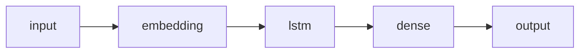
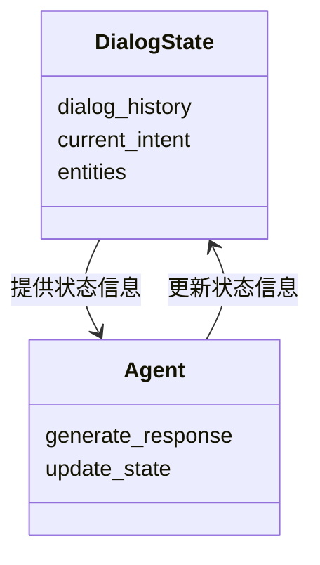
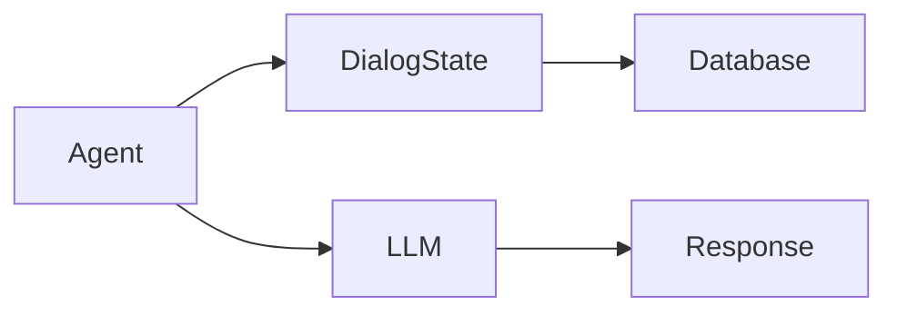
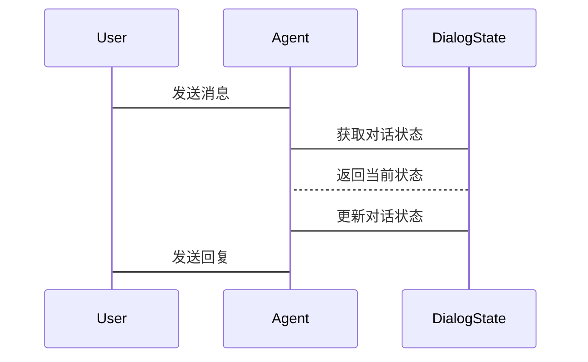

                 


# 《构建LLM驱动的AI Agent多轮对话状态追踪》

---

# 第一部分: 背景介绍

## 第1章: 多轮对话状态追踪的背景与问题

### 1.1 问题背景

#### 1.1.1 多轮对话的定义与特点

多轮对话是指在人与AI Agent之间进行的连续交互，每一轮对话都依赖于前一轮的信息。这种对话方式更接近于人类之间的自然交流。

#### 1.1.2 LLM驱动的AI Agent的崛起

大语言模型（LLM）的出现，使得AI Agent能够理解和生成自然语言，从而在多轮对话中表现出更强的交互能力。

#### 1.1.3 多轮对话状态追踪的重要性

在多轮对话中，AI Agent需要保持对对话历史和当前状态的准确理解，以确保后续的交互能够连贯和有效。

### 1.2 问题描述

#### 1.2.1 对话状态追踪的核心挑战

对话状态追踪需要解决信息不完整、意图变化快、上下文依赖性强等问题。

#### 1.2.2 LLM在对话中的角色与局限性

虽然LLM能够生成自然语言，但在处理复杂对话状态时仍然存在一定的局限性。

#### 1.2.3 状态追踪的边界与外延

对话状态追踪的范围需要明确，同时也要考虑其与其他模块（如对话管理、自然语言理解）的交互。

### 1.3 问题解决

#### 1.3.1 状态追踪的目标与意义

目标是实现对对话过程的准确理解和跟踪，意义在于提升对话系统的智能化水平。

#### 1.3.2 LLM驱动的解决方案

通过结合LLM的自然语言处理能力和状态追踪技术，构建一个多轮对话系统。

#### 1.3.3 状态追踪的实现路径

从数据采集、特征提取、模型训练到结果输出，形成一个完整的实现路径。

### 1.4 概念结构与核心要素

#### 1.4.1 对话状态的定义与组成

对话状态包括对话历史、当前意图、实体信息等多个方面。

#### 1.4.2 LLM驱动的对话机制

LLM通过生成文本与用户交互，同时依赖对话状态来调整后续的回应。

#### 1.4.3 状态追踪的核心要素

包括状态表示、状态更新规则、对话历史记录等关键要素。

### 1.5 本章小结

通过对多轮对话状态追踪的背景、问题和解决方案的分析，明确了本课题的研究意义和目标。

---

# 第二部分: 核心概念与联系

## 第2章: LLM与对话状态追踪的核心概念

### 2.1 LLM的基本原理

#### 2.1.1 大语言模型的定义与特点

LLM是一种基于深度学习的自然语言处理模型，具有强大的语言理解和生成能力。

#### 2.1.2 LLM的训练与推理机制

通过大量数据训练，LLM能够生成与上下文相关的文本。

#### 2.1.3 LLM在对话中的应用

LLM可以用于对话生成、意图识别、实体抽取等多个任务。

### 2.2 对话状态追踪的原理

#### 2.2.1 状态表示的定义与选择

通过向量、符号或文本等多种方式表示对话状态。

#### 2.2.2 状态更新的逻辑与方法

根据对话内容动态更新对话状态。

#### 2.2.3 对话历史的记录与分析

记录对话历史，分析其中的模式和规律。

### 2.3 核心概念的属性特征对比

| 概念       | 属性               | 特征描述                                                        |
|------------|--------------------|-----------------------------------------------------------------|
| 对话状态    | 表达能力           | 高度依赖上下文，能够准确表示对话意图和实体信息                   |
| LLM        | 自然语言处理能力   | 能够生成自然语言文本，但对对话状态的理解依赖外部模块               |

### 2.4 ER实体关系图

```mermaid
er
  actor: 用户
  agent: AI Agent
  dialog_state: 对话状态
  message: 对话内容
  actor -|> agent: 发送消息
  agent -|> dialog_state: 更新状态
  dialog_state -|> message: 包含对话内容
```

---

# 第三部分: 算法原理

## 第3章: 对话状态追踪的算法原理

### 3.1 基于HMM的状态追踪算法

#### 3.1.1 隐马尔可夫模型的定义

HMM是一种统计模型，适用于序列数据的建模。

#### 3.1.2 HMM在对话状态追踪中的应用

将对话内容作为观测序列，状态作为隐藏序列，通过动态规划进行参数估计。

#### 3.1.3 HMM的状态转移矩阵和观测概率计算

$$ \text{状态转移概率} = P(s_t | s_{t-1}) $$
$$ \text{观测概率} = P(o_t | s_t) $$

### 3.2 基于DNN的状态追踪算法

#### 3.2.1 深度神经网络的定义

DNN是一种多层神经网络，能够处理复杂的非线性关系。

#### 3.2.2 DNN在对话状态追踪中的应用

通过训练DNN模型，直接从对话内容中预测对话状态。

#### 3.2.3 DNN的网络结构与训练过程



### 3.3 算法对比与选择

HMM适用于小规模数据，DNN适合大规模复杂场景。

---

# 第四部分: 系统分析与架构设计

## 第4章: 系统架构与设计

### 4.1 问题场景介绍

构建一个基于LLM的AI Agent，能够进行多轮对话，并准确追踪对话状态。

### 4.2 项目介绍

#### 4.2.1 项目目标

实现一个多轮对话系统，具备对话状态追踪功能。

#### 4.2.2 项目范围

包括对话生成、状态追踪、用户交互等模块。

### 4.3 系统功能设计

#### 4.3.1 领域模型类图



### 4.4 系统架构设计

#### 4.4.1 系统架构图



### 4.5 系统接口与交互

#### 4.5.1 系统接口设计

定义接口规范，确保模块之间能够高效交互。

#### 4.5.2 系统交互序列图



---

# 第五部分: 项目实战

## 第5章: 实战项目与代码实现

### 5.1 环境安装

安装Python、TensorFlow、Keras等必要的库。

### 5.2 核心代码实现

#### 5.2.1 对话状态追踪代码

```python
class DialogStateTracker:
    def __init__(self):
        self.dialog_history = []
        self.current_intent = None
        self.entities = {}
    
    def update_state(self, message):
        # 实现状态更新逻辑
        pass
```

#### 5.2.2 LLM集成代码

```python
class Agent:
    def __init__(self, llm):
        self.llm = llm
        self.dialog_state_tracker = DialogStateTracker()
    
    def generate_response(self, message):
        state = self.dialog_state_tracker.update_state(message)
        response = self.llm.generate(state)
        return response
```

### 5.3 代码解读与分析

详细解释代码实现，分析各模块的功能与交互。

### 5.4 实际案例分析

通过具体案例，展示系统的实际运行效果。

### 5.5 项目小结

总结项目实现的关键点和经验教训。

---

# 第六部分: 最佳实践

## 第6章: 实践总结与优化

### 6.1 小结

总结本项目的核心内容和主要收获。

### 6.2 注意事项

提醒读者在实际应用中需要注意的事项。

### 6.3 拓展阅读

推荐相关领域的书籍和论文，供读者进一步学习。

---

# 作者

作者：AI天才研究院 & 禅与计算机程序设计艺术

