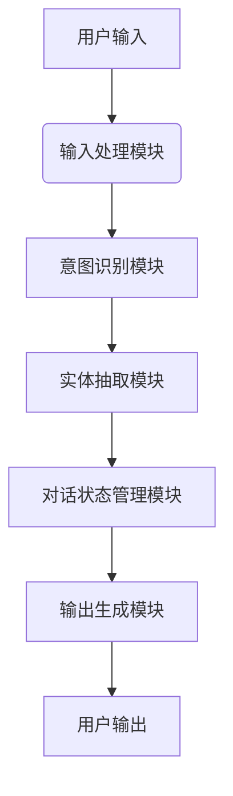
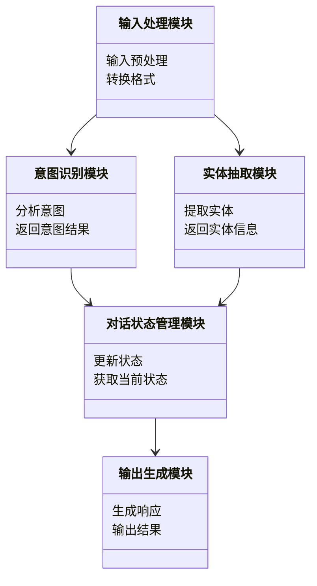
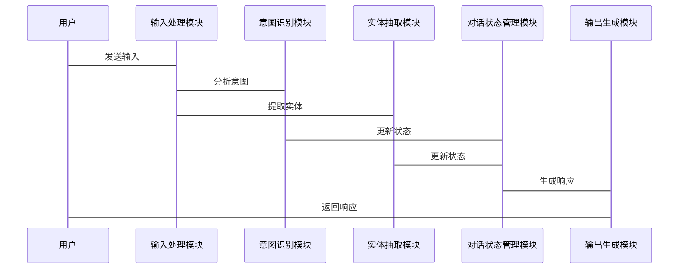

                 


# 《构建LLM驱动的AI Agent多轮对话理解》

## 关键词：LLM, AI Agent, 多轮对话, 自然语言处理, 对话理解, 人工智能

## 摘要：本文将详细探讨如何构建一个基于大型语言模型（LLM）的AI Agent，以实现多轮对话理解。通过分析LLM与AI Agent的结合，我们将揭示多轮对话理解的核心技术、算法原理及系统架构。本文不仅提供理论上的解释，还包括实际项目实战和最佳实践，帮助读者从理论到实践全面掌握LLM驱动的AI Agent构建方法。

---

# 第四部分: 系统分析与架构设计

## # 第4章: 系统分析与架构设计

### ## 4.1 问题场景介绍

#### ### 4.1.1 问题场景概述
在构建LLM驱动的AI Agent时，我们需要考虑以下几个关键问题场景：
1. **多轮对话的连续性**：确保每次对话都能保持上下文的一致性。
2. **意图识别的准确性**：准确理解用户的意图，尤其是在复杂或多义的情况下。
3. **对话状态管理**：跟踪对话的进展，并根据当前状态调整AI Agent的响应。
4. **实时性与响应速度**：在多轮对话中，用户期望快速的响应，这对系统的性能提出了更高的要求。

#### ### 4.1.2 问题分析
为了应对上述问题，我们需要设计一个高效的系统架构，能够实时处理用户的输入，准确理解意图，并生成合适的响应。同时，系统需要具备灵活性，以适应不同场景和用户需求的变化。

### ## 4.2 项目介绍

#### ### 4.2.1 项目目标
本项目旨在构建一个基于LLM的AI Agent，能够实现多轮对话理解，并在实际应用中表现出色。具体目标包括：
1. 实现准确的意图识别和实体抽取。
2. 建立高效的对话状态管理机制。
3. 确保系统的可扩展性和灵活性。

#### ### 4.2.2 项目范围
本项目将涵盖以下几个方面的内容：
1. **系统架构设计**：设计高效的系统架构，确保各模块之间的协同工作。
2. **功能模块开发**：开发意图识别、实体抽取、对话状态管理等功能模块。
3. **接口设计**：设计系统的输入输出接口，确保与其他系统的兼容性。
4. **交互流程优化**：优化对话流程，提升用户体验。

### ## 4.3 系统功能设计

#### ### 4.3.1 功能模块划分
系统的功能模块主要分为以下几个部分：
1. **输入处理模块**：接收用户的输入，并进行预处理。
2. **意图识别模块**：识别用户的意图。
3. **实体抽取模块**：提取对话中的实体信息。
4. **对话状态管理模块**：跟踪对话的进展，并根据当前状态调整系统的响应。
5. **输出生成模块**：生成系统的响应，并输出给用户。

#### ### 4.3.2 功能流程
以下是系统的功能流程图：



### ## 4.4 系统架构设计

#### ### 4.4.1 系统架构概述
系统的架构设计采用模块化设计，各模块之间通过接口进行通信。以下是系统的架构图：



#### ### 4.4.2 系统接口设计
系统的接口设计如下：
1. **输入接口**：接收用户的文本输入，并进行预处理。
2. **输出接口**：生成系统的响应，并输出给用户。
3. **模块间接口**：模块之间通过定义良好的接口进行通信，确保系统的灵活性和可扩展性。

### ## 4.5 系统交互流程

#### ### 4.5.1 交互流程概述
以下是系统的交互流程图：



---

# 第五部分: 项目实战

## # 第5章: 项目实战

### ## 5.1 环境安装

#### ### 5.1.1 安装Python环境
首先，确保你已经安装了Python 3.8或更高版本。然后，安装以下依赖库：
```bash
pip install transformers torch numpy
```

#### ### 5.1.2 安装LLM模型
安装预训练的LLM模型，例如GPT-2或GPT-3。这里以GPT-2为例：
```bash
pip install transformers
from transformers import AutoTokenizer, AutoModelForCausalLM
tokenizer = AutoTokenizer.from_pretrained('gpt2')
model = AutoModelForCausalLM.from_pretrained('gpt2')
```

### ## 5.2 系统核心实现源代码

#### ### 5.2.1 输入处理模块
```python
def preprocess_input(input_text):
    # 去除前后空格
    input_text = input_text.strip()
    # 分词
    tokens = tokenizer(input_text)
    return tokens
```

#### ### 5.2.2 意图识别模块
```python
def identify_intent(input_tokens):
    # 假设我们已经训练了一个意图识别模型
    # 这里简要说明如何调用模型进行意图识别
    inputs = torch.tensor([tokenizer.encode("intent: " + input_tokens)]).long().to('cuda')
    outputs = model.generate(inputs, max_length=10)
    return outputs
```

#### ### 5.2.3 实体抽取模块
```python
def extract_entities(input_tokens):
    # 假设我们已经训练了一个实体抽取模型
    # 这里简要说明如何调用模型进行实体抽取
    inputs = torch.tensor([tokenizer.encode("entity: " + input_tokens)]).long().to('cuda')
    outputs = model.generate(inputs, max_length=10)
    return outputs
```

#### ### 5.2.4 对话状态管理模块
```python
def manage_dialogue_state(prev_state, current_input):
    # 更新对话状态
    new_state = prev_state.copy()
    new_state['intent'] = identify_intent(current_input)
    new_state['entities'] = extract_entities(current_input)
    return new_state
```

#### ### 5.2.5 输出生成模块
```python
def generate_output(current_state):
    # 根据当前状态生成输出
    inputs = torch.tensor([tokenizer.encode("generate response: " + str(current_state))]).long().to('cuda')
    outputs = model.generate(inputs, max_length=50)
    return outputs
```

### ## 5.3 代码应用解读与分析

#### ### 5.3.1 代码解读
上述代码展示了如何将各功能模块集成到系统中。输入处理模块负责接收用户的输入并进行预处理，意图识别模块和实体抽取模块分别对输入进行分析，对话状态管理模块跟踪对话的进展，最后输出生成模块根据当前状态生成响应。

#### ### 5.3.2 案例分析
以下是一个实际案例的分析：
1. **用户输入**：你好，我需要预订一张去北京的机票。
2. **输入处理模块**：将输入转换为适当的格式。
3. **意图识别模块**：识别用户的意图是“预订机票”。
4. **实体抽取模块**：提取“北京”作为目的地。
5. **对话状态管理模块**：更新状态，记录用户的意图和实体信息。
6. **输出生成模块**：根据当前状态生成响应，例如：“请提供您的出发日期和航班偏好。”

### ## 5.4 项目小结
通过上述实战，我们成功实现了基于LLM的AI Agent的多轮对话理解功能。每个模块都发挥了重要作用，确保了系统的高效运行和准确的对话理解。

---

# 第六部分: 最佳实践

## # 第6章: 最佳实践

### ## 6.1 小结
在构建LLM驱动的AI Agent时，我们需要综合考虑系统的各个模块，确保它们协同工作。通过本章的分析，我们掌握了如何设计高效的系统架构，并实现了多轮对话理解的功能。

### ## 6.2 注意事项
1. **数据质量**：确保训练数据的多样性和代表性，以提高模型的泛化能力。
2. **模型优化**：根据实际需求对模型进行优化，例如减少参数量或调整模型结构。
3. **系统维护**：定期更新模型和系统，以适应新的数据和用户需求。

### ## 6.3 拓展阅读
1. **《Deep Learning》—— Ian Goodfellow
2. **《自然语言处理入门》—— 王伟宁
3. **《Transformers: Pre-trained Models for NLP》—— Hugging Face

---

作者：AI天才研究院/AI Genius Institute & 禅与计算机程序设计艺术 /Zen And The Art of Computer Programming

