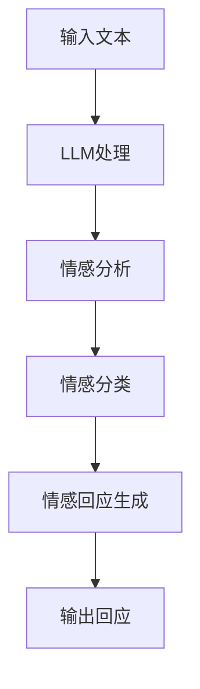
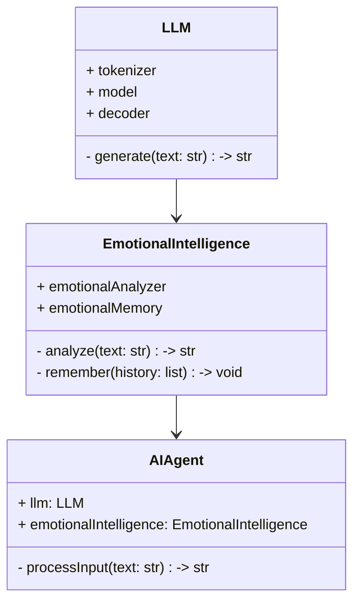
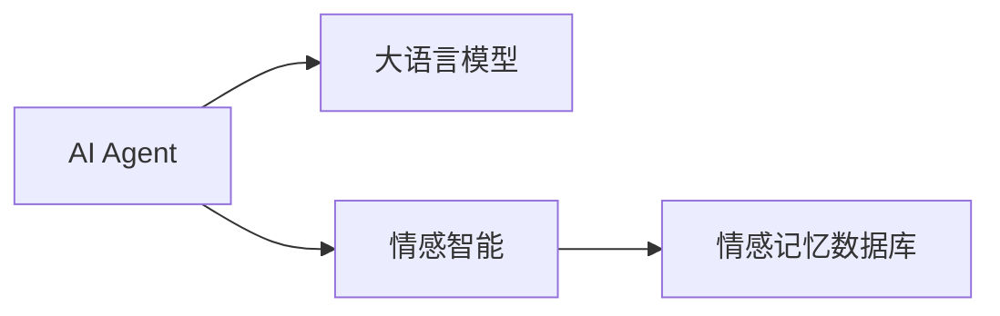
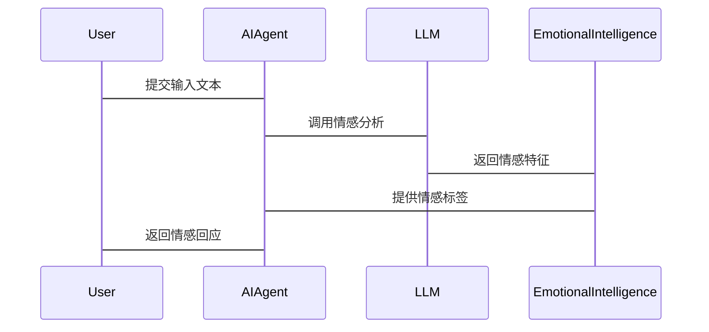

                 


# 构建LLM驱动的AI Agent情感智能交互

> 关键词：大语言模型，AI Agent，情感智能，人机交互，LLM应用

> 摘要：本文探讨如何利用大语言模型（LLM）构建具备情感智能的AI Agent，实现情感智能交互。文章涵盖背景、技术原理、系统架构、项目实战和最佳实践。

---

# 目录大纲

1. 背景介绍  
   1.1 问题背景  
   1.2 核心概念  
   1.3 问题描述  
   1.4 问题解决  
   1.5 边界与外延  
   1.6 概念结构与核心要素  

2. 核心概念与联系  
   2.1 LLM的基本原理  
   2.2 情感智能的基本原理  
   2.3 LLM与情感智能的联系  
   2.4 核心概念对比分析表  
   2.5 实体关系图  

3. 算法原理讲解  
   3.1 LLM驱动AI Agent的算法流程  
   3.2 情感智能交互的算法实现  
   3.3 算法流程图（Mermaid）  
   3.4 数学模型与公式  

4. 系统分析与架构设计  
   4.1 应用场景介绍  
   4.2 系统功能设计（领域模型）  
   4.3 系统架构设计（Mermaid）  
   4.4 系统接口设计  
   4.5 系统交互流程（Mermaid）  

5. 项目实战  
   5.1 环境安装与配置  
   5.2 核心代码实现（Python）  
   5.3 代码解读与分析  
   5.4 实际案例分析  
   5.5 项目小结  

6. 最佳实践与总结  
   6.1 实践中的注意事项  
   6.2 小结与未来展望  
   6.3 拓展阅读推荐  

---

### 第1章: 背景介绍

#### 1.1 问题背景
- **当前人机交互的局限性**：传统AI Agent难以理解用户情感，交互体验单一。  
- **情感智能交互的需求**：用户期望AI Agent具备情感理解能力，提升交互体验。  
- **LLM在情感交互中的潜力**：LLM的强大语言处理能力为情感智能交互提供了技术基础。  

#### 1.2 核心概念
- **大语言模型（LLM）**：基于Transformer架构，能够处理大规模文本数据，具备上下文理解和生成能力。  
- **AI Agent**：一种智能代理，能够通过传感器和执行器与环境交互，完成特定任务。  
- **情感智能交互**：AI Agent能够识别、理解并回应用户的情感状态，实现更自然的交互。  

#### 1.3 问题描述
- **当前AI Agent在情感交互中的不足**：缺乏情感理解能力，交互方式单一，无法应对复杂情感场景。  
- **构建LLM驱动AI Agent的具体问题**：如何将LLM与情感智能技术有效结合，设计高效的情感交互机制。  
- **问题解决的必要性与目标**：提升AI Agent的用户体验，实现更自然、智能的交互方式。  

#### 1.4 问题解决
- **技术路径**：结合LLM的情感分析能力，设计情感驱动的交互逻辑。  
- **实现方法**：通过预训练模型提取情感特征，结合上下文信息生成情感回应。  
- **系统设计的关键点**：情感特征提取、情感分类、情感记忆与推理。  

#### 1.5 边界与外延
- **系统的边界**：AI Agent仅负责情感交互，不涉及其他任务。  
- **相关领域的外延**：结合自然语言处理、机器学习等技术。  
- **与其他技术的区分**：与传统规则驱动的AI Agent不同，LLM驱动的AI Agent具备更强的自适应能力。  

#### 1.6 概念结构与核心要素
- **核心要素**：LLM、情感分析模块、情感记忆模块、交互逻辑模块。  
- **要素之间的关系**：LLM提供语言处理能力，情感分析模块识别用户情感，情感记忆模块记录情感历史，交互逻辑模块生成情感回应。  

---

### 第2章: 核心概念与联系

#### 2.1 LLM的基本原理
- **大语言模型的训练机制**：基于大量文本数据，使用自监督学习进行预训练。  
- **模型的输入输出机制**：输入为文本序列，输出为生成的文本序列。  
- **模型的可解释性**：通过注意力机制分析模型的决策过程。  

#### 2.2 情感智能的基本原理
- **情感分析的定义**：识别文本中蕴含的情感倾向（如正面、负面、中性）。  
- **情感分类算法**：基于机器学习或深度学习的方法，如SVM、LSTM、Transformer。  
- **情感记忆机制**：记录用户情感状态的变化，以便后续交互中参考。  

#### 2.3 LLM与情感智能的联系
- **情感分析的提升**：LLM的强大语言模型能力使情感分类更加准确。  
- **情感生成的增强**：基于LLM生成更自然、贴合情感的情感回应。  
- **情感理解的扩展**：LLM能够理解复杂的情感语境，如隐喻和讽刺。  

#### 2.4 核心概念对比分析表
| 概念 | 描述 | 特性 |
|------|------|------|
| LLM  | 大语言模型 | 强大的文本生成与理解能力 |
| 情感智能 | 情感分析与生成技术 | 精准的情感识别与生成 |
| AI Agent | 智能代理 | 具备情感智能的交互能力 |

#### 2.5 实体关系图（Mermaid）


---

### 第3章: 算法原理讲解

#### 3.1 LLM驱动AI Agent的算法流程
- **输入处理**：接收用户输入的文本。  
- **情感分析**：使用LLM提取文本中的情感特征。  
- **情感分类**：基于情感特征生成情感标签（如正面、负面、中性）。  
- **情感回应生成**：根据情感标签和上下文生成情感回应。  

#### 3.2 情感智能交互的算法实现
- **情感分析算法**：基于预训练模型的情感分类任务。  
- **情感生成算法**：基于LLM的情感文本生成任务。  
- **算法流程图（Mermaid）**



#### 3.3 数学模型与公式
- **注意力机制公式**：  
  $$ \text{Attention}(Q, K, V) = \text{softmax}\left(\frac{QK^T}{\sqrt{d_k}}\right)V $$  
- **情感分类损失函数**：  
  $$ \mathcal{L} = -\sum_{i=1}^{n} y_i \log p(y_i) + (1-y_i) \log (1-p(y_i)) $$  

---

### 第4章: 系统分析与架构设计

#### 4.1 应用场景介绍
- **情感咨询**：AI Agent帮助用户处理情感问题。  
- **情感支持**：提供情感支持与安慰。  
- **情感反馈**：在客服交互中提供情感反馈。  

#### 4.2 系统功能设计（领域模型）


#### 4.3 系统架构设计（Mermaid）


#### 4.4 系统接口设计
- **输入接口**：接收用户输入的文本。  
- **输出接口**：返回情感回应的文本。  
- **数据库接口**：存储用户情感历史数据。  

#### 4.5 系统交互流程（Mermaid）


---

### 第5章: 项目实战

#### 5.1 环境安装与配置
- **安装Python**：确保安装最新版本的Python。  
- **安装依赖库**：`transformers`, `torch`, `scikit-learn`。  

#### 5.2 核心代码实现（Python）
```python
from transformers import AutoTokenizer, AutoModelForCausalLM
import torch

class AIAgent:
    def __init__(self, model_name="gpt2"):
        self.tokenizer = AutoTokenizer.from_pretrained(model_name)
        self.model = AutoModelForCausalLM.from_pretrained(model_name)
    
    def process_input(self, text):
        inputs = self.tokenizer(text, return_tensors="pt")
        outputs = self.model.generate(inputs.input_ids, max_length=50)
        return self.tokenizer.decode(outputs[0], skip_special_tokens=True)
```

#### 5.3 代码解读与分析
- **AIAgent类**：初始化加载LLM模型，定义处理输入的方法。  
- **process_input方法**：将用户输入文本编码，生成情感回应。  

#### 5.4 实际案例分析
- **案例1**：用户输入“我今天很沮丧”。  
- **处理过程**：LLM提取情感特征，生成情感回应“我能理解你的感受，有什么我可以帮助你的吗？”  

#### 5.5 项目小结
- **实现目标**：成功构建了一个基于LLM的AI Agent，具备情感智能交互能力。  
- **未来优化**：进一步优化情感分析的准确性，提升模型的响应速度。  

---

### 第6章: 最佳实践与总结

#### 6.1 实践中的注意事项
- **数据隐私**：确保用户数据的安全与隐私。  
- **模型优化**：定期更新模型，提升交互体验。  
- **用户反馈**：收集用户反馈，持续改进系统。  

#### 6.2 小结与未来展望
- **小结**：本文详细介绍了如何利用LLM构建情感智能的AI Agent，涵盖了技术原理、系统设计和项目实战。  
- **未来展望**：随着技术的发展，情感智能交互将更加自然，AI Agent将在更多领域得到应用。  

#### 6.3 拓展阅读推荐
- **推荐书籍**：《深度学习入门：基于Python和Keras》  
- **推荐论文**：《Attention Is All You Need》  

---

作者：AI天才研究院/AI Genius Institute & 禅与计算机程序设计艺术 /Zen And The Art of Computer Programming

