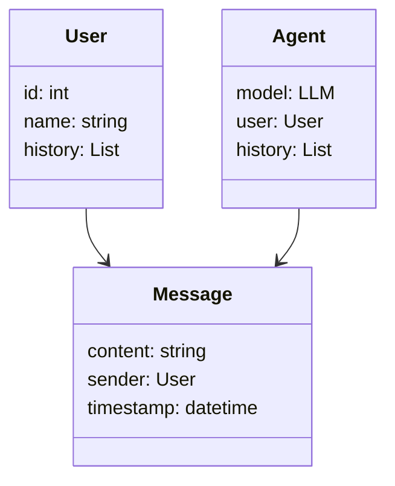
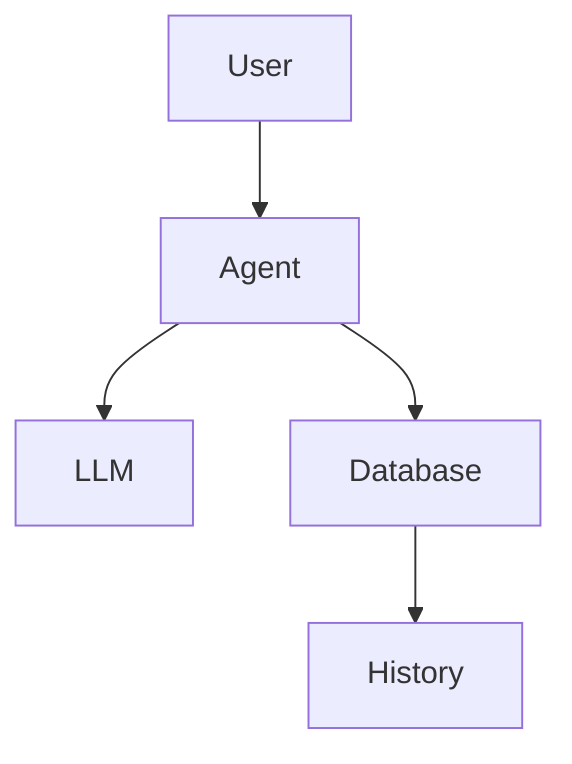

                 


# 构建LLM驱动的AI Agent情感智能对话

## 关键词：LLM，AI Agent，情感智能对话，自然语言处理，机器学习，对话系统

## 摘要：本文详细探讨了构建基于大语言模型（LLM）的AI Agent情感智能对话系统的各个方面。从背景介绍到系统实现，从算法原理到项目实战，本文为读者提供了全面的指导，帮助他们理解如何利用LLM技术实现情感智能对话，并通过实际案例展示了系统的实现过程和应用前景。

---

# 第1章: 情感智能对话的背景与问题背景

## 1.1 情感智能对话的定义与核心概念

### 1.1.1 情感智能对话的定义
情感智能对话是一种基于自然语言处理（NLP）和机器学习的对话系统，旨在理解和模拟人类情感，从而实现更自然、更贴近人类情感的交互方式。

### 1.1.2 情感智能对话的核心要素
- **情感识别**：通过分析用户输入的文字或语音，识别出其中的情感倾向（如喜悦、愤怒、悲伤等）。
- **情感生成**：在生成回复时，考虑上下文和用户情感，生成带有情感色彩的回复。
- **上下文理解**：理解对话的历史，保持对话的连贯性。
- **多模态支持**：结合语音、图像等多模态信息，进一步提升情感识别的准确性。

### 1.1.3 情感智能对话的边界与外延
- **边界**：专注于情感理解和生成，不涉及物理世界中的操作。
- **外延**：情感智能对话可以与其他领域（如医疗、教育、客服）结合，提供更智能化的服务。

## 1.2 问题背景与问题描述

### 1.2.1 当前对话系统的主要挑战
- **情感理解不足**：传统对话系统难以准确捕捉用户的情感，导致回复缺乏情感共鸣。
- **对话上下文处理复杂**：复杂的对话历史难以有效处理，导致对话不连贯。
- **多模态信息利用不足**：大多数系统仅依赖文本信息，忽视了语音、图像等多模态信息的价值。

### 1.2.2 情感智能对话的必要性
- 提升用户体验，使对话更加自然和人性化。
- 增强对话系统的实用性和适用性，尤其是在需要情感支持的领域（如心理健康咨询）。

### 1.2.3 问题解决的路径与目标
- 引入大语言模型（LLM）技术，提升情感理解和生成能力。
- 结合多模态信息，增强对话系统的感知能力。
- 优化对话历史的处理机制，提升对话连贯性。

---

# 第2章: LLM与情感智能对话的核心原理

## 2.1 LLM的基本原理

### 2.1.1 大语言模型的训练机制
- **监督学习**：通过大量标注数据进行训练，学习语言模式。
- **强化学习**：通过与环境的交互，逐步优化生成结果。
- **生成机制**：基于概率模型，生成与上下文相关的文本。

### 2.1.2 模型的参数化表示
- **词嵌入**：将词语映射为低维向量。
- **注意力机制**：重点关注输入中的重要部分，提升生成质量。

### 2.1.3 模型的生成机制
- **解码器**：将输入编码为向量，生成输出文本。
- **采样方法**：如贪心采样、随机采样，选择最优生成结果。

## 2.2 情感智能对话的核心原理

### 2.2.1 情感分析的基本概念
- **情感分类**：将文本分为积极、消极、中性等类别。
- **情感强度分析**：分析情感的强度（如非常高兴、有点生气）。

### 2.2.2 情感智能对话的实现步骤
1. **情感识别**：分析用户输入的情感倾向。
2. **上下文理解**：结合对话历史，理解当前对话的上下文。
3. **情感生成**：根据情感识别和上下文理解，生成带有情感的回复。

### 2.2.3 情感智能对话的优化方法
- **反馈机制**：根据用户反馈，优化生成结果。
- **多模态融合**：结合语音、图像等信息，提升情感识别的准确性。

## 2.3 LLM与情感智能对话的结合

### 2.3.1 LLM在情感智能对话中的作用
- 提供强大的语言生成能力，支持情感化的回复。
- 通过大规模预训练，具备广泛的知识库，提升对话的深度。

### 2.3.2 情感智能对话对LLM的特殊要求
- 情感生成能力：能够根据情感需求生成相应的文本。
- 多模态支持：能够结合其他信息（如语音、图像）进行情感分析。

### 2.3.3 LLM与情感智能对话的结合示例
- 使用GPT模型进行情感生成，结合情感识别模型，实现情感智能对话。

---

# 第3章: 算法原理

## 3.1 大语言模型的训练机制

### 3.1.1 监督学习
- **输入**：用户输入的情感文本。
- **输出**：模型预测的情感类别。
- **损失函数**：交叉熵损失函数。

### 3.1.2 强化学习
- **输入**：对话历史和当前输入。
- **输出**：模型生成的情感化回复。
- **奖励机制**：根据生成结果的准确性给予奖励。

## 3.2 情感分析算法

### 3.2.1 基于词袋模型的情感分析
- **步骤**：
  1. 将文本转换为词袋向量。
  2. 训练分类器（如SVM、随机森林）。
  3. 对新文本进行情感分类。

### 3.2.2 基于深度学习的情感分析
- **模型结构**：
  1. 词嵌入层：将词转换为向量。
  2. RNN/LSTM层：处理序列数据。
  3. 全连接层：输出情感类别。

---

# 第4章: 系统分析与架构设计

## 4.1 项目背景与目标

## 4.2 系统功能设计

### 4.2.1 领域模型类图


### 4.2.2 系统架构设计


### 4.2.3 接口设计
- **输入接口**：接收用户输入的文本或语音。
- **输出接口**：生成带有情感的回复。
- **数据库接口**：存储和检索对话历史。

---

# 第5章: 项目实战

## 5.1 环境安装
- **工具安装**：安装Python、TensorFlow、Keras等。
- **依赖管理**：使用pip安装相关库。

## 5.2 核心代码实现

### 5.2.1 情感识别代码
```python
import tensorflow as tf
from tensorflow.keras import layers

model = tf.keras.Sequential()
model.add(layers.Embedding(input_dim=10000, output_dim=16))
model.add(layers.LSTM(64))
model.add(layers.Dense(3, activation='softmax'))
```

### 5.2.2 情感生成代码
```python
def generate_response(input_text, model):
    # 输入处理
    input_sequence = tokenizer.encode(input_text, padding=True, truncating=True)
    # 生成回复
    response = model.generate(input_sequence)
    return response
```

## 5.3 案例分析
- **案例1**：用户输入“我今天很生气”，系统生成“我很抱歉你感到生气，有什么我可以帮助你的吗？”
- **案例2**：用户输入“我非常喜欢这个电影”，系统生成“谢谢你的喜欢，这个电影确实很经典。”

---

# 第6章: 最佳实践与总结

## 6.1 最佳实践

### 6.1.1 技术建议
- 定期更新模型，保持其情感识别和生成能力的准确性。
- 结合多模态信息，提升系统的情感感知能力。

### 6.1.2 经验总结
- 从简单的场景入手，逐步扩展功能。
- 重视用户反馈，及时优化系统。

## 6.2 常见问题与解答
- **问题**：如何处理多模态信息？
  - **解答**：可以使用多模态模型，如ViT处理图像，或者使用预训练模型进行特征提取。

## 6.3 未来展望
- 情感智能对话将更加个性化和智能化，结合更多的多模态信息，提供更贴近人类情感的交互体验。

---

# 作者：AI天才研究院 & 禅与计算机程序设计艺术

---

通过以上目录，我们可以看到《构建LLM驱动的AI Agent情感智能对话》这本书将从理论到实践，全面讲解如何利用大语言模型构建情感智能对话系统。无论是对于技术开发者还是对情感智能对话感兴趣的读者，这本书都将提供宝贵的知识和实践指导。

