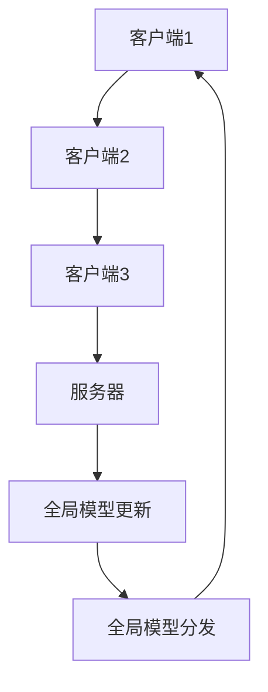
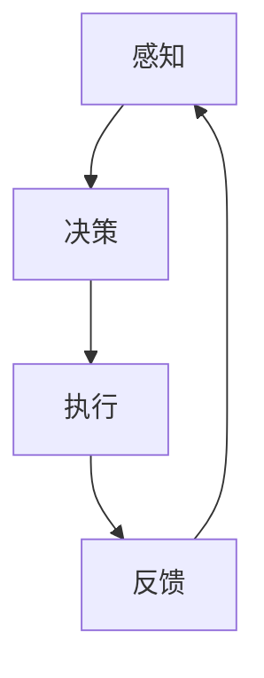
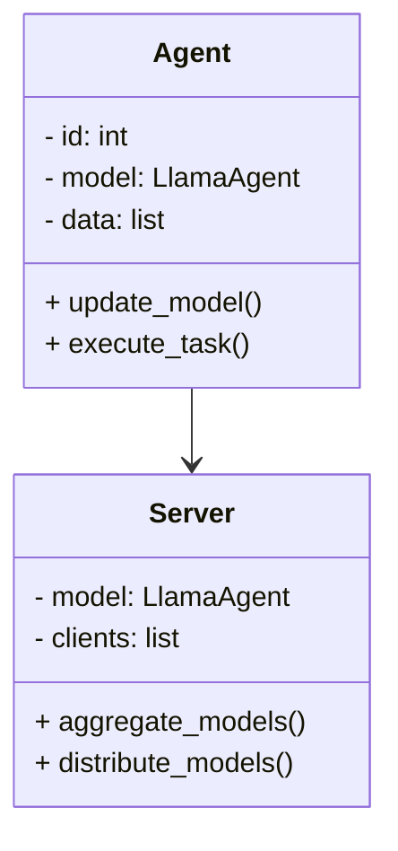
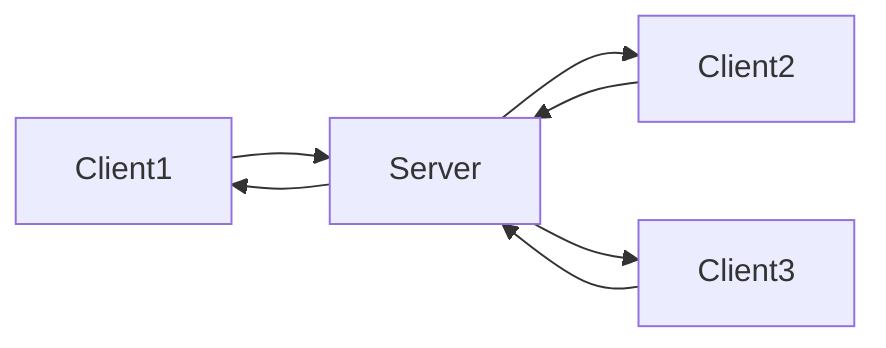

                 


# 构建LLM驱动的AI Agent隐私保护联邦学习

---

## 关键词：
- LLM驱动的AI Agent
- 隐私保护
- 联邦学习
- 分布式计算
- 隐私保护技术

---

## 摘要：
本文探讨如何构建一个基于大语言模型（LLM）的AI代理，使其在联邦学习框架下实现隐私保护。通过分析联邦学习的基本原理、LLM驱动AI代理的核心功能，以及隐私保护技术的实现，本文旨在为读者提供一个系统化的构建方案。内容涵盖从理论到实践，包括算法原理、系统架构设计和实际案例分析，帮助读者理解如何在保护数据隐私的前提下，构建高效且智能的AI代理系统。

---

# 第一部分: 背景介绍与核心概念

---

## 第1章: 问题背景与描述

### 1.1 问题背景

#### 1.1.1 当前AI Agent的发展现状
人工智能代理（AI Agent）作为一种能够感知环境并采取行动以实现目标的智能体，近年来得到了广泛应用。随着大语言模型（LLM）的崛起，AI Agent的能力得到了显著提升，尤其是在自然语言处理、对话生成和任务执行方面。

#### 1.1.2 联邦学习的兴起与应用
联邦学习（Federated Learning）是一种分布式机器学习技术，允许多个参与方在不共享原始数据的情况下共同训练模型。其核心思想是“数据不动，模型动”，适用于保护数据隐私的场景，如医疗、金融和社交网络等领域。

#### 1.1.3 LLM在AI Agent中的作用
LLM作为AI Agent的核心驱动力，不仅能够处理复杂的语言任务，还能通过联邦学习框架与其他代理协作，共同完成更复杂的任务，同时保护数据隐私。

---

### 1.2 问题描述

#### 1.2.1 AI Agent的定义与功能
AI Agent是一种智能实体，能够通过感知环境、理解任务目标并采取行动来完成特定任务。其核心功能包括感知、决策、执行和反馈。

#### 1.2.2 联邦学习的定义与特点
联邦学习是一种分布式学习范式，允许多个参与方在本地数据上进行模型训练，并通过通信协议共享模型参数，最终形成一个全局模型。其特点是数据不出域、模型共训练、隐私有保障。

#### 1.2.3 隐私保护的需求与挑战
在AI Agent和联邦学习的应用中，隐私保护是核心需求。然而，如何在保护隐私的前提下，实现高效的模型训练和协作，是当前面临的主要挑战。

---

## 第2章: 核心概念与问题解决

### 2.1 核心概念

#### 2.1.1 LLM驱动的AI Agent
LLM驱动的AI Agent通过大规模预训练语言模型，能够理解上下文、生成自然语言回复，并通过联邦学习与其他代理协作，实现更复杂的任务。

#### 2.1.2 联邦学习的机制
联邦学习通过在分布式节点上并行训练模型，定期同步模型参数，最终形成一个全局模型。其关键机制包括数据分割、模型同步和通信协议设计。

#### 2.1.3 隐私保护的实现方式
隐私保护技术包括数据加密、差分隐私、同态加密等，旨在在模型训练过程中保护原始数据不被泄露。

---

### 2.2 问题解决

#### 2.2.1 联邦学习如何解决数据隐私问题
联邦学习通过在本地设备或服务器上进行模型训练，避免了原始数据的集中存储和传输，从而保护了数据隐私。

#### 2.2.2 LLM如何增强AI Agent的能力
LLM通过强大的自然语言处理能力，赋予AI Agent更智能的对话生成、意图识别和任务执行能力。

#### 2.2.3 隐私保护与模型性能的平衡
在隐私保护的前提下，如何优化模型性能，确保LLM驱动的AI Agent在任务执行中的有效性，是需要解决的核心问题。

---

## 第3章: 核心概念的边界与外延

### 3.1 核心概念的边界

#### 3.1.1 联邦学习的适用场景
联邦学习适用于数据分布式的场景，如多设备、多机构协作，但不适合需要集中数据处理的场景。

#### 3.1.2 LLM驱动的AI Agent的应用范围
LLM驱动的AI Agent适用于需要自然语言处理和分布式协作的任务，如智能客服、多代理协作等。

#### 3.1.3 隐私保护的实现边界
隐私保护技术的选择和实现需要根据具体场景和需求进行调整，不能一刀切。

---

### 3.2 核心概念的外延

#### 3.2.1 联邦学习与其他分布式学习方法的对比
联邦学习与分布式计算、边缘计算等方法在数据处理和模型训练上有相似之处，但各有侧重。

#### 3.2.2 LLM与其他NLP模型的对比
LLM在参数规模、训练效率和生成能力上优于传统NLP模型，但计算资源消耗更大。

#### 3.2.3 隐私保护技术的多样性
除了联邦学习，隐私保护技术还包括加密技术、差分隐私、同态加密等，各有优劣。

---

## 第4章: 核心概念的结构与组成

### 4.1 核心概念的结构

#### 4.1.1 联邦学习的层次结构
联邦学习通常包括参与方（Client）、协调者（Server）和通信协议三个层次。

#### 4.1.2 LLM驱动的AI Agent的模块结构
LLM驱动的AI Agent通常包括感知模块、决策模块、执行模块和反馈模块。

#### 4.1.3 隐私保护机制的组成部分
隐私保护机制包括数据加密、模型加密和通信加密三个部分。

---

### 4.2 核心要素的对比分析

#### 4.2.1 联邦学习与分布式计算的对比
| 对比维度 | 联邦学习 | 分布式计算 |
|----------|----------|------------|
| 数据处理 | 分散训练 | 分散计算 |
| 模型训练 | 同步模型 | 同步数据 |
| 隐私保护 | 数据不出域 | 数据可能出域 |

#### 4.2.2 LLM与传统NLP模型的对比
| 对比维度 | LLM | 传统NLP模型 |
|----------|-----|--------------|
| 参数规模 | 大 | 小 |
| 训练效率 | 高 | 低 |
| 生成能力 | 强 | 弱 |

#### 4.2.3 隐私保护技术的优劣势分析
| 技术 | 优势 | 劣势 |
|------|------|------|
| 同态加密 | 保护数据隐私 | 计算效率低 |
| 差分隐私 | 数据可用性高 | 隐私保护力度有限 |
| 数据加密 | 实现简单 | 不能直接用于模型训练 |

---

# 第二部分: 算法原理与系统架构

---

## 第5章: 算法原理

### 5.1 联邦学习的算法原理

#### 5.1.1 联邦学习的数学模型
全局模型的更新过程可以表示为：
$$ \theta_{\text{global}}^{t+1} = \frac{1}{N} \sum_{i=1}^{N} \theta_{\text{local}}^{t+1} $$
其中，$N$ 是参与方的数量，$\theta_{\text{local}}^{t+1}$ 是第 $i$ 个参与方在第 $t+1$ 轮的模型参数。

#### 5.1.2 联邦学习的流程
以下是联邦学习的流程图：



#### 5.1.3 联邦学习的代码实现
以下是Python代码示例：

```python
import numpy as np

def client_update(client_model, data, learning_rate):
    # 模型更新
    loss = compute_loss(client_model, data)
    gradient = compute_gradient(client_model, data)
    client_model += learning_rate * gradient
    return client_model

def server_aggregate(global_model, client_models):
    # 模型聚合
    averaged_model = np.mean(client_models, axis=0)
    global_model = averaged_model
    return global_model
```

---

### 5.2 LLM驱动的AI Agent算法原理

#### 5.2.1 LLM的数学模型
大语言模型的训练目标是通过最小化损失函数来优化模型参数：
$$ \min_{\theta} \sum_{i=1}^{N} \mathcal{L}(\theta; x_i, y_i) $$
其中，$\mathcal{L}$ 是损失函数，$(x_i, y_i)$ 是训练数据。

#### 5.2.2 LLM驱动的AI Agent的流程
以下是LLM驱动的AI Agent的流程图：



#### 5.2.3 LLM驱动的AI Agent的代码实现
以下是Python代码示例：

```python
import torch
import torch.nn as nn

class LlamaAgent(nn.Module):
    def __init__(self, vocab_size, embedding_dim):
        super().__init__()
        self.embedding = nn.Embedding(vocab_size, embedding_dim)
        self.transformer = nn.Transformer(embedding_dim, num_layers=6)
        self.output = nn.Linear(embedding_dim, vocab_size)

    def forward(self, input_ids):
        embedding = self.embedding(input_ids)
        output = self.transformer(embedding)
        logits = self.output(output)
        return logits

# 初始化模型
vocab_size = 10000
embedding_dim = 512
agent = LlamaAgent(vocab_size, embedding_dim)
```

---

## 第6章: 系统分析与架构设计

### 6.1 系统分析

#### 6.1.1 问题场景介绍
我们考虑一个分布式环境中的多个AI Agent，每个Agent负责处理局部数据，并通过联邦学习框架协作训练全局模型。

#### 6.1.2 系统功能设计
系统功能包括数据采集、模型训练、模型同步和任务执行四个部分。

---

### 6.2 系统架构设计

#### 6.2.1 领域模型
以下是领域模型的类图：



#### 6.2.2 系统架构
以下是系统架构图：



#### 6.2.3 系统接口设计
系统接口包括：
- `client_update()`: 客户端模型更新接口
- `server_aggregate()`: 服务器模型聚合接口
- `agent_execute()`: Agent任务执行接口

#### 6.2.4 交互流程图
以下是交互流程图：


---

## 第7章: 项目实战

### 7.1 环境安装

#### 7.1.1 安装依赖
```bash
pip install torch numpy mermaid4jupyter
```

#### 7.1.2 启动服务器
```bash
python server.py
```

#### 7.1.3 启动客户端
```bash
python client.py
```

---

### 7.2 核心代码实现

#### 7.2.1 服务器端代码
```python
import torch
import torch.nn as nn

class Server:
    def __init__(self, model):
        self.model = model
        self.clients = []

    def aggregate_models(self, client_models):
        averaged_model = torch.mean(torch.stack(client_models), dim=0)
        self.model.load_state_dict(averaged_model.state_dict())
        return self.model
```

#### 7.2.2 客户端代码
```python
import torch
import torch.nn as nn

class Client:
    def __init__(self, model, data):
        self.model = model
        self.data = data

    def update_model(self, learning_rate):
        # 计算损失和梯度
        loss = compute_loss(self.model, self.data)
        gradient = compute_gradient(self.model, self.data)
        # 更新模型
        with torch.no_grad():
            for param in self.model.parameters():
                param -= learning_rate * param.grad
        return self.model
```

#### 7.2.3 交互流程代码
```python
# 初始化模型和数据
model = LlamaAgent(vocab_size, embedding_dim)
server = Server(model)
client1 = Client(model, data1)
client2 = Client(model, data2)
client3 = Client(model, data3)

# 训练过程
for _ in range(num_epochs):
    # 客户端更新模型
    client_models = [client.update_model(learning_rate) for client in [client1, client2, client3]]
    # 服务器聚合模型
    server.aggregate_models(client_models)
```

---

### 7.3 代码解读与分析

#### 7.3.1 服务器端代码解读
服务器端负责接收多个客户端的模型更新，并对所有客户端的模型参数进行平均，形成一个全局模型。

#### 7.3.2 客户端代码解读
客户端负责在本地数据上更新模型，并将更新后的模型参数发送给服务器。

#### 7.3.3 交互流程解读
整个训练过程包括客户端模型更新和服务器模型聚合两个步骤，通过多次迭代逐步优化全局模型。

---

### 7.4 实际案例分析

#### 7.4.1 案例背景
考虑一个分布式环境中的智能客服系统，每个客服代理负责处理局部的客户咨询，通过联邦学习框架协作训练一个全局的客服问答模型。

#### 7.4.2 案例实现
通过上述代码实现，可以训练出一个能够处理多种客户咨询的智能客服系统。

#### 7.4.3 案例分析
在案例中，通过联邦学习框架，每个客服代理能够在保护客户隐私的前提下，协作训练出一个高效的全局模型。

---

### 7.5 项目小结

#### 7.5.1 核心实现
项目的核心实现包括联邦学习框架的搭建和LLM驱动的AI Agent的设计。

#### 7.5.2 实践意义
通过本项目的实践，我们能够理解如何在保护数据隐私的前提下，构建高效的AI代理系统。

---

# 第三部分: 最佳实践与总结

---

## 第8章: 最佳实践

### 8.1 小结

#### 8.1.1 核心知识点总结
- 联邦学习的基本原理
- LLM驱动的AI Agent的设计与实现
- 隐私保护技术的选择与应用

#### 8.1.2 实践中的注意事项
- 确保数据的分布性和独立性
- 合理选择隐私保护技术
- 定期验证模型的准确性和效率

---

### 8.2 注意事项

#### 8.2.1 数据隐私保护
在实际应用中，需要确保数据的隐私性，避免数据泄露。

#### 8.2.2 模型更新频率
模型更新频率需要根据具体场景和需求进行调整，过高的更新频率会导致计算开销过大，过低的更新频率则会影响模型的准确性和实时性。

#### 8.2.3 系统可扩展性
在设计系统时，需要考虑其可扩展性，以便在未来增加更多的客户端或服务器节点。

---

### 8.3 拓展阅读

#### 8.3.1 联邦学习的最新研究
建议阅读最新的联邦学习论文，了解其在不同场景下的应用和优化方法。

#### 8.3.2 LLM的优化技巧
建议学习大语言模型的优化技巧，如参数剪枝、模型蒸馏等，以提高模型的效率和性能。

#### 8.3.3 隐私保护技术的前沿进展
建议关注隐私保护技术的最新进展，如隐私增强的联邦学习、基于区块链的隐私保护等。

---

## 第9章: 总结与展望

### 9.1 总结
通过本文的探讨，我们了解了如何构建一个基于LLM的AI代理，并在联邦学习框架下实现隐私保护。通过理论分析和实践案例，我们掌握了联邦学习的基本原理、LLM驱动的AI代理的设计与实现，以及隐私保护技术的应用。

### 9.2 展望
未来，随着人工智能和大数据技术的不断发展，构建更加智能、高效且安全的AI代理系统将是一个重要的研究方向。我们期待在隐私保护、模型优化和任务执行等方面取得更多突破。

---

## 作者：AI天才研究院/AI Genius Institute & 禅与计算机程序设计艺术 /Zen And The Art of Computer Programming

---

