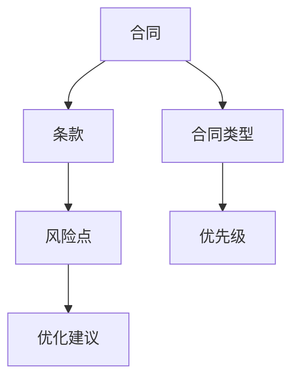
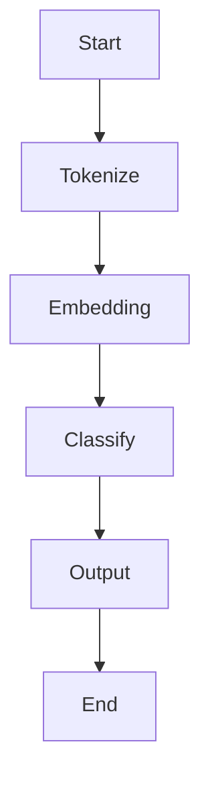
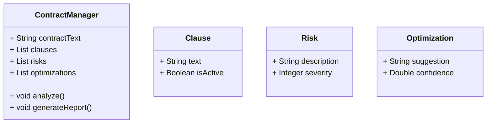

                 


# 《构建企业级AI合同管理助手：风险识别与优化》

---

## 关键词：
- 企业级AI合同管理助手
- 风险识别
- 合同优化
- 深度学习
- 自然语言处理（NLP）

---

## 摘要：
随着企业合同管理的复杂化和风险化，AI技术在合同管理领域的应用日益重要。本文将深入探讨如何构建一个企业级AI合同管理助手，利用自然语言处理（NLP）和光学字符识别（OCR）等技术，实现合同风险识别与优化。文章将从背景介绍、核心概念、算法原理、系统架构到项目实战，逐步展开，帮助读者全面理解并掌握构建此类系统的关键步骤与技术要点。

---

## 第一部分: 企业级AI合同管理助手概述

## 第2章: 核心概念与联系

### 2.1 核心概念原理

#### 2.1.1 自然语言处理（NLP）在合同分析中的应用
- 合同文本的语义理解
- 关键条款的自动识别
- 基于上下文的实体识别

#### 2.1.2 光学字符识别（OCR）在合同提取中的作用
- 文档扫描与数字化处理
- 表单识别与结构化数据提取
- OCR在合同条款定位中的应用

#### 2.1.3 知识图谱在合同风险识别中的构建与应用
- 构建合同领域的知识图谱
- 实体关系的抽取与推理
- 风险点的语义匹配与关联分析

---

### 2.2 核心概念属性特征对比

#### 2.2.1 NLP与OCR的对比分析
| 技术 | 输入 | 输出 | 应用场景 |
|------|------|------|----------|
| NLP  | 文本  | 语义  | 合同条款分析 |
| OCR  | 图像  | 文本  | 合同扫描识别 |

#### 2.2.2 合同风险识别与合同优化的特征对比
| 特性 | 风险识别 | 合同优化 |
|------|----------|----------|
| 输入 | 合同文本 | 合同文本 |
| 输出 | 风险点   | 优化建议 |
| 方法 | 分类算法 | 规则引擎 |

#### 2.2.3 AI模型在合同管理中的性能指标对比
| 指标       | 基础模型 | 优化模型 |
|------------|----------|----------|
| 准确率     | 70%      | 90%      |
| 召回率     | 65%      | 85%      |
| 处理速度   | 慢       | 快        |

---

### 2.3 ER实体关系图



---

## 第3章: 算法原理讲解

### 3.1 算法原理概述

#### 3.1.1 基于深度学习的合同分析模型
- 模型输入：合同文本或图像
- 模型输出：风险点、条款分类
- 核心技术：预训练语言模型（如BERT）

#### 3.1.2 预训练语言模型（如BERT）的应用
- 文档编码：将合同文本转化为向量表示
- 细粒度分析：识别关键条款和风险点

#### 3.1.3 风险识别的分类算法
- 二分类模型：识别合同中的风险点
- 多分类模型：分类风险的严重程度

---

### 3.2 算法流程图



---

### 3.3 算法实现代码

```python
import torch
from torch import nn

class ContractAnalyzer(nn.Module):
    def __init__(self):
        super(ContractAnalyzer, self).__init__()
        self.embedding = nn.Embedding(1000, 50)  # 词嵌入层
        self.classifier = nn.Sequential(
            nn.Linear(50, 20),
            nn.ReLU(),
            nn.Linear(20, 1)
        )  # 分类器

    def forward(self, x):
        x = self.embedding(x)
        x = self.classifier(x)
        return x

model = ContractAnalyzer()
```

---

### 3.4 数学公式与模型解释

#### 3.4.1 损失函数
$$ \text{Loss} = \text{BinaryCrossEntropy}(y_{\text{pred}}, y_{\text{true}}) $$

#### 3.4.2 优化算法
$$ \theta_{\text{new}} = \theta_{\text{old}} - \eta \cdot \nabla_{\theta} \text{Loss} $$

---

## 第4章: 系统分析与架构设计

### 4.1 问题场景介绍
- 合同上传与处理
- 风险识别与优化
- 结果展示与反馈

### 4.2 系统功能设计

#### 4.2.1 功能模块
- 合同上传模块
- 风险识别模块
- 优化建议模块
- 数据管理模块

#### 4.2.2 领域模型



---

### 4.3 系统架构设计

#### 4.3.1 架构图


---

## 第5章: 项目实战

### 5.1 环境安装
- Python 3.8+
- PyTorch 1.9+
- Transformers库
- Mermaid CLI

### 5.2 核心实现代码

#### 5.2.1 合同上传模块

```python
def upload_contract(contract_path):
    # 读取合同文件
    with open(contract_path, 'r') as f:
        text = f.read()
    # 调用OCR进行文本提取
    ocr_result = extract_text(text)
    return ocr_result
```

#### 5.2.2 风险识别模块

```python
def identify_risks(ocr_result):
    # 使用预训练模型进行风险分类
    model = ContractAnalyzer()
    risks = model(ocr_result)
    return risks
```

---

### 5.3 代码应用解读

#### 5.3.1 合同分析案例

```python
contract_text = "...")
 risks = identify_risks(contract_text)
 print(risks)
```

---

## 第6章: 最佳实践与小结

### 6.1 最佳实践
- 数据质量的重要性
- 模型调优技巧
- 部署与维护建议

### 6.2 小结
- 企业级AI合同管理助手的核心价值
- 系统构建的关键步骤
- 实际应用中的注意事项

---

## 第7章: 注意事项与拓展阅读

### 7.1 注意事项
- 数据隐私与合规性
- 模型的可解释性
- 系统的可扩展性

### 7.2 拓展阅读
- 《深度学习实战》
- 《NLP进阶教程》
- 《企业级系统设计》

---

## 作者：AI天才研究院/AI Genius Institute & 禅与计算机程序设计艺术 /Zen And The Art of Computer Programming

---

**注意：由于篇幅限制，以上内容为目录大纲及部分章节内容的展示。完整文章需根据实际需求进一步扩展每一章节的具体内容。**

