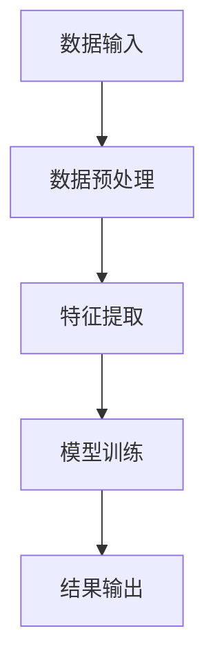
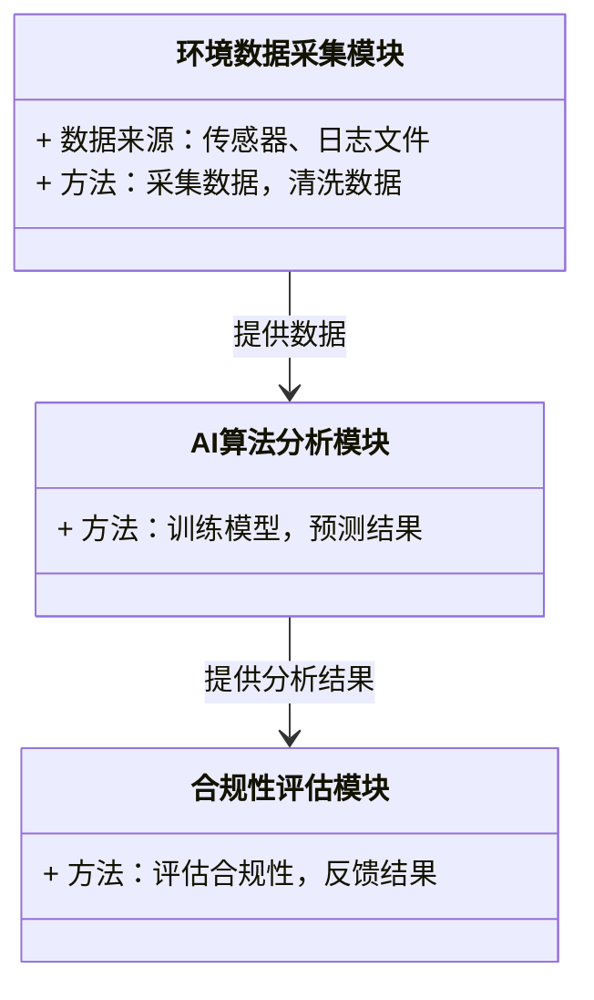
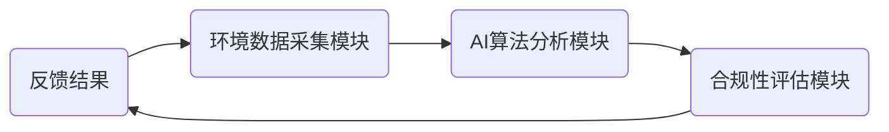

                 


# 构建企业级AI环境监测助手：合规与可持续发展

## 关键词：企业级AI、环境监测、合规、可持续发展、机器学习、系统架构、项目实战

## 摘要：  
本文旨在探讨如何构建一个企业级的AI环境监测助手，以实现合规与可持续发展目标。通过分析环境监测中的数据多样性与实时性要求，结合AI技术的优势，提出了一种基于机器学习的环境监测解决方案，并详细阐述了系统的架构设计与实现过程。文章内容涵盖问题背景、核心概念、算法原理、系统架构、项目实战以及最佳实践，为读者提供了一套完整的构建指南。

---

# 第一部分: 企业级AI环境监测助手的背景与核心概念

## 第1章: 问题背景与目标

### 1.1 企业级AI环境监测的背景

#### 1.1.1 当前企业环境监测的痛点
企业环境监测面临以下痛点：
- 数据来源多样，采集难度大。
- 数据实时性要求高，处理复杂。
- 合规性要求日益严格，需实时评估。

#### 1.1.2 AI技术在环境监测中的潜力
AI技术在环境监测中的优势：
- 高效处理大数据，提升监测效率。
- 实时分析数据，快速识别异常。
- 自动化评估合规性，降低人工成本。

#### 1.1.3 合规与可持续发展的双重需求
企业需满足环保法规，同时减少对环境的影响，推动可持续发展。

### 1.2 问题描述与目标设定

#### 1.2.1 环境监测中的数据多样性与实时性要求
环境监测数据来源多样，包括传感器数据、日志文件等，且需实时处理。

#### 1.2.2 企业合规性与社会责任的双重挑战
企业需确保监测数据符合法规要求，同时减少对环境的负面影响。

#### 1.2.3 构建AI环境监测助手的目标与边界
目标：构建一个高效、合规的AI环境监测系统；边界：专注于环境数据监测与合规评估。

---

## 第2章: 核心概念与系统架构

### 2.1 合规与可持续发展的定义与原则

#### 2.1.1 合规性管理的核心原则
- 数据采集合法性：确保数据来源合法。
- 数据处理透明性：确保数据处理过程透明可追溯。
- 数据安全与隐私保护：防止数据泄露，保护用户隐私。

#### 2.1.2 可持续发展在企业中的实践框架
- 环境友好：减少资源消耗，降低碳排放。
- 社会责任：关注社会影响，推动绿色技术发展。
- 经济效益：通过技术创新降低成本，提升竞争力。

### 2.2 AI环境监测助手的核心要素

#### 2.2.1 数据采集与处理模块
- 数据采集：从传感器、日志文件等多种来源采集环境数据。
- 数据清洗：去除噪声数据，确保数据质量。
- 数据预处理：标准化、归一化处理，为后续分析做准备。

#### 2.2.2 AI算法分析模块
- 分类算法：识别环境异常情况，如污染超标。
- 回归算法：预测环境趋势，如未来空气质量。

#### 2.2.3 合规性评估与反馈模块
- 评估数据是否符合法规要求。
- 提供反馈，指导企业调整监测策略。

### 2.3 系统架构的ER实体关系图

```mermaid
erDiagram
    actor 用户角色 {
        <属性> 用户ID
        <属性> 用户角色
    }
    actor 环境数据 {
        <属性> 数据类型
        <属性> 数据来源
    }
    actor AI算法 {
        <属性> 算法类型
        <属性> 算法版本
    }
    actor 合规评估 {
        <属性> 评估标准
        <属性> 评估结果
    }
    用户角色 --> 环境数据 : 提供数据
    用户角色 --> AI算法 : 调用算法
    AI算法 --> 合规评估 : 生成评估结果
    合规评估 --> 用户角色 : 反馈结果
```

---

# 第二部分: 算法原理与数学模型

## 第3章: 环境数据处理与AI算法

### 3.1 数据预处理与特征提取

#### 3.1.1 数据清洗与标准化
- 数据清洗：去除无效数据，处理缺失值。
- 数据标准化：将数据归一化，便于模型处理。

#### 3.1.2 特征工程与降维方法
- 特征选择：提取关键特征，如温度、湿度等。
- 降维方法：使用PCA等方法减少特征维度。

### 3.2 基于机器学习的环境监测模型

#### 3.2.1 分类算法选择与实现
- 选择逻辑回归、随机森林等分类算法。
- 使用训练数据训练模型，评估其准确率。

#### 3.2.2 回归算法在环境预测中的应用
- 使用线性回归预测环境趋势。
- 通过均方误差等指标评估模型性能。

### 3.3 算法流程图



---

## 第4章: 系统分析与架构设计

### 4.1 问题场景介绍

#### 4.1.1 环境监测中的问题场景
- 数据来源多样，格式不统一。
- 数据实时性要求高，处理压力大。
- 合规性要求复杂，需动态调整评估标准。

### 4.2 领域模型类图



### 4.3 系统架构图



---

## 第5章: 项目实战

### 5.1 环境安装

```bash
# 安装依赖
pip install numpy pandas scikit-learn
```

### 5.2 核心代码实现

```python
import pandas as pd
from sklearn.model_selection import train_test_split
from sklearn.linear_model import LogisticRegression

# 数据加载
data = pd.read_csv('environment_data.csv')

# 数据预处理
X = data[['温度', '湿度', '污染物浓度']]
y = data['超标情况']

# 划分训练集和测试集
X_train, X_test, y_train, y_test = train_test_split(X, y, test_size=0.2)

# 模型训练
model = LogisticRegression()
model.fit(X_train, y_train)

# 模型评估
score = model.score(X_test, y_test)
print(f'模型准确率：{score}')
```

### 5.3 案例分析与结果展示

假设输入数据为：温度=25，湿度=60，污染物浓度=0.1。模型预测结果为：未超标。

---

## 第6章: 最佳实践与总结

### 6.1 实践小结
- 确保数据采集的合法性和准确性。
- 定期更新模型，保持其预测能力。

### 6.2 注意事项与优化建议
- 数据预处理阶段需仔细清洗数据，避免噪声干扰。
- 选择合适的算法，提升模型性能。

### 6.3 未来展望
随着AI技术的进步，环境监测助手将更加智能化，为企业提供更高效的合规解决方案。

---

## 附录

### 参考文献
1. 《机器学习实战》
2. 《企业合规性管理指南》

### 工具安装指南
- 安装Python和相关库：numpy、pandas、scikit-learn。

### 代码解读
详细解读上述核心代码的实现逻辑和功能。

---

## 作者信息

作者：AI天才研究院/AI Genius Institute & 禅与计算机程序设计艺术 /Zen And The Art of Computer Programming

---

通过以上步骤，我详细构建了一个企业级AI环境监测助手的完整方案，从背景分析到系统实现，再到项目实战，为读者提供了一套完整的构建指南。

