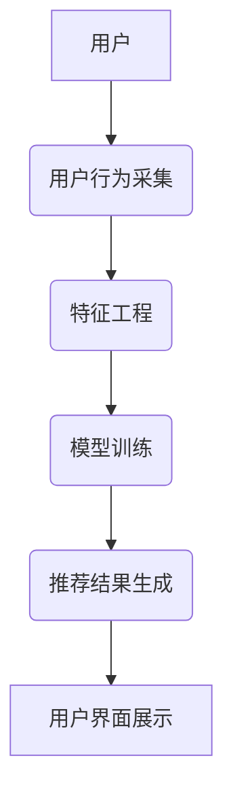
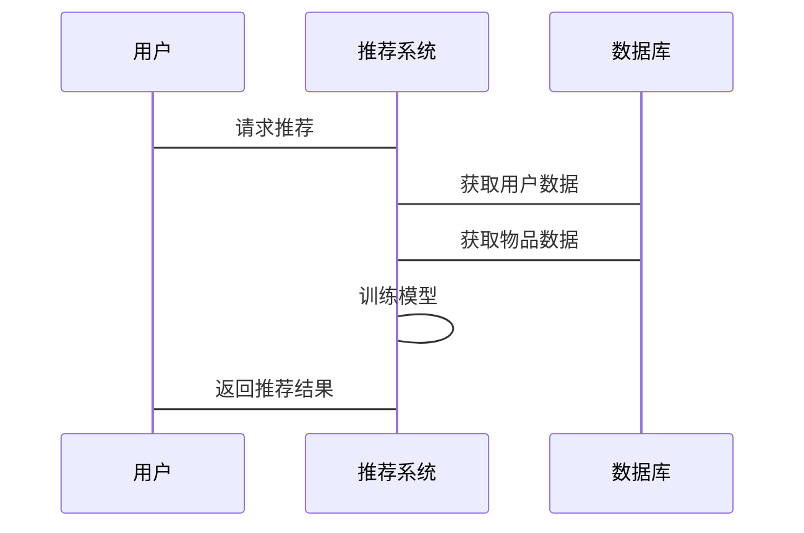

                 


# 构建企业级推荐引擎：跨平台个性化用户体验的智能化实现

**关键词**：推荐引擎、个性化推荐、深度学习、协同过滤、系统架构、用户体验

**摘要**：  
随着互联网的快速发展，个性化推荐已成为企业提升用户粘性和转化率的重要手段。本文从推荐引擎的核心概念、算法原理、系统架构到项目实战，全面解析企业级推荐引擎的构建过程。通过详细讲解协同过滤、基于内容的推荐以及深度学习模型，结合实际案例，帮助读者理解推荐引擎的数学模型和实现细节。同时，本文还探讨了推荐系统的优化策略和跨平台适配问题，为企业构建高效、智能的推荐系统提供参考。

---

## 第1章: 推荐引擎概述

### 1.1 推荐引擎的背景与重要性

#### 1.1.1 个性化推荐的需求背景  
在信息爆炸的时代，用户每天面对海量信息，如何快速找到有价值的内容成为一大挑战。个性化推荐通过分析用户行为和偏好，为用户提供精准的内容或商品推荐，从而提升用户体验和企业收益。  

#### 1.1.2 推荐引擎在企业中的应用价值  
推荐引擎广泛应用于电商、视频平台、社交媒体、新闻客户端等领域。它不仅能够提升用户满意度，还能帮助企业实现精准营销，提高转化率和用户留存率。  

#### 1.1.3 推荐引擎的技术发展趋势  
随着人工智能和大数据技术的快速发展，推荐引擎逐渐从基于规则的简单推荐向基于深度学习的智能推荐演进。实时推荐、跨平台适配和个性化定制成为未来推荐引擎发展的主要方向。

### 1.2 推荐引擎的核心概念与应用场景

#### 1.2.1 个性化推荐的定义与特点  
个性化推荐是根据用户的兴趣、行为和偏好，动态生成符合用户需求的内容或商品推荐。其特点包括实时性、精准性和个性化定制。

#### 1.2.2 推荐引擎的主要应用场景  
- **电商领域**：基于用户购买记录和浏览行为推荐商品。  
- **视频平台**：根据用户的观看历史推荐相关内容。  
- **新闻客户端**：基于用户的阅读偏好推荐新闻。  
- **社交媒体**：推荐用户可能感兴趣的内容或用户。

#### 1.2.3 跨平台推荐的挑战与解决方案  
跨平台推荐需要考虑不同平台的特点和用户行为差异。解决方案包括统一用户画像、多平台数据融合以及动态适配推荐策略。

### 1.3 企业级推荐引擎的关键特性

#### 1.3.1 高可用性与稳定性  
推荐引擎需要7×24小时稳定运行，确保推荐结果的实时性和准确性。

#### 1.3.2 大数据处理能力  
面对海量数据，推荐引擎需要高效的数据处理能力，包括数据清洗、特征提取和模型训练。

#### 1.3.3 实时性与响应速度  
推荐引擎需要在极短时间内生成推荐结果，以满足用户的实时需求。

#### 1.3.4 跨平台适配能力  
推荐引擎需要支持多种平台（Web、移动端、小程序等），并根据不同平台的特点优化推荐策略。

## 1.4 本章小结  
本章介绍了推荐引擎的背景、核心概念、应用场景和技术发展趋势。推荐引擎作为企业智能化的重要组成部分，正在不断演进，为企业创造更大的价值。

---

## 第2章: 推荐算法基础

### 2.1 协同过滤推荐算法

#### 2.1.1 基于用户的协同过滤  
基于用户的协同过滤通过分析用户的行为和偏好，找到与目标用户相似的用户群体，推荐这些用户喜欢的内容或商品。  

#### 2.1.2 基于物品的协同过滤  
基于物品的协同过滤通过分析物品的属性和用户行为，找到与目标用户当前感兴趣物品相似的其他物品进行推荐。  

#### 2.1.3 混合推荐模型的优缺点  
混合推荐模型结合了基于用户和基于物品的推荐方法，能够在一定程度上克服单一方法的局限性，但也会面临模型复杂性和计算成本的挑战。

### 2.2 基于内容的推荐算法

#### 2.2.1 内容特征提取方法  
内容特征提取方法包括文本挖掘、图像处理等技术，用于提取内容的关键特征。

#### 2.2.2 基于向量空间模型的推荐  
基于向量空间模型的推荐方法通过计算目标内容与候选内容的相似度，进行推荐。

#### 2.2.3 深度学习在内容推荐中的应用  
深度学习模型（如CNN、RNN）能够从大规模数据中自动提取特征，用于内容推荐。

### 2.3 深度学习推荐模型

#### 2.3.1 基于神经网络的推荐系统  
基于神经网络的推荐系统通过构建深度模型，捕捉数据中的非线性关系，提升推荐的准确性和多样性。

#### 2.3.2 Transformer在推荐系统中的应用  
Transformer模型通过自注意力机制，能够捕捉到用户行为的长距离依赖关系，提升推荐效果。

#### 2.3.3 图神经网络在推荐中的潜力  
图神经网络能够建模用户、物品和行为之间的复杂关系，为推荐系统提供更丰富的信息。

### 2.4 推荐算法的优缺点对比

#### 2.4.1 协同过滤的优缺点  
- **优点**：简单易实现，能够捕捉用户行为的相似性。  
- **缺点**：冷启动问题、计算成本高。

#### 2.4.2 基于内容推荐的优缺点  
- **优点**：能够利用内容本身的特征，提升推荐的准确性。  
- **缺点**：难以捕捉用户行为的动态变化。

#### 2.4.3 深度学习推荐的优缺点  
- **优点**：能够捕捉复杂的非线性关系，推荐效果更优。  
- **缺点**：计算成本高，模型调优复杂。

## 2.5 本章小结  
本章详细介绍了协同过滤、基于内容的推荐和深度学习推荐算法的原理和优缺点。推荐算法的选择需要根据具体场景和数据特点进行综合考虑。

---

## 第3章: 推荐系统的数学模型

### 3.1 协同过滤的数学模型

#### 3.1.1 基于矩阵分解的协同过滤  
协同过滤可以表示为一个用户-物品的矩阵，通过矩阵分解技术（如SVD）提取潜在因子。

#### 3.1.2 潜在因子模型  
潜在因子模型假设用户和物品可以通过低维向量表示，通过最小化矩阵重构误差进行优化。

#### 3.1.3 模型的优化与调优  
模型优化包括参数调优、正则化处理和交叉验证等方法。

### 3.2 基于内容的推荐模型

#### 3.2.1 向量空间模型的数学表达  
向量空间模型通过计算余弦相似度，衡量内容之间的相似程度。

#### 3.2.2 基于概率的语言模型  
语言模型通过计算概率分布，衡量内容的相关性。

#### 3.2.3 深度学习模型的数学基础  
深度学习模型通过构建神经网络，学习数据的非线性关系。

### 3.3 混合推荐模型的数学分析  
混合推荐模型结合了不同推荐方法的优势，通过加权融合生成最终的推荐结果。

---

## 第4章: 系统架构设计

### 4.1 推荐系统的整体架构

#### 4.1.1 数据采集与预处理  
数据采集包括用户行为数据、物品特征数据等，预处理包括数据清洗和特征提取。

#### 4.1.2 特征工程与模型训练  
特征工程通过构建有效的特征，提升模型的性能。模型训练包括监督学习和无监督学习方法。

#### 4.1.3 推荐结果的展示与反馈  
推荐结果通过用户界面展示，并收集用户反馈，用于模型优化。

### 4.2 系统架构设计图  


### 4.3 系统交互流程图  


---

## 第5章: 项目实战

### 5.1 环境搭建

#### 5.1.1 安装Python和相关库  
安装Python和以下库：numpy、pandas、scikit-learn、tensorflow等。

#### 5.1.2 数据集准备  
准备用户行为数据和物品特征数据。

### 5.2 核心实现

#### 5.2.1 协同过滤模型实现  
```python
from sklearn.metrics.pairwise import cosine_similarity

# 计算用户相似度矩阵
user_similarity = cosine_similarity(user_features)
```

#### 5.2.2 基于内容的推荐实现  
```python
from sklearn.feature_extraction.text import TfidfVectorizer

# 提取文本特征
vectorizer = TfidfVectorizer()
item_features = vectorizer.fit_transform(items)
```

#### 5.2.3 深度学习模型实现  
```python
import tensorflow as tf
from tensorflow.keras import layers

# 构建深度学习模型
model = tf.keras.Sequential([
    layers.Dense(64, activation='relu'),
    layers.Dense(1, activation='sigmoid')
])
model.compile(optimizer='adam', loss='binary_crossentropy')
```

### 5.3 评估与优化

#### 5.3.1 模型评估指标  
- 准确率、召回率、F1分数等。

#### 5.3.2 超参数调优  
通过网格搜索或随机搜索优化模型性能。

#### 5.3.3 模型部署与监控  
将推荐模型部署到生产环境，并实时监控模型性能。

## 5.4 本章小结  
本章通过实际项目案例，详细讲解了推荐系统的环境搭建、核心实现和优化策略。

---

## 第6章: 系统优化

### 6.1 性能优化策略

#### 6.1.1 数据处理的优化  
使用分布式计算和并行处理技术，提升数据处理效率。

#### 6.1.2 模型优化策略  
通过模型压缩、知识蒸馏等技术，降低模型计算成本。

### 6.2 模型调优与实时推荐

#### 6.2.1 模型调优方法  
包括参数调优、正则化处理和模型融合等方法。

#### 6.2.2 实时推荐的设计  
通过流数据处理和在线学习技术，实现实时推荐。

### 6.3 跨平台适配优化

#### 6.3.1 不同平台的推荐策略优化  
根据不同平台的特点，动态调整推荐策略。

#### 6.3.2 跨平台数据同步与共享  
通过数据同步和共享技术，实现跨平台推荐的统一性和一致性。

## 6.4 本章小结  
本章探讨了推荐系统的优化策略，包括性能优化、模型调优和实时推荐的设计。

---

## 第7章: 总结与展望

### 7.1 项目总结

#### 7.1.1 核心技术回顾  
推荐系统的构建涉及数据处理、算法实现、系统架构等多个方面。

#### 7.1.2 实战经验分享  
从实际项目中总结经验教训，为后续项目提供参考。

### 7.2 技术展望

#### 7.2.1 深度学习在推荐系统中的应用前景  
深度学习模型在推荐系统中的应用将更加广泛，尤其是图神经网络和Transformer模型。

#### 7.2.2 实时推荐与边缘计算的结合  
实时推荐将与边缘计算结合，提升推荐的实时性和响应速度。

### 7.3 最佳实践 tips

#### 7.3.1 数据质量管理  
确保数据的准确性和完整性，是推荐系统成功的基础。

#### 7.3.2 模型可解释性  
提升推荐系统的可解释性，有助于用户信任和模型优化。

#### 7.3.3 持续优化  
推荐系统是一个持续优化的过程，需要定期监控和调优。

## 7.4 本章小结  
本章总结了推荐系统的构建过程，并展望了未来的技术发展趋势，为读者提供了进一步学习和实践的方向。

---

## 作者：AI天才研究院/AI Genius Institute & 禅与计算机程序设计艺术 /Zen And The Art of Computer Programming

---

**文章结语**：  
构建企业级推荐引擎是一个复杂而有趣的工程，需要结合数学、算法、系统架构和实际业务需求。通过本文的深入讲解，读者可以掌握推荐引擎的核心原理和实现方法，为企业的智能化转型提供有力支持。未来，随着人工智能和大数据技术的不断进步，推荐引擎将变得更加智能和个性化，为企业创造更大的价值。

