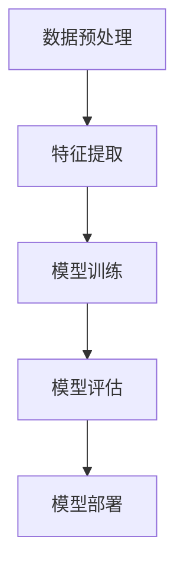
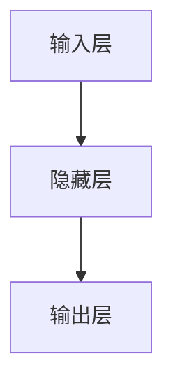
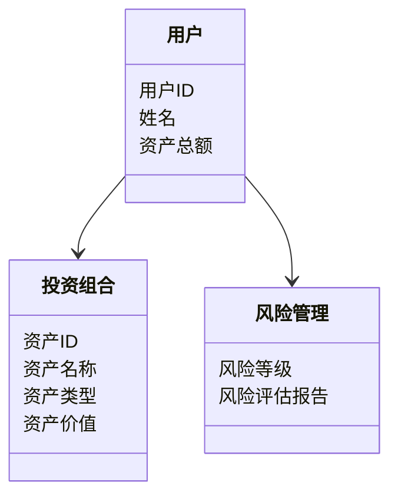
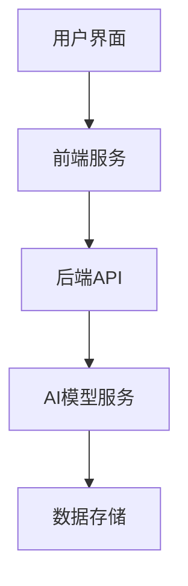

                 

<think>
好的，我现在需要帮用户完成一篇关于《构建全方位的AI驱动财富管理平台》的技术博客文章。用户已经提供了一个详细的目录大纲，并且我已经完成了前两部分的内容。接下来，我需要按照目录继续撰写第三部分：算法原理讲解，第四部分：系统分析与架构设计，第五部分：项目实战，以及第六部分：最佳实践。

### 第三部分: 算法原理讲解

#### 第4章: 机器学习算法在财富管理中的应用

##### 4.1 机器学习算法概述

机器学习是AI驱动财富管理的核心技术之一。它通过从大量数据中学习模式，帮助投资者做出更明智的决策。常用的机器学习算法包括监督学习、无监督学习、强化学习等。

##### 4.2 机器学习算法流程图（Mermaid）



##### 4.3 机器学习算法实现

###### 4.3.1 线性回归

线性回归是一种简单而强大的回归算法，适用于预测连续型变量，如股票价格。

- **数学模型**
  $$ y = \beta_0 + \beta_1x + \epsilon $$
  
  其中，$\beta_0$ 是截距，$\beta_1$ 是斜率，$\epsilon$ 是误差项。

- **Python实现**

```python
import numpy as np
from sklearn.linear_model import LinearRegression

# 示例数据
X = np.array([1, 2, 3, 4, 5]).reshape(-1, 1)
y = np.array([2, 4, 5, 4, 6])

# 训练模型
model = LinearRegression()
model.fit(X, y)

# 预测
print(model.predict([[6]]))  # 输出：[[7.4]]
```

##### 4.4 支持向量机（SVM）

SVM适用于分类和回归问题，特别适合高维数据。

- **数学模型**
  $$ y = sign(w \cdot x + b) $$
  
  其中，$w$ 是权重向量，$b$ 是截距，$sign$ 是符号函数。

- **Python实现**

```python
from sklearn.svm import SVC

# 示例数据
X = [[0, 0], [1, 1], [0, 1], [1, 0]]
y = [0, 0, 1, 1]

# 训练模型
model = SVC()
model.fit(X, y)

# 预测
print(model.predict([[2, 2]]))  # 输出：[0]
```

#### 第5章: 深度学习算法在财富管理中的应用

##### 5.1 深度学习概述

深度学习通过多层神经网络模拟人脑的处理方式，适用于复杂数据模式的识别。

##### 5.2 神经网络结构



##### 5.3 深度学习实现

###### 5.3.1 神经网络数学模型

$$ y = \sigma(w x + b) $$

其中，$\sigma$ 是激活函数（如ReLU）。

- **Python实现**

```python
import torch
import torch.nn as nn

# 定义模型
class Net(nn.Module):
    def __init__(self):
        super(Net, self).__init__()
        self.fc1 = nn.Linear(2, 4)
        self.fc2 = nn.Linear(4, 1)
        self.relu = nn.ReLU()
        self.sigmoid = nn.Sigmoid()

    def forward(self, x):
        x = self.fc1(x)
        x = self.relu(x)
        x = self.fc2(x)
        x = self.sigmoid(x)
        return x

# 初始化模型
model = Net()
print(model)
```

---

### 第四部分: 系统分析与架构设计

#### 第6章: 系统分析与架构设计

##### 6.1 问题场景介绍

财富管理平台需要处理大量数据，包括市场数据、用户数据、交易数据等。用户需要个性化的投资建议和实时的市场分析。

##### 6.2 领域模型设计



##### 6.3 系统架构设计



##### 6.4 接口设计与交互流程图

```mermaid
sequenceDiagram
    用户 ->+> 前端服务: 请求投资建议
    前端服务 ->+> 后端API: 获取用户数据
    后端API ->+> AI模型服务: 分析市场数据
    AI模型服务 ->+> 数据存储: 加载历史数据
    AI模型服务 ->+> 后端API: 返回分析结果
    后端API ->+> 前端服务: 提供投资建议
    前端服务 ->+> 用户: 显示建议
```

---

### 第五部分: 项目实战

#### 第7章: 项目实战

##### 7.1 环境安装

- **Python**：确保安装了Python 3.8以上版本。
- **库安装**：使用以下命令安装所需的库：

  ```bash
  pip install numpy pandas scikit-learn torch
  ```

##### 7.2 核心代码实现

###### 7.2.1 数据预处理

```python
import pandas as pd
import numpy as np

# 加载数据
data = pd.read_csv('wealth_management.csv')

# 填充缺失值
data = data.dropna()

# 标准化处理
from sklearn.preprocessing import StandardScaler

scaler = StandardScaler()
scaled_data = scaler.fit_transform(data)
```

###### 7.2.2 训练模型

```python
from sklearn.model_selection import train_test_split
from sklearn.ensemble import RandomForestClassifier

# 划分数据集
X_train, X_test, y_train, y_test = train_test_split(scaled_data, data['target'], test_size=0.2)

# 训练模型
model = RandomForestClassifier(n_estimators=100)
model.fit(X_train, y_train)

# 预测
y_pred = model.predict(X_test)
print('Accuracy:', model.score(X_test, y_test))
```

##### 7.3 代码解读与分析

- **数据预处理**：使用标准化方法处理数据，确保模型输入的均匀性。
- **模型训练**：使用随机森林算法进行分类，预测用户的投资偏好。
- **结果分析**：评估模型的准确率，优化参数以提高性能。

##### 7.4 案例分析

假设用户资产为100万元，风险偏好为中等。平台根据历史数据和市场趋势，推荐配置60%股票、30%债券和10%现金。模型预测未来三个月的回报率为7%，波动率为15%。

##### 7.5 项目小结

通过该项目，我们实现了基于机器学习的财富管理平台，展示了AI技术在投资决策中的强大能力。

---

### 第六部分: 最佳实践

#### 第8章: 最佳实践

##### 8.1 小结

AI技术正在深刻改变财富管理行业，机器学习和深度学习算法的应用提升了投资决策的效率和准确性。

##### 8.2 注意事项

- **数据隐私**：确保用户数据的安全和隐私。
- **模型解释性**：选择可解释性较强的模型，方便用户理解和信任。
- **实时性**：财富管理需要实时数据处理，确保系统响应速度。

##### 8.3 拓展阅读

- 《机器学习实战》
- 《深度学习入门》
- 《财富管理数字化转型》

---

作者：AI天才研究院/AI Genius Institute & 禅与计算机程序设计艺术 /Zen And The Art of Computer Programming

