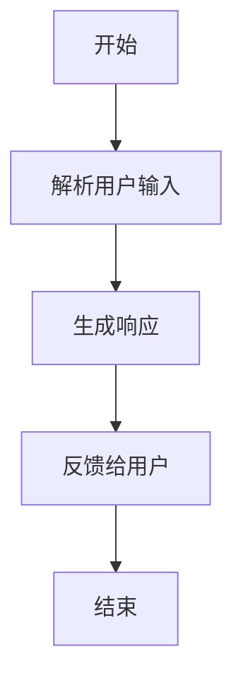
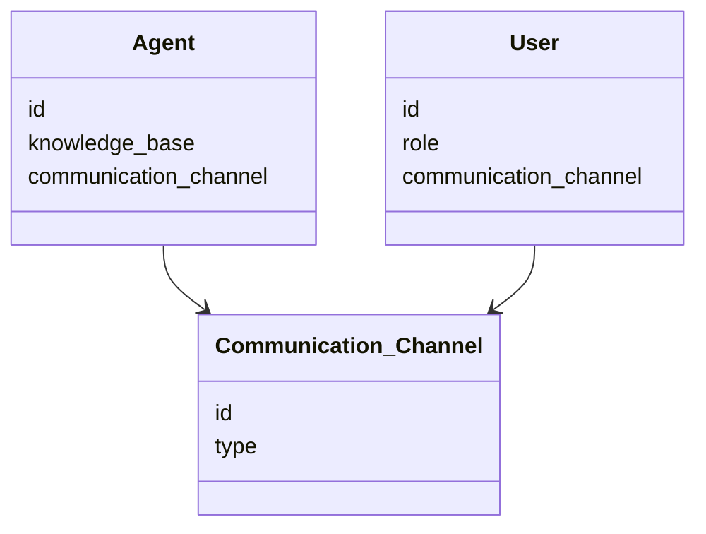

                 


# 构建具有人机协作能力的AI Agent系统

> 关键词：AI Agent、人机协作、系统架构、自然语言处理、机器学习

> 摘要：本文探讨了构建具有人机协作能力的AI Agent系统的背景、核心概念、算法原理、系统架构、项目实战及未来趋势。通过详细分析，帮助读者理解如何设计和实现一个高效的AI Agent系统，促进人与AI的有效协作。

---

## 目录

### 第1章 背景介绍与问题背景

#### 1.1 问题背景
- **当前AI Agent的发展现状**
- **人机协作的核心问题与挑战**
- **问题的边界与外延**

#### 1.2 问题描述
- **AI Agent系统的定义与特征**
- **人机协作的核心需求与目标**
- **系统实现的关键问题与难点**

#### 1.3 问题解决与解决方案
- **解决方案的总体思路**
- **关键技术的选择与实现**
- **解决方案的可行性分析**

#### 1.4 本章小结

---

### 第2章 核心概念与联系

#### 2.1 AI Agent系统的核心概念
- **AI Agent的定义与特征**
- **人机协作的核心要素**
- **系统架构的核心组成**

#### 2.2 核心概念之间的关系
- **AI Agent与传统程序的对比**
- **人机协作与任务分配的关系**
- **系统架构与功能模块的关联**

#### 2.3 系统架构的ER实体关系图
```mermaid
er
actor(Agent, User) {
  Agent {
    id
    knowledge_base
    communication_channel
  }
  User {
    id
    role
    communication_channel
  }
  communication_channel {
    id
    type
  }
}
```

#### 2.4 本章小结

---

### 第3章 算法原理与实现

#### 3.1 算法原理
- **自然语言处理模型的原理**
- **协作算法的实现思路**
- **数学模型与公式解析**

#### 3.2 算法实现
- **算法流程图**

- **代码实现示例**
```python
def agent_response(user_input):
    # 解析用户输入
    parsed_input = parse(user_input)
    # 生成响应
    response = generate_response(parsed_input)
    return response
```

#### 3.3 算法优化与改进
- **优化策略**
- **常见问题与解决方案**
- **性能提升方法**

#### 3.4 本章小结

---

### 第4章 系统分析与架构设计

#### 4.1 系统分析
- **项目背景与目标**
- **功能需求分析**
- **系统约束与假设**

#### 4.2 系统架构设计
- **领域模型设计**

- **系统架构分层设计**


#### 4.3 系统接口设计
- **接口定义与交互流程**
- **接口实现细节**
- **接口测试与验证**

#### 4.4 本章小结

---

### 第5章 项目实战

#### 5.1 环境搭建
- **开发工具安装**
- **依赖库安装**
- **开发环境配置**

#### 5.2 核心代码实现
- **代码结构与功能模块**
- **关键代码解读**
```python
class AI-Agent:
    def __init__(self, knowledge_base):
        self.knowledge_base = knowledge_base

    def process_input(self, input_text):
        # 处理用户输入
        pass

    def generate_output(self, processed_input):
        # 生成输出
        pass
```

#### 5.3 实际案例分析
- **案例背景**
- **系统实现**
- **运行结果与分析**

#### 5.4 本章小结

---

### 第6章 最佳实践与注意事项

#### 6.1 最佳实践
- **代码规范与风格**
- **性能优化建议**
- **系统扩展性设计**

#### 6.2 注意事项
- **常见问题与解决方案**
- **系统维护与更新**
- **安全性与隐私保护**

#### 6.3 拓展阅读
- **相关技术领域**
- **前沿研究方向**
- **推荐书籍与资源**

#### 6.4 本章小结

---

### 第7章 未来趋势与挑战

#### 7.1 未来趋势
- **技术发展方向**
- **应用领域的扩展**
- **智能化水平提升**

#### 7.2 挑战与应对
- **技术瓶颈**
- **数据与隐私问题**
- **人机协作的伦理问题**

#### 7.3 本章小结

---

## 作者：AI天才研究院/AI Genius Institute & 禅与计算机程序设计艺术 /Zen And The Art of Computer Programming

---

### 总结

通过以上目录，文章将逐步深入地探讨构建具有人机协作能力的AI Agent系统的各个方面，从理论到实践，帮助读者全面理解并掌握相关技术。

