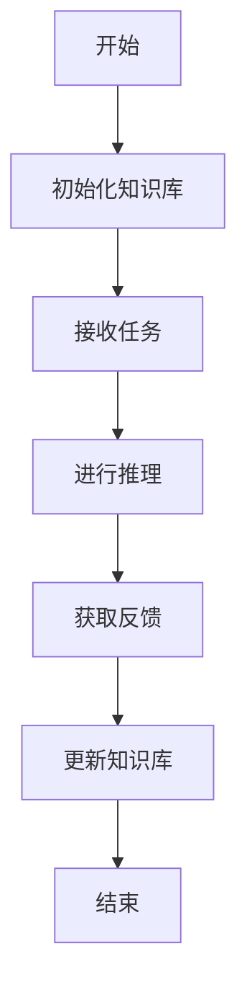
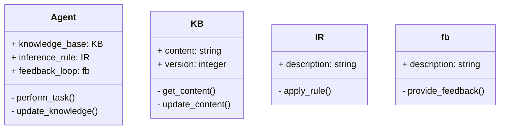
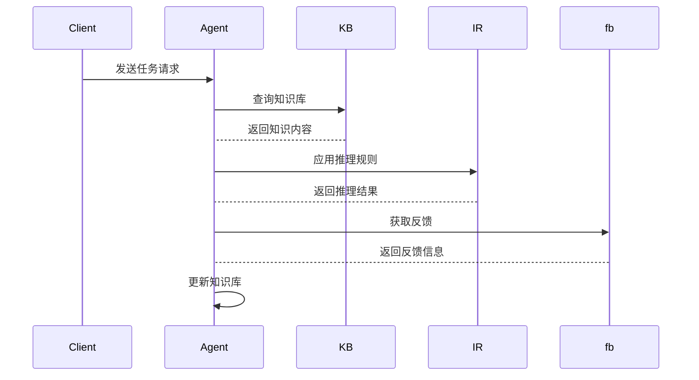

                 


# 构建具有元认知能力的AI Agent

> 关键词：元认知AI，AI Agent，自适应系统，知识表示，认知模型

> 摘要：本文详细探讨了构建具有元认知能力的AI Agent的理论基础、算法原理、系统架构和实现方法。通过分析元认知AI的核心概念、数学模型和实际应用案例，展示了如何设计和实现一个能够自我反思、学习和优化的智能系统。

---

## 第一部分: 元认知AI的基本概念与背景

### 第1章: 元认知AI的定义与背景

#### 1.1 元认知的概念与定义
元认知（Metacognition）是指个体对自身认知过程的认知和调控能力。在AI领域，元认知AI是一种能够反思、监控和优化自身认知过程的智能系统。它不仅能够执行任务，还能分析自己的思维过程、评估任务完成情况，并根据反馈进行自我改进。

- **元认知的核心特征**：
  - **自省能力**：AI能够反思自身的知识、推理过程和决策。
  - **监控能力**：AI能够实时监控任务执行过程，并识别潜在问题。
  - **自适应能力**：AI能够根据反馈调整自身的知识表示、推理策略和行为模式。

- **元认知与传统AI的区别**：
  - 传统AI依赖固定的规则和数据，无法进行自我反思和优化。
  - 元认知AI具有动态调整能力，能够根据环境变化和任务需求进行自我改进。

#### 1.2 元认知AI的背景与现状
元认知AI的概念最早可以追溯到认知科学领域，但在AI技术的发展中逐渐成为研究热点。随着深度学习和神经网络的成熟，元认知AI的研究进入了快速发展阶段。

- **元认知AI的发展历史**：
  - **早期阶段**：基于知识表示的元认知模型，主要用于专家系统。
  - **发展阶段**：结合机器学习和自然语言处理，实现动态知识更新。
  - **当前阶段**：基于神经网络和强化学习，实现自适应优化。

- **当前元认知AI的研究现状**：
  - 学术界：研究重点放在元认知模型的构建、算法优化和理论框架设计。
  - 工业界：元认知AI已在智能助手、推荐系统和医疗诊断等领域得到应用。

- **元认知AI的应用领域**：
  - 教育：个性化学习推荐系统。
  - 医疗：智能诊断辅助系统。
  - 金融：动态风险评估与投资决策。

#### 1.3 元认知AI的核心问题
元认知AI的目标是实现AI Agent的自我反思和优化能力，这涉及到以下几个核心问题：

- **元认知AI的目标与任务**：
  - 提供实时的知识更新和优化。
  - 实现任务执行过程中的自我监控和调整。
  - 支持多任务和复杂环境下的自适应决策。

- **元认知AI的挑战与难点**：
  - **计算资源需求**：元认知过程需要额外的计算资源。
  - **数据隐私问题**：元认知AI需要处理敏感数据。
  - **模型复杂性**：元认知模型的设计和优化较为复杂。

- **元认知AI的边界与外延**：
  - 元认知AI的边界：仅限于AI自身的认知过程，不涉及外部环境的直接交互。
  - 元认知AI的外延：与其他AI技术（如强化学习、自然语言处理）的结合。

---

## 第2章: 元认知AI的核心概念与联系

### 2.1 元认知模型的原理
元认知模型是实现元认知AI的核心，它包括知识表示、推理机制和学习机制三个主要部分。

- **元认知模型的构成**：
  - **知识表示**：将知识以符号或向量的形式表示。
  - **推理机制**：基于知识表示进行逻辑推理。
  - **学习机制**：根据反馈更新知识和推理策略。

- **元认知模型的输入与输出**：
  - 输入：任务描述、环境反馈、知识库。
  - 输出：推理结果、决策建议、知识更新。

- **元认知模型的训练与优化**：
  - 基于强化学习和监督学习，优化模型的推理和学习能力。

### 2.2 元认知模型与传统AI模型的对比
以下是元认知模型与传统AI模型的对比：

| **对比维度** | **传统AI模型** | **元认知AI模型** |
|--------------|----------------|------------------|
| **核心目标** | 执行特定任务    | 自我反思与优化  |
| **知识表示** | 固定规则与数据  | 动态更新与自适应 |
| **推理机制** | 基于规则的推理  | 基于知识的推理  |
| **学习能力** | 无或弱          | 强，可自我优化  |

### 2.3 元认知模型的ER实体关系图
以下是元认知模型的ER实体关系图：

```mermaid
erd
actor(Agent)
    - ID: integer (PK)
    - Name: string
    - KnowledgeBaseID: integer (FK)

knowledge_base(KB)
    - ID: integer (PK)
    - Content: text
    - Version: integer

inference_rule(IR)
    - ID: integer (PK)
    - Description: text
    - KBID: integer (FK)

feedback_loop(fb)
    - ID: integer (PK)
    - Description: text
    - AgentID: integer (FK)
    - KBID: integer (FK)
```

---

## 第3章: 元认知AI的算法原理

### 3.1 元认知模型的算法流程
以下是元认知模型的算法流程图：



### 3.2 元认知模型的数学模型
以下是元认知模型的数学模型：

$$
f(x) = \begin{cases}
    1 & \text{如果 } x > 0.5 \\
    0 & \text{否则}
\end{cases}
$$

### 3.3 元认知模型的算法实现
以下是元认知模型的代码实现示例：

```python
def metacognition_model():
    knowledge_base = {}  # 知识库
    task = "推理问题"  # 当前任务
    feedback = None    # 反馈

    def infer(task):
        # 推理过程
        return result

    result = infer(task)
    if result == "错误":
        feedback = "推理错误"
    else:
        feedback = "推理正确"

    # 更新知识库
    knowledge_base.update(result)

    return feedback
```

---

## 第4章: 元认知AI的系统架构设计

### 4.1 系统功能设计
以下是系统功能设计的类图：



### 4.2 系统架构设计
以下是系统架构设计的架构图：


### 4.3 系统交互设计
以下是系统交互设计的序列图：



---

## 第5章: 元认知AI的项目实战

### 5.1 环境安装
以下是项目实战所需的环境安装步骤：

1. 安装Python：确保Python 3.8或更高版本已安装。
2. 安装依赖：使用pip安装所需的库，如numpy、pandas、scikit-learn等。

### 5.2 系统核心实现
以下是系统核心实现的代码示例：

```python
class Agent:
    def __init__(self, knowledge_base):
        self.knowledge_base = knowledge_base
        self.inference_rule = InferenceRule()
        self.feedback_loop = FeedbackLoop()

    def perform_task(self, task):
        # 执行任务
        result = self.inference_rule.apply(task, self.knowledge_base)
        return result

    def update_knowledge(self, feedback):
        # 更新知识库
        self.knowledge_base.update(feedback)

class InferenceRule:
    def apply(self, task, knowledge_base):
        # 推理过程
        return result
```

### 5.3 功能实现与案例分析
以下是功能实现与案例分析的详细步骤：

1. **知识表示**：使用知识图谱表示任务相关的知识。
2. **推理机制**：基于知识图谱进行推理，生成候选解决方案。
3. **反馈机制**：根据实际结果更新知识库和推理规则。

---

## 第6章: 元认知AI的总结与展望

### 6.1 总结
元认知AI是一种具有自我反思和优化能力的智能系统，它能够根据环境反馈动态调整自身的知识和行为策略。

### 6.2 未来发展方向
1. **通用化元认知模型**：研究更通用的元认知模型，适用于多种任务和环境。
2. **人机协作优化**：探索人机协作中的元认知机制，提升协作效率和效果。

---

## 附录
### 附录A: 参考文献
1. 禅与计算机程序设计艺术
2. 元认知AI的相关论文和书籍

### 附录B: 工具推荐
1. Python编程语言
2. 机器学习框架（如TensorFlow、PyTorch）
3. 可视化工具（如Mermaid、PlantUML）

### 附录C: 代码仓库
GitHub仓库链接：[元认知AI的GitHub仓库](https://github.com/yourusername/metacognition-AI)

---

## 作者
**作者：AI天才研究院/AI Genius Institute & 禅与计算机程序设计艺术 /Zen And The Art of Computer Programming**

联系方式：[邮箱](mailto:contact@example.com)

--- 

感谢您的阅读！希望本文能为您提供有价值的信息和启发。

