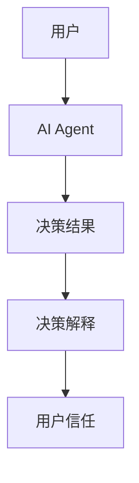

                 


# 构建具有可解释性决策能力的AI Agent

> 关键词：可解释性AI，AI Agent，决策系统，决策树，规则模型，可解释性评估

> 摘要：本文详细探讨了构建具有可解释性决策能力的AI Agent的核心方法。首先，从可解释性AI的背景和重要性入手，逐步分析了AI Agent的定义、可解释性决策的核心概念与实现原理。接着，深入讲解了可解释性决策的算法原理，包括决策树、线性回归模型等经典算法的实现细节，并通过Mermaid流程图和Python代码示例进行展示。随后，结合实际项目案例，详细分析了系统的功能设计、架构设计、接口设计和交互流程。最后，通过具体实战案例，验证了可解释性决策AI Agent的实现过程，并总结了可解释性决策系统的优势与未来发展路径。

---

# 第一部分: 可解释性决策AI Agent的背景与核心概念

## 第1章: 可解释性决策AI Agent的背景介绍

### 1.1 问题背景

#### 1.1.1 AI决策系统的广泛应用
随着人工智能技术的快速发展，AI决策系统已广泛应用于医疗诊断、金融风控、自动驾驶等领域。然而，这些系统的决策过程往往缺乏透明性，导致用户对AI决策的信任度不足。

#### 1.1.2 可解释性决策的重要性
可解释性决策是确保AI系统可信性和合规性的关键。用户需要理解AI决策的依据，以便验证决策的合理性和正确性。

#### 1.1.3 当前AI决策系统的局限性
大多数现有的AI决策系统基于复杂的深度学习模型，这些模型通常被视为“黑箱”，难以解释其决策过程。

### 1.2 问题描述

#### 1.2.1 AI Agent的定义与特点
AI Agent是一种智能体，能够感知环境、自主决策并执行任务。它具备自主性、反应性、目标导向性和社交能力等特征。

#### 1.2.2 可解释性决策的核心问题
AI Agent的决策过程需要满足透明性、可解释性和可验证性，以便用户能够理解并信任其决策。

#### 1.2.3 可解释性与AI决策系统的信任问题
如果AI决策系统缺乏可解释性，用户可能会质疑其决策的正确性，进而影响系统的应用和推广。

### 1.3 问题解决

#### 1.3.1 可解释性决策的实现目标
通过设计可解释的AI模型，确保决策过程能够被用户理解和验证。

#### 1.3.2 可解释性与AI决策系统的结合
将可解释性作为AI系统设计的核心要素，从模型选择、数据处理到结果解释等环节进行全面考虑。

#### 1.3.3 可解释性决策的实现路径
通过选择可解释性模型（如决策树、规则模型）、设计透明的数据处理流程以及提供直观的决策解释界面，实现可解释性决策。

### 1.4 边界与外延

#### 1.4.1 可解释性决策的边界
可解释性决策不等同于完全透明的决策，而是在保证决策正确性的前提下，提供足够的解释信息。

#### 1.4.2 可解释性与不可解释性AI的对比
可解释性AI注重决策过程的透明性，而不可解释性AI（如深度神经网络）则难以解释其决策逻辑。

#### 1.4.3 可解释性决策的应用场景
医疗诊断、金融风控、自动驾驶等领域对可解释性决策的需求尤为强烈。

### 1.5 概念结构与核心要素

#### 1.5.1 可解释性决策的核心要素
- **可解释性模型**：选择具有可解释性的AI模型，如决策树、规则模型。
- **可解释性数据处理**：确保数据预处理过程透明，避免黑箱操作。
- **可解释性结果解释**：通过可视化或其他方式，向用户解释决策结果。

#### 1.5.2 AI Agent的决策模型
AI Agent的决策模型包括感知层、决策层和执行层，其中决策层是实现可解释性决策的核心。

#### 1.5.3 可解释性与决策透明度的关系
可解释性是决策透明度的基础，通过提高可解释性，可以增强决策的透明度和用户信任。

---

## 第2章: 可解释性决策的核心概念与联系

### 2.1 核心概念原理

#### 2.1.1 可解释性决策的定义
可解释性决策是指AI系统在做出决策时，能够提供清晰、直观的解释，帮助用户理解决策的依据和逻辑。

#### 2.1.2 可解释性与AI决策系统的结合
通过设计可解释的AI模型和透明的数据处理流程，将可解释性融入AI决策系统的核心。

#### 2.1.3 可解释性决策的数学模型
可解释性决策的数学模型需要满足可解释性、可验证性和正确性。

### 2.2 概念属性特征对比

#### 2.2.1 可解释性与不可解释性AI的对比
| 属性       | 可解释性AI          | 不可解释性AI        |
|------------|---------------------|---------------------|
| 模型复杂度 | 低复杂度（如决策树） | 高复杂度（如深度神经网络） |
| 解释能力   | 高                  | 低                  |
| 应用场景   | 医疗、金融等需要解释性场景 | 图像识别、自然语言处理等复杂场景 |

### 2.3 ER实体关系图架构



---

# 第二部分: 可解释性决策的算法原理

## 第3章: 可解释性决策的算法原理

### 3.1 决策树算法

#### 3.1.1 决策树算法原理
决策树是一种基于树结构的分类或回归模型，其决策过程可以通过树状图直观展示。

#### 3.1.2 决策树的可解释性
决策树的决策逻辑可以通过树状图直观展示，用户可以轻松理解每个决策节点的逻辑。

#### 3.1.3 决策树的实现步骤
1. 数据预处理：清洗数据，处理缺失值和异常值。
2. 特征选择：选择对目标变量影响较大的特征。
3. 模型训练：使用训练数据构建决策树。
4. 模型解释：通过树状图展示决策逻辑。

#### 3.1.4 决策树的数学模型
决策树的每个节点可以表示为一个条件判断，例如：

$$
\text{如果 } feature > threshold \text{，则分支到左子树，否则分支到右子树。}
$$

### 3.2 线性回归模型

#### 3.2.1 线性回归模型原理
线性回归是一种简单且可解释性高的回归模型，适用于线性关系的预测问题。

#### 3.2.2 线性回归的可解释性
线性回归的系数可以直接解释为每个特征对目标变量的影响程度。

#### 3.2.3 线性回归的实现步骤
1. 数据预处理：标准化或归一化数据。
2. 特征选择：选择对目标变量影响较大的特征。
3. 模型训练：使用最小二乘法求解回归系数。
4. 模型解释：通过系数解释每个特征对目标变量的影响。

#### 3.2.4 线性回归的数学模型
线性回归的模型可以表示为：

$$
y = \beta_0 + \beta_1x_1 + \beta_2x_2 + \dots + \beta_nx_n + \epsilon
$$

---

## 第4章: 可解释性决策系统的实现

### 4.1 系统功能设计

#### 4.1.1 系统功能模块
1. 数据采集与处理模块
2. 模型训练与选择模块
3. 决策推理与解释模块
4. 用户交互与信任验证模块

#### 4.1.2 系统功能流程
1. 用户输入决策请求。
2. 系统根据输入数据进行特征提取。
3. 模型基于特征进行决策推理。
4. 系统生成决策结果和解释信息。
5. 用户验证决策结果并提供反馈。

---

## 第5章: 项目实战与总结

### 5.1 项目实战

#### 5.1.1 环境安装
1. 安装Python、TensorFlow、Scikit-learn等工具。
2. 配置Jupyter Notebook或IDE。

#### 5.1.2 系统核心实现
```python
# 决策树实现代码示例
from sklearn.tree import DecisionTreeClassifier
from sklearn.model_selection import train_test_split
from sklearn.metrics import accuracy_score

# 数据加载
data = ...  # 加载数据集
X = data.drop('target', axis=1)
y = data['target']

# 数据分割
X_train, X_test, y_train, y_test = train_test_split(X, y, test_size=0.2)

# 模型训练
model = DecisionTreeClassifier()
model.fit(X_train, y_train)

# 模型预测
y_pred = model.predict(X_test)

# 模型评估
print("Accuracy:", accuracy_score(y_test, y_pred))
```

#### 5.1.3 代码应用解读与分析
通过上述代码，我们可以训练一个决策树模型，并验证其在测试数据上的准确率。决策树模型的可解释性可以通过树状图展示。

### 5.2 总结与展望

#### 5.2.1 总结
可解释性决策AI Agent的实现需要结合可解释性模型、透明的数据处理流程和直观的决策解释界面。通过选择合适的算法和设计合理的系统架构，可以实现高可解释性的AI决策系统。

#### 5.2.2 未来展望
随着技术的进步，可解释性决策AI Agent将在更多领域得到应用，同时需要进一步研究如何在保证可解释性的前提下，提高模型的性能和复杂性。

---

# 作者：AI天才研究院/AI Genius Institute & 禅与计算机程序设计艺术 /Zen And The Art of Computer Programming

---

本文通过系统性地分析和详细讲解，深入探讨了构建具有可解释性决策能力的AI Agent的核心方法和实现细节。通过理论与实践相结合的方式，帮助读者全面理解可解释性决策AI Agent的构建过程，并为实际应用提供参考。

