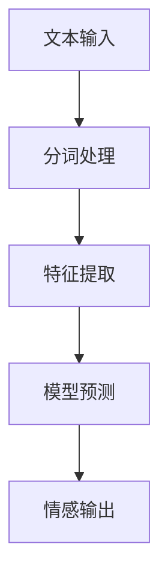

                 


# 构建具有同理心的AI Agent交互系统

> 关键词：情感计算、同理心建模、人机交互、自然语言处理、AI Agent、机器学习

> 摘要：随着人工智能技术的快速发展，AI Agent在各个领域的应用日益广泛。然而，现有的AI Agent交互系统往往缺乏同理心，无法真正理解用户的情感和需求。本文从理论基础、算法原理、系统设计、项目实现等多个角度，详细探讨如何构建一个具有同理心的AI Agent交互系统，帮助用户实现更自然、更贴心的交互体验。

---

## 第一部分：AI Agent与同理心交互的背景

### 第1章：AI Agent的基本概念

#### 1.1 AI Agent的定义与分类
- **AI Agent**是指具有智能性、反应性、主动性、社交能力等特性的智能体，能够根据环境信息自主决策并执行任务。
- **分类**：基于任务类型，AI Agent可以分为信息服务类、决策支持类、娱乐互动类等。

#### 1.2 同理心在AI Agent中的重要性
- 同理心（Empathy）是理解并共享他人情感的能力，是实现自然人机交互的关键。
- 具有同理心的AI Agent能够更好地理解用户需求，提供更个性化的服务。

#### 1.3 当前AI Agent交互系统的现状
- **问题**：传统AI Agent交互系统主要依赖预设规则，缺乏情感理解和动态适应能力。
- **挑战**：如何在交互过程中准确识别用户情感，实时调整交互策略。

---

### 第2章：情感计算与人机交互

#### 2.1 情感计算的定义与技术
- 情感计算（Affective Computing）是通过计算机技术来识别、理解和模拟人类情感的过程。
- **关键技术**：基于自然语言处理的情感分析、基于语音识别的情感识别、基于面部表情分析的情感计算。

#### 2.2 同理心交互的目标
- **目标**：构建一个能够理解用户情感、提供情感支持的AI Agent交互系统。
- **意义**：提升用户体验，增强人机交互的自然性和亲和力。

---

## 第二部分：具有同理心的AI Agent核心概念

### 第3章：情感计算与同理心建模

#### 3.1 情感计算的数学模型
- **情感计算模型**：基于概率论和统计学的方法，通过分析用户输入（文本、语音、表情等）来预测情感状态。
- **公式示例**：$$ P(positive|text) = \frac{P(text|positive)}{P(text)} \times P(positive) $$

#### 3.2 同理心建模的理论基础
- **共情模型**：通过模拟人类共情过程，建立情感理解和情感生成的模型。
- **情感记忆**：记录用户的历史情感状态，用于后续交互中的情感预测。

#### 3.3 情感计算与同理心建模的对比分析
- **对比表格**：从目标、方法、应用场景等方面进行对比，展示两者的异同点。

| 特性       | 情感计算           | 同理心建模         |
|------------|-------------------|-------------------|
| 目标       | 分析情感状态       | 模拟情感共鸣       |
| 方法       | 统计分析、机器学习 | 情感记忆、共情推理 |
| 应用场景   | 情感分析、推荐系统 | 情感对话、心理支持 |

---

## 第三部分：具有同理心的AI Agent算法原理

### 第4章：情感计算算法

#### 4.1 基于规则的情感计算算法
- **规则定义**：通过设定情感关键词和情感强度，构建情感分析规则。
- **实现步骤**：1. 分词；2. 关键词匹配；3. 情感强度计算。

#### 4.2 基于机器学习的情感计算算法
- **算法选择**：支持向量机（SVM）、随机森林（Random Forest）、深度学习模型（如LSTM）。
- **流程图**：使用mermaid绘制情感计算流程图。



---

## 第四部分：系统设计与实现

### 第5章：系统架构设计

#### 5.1 需求分析
- **用户需求**：实时情感识别、个性化交互、情感记忆功能。
- **系统功能**：情感识别模块、情感记忆模块、交互反馈模块。

#### 5.2 系统架构设计
- **模块划分**：前端交互模块、后端处理模块、数据库模块。
- **架构图**：使用mermaid绘制系统架构图。


---

## 第五部分：项目实战

### 第6章：具有同理心的AI Agent实现

#### 6.1 环境安装
- **工具安装**：Python、TensorFlow、NLTK、jieba。
- **依赖库安装**：pip install numpy, scikit-learn, transformers。

#### 6.2 核心代码实现
- **情感识别代码**：基于预训练模型的情感分析代码。

```python
from transformers import pipeline

sentiment_analyzer = pipeline("sentiment-analysis")
result = sentiment_analyzer("I love this product")[0]
print(f"Sentiment: {result['label']}, Score: {result['score']}")
```

#### 6.3 项目小结
- **实现功能**：情感识别、情感记忆、交互反馈。
- **应用案例**：医疗咨询系统中的情感支持功能。

---

## 第六部分：总结与展望

### 第7章：总结与展望

#### 7.1 本章小结
- 本文详细探讨了构建具有同理心的AI Agent交互系统的理论基础、算法原理和实现方法。
- 通过项目实战，展示了如何将理论应用于实际场景中。

#### 7.2 未来展望
- **优化方向**：提高情感识别的准确率，增强情感记忆的深度。
- **发展方向**：结合多模态数据（如语音、视频）进一步提升同理心交互能力。

---

## 作者

作者：AI天才研究院/AI Genius Institute & 禅与计算机程序设计艺术 /Zen And The Art of Computer Programming

---

这篇文章通过系统性的分析和详细的技术实现，帮助读者全面理解如何构建一个具有同理心的AI Agent交互系统。希望对相关领域的研究人员和开发者提供有价值的参考和启发。

