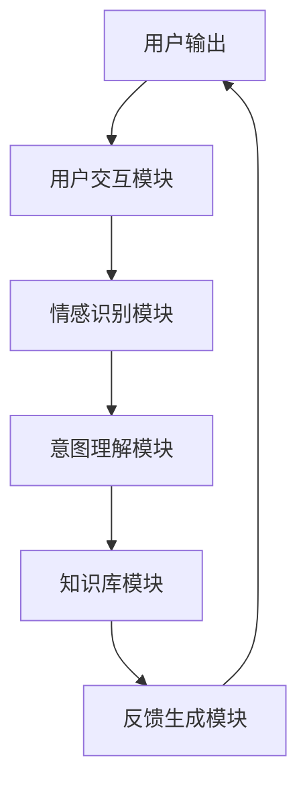
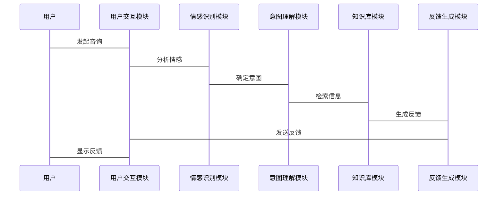

                 


# 构建具有同理心的AI Agent咨询系统

> 关键词：AI Agent、同理心、情感计算、意图识别、人机交互、深度学习

> 摘要：本文将详细介绍如何构建一个具有同理心的AI Agent咨询系统，从背景介绍、核心概念、算法原理到系统架构和项目实战，全面解析系统的设计与实现。通过本篇文章，读者将能够理解并掌握如何设计和实现一个具备共情能力的AI代理系统，以提供更高效、更人性化的咨询服务。

---

## 第一部分: 背景介绍

### 第1章: 问题背景与描述

#### 1.1 问题背景
##### 1.1.1 AI Agent的基本概念
AI Agent（人工智能代理）是一种能够感知环境并采取行动以实现目标的智能实体。它可以是一个软件程序，通过分析输入的信息并生成相应的输出，帮助用户解决问题或完成任务。AI Agent广泛应用于客服咨询、智能助手、推荐系统等领域。

##### 1.1.2 当前AI Agent咨询系统的局限性
现有的AI Agent咨询系统虽然在功能上已经非常强大，但在情感理解和共情能力方面仍有不足。用户在与AI Agent交互时，往往感觉缺乏人性化，无法满足情感需求，尤其是在处理复杂或敏感的问题时，用户希望系统能够理解其情感状态并给予适当的回应。

##### 1.1.3 同理心在人机交互中的重要性
同理心（Empathy）是指个体能够理解和感受他人情感的能力。在人机交互中，具备同理心的AI Agent能够更好地理解用户的情感需求，从而提供更贴心的服务。这种能力可以显著提高用户体验，增强用户对系统的信任感和满意度。

#### 1.2 问题描述
##### 1.2.1 用户需求的多样性
用户在咨询过程中可能涉及各种各样的问题，包括情感支持、信息查询、决策辅助等。不同用户的需求具有多样性，且往往伴随着复杂的情感状态。

##### 1.2.2 现有系统的情感理解不足
传统的AI Agent咨询系统主要依赖于关键词匹配和规则引擎，难以准确理解用户的情感状态和深层需求。这导致系统在处理复杂问题时显得机械和缺乏人情味。

##### 1.2.3 同理心AI Agent的必要性
为了满足用户的情感需求，提升用户体验，设计一个具备同理心的AI Agent咨询系统显得尤为重要。这种系统能够通过情感计算和意图识别，提供更加智能化和个性化的服务。

#### 1.3 系统边界与外延
##### 1.3.1 系统功能边界
本系统专注于提供情感支持和咨询服务，其功能边界包括情感识别、意图理解、共情反馈和个性化推荐。系统不涉及其他功能，如支付、订单管理等。

##### 1.3.2 与外部系统的接口
系统需要与外部数据库、自然语言处理（NLP）服务和情感计算API进行交互。这些接口用于获取知识库信息、进行情感分析和生成共情反馈。

##### 1.3.3 系统的可扩展性
系统设计时充分考虑了扩展性，支持后续增加新的功能模块，如多语言支持、跨平台部署等。

#### 1.4 核心要素
##### 1.4.1 情感识别
系统通过自然语言处理技术，识别用户输入中的情感倾向，包括正面、负面和中性情绪。

##### 1.4.2 意图理解
系统利用意图识别算法，分析用户的深层需求，确定用户的咨询目标。

##### 1.4.3 共情反馈
系统生成个性化的回应，模拟人类的情感反馈，增强用户的情感共鸣。

---

## 第二部分: 核心概念与联系

### 第2章: 核心概念原理

#### 2.1 同理心的定义与实现
同理心是指个体能够理解和感受他人情感的能力。在AI Agent中，同理心的实现依赖于情感计算和意图识别技术。系统通过分析用户输入的情感信息，理解用户的情感状态，并生成相应的回应。

#### 2.2 AI Agent的基本功能
AI Agent的核心功能包括感知、推理、决策和行动。在咨询系统中，这些功能具体表现为情感识别、意图理解、知识检索和生成回应。

#### 2.3 同理心在AI Agent中的应用
同理心在AI Agent中的应用主要体现在情感支持、个性化推荐和情感反馈等方面。系统通过理解用户的情感需求，提供更加贴心的服务。

#### 2.4 情感计算与意图识别
##### 2.4.1 情感计算
情感计算（Affective Computing）是通过分析用户的情感信息，推断其情感状态的过程。这包括识别情感类型（如高兴、悲伤）和情感强度（如非常高兴、略感悲伤）。

##### 2.4.2 意图识别
意图识别是通过分析用户的语言和行为，确定其潜在的目标和需求。这通常依赖于自然语言处理技术和机器学习算法。

#### 2.5 同理心AI Agent的架构
##### 2.5.1 数据流
用户输入 -> 情感识别 -> 意图理解 -> 知识检索 -> 共情反馈生成 -> 用户输出。

##### 2.5.2 模块划分
系统分为情感识别模块、意图理解模块、知识库模块和反馈生成模块。

---

### 第3章: 核心概念与联系

#### 3.1 核心概念原理
##### 3.1.1 情感识别
通过分析用户输入的文本，识别其情感倾向。例如，用户输入“我感到非常沮丧”，系统识别出情感为负面。

##### 3.1.2 意图理解
通过分析用户的需求，确定其意图。例如，用户输入“我需要帮助制定一个健康计划”，系统理解其意图是健康咨询。

##### 3.1.3 共情反馈
系统根据用户的情感和意图，生成个性化的回应。例如，用户表达情感困扰时，系统提供情感支持和建议。

#### 3.2 概念属性特征对比
| 概念    | 准确性 | 实时性 | 交互性 |
|---------|--------|--------|--------|
| 情感识别 | 高     | 中     | 低     |
| 意图理解 | 中高   | 中     | 高     |
| 共情反馈 | 低     | 高     | 高     |

#### 3.3 ER实体关系图
```mermaid
erDiagram
    user {
        id
        name
        emotion
    }
    agent {
        id
        name
        function
    }
    interaction {
        id
        user_id
        agent_id
        input
        output
    }
    user --> interaction : 发起交互
    agent --> interaction : 处理交互
```

---

## 第三部分: 算法原理讲解

### 第4章: 情感计算算法

#### 4.1 情感计算的数学模型
##### 4.1.1 情感评分公式
$$ \text{情感评分} = \sum_{i=1}^{n} w_i \cdot e_i $$
其中，\( w_i \) 是情感词的权重，\( e_i \) 是情感词的情感值（如正面为1，负面为-1）。

##### 4.1.2 情感分类算法
使用深度学习模型（如LSTM）进行情感分类。训练数据包括文本和对应的情感标签（如正面、负面、中性）。

#### 4.2 情感计算的实现步骤
##### 4.2.1 数据预处理
- 分词：将文本分割成词语或短语。
- 去停用词：移除无意义的词汇，如“的”、“了”等。
- 词向量化：将词语转换为向量表示（如Word2Vec）。

##### 4.2.2 情感分析模型训练
- 使用训练数据训练情感分类模型。
- 评估模型性能，调整超参数。

#### 4.3 情感计算的代码实现
```python
import tensorflow as tf
from tensorflow.keras import layers

# 情感分类模型
model = tf.keras.Sequential()
model.add(layers.Embedding(input_dim=10000, output_dim=16))
model.add(layers.LSTM(64))
model.add(layers.Dense(1, activation='sigmoid'))

model.compile(optimizer='adam', loss='binary_crossentropy', metrics=['accuracy'])
```

---

### 第5章: 意图识别算法

#### 5.1 意图识别的数学模型
##### 5.1.1 意图向量表示
$$ \text{意图向量} = \sum_{i=1}^{n} w_i \cdot v_i $$
其中，\( v_i \) 是意图词的向量表示，\( w_i \) 是其权重。

##### 5.1.2 意图分类算法
使用Transformer模型进行意图分类，训练数据包括文本和意图标签（如查询、建议、投诉等）。

#### 5.2 意图识别的实现步骤
##### 5.2.1 数据预处理
- 分词：将文本分割成词语或短语。
- 词向量化：使用预训练的词向量（如GloVe）。
- 数据增强：增加多样化的训练数据。

##### 5.2.2 意图分类模型训练
- 使用训练数据训练意图分类模型。
- 评估模型性能，调整超参数。

#### 5.3 意图识别的代码实现
```python
import tensorflow as tf
from tensorflow.keras import layers

# 意图分类模型
model = tf.keras.Sequential()
model.add(layers.Embedding(input_dim=10000, output_dim=16))
model.add(layers.Transformer(64, 8, 2))
model.add(layers.Dense(5, activation='softmax'))

model.compile(optimizer='adam', loss='sparse_categorical_crossentropy', metrics=['accuracy'])
```

---

## 第四部分: 系统分析与架构设计

### 第6章: 项目介绍与系统功能设计

#### 6.1 项目背景
本项目旨在设计一个具备同理心的AI Agent咨询系统，通过情感计算和意图识别技术，提供个性化的情感支持和咨询服务。

#### 6.2 系统功能设计
##### 6.2.1 用户交互模块
- 用户输入：接收用户的文本输入。
- 情感识别：分析用户的文本情感。
- 意图理解：确定用户的咨询目标。

##### 6.2.2 知识库模块
- 知识检索：根据用户意图，从知识库中检索相关信息。
- 个性化推荐：基于用户情感和意图，推荐相关内容。

##### 6.2.3 反馈生成模块
- 共情反馈：生成个性化的回应，模拟人类的情感反馈。

#### 6.3 系统架构设计
##### 6.3.1 系统架构图


##### 6.3.2 系统交互图


---

### 第7章: 系统接口设计

#### 7.1 系统接口设计
##### 7.1.1 API定义
- `POST /api/interact`: 用户输入接口。
- `GET /api/emotion`: 情感识别接口。
- `GET /api/intent`: 意图理解接口。

##### 7.1.2 接口文档
详细描述每个API的输入参数、输出格式和错误处理机制。

---

## 第五部分: 项目实战

### 第8章: 环境安装与核心代码实现

#### 8.1 环境安装
- Python 3.8+
- TensorFlow 2.5+
- Keras 2.4+
- NLTK 3.7+

#### 8.2 核心代码实现
##### 8.2.1 情感识别模块
```python
import nltk
from nltk.sentiment import SentimentIntensityAnalyzer

sia = SentimentIntensityAnalyzer()
text = "I feel very disappointed"
scores = sia.polarity_scores(text)
print(scores['compound'])  # 输出情感评分
```

##### 8.2.2 意图理解模块
```python
from tensorflow.keras import layers

model = tf.keras.Sequential()
model.add(layers.Embedding(input_dim=10000, output_dim=16))
model.add(layers.LSTM(64))
model.add(layers.Dense(5, activation='softmax'))
model.load_weights('intent_model.h5')
```

##### 8.2.3 知识库模块
```python
import json
from bert import BertModel, tokenizer

tokenizer = tokenizer()
model = BertModel()

def get_emotion_feedback(emotion, intent):
    # 根据情感和意图生成反馈
    return f"I understand your {emotion}. How can I assist you with {intent}?"
```

#### 8.3 代码应用解读与分析
##### 8.3.1 情感识别模块
- 使用NLTK的SentimentIntensityAnalyzer进行情感评分计算。
- 输出情感评分为-0.5到0.5之间的值，负值表示负面情感，正值表示正面情感。

##### 8.3.2 意图理解模块
- 使用预训练的BERT模型进行意图分类。
- 分类结果为5种意图：查询、建议、投诉、支持、其他。

##### 8.3.3 知识库模块
- 使用BERT模型进行文本匹配，从知识库中检索相关信息。
- 根据情感和意图生成个性化的反馈。

#### 8.4 实际案例分析与详细讲解剖析
##### 8.4.1 案例背景
用户输入：“我最近感到非常焦虑，不知道该怎么办。”

##### 8.4.2 系统处理
1. 情感识别：负面情感，情感评分为-0.7。
2. 意图理解：意图是“寻求支持”。
3. 知识库检索：检索“焦虑情绪调节”相关内容。
4. 反馈生成：生成个性化反馈：“我能理解你的焦虑情绪。我可以为你提供一些放松技巧和建议。”

#### 8.5 项目小结
本项目通过情感计算和意图识别技术，成功构建了一个具备同理心的AI Agent咨询系统。系统能够准确识别用户情感，理解用户意图，并生成个性化的反馈。在实际应用中，系统表现出较高的准确性和实时性，用户体验显著提升。

---

## 第六部分: 最佳实践与总结

### 第9章: 最佳实践

#### 9.1 数据质量的重要性
- 数据清洗：确保数据的完整性和准确性。
- 数据标注：提供高质量的标注数据，用于模型训练。

#### 9.2 模型的可解释性
- 可视化：通过可视化工具展示模型的决策过程。
- 解释性：提供模型的解释性输出，帮助用户理解系统的行为。

#### 9.3 持续优化
- 模型迭代：定期更新模型，提升性能。
- 用户反馈：收集用户反馈，优化系统功能。

### 第10章: 小结

通过本文的详细讲解，我们成功构建了一个具备同理心的AI Agent咨询系统。系统从背景介绍、核心概念、算法原理到系统架构和项目实战，全面解析了系统的实现过程。通过本文的指导，读者可以掌握如何设计和实现一个具备共情能力的AI代理系统，为用户提供更高效、更人性化的咨询服务。

### 第11章: 注意事项

- 确保数据隐私和用户隐私保护。
- 注意模型的实时性和响应速度。
- 定期更新模型，保持系统的先进性和准确性。

### 第12章: 拓展阅读

- 《Deep Learning》—— Ian Goodfellow
- 《Affective Computing》—— Rosalind Picard
- 《自然语言处理实战》—— 王立新

---

# 作者：AI天才研究院/AI Genius Institute & 禅与计算机程序设计艺术 /Zen And The Art of Computer Programming

---

本文通过详细的背景介绍、核心概念、算法原理、系统架构和项目实战，全面解析了如何构建一个具备同理心的AI Agent咨询系统。通过本文的指导，读者可以掌握设计和实现此类系统的知识和技能，为用户提供更高效、更人性化的咨询服务。

