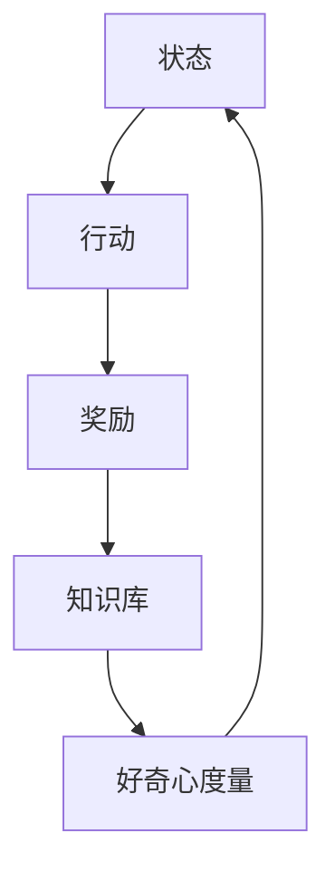
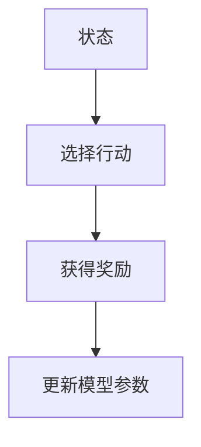
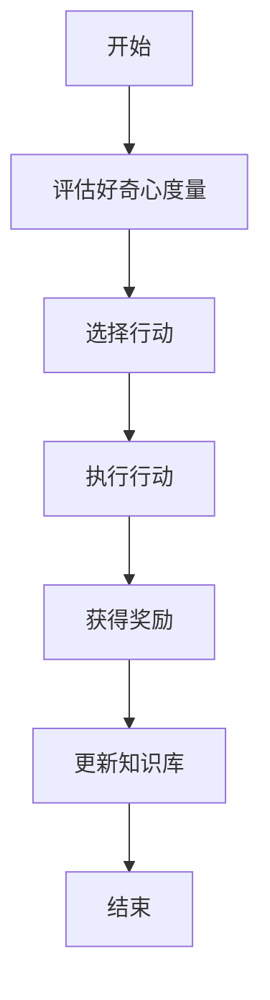
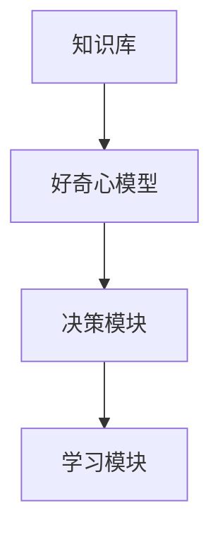

                 

---

# 构建具有好奇心的AI Agent：探索与学习

> **关键词**：AI Agent, 好奇心驱动, 强化学习, 探索机制, 系统架构, 无监督学习

> **摘要**：本文探讨了如何构建具有好奇心的AI Agent，通过分析好奇驱动的探索机制、算法原理、系统架构及实际应用，深入解析了AI Agent在自主学习和问题解决中的潜力。文章从问题背景出发，结合数学模型、算法流程图和系统架构图，详细阐述了构建具有好奇心的AI Agent的关键步骤和技术细节。

---

# 第一部分: 背景介绍与核心概念

## 第1章: 具有好奇心的AI Agent概述

### 1.1 问题背景与问题描述

#### 1.1.1 当前AI Agent的发展现状
人工智能（AI）代理（Agent）近年来取得了显著进展，从简单的规则驱动到复杂的强化学习模型。然而，大多数AI Agent仍依赖于外部输入的目标或奖励，缺乏自主探索和学习的能力。

#### 1.1.2 好奇心在AI Agent中的作用
好奇心驱动的AI Agent能够自主选择行动，探索未知领域，从而扩展知识库并适应复杂环境。这种机制使AI Agent在无明确目标的情况下仍能有效学习。

#### 1.1.3 好奇心驱动的探索机制
好奇心驱动的探索机制允许AI Agent主动寻找新信息，解决未知问题，从而提升其在动态环境中的适应能力。

### 1.2 好奇心驱动的探索机制

#### 1.2.1 好奇心的数学模型
好奇驱动的探索可以表示为一个数学模型，其中好奇心度量（curiosity measure）$C$ 表示AI Agent对某个状态的好奇程度：
$$C = f(s, \theta)$$
其中，$s$ 是当前状态，$\theta$ 是模型参数。

#### 1.2.2 探索与利用的平衡
好奇驱动的探索需要在探索未知领域和利用已知知识之间找到平衡。这可以通过强化学习中的ε-greedy策略实现：
$$\text{探索概率} = \epsilon \times \text{好奇心度量}$$

#### 1.2.3 好奇心驱动的决策过程
决策过程包括以下步骤：
1. 评估当前状态的好奇心度量。
2. 根据好奇心度量和已知奖励选择下一步行动。
3. 更新知识库和好奇心模型。

### 1.3 概念结构与核心要素

#### 1.3.1 好奇心驱动的系统架构
系统架构包括以下模块：
- 知识库：存储已知信息。
- 好奇心模型：计算好奇心度量。
- 决策模块：基于好奇心和已知奖励选择行动。
- 学习模块：更新知识库和模型参数。

#### 1.3.2 好奇心与知识表示的关系
好奇驱动的探索需要有效的知识表示方法，例如使用图结构表示知识之间的关系。

#### 1.3.3 系统的核心要素与交互关系
系统的核心要素包括：
- 状态空间：环境中的所有可能状态。
- 行动空间：AI Agent可以执行的所有行动。
- 奖励函数：定义每个行动的奖励值。
- 好奇心度量：评估AI Agent对某个状态的好奇程度。

## 第2章: 核心概念与联系

### 2.1 好奇心驱动的探索机制

#### 2.1.1 好奇心的定义与数学模型
好奇驱动的探索机制可以表示为一个数学模型，其中好奇心度量$C$ 表示AI Agent对某个状态的好奇程度：
$$C = f(s, \theta)$$

#### 2.1.2 探索与利用的平衡
好奇驱动的探索需要在探索未知领域和利用已知知识之间找到平衡，可以通过强化学习中的ε-greedy策略实现：
$$\text{探索概率} = \epsilon \times \text{好奇心度量}$$

#### 2.1.3 好奇心驱动的决策过程
决策过程包括以下步骤：
1. 评估当前状态的好奇心度量。
2. 根据好奇心度量和已知奖励选择下一步行动。
3. 更新知识库和好奇心模型。

### 2.2 核心概念对比表格

| 概念 | 好奇心驱动的探索机制 | 传统强化学习 | 监督学习 |
|------|-----------------------|--------------|----------|
| 目标  | 自主选择行动           | 外部定义目标 | 标签输入 |
| 奖励  | 好奇心度量和外部奖励   | 外部定义     | 无       |
| 决策  | 内外结合               | 完全外部     | 完全外部 |

### 2.3 ER实体关系图

## 第3章: 好奇心驱动的数学模型与算法原理

### 3.1 好奇心驱动的数学模型

#### 3.1.1 好奇心的度量公式
$$C(s, a) = \mathbb{E}[R(s', a) - R(s, a)]$$

#### 3.1.2 好奇心驱动的奖励机制
$$R(s, a) = \min(C(s, a), \alpha)$$

#### 3.1.3 好奇心与学习目标的关系
好奇驱动的探索可以看作是一种多目标优化问题，其中目标包括最大化好奇心和最大化外部奖励。

### 3.2 算法原理讲解

#### 3.2.1 好奇心驱动的强化学习算法

### 3.3 算法流程图

---

# 第二部分: 系统分析与架构设计

## 第4章: 系统分析与架构设计

### 4.1 问题场景介绍

#### 4.1.1 好奇心驱动的AI Agent应用场景
好奇驱动的AI Agent可以应用于自动驾驶、智能客服、游戏AI等领域。

#### 4.1.2 系统的目标与功能需求
- 自主选择行动
- 动态更新知识库
- 适应复杂环境

### 4.2 系统功能设计

#### 4.2.1 领域模型设计
使用图结构表示知识之间的关系。

#### 4.2.2 功能模块划分
- 知识库模块
- 好奇心模型模块
- 决策模块
- 学习模块

### 4.3 系统架构设计

#### 4.3.1 系统架构图

### 4.4 系统接口设计

#### 4.4.1 接口定义
- `get_curiosity(s)`：返回状态$s$的好奇心度量。
- `choose_action(s)`：基于好奇心度量选择行动。

#### 4.4.2 接口之间的交互流程
1. 知识库模块提供当前状态$s$。
2. 好奇心模型计算$s$的好奇心度量$C$。
3. 决策模块根据$C$和已知奖励选择下一步行动$a$。
4. 学习模块更新知识库和模型参数。

---

## 小结

构建具有好奇心的AI Agent是一项具有挑战性的任务，但通过合理的设计和实现，可以显著提升AI Agent的自主学习和适应能力。本文详细介绍了好奇驱动的探索机制、算法原理、系统架构及实际应用，为读者提供了全面的理论支持和实践指导。

---

**作者：AI天才研究院/AI Genius Institute & 禅与计算机程序设计艺术 /Zen And The Art of Computer Programming**

