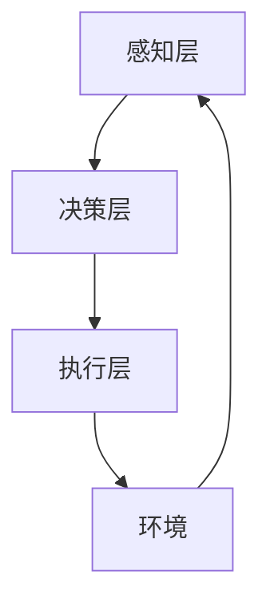
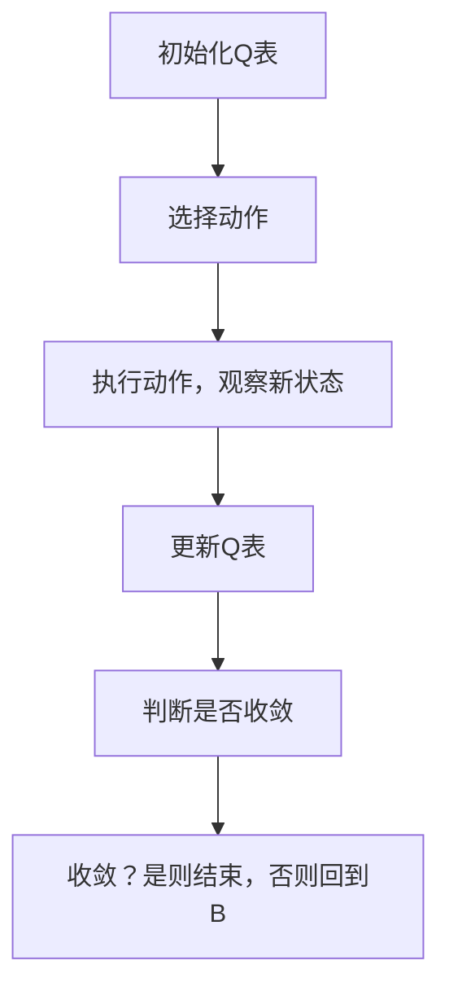

                 


# 构建具有强化学习能力的AI Agent

## 关键词
- 强化学习
- AI Agent
- 算法原理
- 系统架构
- 项目实战

## 摘要
构建具有强化学习能力的AI Agent是人工智能领域的重要研究方向。本文将从强化学习的基本概念和AI Agent的定义入手，详细探讨强化学习在AI Agent中的应用，包括核心算法、系统架构、项目实战等方面。通过理论与实践相结合的方式，帮助读者全面理解并掌握如何构建具备强化学习能力的AI Agent。

## 目录大纲

### 第一部分: 强化学习与AI Agent的背景介绍

#### 第1章: 强化学习与AI Agent概述

##### 1.1 强化学习的基本概念
- 1.1.1 什么是强化学习
- 1.1.2 强化学习的核心要素
- 1.1.3 强化学习与监督学习的区别

##### 1.2 AI Agent的定义与特点
- 1.2.1 什么是AI Agent
- 1.2.2 AI Agent的分类
- 1.2.3 AI Agent的核心能力

##### 1.3 强化学习与AI Agent的结合
- 1.3.1 强化学习在AI Agent中的作用
- 1.3.2 AI Agent通过强化学习实现智能决策
- 1.3.3 强化学习与AI Agent结合的应用场景

##### 1.4 强化学习在AI Agent中的应用案例
- 1.4.1 游戏AI Agent
- 1.4.2 自动驾驶中的AI Agent
- 1.4.3 机器人控制中的AI Agent

##### 1.5 强化学习与AI Agent的挑战与未来方向
- 1.5.1 当前的挑战
- 1.5.2 未来的研究方向

### 第二部分: 强化学习的核心概念与原理

#### 第2章: 强化学习的核心概念与原理

##### 2.1 马尔可夫决策过程（MDP）
- 2.1.1 状态、动作、奖励的定义
- 2.1.2 策略与价值函数
- 2.1.3 探索与利用

##### 2.2 强化学习算法的基本原理
- 2.2.1 Q-learning算法
- 2.2.2 深度Q网络（DQN）
- 2.2.3 策略梯度方法

##### 2.3 强化学习的数学模型
- 2.3.1 Q-learning的数学模型
- 2.3.2 策略梯度的数学模型
- 2.3.3 值函数的数学模型

### 第三部分: 强化学习算法的实现与优化

#### 第3章: 强化学习算法的实现与优化

##### 3.1 Q-Learning算法的实现
- 3.1.1 算法步骤
- 3.1.2 算法优缺点
- 3.1.3 算法优化

##### 3.2 深度Q网络（DQN）的实现
- 3.2.1 DQN的结构
- 3.2.2 经验回放机制
- 3.2.3 网络训练过程

##### 3.3 策略梯度方法的实现
- 3.3.1 策略梯度的基本原理
- 3.3.2 策略梯度的优化方法
- 3.3.3 策略梯度的优缺点

### 第四部分: AI Agent的系统架构与设计

#### 第4章: AI Agent的系统架构与设计

##### 4.1 系统架构设计
- 4.1.1 感知层设计
- 4.1.2 决策层设计
- 4.1.3 执行层设计

##### 4.2 系统功能设计
- 4.2.1 状态感知模块
- 4.2.2 决策模块
- 4.2.3 行为执行模块

##### 4.3 系统接口设计
- 4.3.1 接口定义
- 4.3.2 接口交互流程

### 第五部分: 项目实战与案例分析

#### 第5章: 项目实战与案例分析

##### 5.1 项目背景与目标
- 5.1.1 项目背景
- 5.1.2 项目目标

##### 5.2 环境配置与安装
- 5.2.1 环境搭建
- 5.2.2 工具安装

##### 5.3 算法实现与系统集成
- 5.3.1 算法实现
- 5.3.2 系统集成
- 5.3.3 系统测试

##### 5.4 项目分析与总结
- 5.4.1 项目成果
- 5.4.2 项目总结
- 5.4.3 改进建议

### 第六部分: 总结与展望

#### 第6章: 总结与展望

##### 6.1 总结
- 6.1.1 核心内容回顾
- 6.1.2 重要结论总结

##### 6.2 未来展望
- 6.2.1 技术发展趋势
- 6.2.2 研究方向建议

##### 6.3 最佳实践Tips
- 6.3.1 开发注意事项
- 6.3.2 优化建议
- 6.3.3 常见问题解答

### 附录

#### 附录A: 强化学习相关数学公式汇总

#### 附录B: 常用算法代码示例

#### 附录C: 系统架构图与流程图

---

作者：AI天才研究院/AI Genius Institute & 禅与计算机程序设计艺术 /Zen And The Art of Computer Programming

---

### 内容详解：

#### 第一部分: 强化学习与AI Agent的背景介绍

##### 第1章: 强化学习与AI Agent概述

###### 1.1 强化学习的基本概念

- **1.1.1 什么是强化学习**
  强化学习是一种机器学习范式，通过智能体与环境的交互来学习最优策略。智能体通过执行动作并获得奖励或惩罚，逐步优化自己的行为以最大化累积奖励。

- **1.1.2 强化学习的核心要素**
  - 状态（State）：智能体所处的环境状况。
  - 动作（Action）：智能体根据当前状态做出的行为选择。
  - 奖励（Reward）：智能体执行动作后获得的反馈，用于指导学习。

- **1.1.3 强化学习与监督学习的区别**
  监督学习通过标签数据进行学习，而强化学习通过与环境交互并获得奖励来学习，具有更高的自主性和适应性。

###### 1.2 AI Agent的定义与特点

- **1.2.1 什么是AI Agent**
  AI Agent是具有感知环境、做出决策并执行动作的智能实体，能够自主完成特定任务。

- **1.2.2 AI Agent的分类**
  - 简单反射型：基于当前状态直接做出反应。
  - 目标驱动型：基于目标状态采取行动。
  - 情境驱动型：根据情境和历史信息进行决策。

- **1.2.3 AI Agent的核心能力**
  - 感知能力：获取环境信息。
  - 决策能力：基于信息做出最优决策。
  - 学习能力：通过经验改进决策策略。

###### 1.3 强化学习与AI Agent的结合

- **1.3.1 强化学习在AI Agent中的作用**
  强化学习为AI Agent提供了一种通过与环境交互来优化决策的机制，使其能够在动态环境中自主适应和改进。

- **1.3.2 AI Agent通过强化学习实现智能决策**
  AI Agent利用强化学习算法，通过不断试错和学习，掌握在不同状态下选择最优动作的能力。

- **1.3.3 强化学习与AI Agent结合的应用场景**
  - 游戏AI：在游戏环境中训练AI Agent进行策略学习。
  - 自动驾驶：通过强化学习优化自动驾驶系统的决策过程。
  - 机器人控制：提升机器人在复杂环境中的自主决策能力。

###### 1.4 强化学习在AI Agent中的应用案例

- **1.4.1 游戏AI Agent**
  在游戏环境中，AI Agent通过强化学习不断优化策略，提升游戏表现。

- **1.4.2 自动驾驶中的AI Agent**
  自动驾驶系统通过强化学习优化路径规划和决策，提升驾驶安全性和效率。

- **1.4.3 机器人控制中的AI Agent**
  强化学习使机器人能够在动态环境中自主调整动作，完成复杂任务。

###### 1.5 强化学习与AI Agent的挑战与未来方向

- **1.5.1 当前的挑战**
  - 环境复杂性：复杂环境下的学习效率和稳定性问题。
  - 算法收敛性：强化学习算法的收敛性和稳定性需要进一步提升。
  - 计算资源需求：高维状态和动作空间对计算资源提出更高要求。

- **1.5.2 未来的研究方向**
  - 更高效的算法设计：探索更优的强化学习算法，提升学习效率和效果。
  - 多智能体协作：研究多AI Agent协作的强化学习方法，提升系统整体智能性。
  - 真实世界的应用：强化学习在更多实际场景中的应用研究和优化。

---

#### 第二部分: 强化学习的核心概念与原理

##### 第2章: 强化学习的核心概念与原理

###### 2.1 马尔可夫决策过程（MDP）

- **2.1.1 状态、动作、奖励的定义**
  - 状态（State）：智能体所处的环境状况，如位置、传感器数据等。
  - 动作（Action）：智能体在给定状态下做出的行为选择。
  - 奖励（Reward）：智能体执行动作后获得的反馈，指导学习的方向。

- **2.1.2 策略与价值函数**
  - 策略（Policy）：定义智能体在每个状态下选择动作的概率分布。
  - 价值函数（Value Function）：评估一个状态或动作的价值，用于指导策略的选择。

- **2.1.3 探索与利用**
  - 探索（Exploration）：尝试不同的动作以发现更好的策略。
  - 利用（Exploitation）：利用已知的最佳策略以获得最大奖励。

###### 2.2 强化学习算法的基本原理

- **2.2.1 Q-learning算法**
  Q-learning是一种经典的强化学习算法，通过更新Q值表来学习最优策略。

- **2.2.2 深度Q网络（DQN）**
  DQN通过深度神经网络近似Q值函数，解决高维状态空间的问题。

- **2.2.3 策略梯度方法**
  策略梯度方法直接优化策略，通过梯度上升或下降寻找最优策略。

###### 2.3 强化学习的数学模型

- **2.3.1 Q-learning的数学模型**
  $$ Q(s,a) \leftarrow Q(s,a) + \alpha [r + \gamma \max Q(s',a') - Q(s,a)] $$
  其中，\( Q(s,a) \) 是当前状态 \( s \) 下动作 \( a \) 的Q值，\( \alpha \) 是学习率，\( r \) 是奖励，\( \gamma \) 是折扣因子，\( Q(s',a') \) 是后续状态的最大Q值。

- **2.3.2 策略梯度的数学模型**
  策略梯度方法通过优化策略的参数，使得期望奖励最大化：
  $$ \nabla J(\theta) = \mathbb{E}_{\tau \sim \pi_\theta} [ \nabla \log \pi_\theta(a|s) Q_\theta(s,a) ] $$
  其中，\( \tau \) 是轨迹，\( \pi_\theta \) 是策略，\( Q_\theta \) 是价值函数。

- **2.3.3 值函数的数学模型**
  值函数 \( V(s) \) 表示从状态 \( s \) 开始的期望累积奖励：
  $$ V(s) = \mathbb{E}[R_{t+1} + \gamma R_{t+2} + \gamma^2 R_{t+3} + \dots | s_t = s] $$

---

#### 第三部分: 强化学习算法的实现与优化

##### 第3章: 强化学习算法的实现与优化

###### 3.1 Q-Learning算法的实现

- **3.1.1 算法步骤**
  1. 初始化Q值表。
  2. 在每个时间步，根据当前状态选择动作。
  3. 执行动作，观察奖励和新状态。
  4. 更新Q值表：$$ Q(s,a) \leftarrow Q(s,a) + \alpha (r + \gamma \max Q(s',a') - Q(s,a)) $$
  5. 重复步骤2-4，直到收敛。

- **3.1.2 算法优缺点**
  - 优点：简单易实现，适用于低维状态空间。
  - 缺点：收敛速度慢，难以处理高维状态。

- **3.1.3 算法优化**
  - 使用经验回放：随机采样经验以减少相关性。
  - 调整学习率 \( \alpha \) 和折扣因子 \( \gamma \)。

###### 3.2 深度Q网络（DQN）的实现

- **3.2.1 DQN的结构**
  - 状态输入层 → 隐藏层（神经网络） → Q值输出层。

- **3.2.2 经验回放机制**
  使用经验回放池存储状态、动作和奖励，随机抽取样本进行训练。

- **3.2.3 网络训练过程**
  - 分离目标网络和行为网络。
  - 行为网络负责选择动作，目标网络负责评估Q值，定期同步权重。

###### 3.3 策略梯度方法的实现

- **3.3.1 策略梯度的基本原理**
  直接优化策略参数，使得累积奖励最大化。

- **3.3.2 策略梯度的优化方法**
  - 使用梯度上升法，计算策略梯度并更新参数：
    $$ \theta \leftarrow \theta + \alpha \nabla J(\theta) $$

- **3.3.3 策略梯度的优缺点**
  - 优点：直接优化策略，适用于高维状态空间。
  - 缺点：计算复杂度高，收敛速度较慢。

---

#### 第四部分: AI Agent的系统架构与设计

##### 第4章: AI Agent的系统架构与设计

###### 4.1 系统架构设计

- **4.1.1 感知层设计**
  - 负责接收和处理环境中的感知信息，如图像、传感器数据等。

- **4.1.2 决策层设计**
  - 基于感知层提供的信息，结合强化学习算法，做出最优决策。

- **4.1.3 执行层设计**
  - 根据决策层的指令，执行具体动作，与环境进行交互。

###### 4.2 系统功能设计

- **4.2.1 状态感知模块**
  - 通过传感器或其他数据源获取环境状态。

- **4.2.2 决策模块**
  - 使用强化学习算法，根据当前状态和历史信息，生成最优动作。

- **4.2.3 行为执行模块**
  - 根据决策模块的指令，执行动作，输出结果。

###### 4.3 系统接口设计

- **4.3.1 接口定义**
  - 明确系统内部各模块之间的接口，如感知层与决策层的交互接口。

- **4.3.2 接口交互流程**
  - 描述接口如何在系统运行过程中进行数据传递和控制。

---

#### 第五部分: 项目实战与案例分析

##### 第5章: 项目实战与案例分析

###### 5.1 项目背景与目标

- **5.1.1 项目背景**
  通过构建一个简单的游戏AI Agent，展示强化学习在实际中的应用。

- **5.1.2 项目目标**
  训练AI Agent在游戏环境中通过强化学习实现最优策略。

###### 5.2 环境配置与安装

- **5.2.1 环境搭建**
  - 选择合适的强化学习框架，如OpenAI Gym。
  - 安装必要的库和工具。

- **5.2.2 工具安装**
  - 安装Python和相关机器学习库（如TensorFlow、Keras）。

###### 5.3 算法实现与系统集成

- **5.3.1 算法实现**
  - 实现Q-Learning或DQN算法，训练AI Agent。

- **5.3.2 系统集成**
  - 将训练好的模型集成到AI Agent中，实现与环境的交互。

- **5.3.3 系统测试**
  - 在实际环境中测试AI Agent的表现，验证算法的有效性。

###### 5.4 项目分析与总结

- **5.4.1 项目成果**
  - 展示训练后的AI Agent在游戏或模拟环境中的表现。

- **5.4.2 项目总结**
  - 总结项目实施过程中的经验教训，优化建议。

- **5.4.3 改进建议**
  - 提出进一步优化算法或系统架构的建议。

---

#### 第六部分: 总结与展望

##### 第6章: 总结与展望

###### 6.1 总结

- **6.1.1 核心内容回顾**
  本文详细介绍了强化学习的基本概念、AI Agent的系统架构，以及强化学习在AI Agent中的应用。

- **6.1.2 重要结论总结**
  强化学习为AI Agent提供了强大的决策能力，使其能够在复杂环境中自主优化行为。

###### 6.2 未来展望

- **6.2.1 技术发展趋势**
  - 更高效的强化学习算法：如基于神经网络的深度强化学习。
  - 多智能体协作：研究多个AI Agent协作的强化学习方法。
  - 真实世界的应用：将强化学习应用于更多实际场景，如自动驾驶、机器人控制等。

- **6.2.2 研究方向建议**
  - 结合其他机器学习技术，如迁移学习，提升AI Agent的泛化能力。
  - 探索强化学习与人机交互的结合，提升用户体验。

###### 6.3 最佳实践Tips

- **6.3.1 开发注意事项**
  - 明确项目目标，选择合适的强化学习算法。
  - 合理设计系统架构，确保各模块协同工作。

- **6.3.2 优化建议**
  - 使用经验回放机制，提升训练效率。
  - 定期评估和优化策略，确保系统性能。

- **6.3.3 常见问题解答**
  - 如何处理环境的不确定性？可以采用鲁棒控制策略或增强探索机制。
  - 如何提升训练速度？可以优化算法、增加并行计算能力。

---

### 附录

#### 附录A: 强化学习相关数学公式汇总

- Q-Learning算法更新公式：
  $$ Q(s,a) \leftarrow Q(s,a) + \alpha [r + \gamma \max Q(s',a') - Q(s,a)] $$

- 策略梯度算法更新公式：
  $$ \theta \leftarrow \theta + \alpha \nabla J(\theta) $$

- 值函数公式：
  $$ V(s) = \mathbb{E}[R_{t+1} + \gamma R_{t+2} + \gamma^2 R_{t+3} + \dots | s_t = s] $$

#### 附录B: 常用算法代码示例

- Q-Learning算法代码示例（基于OpenAI Gym）：

```python
import gym
import numpy as np

env = gym.make('CartPole-v0')
env.seed(42)

Q = np.zeros([env.observation_space.shape[0], env.action_space.n])
alpha = 0.1
gamma = 0.99

for episode in range(1000):
    state = env.reset()
    for _ in range(1000):
        action = np.argmax(Q[state])
        next_state, reward, done, _ = env.step(action)
        Q[state][action] += alpha * (reward + gamma * np.max(Q[next_state]) - Q[state][action])
        state = next_state
        if done:
            break
```

- DQN算法代码示例（基于TensorFlow）：

```python
import tensorflow as tf
from tensorflow.keras import layers

model = tf.keras.Sequential([
    layers.Dense(64, activation='relu'),
    layers.Dense(64, activation='relu'),
    layers.Dense(env.action_space.n, activation='linear')
])

optimizer = tf.keras.optimizers.Adam(learning_rate=0.001)
loss_fn = tf.keras.losses.mean_squared_error

@tf.function
def train_step(state, target):
    with tf.GradientTape() as tape:
        predictions = model(state)
        loss = tf.reduce_mean(loss_fn(target, predictions))
    gradients = tape.gradient(loss, model.trainable_weights)
    optimizer.apply_gradients(zip(gradients, model.trainable_weights))
    return loss

# 训练过程略...
```

#### 附录C: 系统架构图与流程图

- 系统架构图：



- 算法流程图（Q-Learning）：



---

### 作者信息

**作者：AI天才研究院/AI Genius Institute & 禅与计算机程序设计艺术 /Zen And The Art of Computer Programming**

---

通过以上目录和内容的详细规划，您可以根据需要进一步扩展每个部分的内容，添加具体的数学公式、代码实现、图表说明等，确保文章的完整性和深度。

