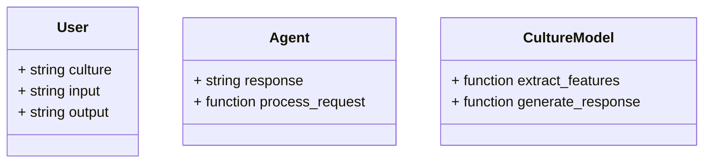
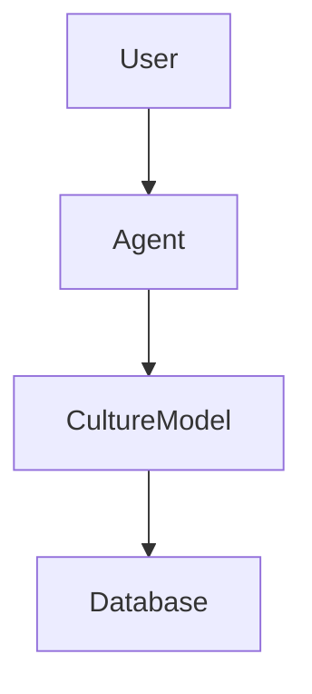
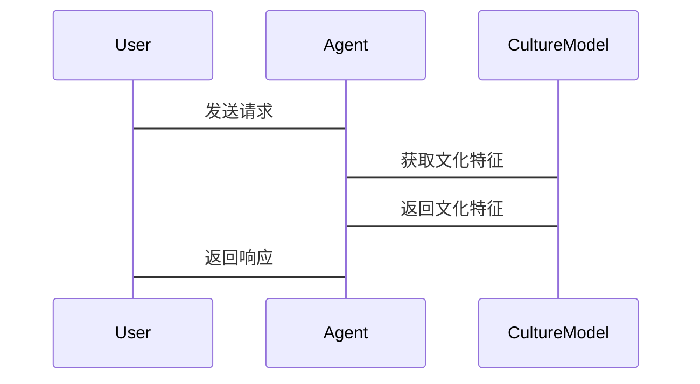

                 


# 构建具有文化适应性的AI Agent系统

## 关键词：AI Agent，文化适应性，跨文化推理，文化建模，文化敏感性

## 摘要：本文系统地探讨了如何构建具有文化适应性的AI Agent系统。通过分析文化差异对AI Agent行为的影响，提出了一种基于文化建模和跨文化推理的解决方案。文章详细讲解了文化适应性AI Agent的核心概念、算法原理、系统架构，并通过实际案例展示了系统的实现与应用。最后，提出了文化适应性AI Agent的最佳实践建议，展望了未来的发展方向。

---

## 第1章: 背景介绍

### 1.1 问题背景

#### 1.1.1 AI Agent的定义与特点
AI Agent（人工智能代理）是指能够感知环境并采取行动以实现目标的智能体。AI Agent的特点包括自主性、反应性、目标导向性和社交能力。它们可以用于推荐系统、对话系统、自动化决策等领域。

#### 1.1.2 文化适应性问题的提出
随着全球化的发展，AI Agent需要在不同文化背景下与用户交互。然而，文化差异可能导致AI Agent的行为不符合用户的期望。例如，在某些文化中，直接表达否定意见可能被认为是不礼貌的，而AI Agent可能无法理解这种文化差异。

#### 1.1.3 当前AI Agent在文化适应性方面的局限性
传统的AI Agent通常基于通用的规则或数据进行训练，缺乏对文化差异的敏感性。这导致在跨文化场景中，AI Agent的交互效果不佳，甚至可能引发误解或冲突。

### 1.2 问题描述

#### 1.2.1 AI Agent在跨文化场景中的挑战
AI Agent需要在不同文化背景下理解和适应用户的语言、行为和价值观。例如，在中文和英文中，问候语和礼貌用语的差异可能影响AI Agent的回应方式。

#### 1.2.2 文化差异对AI Agent行为的影响
文化差异可能导致AI Agent对同一输入的解释不同。例如，在某些文化中，用户可能更倾向于间接表达需求，而AI Agent需要能够理解这种间接性。

#### 1.2.3 用户需求的文化敏感性问题
用户的实际需求可能受到文化背景的影响。例如，在某些文化中，用户可能更注重隐私保护，而AI Agent需要在数据收集和使用中考虑到这一点。

### 1.3 问题解决

#### 1.3.1 文化适应性AI Agent的目标
文化适应性AI Agent的目标是通过理解和适应不同文化背景，提供更加个性化的交互体验。具体目标包括：
- 理解用户的文化背景
- 调整交互策略以适应文化差异
- 提供符合文化习惯的反馈和建议

#### 1.3.2 解决方案的可行性分析
文化适应性AI Agent的实现需要结合文化建模、跨文化推理和个性化交互技术。通过机器学习和自然语言处理技术，可以提取和分析文化特征，从而实现文化适应性。

#### 1.3.3 边界与外延
文化适应性AI Agent的研究范围主要集中在语言、行为和价值观层面。短期内，研究重点在于处理常见的文化差异；长期目标是实现对所有文化背景的全面适应。

### 1.4 核心概念与联系

#### 1.4.1 文化适应性AI Agent的核心要素
文化适应性AI Agent的核心要素包括：
- 文化建模：构建文化特征的表示方法
- 跨文化推理：基于文化差异进行推理和决策
- 文化适配算法：根据文化特征调整交互策略

#### 1.4.2 相关概念对比（文化敏感性 vs 文化适应性）
| 概念       | 描述                                             |
|------------|--------------------------------------------------|
| 文化敏感性 | AI Agent能够识别和理解文化差异                   |
| 文化适应性 | AI Agent能够根据文化差异调整自身行为             |

#### 1.4.3 ER实体关系图架构
以下是文化适应性AI Agent的ER实体关系图：

```mermaid
er
    actor: 用户
    agent: AI Agent
    culture: 文化特征
    interaction: 交互记录

    actor -[1..n]-> interaction
    agent -[1..1]-> interaction
    interaction -[1..n]-> culture
```

---

## 第2章: 核心概念与联系

### 2.1 文化适应性AI Agent的原理

#### 2.1.1 文化建模
文化建模是文化适应性AI Agent的核心技术之一。通过分析不同文化的特点，构建文化特征的表示方法。例如，可以基于文化维度理论（如霍夫斯泰德的文化维度理论）构建文化模型。

#### 2.1.2 跨文化推理
跨文化推理是指在不同文化背景下进行推理和决策的过程。例如，AI Agent需要根据用户的文化背景调整对话策略。

#### 2.1.3 文化适配算法
文化适配算法用于根据文化特征调整AI Agent的行为。例如，可以使用基于规则的适配算法或基于机器学习的适配算法。

### 2.2 核心概念对比

#### 2.2.1 文化敏感性与文化适应性的对比分析
- 文化敏感性：AI Agent能够识别和理解文化差异。
- 文化适应性：AI Agent能够根据文化差异调整自身行为。

#### 2.2.2 不同文化维度对AI Agent行为的影响
- 个体主义 vs 集体主义：影响用户的表达方式和决策方式。
- 权力距离：影响用户对权威的尊重程度。

#### 2.2.3 文化适应性AI Agent与传统AI Agent的对比
| 特性             | 文化适应性AI Agent | 传统AI Agent |
|------------------|-------------------|--------------|
| 文化敏感性       | 高                | 低            |
| 交互策略调整     | 是                | 否            |
| 应用场景          | 跨文化场景        | 单一文化场景  |

### 2.3 ER实体关系图架构

#### 2.3.1 实体定义
- 用户：具有特定文化背景的个体。
- AI Agent：能够根据文化差异调整行为的智能体。
- 文化特征：用户的文化背景特征。
- 交互记录：用户与AI Agent之间的交互记录。

#### 2.3.2 实体关系
- 用户与交互记录：每个用户可以有多个交互记录。
- AI Agent与交互记录：每个交互记录对应一个AI Agent。
- 交互记录与文化特征：每个交互记录可以包含多个文化特征。

#### 2.3.3 关系图展示（使用mermaid）

```mermaid
er
    actor: 用户
    agent: AI Agent
    culture: 文化特征
    interaction: 交互记录

    actor -[1..n]-> interaction
    agent -[1..1]-> interaction
    interaction -[1..n]-> culture
```

---

## 第3章: 算法原理讲解

### 3.1 跨文化对话模型

#### 3.1.1 模型输入
- 用户输入：文本或语音形式的输入。
- 文化特征：用户的文化背景特征。

#### 3.1.2 模型处理流程
1. **文化特征提取**：分析用户输入，提取文化特征。
2. **文化适配**：根据文化特征调整对话策略。
3. **生成响应**：根据调整后的策略生成响应。

#### 3.1.3 输出结果
- 响应文本：根据文化特征调整的对话内容。

### 3.2 跨文化推理算法

#### 3.2.1 算法流程
1. **输入处理**：接收用户输入。
2. **文化特征提取**：分析用户的文化背景。
3. **推理与决策**：根据文化特征进行推理和决策。
4. **生成输出**：根据推理结果生成输出。

#### 3.2.2 算法实现
以下是跨文化推理算法的Python代码示例：

```python
def cross_cultural_reasoning(user_input, culture_model):
    # 提取文化特征
    culture_features = extract_culture_features(user_input, culture_model)
    
    # 推理与决策
    decision = make_decision(culture_features)
    
    # 生成输出
    output = generate_response(decision)
    
    return output
```

#### 3.2.3 数学模型与公式
跨文化推理算法的数学模型如下：

$$
P(\text{决策} | \text{文化特征}) = \frac{P(\text{文化特征} | \text{决策}) \cdot P(\text{决策})}{P(\text{文化特征})}
$$

---

## 第4章: 系统分析与架构设计

### 4.1 问题场景介绍

#### 4.1.1 背景设定
假设我们正在开发一个跨文化对话系统，用户来自不同的文化背景。

#### 4.1.2 问题描述
用户与AI Agent之间的对话需要考虑文化差异。

### 4.2 系统功能设计

#### 4.2.1 领域模型
以下是领域模型的类图：



#### 4.2.2 系统架构设计
以下是系统架构图：



### 4.3 系统接口设计

#### 4.3.1 输入接口
- 用户输入：文本或语音形式。

#### 4.3.2 输出接口
- 响应文本：根据文化特征调整的对话内容。

### 4.4 系统交互流程图



---

## 第5章: 项目实战

### 5.1 环境安装

#### 5.1.1 安装Python
```bash
python --version
```

#### 5.1.2 安装依赖
```bash
pip install numpy pandas scikit-learn
```

### 5.2 系统核心实现

#### 5.2.1 文化识别模块
```python
def extract_culture_features(user_input):
    # 实现文化特征提取逻辑
    pass
```

#### 5.2.2 对话生成模块
```python
def generate_response(culture_features):
    # 实现响应生成逻辑
    pass
```

### 5.3 案例分析

#### 5.3.1 实际案例
假设用户来自中文文化背景，输入“你好”，AI Agent应回应“你好！有什么可以帮助你的吗？”

#### 5.3.2 分析与解读
AI Agent根据用户的文化背景生成符合习惯的回应。

### 5.4 项目小结

---

## 第6章: 最佳实践与小结

### 6.1 最佳实践

#### 6.1.1 数据收集
- 确保数据多样性，覆盖不同文化背景。

#### 6.1.2 模型训练
- 使用多文化数据进行训练，避免模型偏见。

#### 6.1.3 系统部署
- 在实际场景中进行测试和优化。

### 6.2 小结

### 6.3 注意事项

#### 6.3.1 数据偏见
- 数据收集和训练过程中需要注意文化偏见问题。

#### 6.3.2 文化复杂性
- 部分文化差异可能较为复杂，难以通过简单的模型捕捉。

### 6.4 拓展阅读

#### 6.4.1 推荐书籍
- 《文化适应性AI Agent：理论与实践》
- 《跨文化计算与信息处理》

#### 6.4.2 推荐博客
- AI Genius Institute 博客

---

## 作者：AI天才研究院/AI Genius Institute & 禅与计算机程序设计艺术/Zen And The Art of Computer Programming

