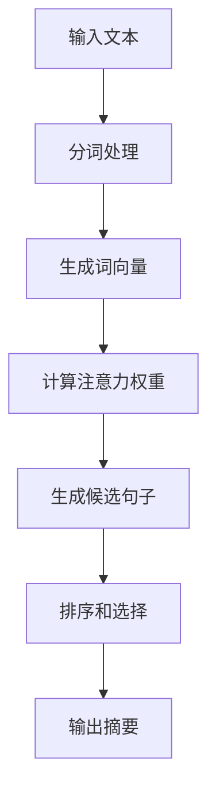
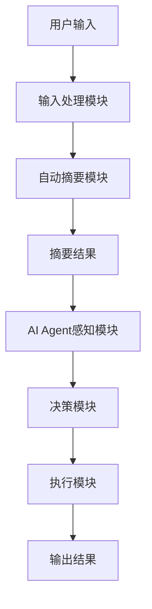
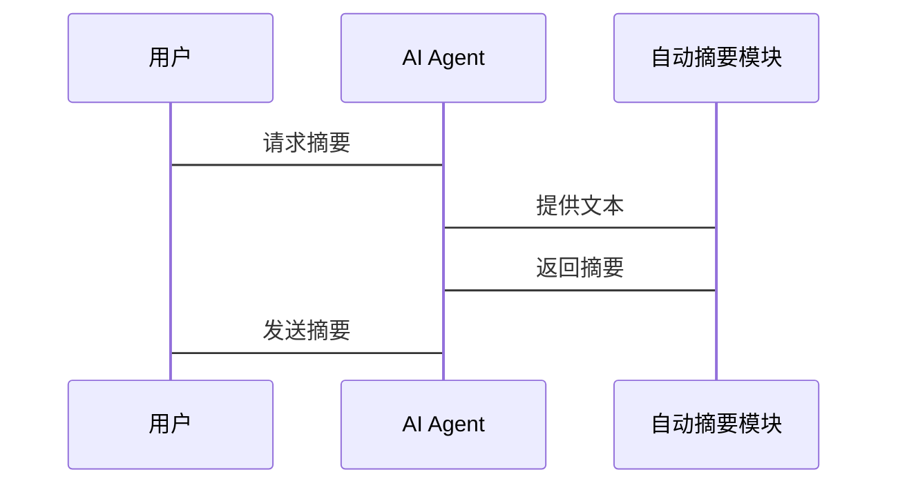

                 


# 《构建具有自动摘要能力的AI Agent》

---

## 关键词：自动摘要，AI Agent，自然语言处理，文本处理，人工智能，算法设计

---

## 摘要：  
本文详细探讨了如何构建一个具有自动摘要能力的AI Agent，从自动摘要与AI Agent的核心概念出发，分析了它们的结合方式，深入讲解了相关的算法原理，设计了系统的架构方案，并通过实际项目实战展示了实现过程。文章最后总结了最佳实践和未来的发展方向，为读者提供了全面的指导。

---

## 目录大纲

### 第一部分：自动摘要与AI Agent背景介绍

#### 第1章：自动摘要与AI Agent概述

- 1.1 自动摘要的核心概念  
  - 从文本摘要到自动摘要的演进  
  - 自动摘要的关键技术与实现原理  
  - 自动摘要的应用场景与挑战  

- 1.2 AI Agent的基本概念  
  - AI Agent的定义与分类  
  - AI Agent的核心功能与特点  
  - AI Agent与传统自动摘要工具的区别  

- 1.3 自动摘要与AI Agent的结合  
  - 自动摘要在AI Agent中的作用  
  - AI Agent如何提升自动摘要能力  
  - 自动摘要能力对AI Agent的整体影响  

- 1.4 本章小结  
  - 本章主要概念回顾  
  - 下一章的预览  

---

### 第二部分：自动摘要与AI Agent的核心概念与联系

#### 第2章：核心概念原理与对比分析

- 2.1 自动摘要的原理  
  - 自动摘要的基本原理  
  - 自动摘要的主要算法与模型  
  - 自动摘要的关键技术对比  

- 2.2 AI Agent的核心原理  
  - AI Agent的感知与决策机制  
  - AI Agent的交互与执行流程  
  - AI Agent的知识表示与推理方法  

- 2.3 自动摘要与AI Agent的联系  
  - 自动摘要在AI Agent中的应用场景  
  - AI Agent如何提升自动摘要的效率与质量  
  - 自动摘要与AI Agent的协同工作模式  

- 2.4 核心概念对比分析  
  - 自动摘要与AI Agent的属性对比表格  
  - 自动摘要与AI Agent的ER实体关系图  

```mermaid
er
    entity 自动摘要系统 {
        id: string
        摘要算法: string
        输入文本: string
        输出摘要: string
    }
    entity AI Agent {
        id: string
        感知模块: string
        决策模块: string
        执行模块: string
    }
    relationship 关联关系 {
        自动摘要系统 --> AI Agent: 集成与调用
        AI Agent --> 自动摘要系统: 依赖与使用
    }
```

---

### 第三部分：自动摘要与AI Agent的算法原理讲解

#### 第3章：算法原理讲解

- 3.1 自动摘要算法原理  
  - 自动摘要的主要算法与模型  
    - 基于传统NLP的自动摘要算法（如文本排名算法）  
    - 基于深度学习的自动摘要模型（如BERT、GPT）  
    - 现代Transformer架构的自动摘要模型（如T5）  

  - 自动摘要算法的数学模型和公式  
    - 文本表示的向量空间模型（Vector Space Model）  
    - 注意力机制（Attention Mechanism）  
    - 解码器结构（Decoder Structure）  

  - 自动摘要算法的流程图  



- 3.2 AI Agent中的自动摘要实现  
  - AI Agent整合自动摘要功能的流程  
  - AI Agent调用自动摘要模块的接口  
  - 自动摘要结果的反馈与优化  

---

### 第四部分：自动摘要与AI Agent的系统架构设计

#### 第4章：系统分析与架构设计方案

- 4.1 系统场景介绍  
  - AI Agent自动摘要功能的应用场景  
  - 系统的主要参与者和交互流程  

- 4.2 系统功能设计  
  - 自动摘要功能模块的详细设计  
    - 输入处理模块  
    - 摘要生成模块  
    - 结果反馈模块  

  - AI Agent系统功能模块的详细设计  
    - 感知模块  
    - 决策模块  
    - 执行模块  

- 4.3 系统架构设计  
  - 系统整体架构图  



- 4.4 系统接口设计  
  - 输入接口定义  
  - 输出接口定义  
  - API接口的设计与实现  

- 4.5 系统交互流程  
  - 用户与AI Agent的交互流程  
  - 自动摘要功能在交互中的具体步骤  



---

### 第五部分：自动摘要与AI Agent的项目实战

#### 第5章：项目实战

- 5.1 项目环境与工具安装  
  - 开发环境的配置  
  - 必要工具与库的安装（如Python、TensorFlow、PyTorch）  

- 5.2 项目核心代码实现  
  - 自动摘要模块的实现  

```python
def automatic_summarization(text):
    # 文本预处理
    # 生成摘要
    return summary
```

  - AI Agent整合自动摘要功能的实现  

```python
class AI_Agent:
    def __init__(self):
        self.summarizer = AutomaticSummarizer()

    def process_request(self, text):
        summary = self.summarizer.summarize(text)
        return summary
```

- 5.3 代码实现细节解读  
  - 自动摘要模块的具体实现步骤  
  - AI Agent调用自动摘要模块的方式  
  - 代码实现中的关键点与注意事项  

- 5.4 实际案例分析  
  - 案例背景介绍  
  - 输入文本  
  - 自动摘要结果  
  - AI Agent的处理过程  
  - 最终输出结果  

- 5.5 项目小结  
  - 项目实现的主要收获  
  - 项目中的遇到的问题及解决方案  
  - 项目经验对后续开发的启示  

---

### 第六部分：自动摘要与AI Agent的最佳实践与总结

#### 第6章：最佳实践与小结

- 6.1 最佳实践  
  - 开发中的最佳实践建议  
    - 选择合适的摘要算法  
    - 优化模型的训练数据  
    - 提升AI Agent的交互体验  

  - 系统设计中的注意事项  
    - 系统架构的可扩展性  
    - 接口设计的规范性  
    - 代码实现的可维护性  

- 6.2 总结与展望  
  - 本章主要知识点回顾  
  - 自动摘要与AI Agent技术的发展趋势  
  - 未来的研究方向与应用前景  

---

### 第七部分：附录

#### 第7章：附录

- 7.1 术语表  
  - 专业术语的解释与定义  

- 7.2 参考文献  
  - 书籍引用  
  - 网站链接  
  - 论文引用  

- 7.3 源代码  
  - 项目完整代码的展示与解读  

---

### 作者：AI天才研究院/AI Genius Institute & 禅与计算机程序设计艺术 /Zen And The Art of Computer Programming

