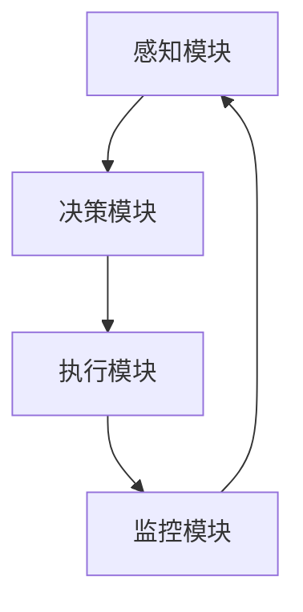

                 

# 构建具有自我修正能力的AI Agent

> 关键词：AI Agent, 自我修正, 人工智能, 强化学习, 自我优化

> 摘要：本文将详细探讨如何构建一个具有自我修正能力的AI Agent。通过分析AI Agent的基本概念、自我修正的核心要素、算法原理、系统架构以及实际项目实现，我们将深入理解如何设计和实现一个能够自我检测、修复和优化的智能体。文章最后还将总结实践经验，展望未来的发展方向。

---

# 第一部分: 构建具有自我修正能力的AI Agent概述

## 第1章: AI Agent与自我修正能力概述

### 1.1 AI Agent的基本概念

#### 1.1.1 AI Agent的定义与特点
AI Agent（人工智能代理）是一种能够感知环境、做出决策并采取行动的智能实体。与传统程序不同，AI Agent具备以下特点：
- **自主性**：能够自主决策，无需外部干预。
- **反应性**：能够实时感知环境并做出响应。
- **目标导向**：基于目标驱动行为。
- **学习能力**：能够通过经验改进性能。

#### 1.1.2 自我修正能力的定义与实现方式
自我修正能力是指AI Agent在运行过程中能够检测自身的问题，并采取相应措施进行修复的能力。其实现方式包括：
- **监督学习**：通过外部反馈修正错误。
- **强化学习**：通过奖励机制优化行为。
- **无监督学习**：通过自我发现和纠正错误。

#### 1.1.3 自我修正AI Agent的应用场景与优势
- **应用场景**：广泛应用于自动驾驶、智能助手、工业自动化等领域。
- **优势**：提高系统的可靠性和适应性，减少人为干预。

### 1.2 自我修正能力的核心要素

#### 1.2.1 自我检测机制
AI Agent需要实时监控自身的状态，包括：
- **错误检测**：识别系统中的异常或错误。
- **状态评估**：评估当前状态与目标的偏差。

#### 1.2.2 自我修复算法
通过算法修复检测到的问题，包括：
- **基于规则的修复**：使用预定义的规则进行修复。
- **基于学习的修复**：利用机器学习模型进行修复。

#### 1.2.3 自我优化策略
通过优化算法提升系统的性能，包括：
- **在线优化**：实时调整参数。
- **离线优化**：批量处理数据后进行优化。

### 1.3 自我修正AI Agent的分类

#### 1.3.1 基于规则的自我修正
通过预定义的规则进行检测和修复，适用于规则明确的场景。

#### 1.3.2 基于学习的自我修正
利用机器学习模型进行自我检测和修复，适用于复杂场景。

#### 1.3.3 混合型自我修正
结合规则和学习的方法，适用于复杂且需要灵活性的场景。

## 第2章: 自我修正AI Agent的背景与挑战

### 2.1 当前AI Agent的发展现状

#### 2.1.1 AI Agent在各领域的应用现状
- **自动驾驶**：实时感知和决策。
- **智能助手**：提供个性化服务。
- **工业自动化**：提高生产效率。

#### 2.1.2 当前AI Agent存在的主要问题
- **数据依赖性**：高度依赖训练数据。
- **可解释性差**：难以解释决策过程。
- **动态环境适应性**：难以应对快速变化的环境。

#### 2.1.3 自我修正能力的必要性
- **提高可靠性**：减少错误发生。
- **增强适应性**：适应动态环境。

### 2.2 自我修正能力的核心挑战

#### 2.2.1 知识表示与更新的挑战
- **知识表示**：如何有效地表示知识。
- **知识更新**：如何高效地更新知识。

#### 2.2.2 多目标优化的冲突问题
- **目标冲突**：多个目标之间的冲突。
- **优先级处理**：如何处理目标优先级。

#### 2.2.3 动态环境下的适应性问题
- **环境变化**：如何适应快速变化的环境。
- **实时响应**：如何实现快速响应。

### 2.3 自我修正能力的实现路径

#### 2.3.1 基于监督学习的自我修正
- **监督学习**：通过标签数据进行训练。
- **修复策略**：基于标签反馈进行修复。

#### 2.3.2 基于强化学习的自我修正
- **强化学习**：通过奖励机制优化行为。
- **修复策略**：基于奖励进行调整。

#### 2.3.3 基于无监督学习的自我修正
- **无监督学习**：通过自我发现进行修复。
- **修复策略**：基于聚类或异常检测进行修复。

---

# 第二部分: 自我修正AI Agent的核心算法与数学模型

## 第3章: 自我修正机制的数学模型

### 3.1 自我检测与修复的数学表示

#### 3.1.1 错误检测的概率模型
- **错误概率**：$P(error) = 1 - accuracy$
- **检测阈值**：$\theta = \alpha \cdot P(error)$

#### 3.1.2 修复策略的选择模型
- **策略选择**：基于最大似然估计选择最优修复策略。

#### 3.1.3 状态更新的数学公式
- **状态更新**：$s_{t+1} = f(s_t, a_t)$，其中$a_t$是修复动作。

### 3.2 基于监督学习的修复算法

#### 3.2.1 损失函数的定义
- **交叉熵损失**：$L = -\sum y_i \log(p_i) + (1-y_i)\log(1-p_i)$

#### 3.2.2 优化算法的选择
- **随机梯度下降**：$\theta_{t+1} = \theta_t - \eta \cdot \nabla L$

#### 3.2.3 模型更新的数学推导
- **反向传播**：计算梯度并更新权重。

### 3.3 基于强化学习的修复策略

#### 3.3.1 状态空间的定义
- **状态向量**：$s = [s_1, s_2, ..., s_n]$

#### 3.3.2 动作空间的构建
- **动作集合**：$a \in \{a_1, a_2, ..., a_m\}$

#### 3.3.3 奖励函数的设计
- **奖励函数**：$r(s, a) = \begin{cases} 1 & \text{if } a \text{正确} \\ -1 & \text{否则} \end{cases}$

## 第4章: 自我修正算法的实现与优化

### 4.1 自我检测算法的实现

#### 4.1.1 错误检测的阈值设定
- **动态阈值**：$\theta_t = \theta_{t-1} + \beta \cdot error\_rate$

#### 4.1.2 异常检测的数学模型
- **One-Class SVM**：用于检测异常数据。

#### 4.1.3 检测结果的反馈机制
- **实时反馈**：将检测结果实时反馈给修复模块。

### 4.2 自我修复算法的优化

#### 4.2.1 修复策略的多目标优化
- **多目标优化**：使用帕累托前沿进行优化。

#### 4.2.2 修复过程中的权重分配
- **权重分配**：基于任务重要性分配权重。

#### 4.2.3 修复效果的评估指标
- **准确率**：$accuracy = \frac{correct}{total}$
- **召回率**：$recall = \frac{correct}{actual}$

### 4.3 自我优化策略的实现

#### 4.3.1 在线优化的数学模型
- **在线学习**：$w_{t+1} = w_t + \eta \cdot (y_t - \hat{y}_t)$

#### 4.3.2 离线优化的实现方式
- **批量处理**：$W_{t+1} = W_t - \eta \cdot \nabla L(W_t)$

#### 4.3.3 优化过程中的收敛性分析
- **收敛速度**：基于优化算法的收敛性理论。

---

# 第三部分: 自我修正AI Agent的系统架构与实现

## 第5章: 自我修正AI Agent的系统

### 5.1 系统整体架构

### 5.2 关键模块的设计与实现

#### 5.2.1 感知模块
- **功能**：处理输入数据，如传感器数据、用户输入。
- **实现**：使用深度学习模型进行特征提取。

#### 5.2.2 决策模块
- **功能**：基于当前状态做出决策。
- **实现**：使用强化学习模型进行决策。

#### 5.2.3 执行模块
- **功能**：执行决策并输出结果。
- **实现**：调用API或控制硬件。

#### 5.2.4 监控模块
- **功能**：实时监控系统状态，检测错误。
- **实现**：使用异常检测算法。

### 5.3 系统实现的关键技术

#### 5.3.1 数据处理技术
- **数据预处理**：清洗、归一化。
- **特征提取**：使用CNN、RNN提取特征。

#### 5.3.2 模型训练技术
- **深度学习框架**：TensorFlow、Keras。
- **优化算法**：Adam、SGD。

#### 5.3.3 修复机制的实现
- **基于规则的修复**：预定义修复规则。
- **基于学习的修复**：利用强化学习模型选择修复动作。

---

# 第四部分: 最佳实践与总结

## 第7章: 最佳实践与小结

### 7.1 实践中的注意事项

#### 7.1.1 数据质量
- **数据清洗**：确保数据质量。
- **数据多样性**：覆盖各种场景。

#### 7.1.2 模型选择
- **模型复杂度**：平衡准确性和计算效率。
- **模型可解释性**：提高系统的透明度。

#### 7.1.3 修复机制的可解释性
- **修复策略的透明度**：确保用户理解修复过程。
- **修复结果的验证**：验证修复效果。

## 第7章: 总结与展望

### 7.2 项目小结
通过本文的详细讲解，我们了解了如何构建具有自我修正能力的AI Agent。从基本概念到算法实现，再到系统架构，每一步都需要仔细设计和优化。

### 7.3 未来展望
未来，随着人工智能技术的不断发展，具有自我修正能力的AI Agent将在更多领域得到应用。研究方向包括更复杂的修复算法、更高效的系统架构以及更智能的决策机制。

### 7.4 致谢
感谢读者的支持和帮助，希望本文对您有所帮助。

---

# 作者

作者：AI天才研究院/AI Genius Institute & 禅与计算机程序设计艺术 /Zen And The Art of Computer Programming

