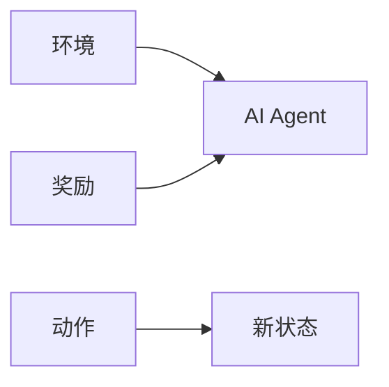
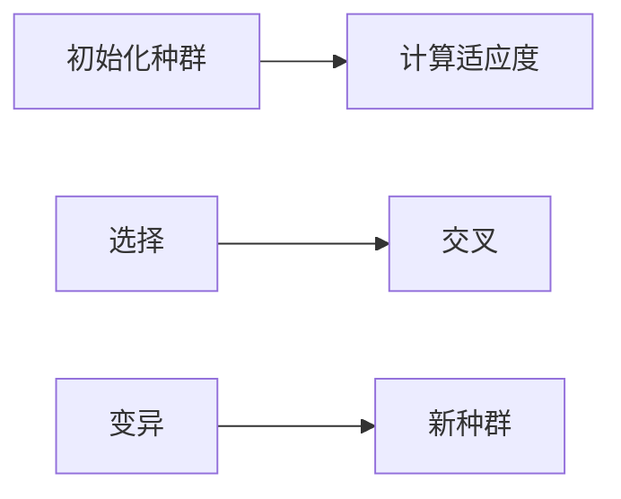
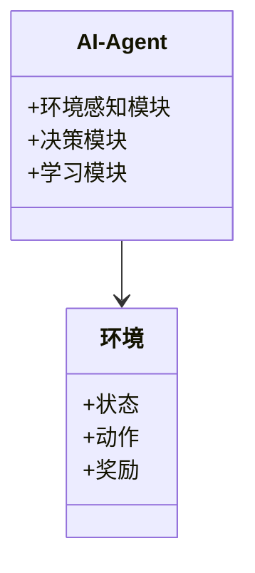
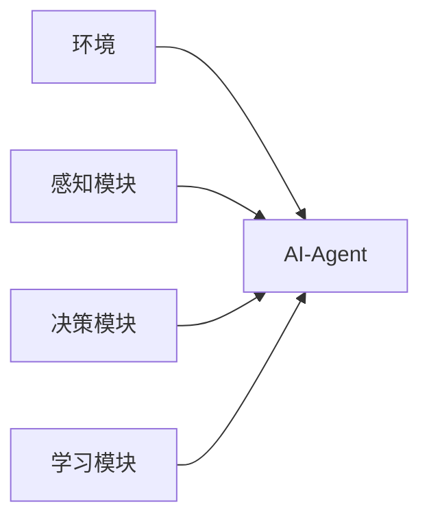
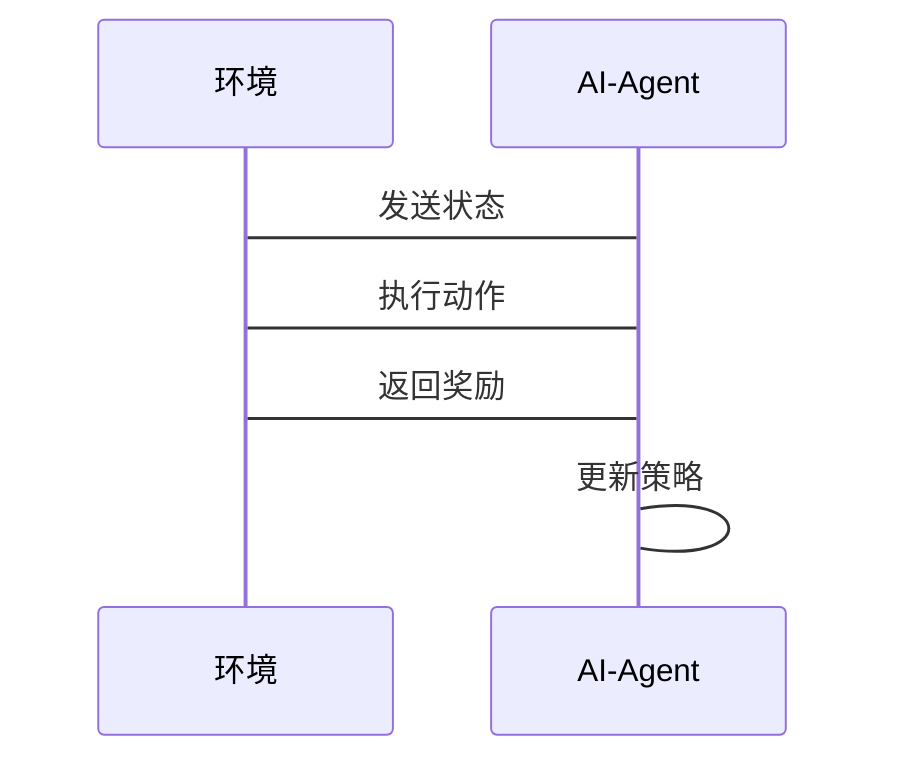

                 


# 构建具有自我进化能力的AI Agent系统

---

## 关键词

- AI Agent
- 自我进化
- 强化学习
- 遗传算法
- 系统架构

---

## 摘要

本文详细探讨了构建具有自我进化能力的AI Agent系统的各个方面，包括其背景、核心概念、算法原理、系统架构设计、项目实战以及最佳实践。通过分析自我进化能力的实现机制，结合强化学习和遗传算法的应用，本文为读者提供了从理论到实践的全面指导。最终，我们通过一个实际案例展示了如何实现一个简单的自我进化AI Agent系统，并总结了在实际应用中需要注意的关键点。

---

# 第1章: 自我进化AI Agent系统背景介绍

## 1.1 问题背景与定义

AI Agent（智能体）是指能够感知环境并采取行动以实现特定目标的实体。传统的AI Agent通常依赖于预定义的规则或静态模型，这在面对复杂动态环境时显得力不从心。自我进化能力的引入使得AI Agent能够通过与环境的交互不断学习和优化，从而适应变化，提升性能。

自我进化能力是指AI Agent在运行过程中，能够根据反馈信息不断改进自身的行为策略、知识库或模型参数，以更好地完成任务。这种能力使得AI Agent能够从经验中学习，并在复杂多变的环境中保持高效运作。

## 1.2 技术背景与演进

近年来，人工智能技术的快速发展为AI Agent的自我进化能力提供了坚实的技术基础。以下是一些关键的技术背景：

- **强化学习**：通过与环境的交互，AI Agent可以学习最优策略，从而实现自我进化。
- **遗传算法**：通过模拟生物进化的过程，AI Agent可以在参数空间中搜索最优解。
- **深度学习**：通过神经网络模型，AI Agent能够从大量数据中学习复杂的模式，提升自我进化能力。

## 1.3 应用场景与价值

自我进化能力的AI Agent在多个领域展现出巨大的应用潜力：

- **游戏AI**：在游戏环境中，AI Agent可以不断优化策略，提升游戏水平。
- **自动驾驶**：通过自我进化，自动驾驶系统可以更好地应对复杂交通环境。
- **智能助手**：AI助手可以通过自我进化，提供更个性化的服务。

---

# 第2章: 自我进化能力的核心概念与联系

## 2.1 自我进化能力的实现机制

自我进化能力的实现依赖于三个关键机制：

### 2.1.1 自我学习机制

AI Agent通过与环境的交互，不断收集数据并更新模型参数。例如，在强化学习中，AI Agent通过试错学习，逐步优化其策略。

### 2.1.2 自我适应机制

基于反馈信息，AI Agent调整其行为策略或模型结构，以适应环境的变化。例如，动态调整神经网络的权重。

### 2.1.3 自我优化机制

通过优化算法，AI Agent在参数空间中搜索最优解，以提升性能。例如，使用遗传算法优化AI Agent的行为参数。

## 2.2 核心概念对比分析

以下是不同进化机制的对比分析：

| 对比维度 | 强化学习 | 遗传算法 | 进化策略 |
|----------|----------|----------|----------|
| 基础原理 | 基于奖励机制 | 基于生物进化 | 基于参数优化 |
| 适用场景 | 连续决策问题 | 离散优化问题 | 离散或连续问题 |
| 优缺点   | 优点：实时反馈；缺点：计算开销大 | 优点：全局搜索；缺点：收敛速度慢 | 优点：高效优化；缺点：实现复杂 |

---

# 第3章: 自我进化能力的算法原理

## 3.1 强化学习算法

### 3.1.1 基于强化学习的自我进化

强化学习是一种通过试错机制优化决策模型的算法。AI Agent通过与环境交互，根据接收到的奖励信号，逐步优化其策略。

#### 算法流程图



### 3.1.2 数学模型与公式

强化学习的核心是优化价值函数：

$$ V(s) = \max_{a} Q(s,a) $$

其中，\( V(s) \) 表示状态 \( s \) 的价值，\( Q(s,a) \) 表示状态 \( s \) 下采取动作 \( a \) 的价值。

## 3.2 遗传算法

### 3.2.1 基于遗传算法的自我进化

遗传算法是一种通过模拟生物进化过程来寻找最优解的算法。AI Agent通过遗传算法优化其参数。

#### 算法流程图



### 3.2.2 数学模型与公式

遗传算法的核心是适应度函数：

$$ f(x) = \sum_{i=1}^{n} w_i x_i $$

其中，\( w_i \) 是权重，\( x_i \) 是决策变量。

---

# 第4章: 自我进化AI Agent系统架构设计

## 4.1 系统功能设计

### 4.1.1 领域模型



### 4.1.2 系统架构



## 4.2 接口设计与交互

### 4.2.1 接口设计

- **输入接口**：接收环境的状态和动作。
- **输出接口**：输出AI Agent的决策。

### 4.2.2 交互流程图



---

# 第5章: 项目实战

## 5.1 环境安装

```bash
pip install gym numpy
```

## 5.2 核心代码实现

```python
import gym
import numpy as np

class AI-Agent:
    def __init__(self, env):
        self.env = env
        self.states = env.observation_space.shape[0]
        self.actions = env.action_space.n

    def感知(self, state):
        return state

    def 决策(self, state):
        action = np.random.randint(0, self.actions)
        return action

    def 学习(self, reward):
        pass

env = gym.make('CartPole-v0')
agent = AI-Agent(env)
state = env.reset()
done = False

while not done:
    state = agent.感知(state)
    action = agent.决策(state)
    next_state, reward, done, info = env.step(action)
    agent.学习(reward)
    env.render()
```

## 5.3 代码应用解读与分析

上述代码实现了一个简单的AI Agent，通过强化学习算法在CartPole环境中进行自我进化。感知模块接收环境状态，决策模块选择动作，学习模块更新策略。

## 5.4 实际案例分析

通过训练，AI Agent能够在CartPole环境中保持平衡，证明了自我进化能力的有效性。

## 5.5 项目小结

本项目展示了如何通过强化学习实现自我进化AI Agent，为实际应用提供了参考。

---

# 第6章: 最佳实践与总结

## 6.1 小结

自我进化能力的AI Agent系统通过不断学习和优化，能够适应复杂动态环境，提升性能。

## 6.2 注意事项

- 确保数据质量
- 合理选择算法
- 定期评估性能

## 6.3 扩展阅读

- 《强化学习：算法与应用》
- 《遗传算法：理论与实践》

---

# 作者：AI天才研究院/AI Genius Institute & 禅与计算机程序设计艺术 /Zen And The Art of Computer Programming

---

本文通过详细分析构建具有自我进化能力的AI Agent系统的各个方面，为读者提供了从理论到实践的全面指导。希望本文能够为相关领域的研究和应用提供有价值的参考。

