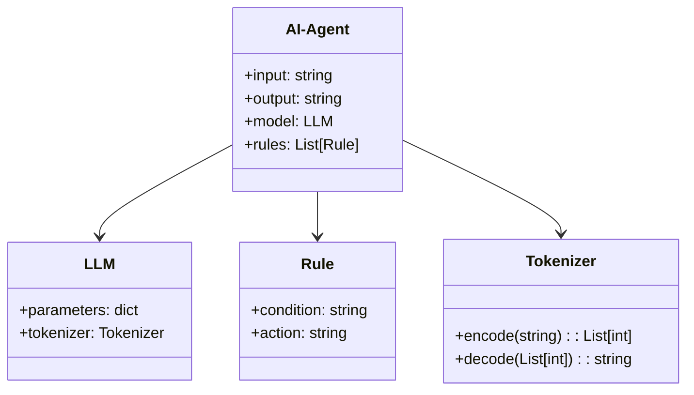
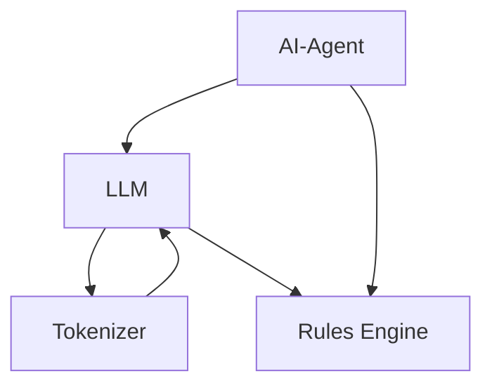

                 


# 构建可信AI Agent：LLM的安全性与可控性设计

## 关键词：可信AI Agent，大语言模型，LLM，安全性，可控性，AI安全

## 摘要：  
随着大语言模型（LLM）的快速发展，构建可信的AI Agent已成为当前人工智能领域的重要挑战。本文从LLM的安全性和可控性入手，系统性地分析了可信AI Agent的核心概念、安全威胁、设计原则、技术实现以及实际应用场景。通过结合理论分析和实践案例，本文为构建安全可靠的AI Agent提供了全面的技术指导和参考。

---

# 第1章: 可信AI Agent的定义与问题背景

## 1.1 可信AI Agent的核心概念

### 1.1.1 可信AI Agent的定义  
可信AI Agent是指在特定场景下，能够按照预期目标和伦理规范执行任务，并在面对潜在攻击或干扰时仍能保持安全性和可靠性的智能代理系统。其核心在于确保AI Agent的行为符合预期，同时具备抵御外部攻击的能力。

### 1.1.2 可信AI Agent的核心要素  
可信AI Agent需要满足以下核心要素：  
1. **安全性**：防止恶意攻击或滥用，确保数据和模型的完整性。  
2. **可控性**：通过设计手段，确保AI Agent的行为在可预测的范围内。  
3. **可解释性**：用户能够理解AI Agent的决策过程和行为逻辑。  
4. **鲁棒性**：在面对不确定性或异常输入时，仍能保持稳定性能。  

### 1.1.3 可信AI Agent的边界与外延  
可信AI Agent的边界包括：  
1. **数据层面**：确保训练数据和交互数据的安全性。  
2. **模型层面**：防止模型被恶意修改或窃取。  
3. **行为层面**：确保AI Agent的行为符合预设的目标和伦理规范。  

其外延则涉及AI Agent的可解释性、用户隐私保护以及与人类交互的自然性。

---

## 1.2 问题背景与技术挑战

### 1.2.1 当前AI Agent的应用现状  
AI Agent已在多个领域展现出强大的能力，如智能客服、自动驾驶、智能助手等。然而，随着应用范围的扩大，AI Agent的安全性和可控性问题逐渐显现。

### 1.2.2 可信性问题的提出  
可信性问题主要来源于以下方面：  
1. **模型滥用**：恶意用户可能利用AI Agent进行非法操作。  
2. **数据泄露**：训练数据可能包含敏感信息，面临被窃取的风险。  
3. **对抗攻击**：攻击者可能通过输入特定数据干扰AI Agent的行为。  

### 1.2.3 技术实现中的主要挑战  
1. **安全性设计**：如何防止模型被攻击或滥用。  
2. **可控性实现**：如何确保AI Agent的行为在可预测的范围内。  
3. **可解释性提升**：如何让用户理解AI Agent的决策过程。  

---

## 1.3 本章小结  
本章从可信AI Agent的核心概念出发，分析了其定义、核心要素以及边界与外延，并结合当前技术背景，提出了可信AI Agent面临的主要挑战。

---

# 第2章: 大语言模型（LLM）的核心原理

## 2.1 LLM的定义与特点

### 2.1.1 大语言模型的定义  
大语言模型（LLM）是指基于深度学习技术构建的大型神经网络模型，能够理解和生成人类语言。其核心在于通过大量数据的训练，掌握语言的语义和上下文关系。

### 2.1.2 LLM的核心特点  
1. **大规模参数**：通常包含 billions级别的参数。  
2. **多任务能力**：能够处理多种语言理解和生成任务。  
3. **自监督学习**：通过预测任务进行无监督学习，提升模型的泛化能力。  

---

## 2.2 LLM的训练与推理过程

### 2.2.1 基于Transformer的架构  
Transformer模型通过自注意力机制，能够捕捉到输入序列中的长距离依赖关系。其结构包括编码器和解码器两个部分。  

**编码器**：将输入序列转换为上下文表示。  
**解码器**：根据编码器的输出生成目标序列。  

### 2.2.2 自监督学习机制  
自监督学习通过构建预测任务（如预测下一个词）来训练模型。这种机制使得模型能够从大量未标注数据中学习语言规律。  

### 2.2.3 模型的可解释性问题  
尽管LLM在实际应用中表现出强大的能力，但其决策过程往往缺乏可解释性。这使得模型的行为难以被用户理解和信任。

---

## 2.3 LLM的数学模型与公式

### 2.3.1 Transformer模型的数学公式  
Transformer的自注意力机制可以表示为：  
$$\text{Attention}(Q, K, V) = \text{softmax}\left(\frac{QK^T}{\sqrt{d_k}}\right)V$$  

其中，\(Q\)、\(K\)、\(V\)分别是查询、键和值向量，\(d_k\)是向量的维度。  

### 2.3.2 损失函数的定义  
常用的损失函数包括交叉熵损失：  
$$\text{Loss} = -\sum_{i=1}^{n} \text{log}(p(y_i|x_i))$$  

---

## 2.4 本章小结  
本章详细介绍了大语言模型（LLM）的核心原理，包括其定义、特点、训练过程以及数学模型。这些内容为后续分析LLM的安全性和可控性奠定了基础。

---

# 第3章: LLM的安全威胁与风险分析

## 3.1 常见的安全威胁

### 3.1.1 模型窃取攻击  
攻击者通过获取模型参数或推理结果，反向推断模型的内部结构，从而窃取模型知识。  

### 3.1.2 模糊攻击  
攻击者通过输入特定的干扰数据，使得模型输出不符合预期的结果。  

### 3.1.3 操纵攻击  
攻击者通过精心设计的输入，引导模型生成有害或误导性的内容。  

---

## 3.2 安全风险的特征分析

### 3.2.1 数据泄露风险  
训练数据中可能包含敏感信息，攻击者可能通过模型推理获取这些信息。  

### 3.2.2 模型滥用风险  
恶意用户可能利用模型生成有害内容或进行非法操作。  

### 3.2.3 黑盒攻击风险  
攻击者无需了解模型内部结构，仅通过输入输出接口即可进行攻击。  

---

## 3.3 安全威胁的案例分析

### 3.3.1 模型窃取攻击的案例  
例如，攻击者通过获取模型的预测结果，逐步还原模型参数。  

### 3.3.2 模糊攻击的案例  
例如，攻击者输入包含歧义的句子，使得模型输出错误的结果。  

### 3.3.3 操纵攻击的案例  
例如，攻击者通过输入特定的关键词，引导模型生成恶意代码或攻击性言论。  

---

## 3.4 本章小结  
本章分析了LLM面临的主要安全威胁，包括模型窃取攻击、模糊攻击和操纵攻击，并结合实际案例进行了详细说明。

---

# 第4章: 可信AI Agent的安全性与可控性

## 4.1 可信AI Agent的安全性设计

### 4.1.1 数据层面的安全性  
1. **数据清洗**：去除训练数据中的敏感信息。  
2. **数据加密**：对训练数据进行加密存储和传输。  

### 4.1.2 模型层面的安全性  
1. **模型加固**：通过对抗训练提升模型的鲁棒性。  
2. **模型水印**：在模型中嵌入特定标识，防止模型被窃取。  

---

## 4.2 可信AI Agent的可控性设计

### 4.2.1 行为约束机制  
1. **规则引擎**：通过预定义的规则限制AI Agent的行为范围。  
2. **伦理审查**：确保AI Agent的输出符合伦理规范。  

### 4.2.2 可解释性增强  
1. **中间结果可视化**：展示模型决策过程中的关键节点。  
2. **决策日志记录**：记录AI Agent的决策过程，便于后续分析。  

---

## 4.3 安全性与可控性设计的整合

### 4.3.1 综合设计策略  
可信AI Agent的安全性和可控性需要在系统设计阶段综合考虑，确保两者相辅相成。  

### 4.3.2 实际应用中的注意事项  
1. **动态调整**：根据环境变化及时调整安全策略。  
2. **用户反馈机制**：通过用户反馈不断优化AI Agent的行为。  

---

## 4.4 本章小结  
本章从安全性与可控性的角度，提出了可信AI Agent的设计原则，并详细介绍了具体实现方法。

---

# 第5章: 基于LLM的可信AI Agent实现

## 5.1 项目背景与目标  
本项目旨在基于大语言模型构建一个可信的AI Agent，确保其安全性、可控性和可解释性。  

---

## 5.2 系统架构设计

### 5.2.1 领域模型设计  


---

### 5.2.2 系统架构图  


---

## 5.3 系统功能设计

### 5.3.1 环境安装  
1. 安装Python 3.8及以上版本。  
2. 安装必要的库：`transformers`, `torch`, `numpy`。  

---

### 5.3.2 核心代码实现  

```python
from transformers import AutoTokenizer, AutoModelForCausalLM
import torch

class AI-Agent:
    def __init__(self, model_name, tokenizer_name):
        self.model = AutoModelForCausalLM.from_pretrained(model_name)
        self.tokenizer = AutoTokenizer.from_pretrained(tokenizer_name)
        self.rules = []

    def process_input(self, input_text):
        inputs = self.tokenizer(input_text, return_tensors="pt")
        outputs = self.model.generate(inputs.input_ids, max_length=100)
        return self.tokenizer.decode(outputs[0], skip_special_tokens=True)

    def apply_rules(self, output_text):
        for rule in self.rules:
            if rule.condition.match(output_text):
                output_text = rule.apply(output_text)
        return output_text
```

---

### 5.3.3 案例分析  
以智能客服场景为例，AI Agent需要根据用户输入生成符合公司政策的回复，并通过规则引擎确保输出内容的安全性和合规性。

---

## 5.4 本章小结  
本章通过实际项目案例，详细介绍了基于LLM的可信AI Agent的实现过程，包括系统架构设计和核心代码实现。

---

# 第6章: 总结与展望

## 6.1 本章总结  
本文从可信AI Agent的核心概念出发，详细分析了LLM的安全性和可控性设计，并结合实际案例进行了技术实现。通过这些工作，我们为构建可信的AI Agent提供了理论支持和实践指导。

---

## 6.2 未来研究方向  
1. **模型安全性的进一步提升**：探索更有效的对抗训练方法。  
2. **可解释性增强**：开发更直观的解释生成方法。  
3. **多模态融合**：结合视觉、听觉等多模态信息，提升AI Agent的交互能力。  

---

# 作者  
作者：AI天才研究院 & 禅与计算机程序设计艺术

