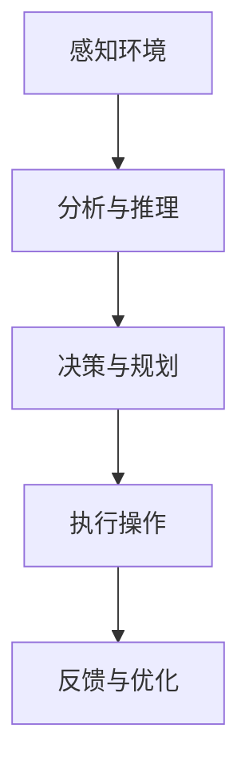
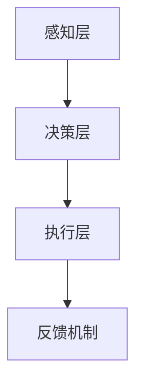
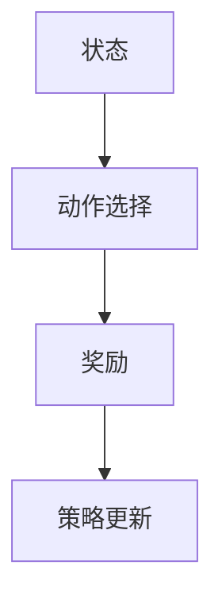
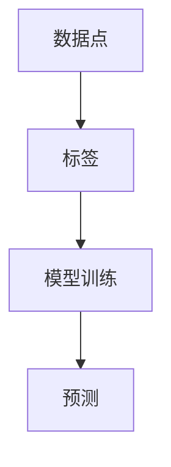
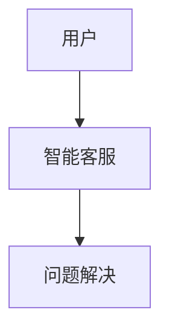
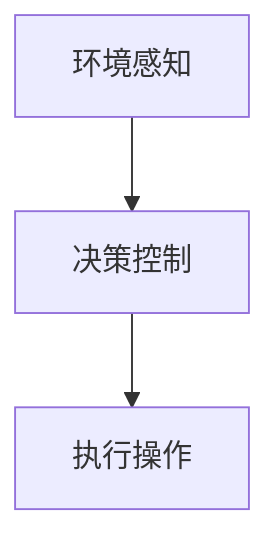
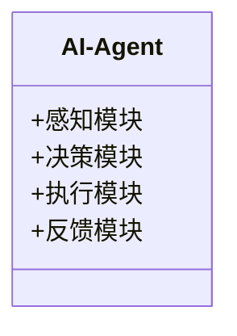

                 


# 构建可持续发展的AI Agent生态系统

> 关键词：AI Agent, 可持续发展, 系统架构, 算法原理, 应用场景

> 摘要：  
本文旨在探讨如何构建一个可持续发展的AI Agent生态系统。通过分析AI Agent的核心概念、系统架构、算法原理及应用场景，结合实际案例和系统设计，为读者提供全面的指导。本文内容涵盖从基础理论到实际应用的各个层面，帮助读者理解并掌握构建高效、可靠且可持续发展的AI Agent生态系统的关键方法。

---

## 第一部分：AI Agent生态系统背景介绍

### 第1章：AI Agent的基本概念与背景

#### 1.1 AI Agent的定义与核心概念

AI Agent（人工智能代理）是指能够感知环境、自主决策并执行任务的智能实体。它通过传感器获取信息，利用算法进行分析和推理，并通过执行器与环境互动。AI Agent的核心特征包括：

1. **自主性**：无需外部干预，自主完成任务。
2. **反应性**：能够实时感知环境并做出响应。
3. **目标导向**：基于目标驱动行为。
4. **学习能力**：通过经验改进性能。

**AI Agent与传统AI的区别**：  
AI Agent强调自主性和适应性，而传统AI更多依赖于固定的规则和数据。

#### 1.2 AI Agent生态系统的重要性

AI Agent生态系统是指由多个AI Agent及其交互环境组成的复杂系统。它的重要性体现在：

1. **高效性**：通过协作提高整体效率。
2. **适应性**：能够动态调整以应对变化。
3. **可持续性**：通过资源优化实现长期稳定运行。

**AI Agent生态系统的特点**：  
- 分布式：AI Agent可以分布在网络中，协同工作。
- 多目标：每个AI Agent可能有不同的目标，需要协调以实现整体最优。
- 动态性：环境和任务可能随时变化，要求系统具备快速响应能力。

---

## 第二部分：AI Agent的核心概念与原理

### 第2章：AI Agent的核心概念与原理

#### 2.1 AI Agent的类型与特点

AI Agent可以分为以下几类：

1. **简单反射型AI Agent**  
   - 基于即时感知做出反应，没有内部状态。
   - 例如：简单的自动门系统。

2. **基于模型的AI Agent**  
   - 维护环境模型，基于模型进行推理和决策。
   - 例如：自动驾驶汽车。

3. **目标驱动型AI Agent**  
   - 以目标为导向，通过规划实现目标。
   - 例如：智能助手（如Siri）。

4. **学习驱动型AI Agent**  
   - 通过学习优化行为策略。
   - 例如：AlphaGo。

**AI Agent类型对比表**：  

| 类型                | 描述                                                                 |
|---------------------|----------------------------------------------------------------------|
| 简单反射型          | 基于即时反馈，无内部状态                                         |
| 基于模型的          | 维护环境模型，推理能力较强                                         |
| 目标驱动型          | 以目标为导向，规划能力突出                                         |
| 学习驱动型          | 通过学习优化行为，适应性更强                                     |

#### 2.2 AI Agent的工作原理

AI Agent的工作流程包括以下步骤：

1. **感知环境**：通过传感器或接口获取环境信息。
2. **分析与推理**：利用算法对信息进行分析和推理。
3. **决策与规划**：基于推理结果制定行动方案。
4. **执行操作**：通过执行器执行决策。
5. **反馈与优化**：根据执行结果调整行为策略。

**AI Agent工作原理的Mermaid图**：



---

## 第三部分：AI Agent的可持续发展架构

### 第3章：可持续发展的AI Agent系统架构

#### 3.1 可持续发展AI Agent的系统架构

AI Agent的可持续发展架构需要考虑以下几点：

1. **分层架构**：将系统划分为感知层、决策层和执行层。
2. **微服务架构**：通过微服务实现模块化，提高系统的可扩展性和可维护性。
3. **混合架构**：结合集中式和分布式架构，优化资源利用。

**AI Agent系统架构的Mermaid图**：



#### 3.2 可持续性评估指标

AI Agent系统的可持续性可以从以下几个方面进行评估：

1. **资源利用率**：是否高效利用计算资源。
2. **环境适应性**：是否能够适应动态变化的环境。
3. **可扩展性**：是否能够轻松扩展以应对更大的任务规模。

**AI Agent系统架构评估指标对比表**：  

| 指标       | 分层架构 | 微服务架构 | 混合架构 |
|------------|----------|------------|----------|
| 资源利用率 | 低       | 高         | 较高     |
| 环境适应性 | 中       | 高         | 较高     |
| 可扩展性   | 低       | 高         | 较高     |

---

## 第四部分：AI Agent的算法原理

### 第4章：AI Agent的算法原理

#### 4.1 强化学习算法

强化学习是一种通过试错机制优化行为策略的方法。其核心流程如下：

1. **环境感知**：获取环境状态。
2. **动作选择**：基于当前策略选择动作。
3. **奖励机制**：根据动作结果获得奖励或惩罚。
4. **策略更新**：基于奖励调整策略。

**强化学习算法的Mermaid图**：



**Python代码示例**：

```python
import numpy as np

# 初始化策略参数
theta = np.random.randn(4, 1)

# 定义价值函数
def value_function(state):
    return state.dot(theta)

# 定义策略
def policy(state):
    values = value_function(state)
    action_probs = np.exp(values) / np.exp(values).sum()
    return action_probs

# 训练过程
for _ in range(1000):
    state = get_state()
    action = sample_policy(state)
    reward = get_reward(state, action)
    update_policy(theta, state, reward)
```

#### 4.2 监督学习算法

监督学习通过标注数据训练模型，使其能够预测新的数据点。常用算法包括线性回归、支持向量机等。

**监督学习算法的Mermaid图**：



**Python代码示例**：

```python
from sklearn.linear_model import LinearRegression

# 初始化数据
X = np.array([[1], [2], [3], [4]])
y = np.array([2, 4, 6, 8])

# 训练模型
model = LinearRegression()
model.fit(X, y)

# 预测
print(model.predict(np.array([[5]])))  # 输出：[[10]]
```

---

## 第五部分：AI Agent的应用场景分析

### 第5章：AI Agent的应用场景分析

#### 5.1 智能客服

AI Agent可以用于智能客服系统，通过自然语言处理技术与用户交互，解决用户问题。

**案例分析**：  
某电商平台的智能客服系统，通过NLP技术识别用户意图，并调用相应的服务解决问题。

**系统架构图**：



#### 5.2 自动驾驶

AI Agent在自动驾驶中的应用主要体现在环境感知和决策控制。

**案例分析**：  
自动驾驶汽车通过激光雷达和摄像头感知环境，利用强化学习算法进行路径规划和避障。

**算法流程图**：



---

## 第六部分：AI Agent的系统设计与实现

### 第6章：AI Agent的系统设计与实现

#### 6.1 系统设计

AI Agent系统的功能设计包括：

1. **感知模块**：负责环境数据的采集。
2. **决策模块**：负责基于数据做出决策。
3. **执行模块**：负责执行决策动作。
4. **反馈模块**：负责收集执行结果并优化系统。

**系统功能设计的Mermaid类图**：



#### 6.2 项目实战

**环境搭建**：  
需要安装Python、TensorFlow、Keras等库。

**核心代码实现**：

```python
import tensorflow as tf
from tensorflow.keras import layers

# 定义AI Agent模型
class AIAgent(tf.keras.Model):
    def __init__(self):
        super(AIAgent, self).__init__()
        self.dense1 = layers.Dense(64, activation='relu')
        self.dense2 = layers.Dense(1, activation='sigmoid')

    def call(self, inputs):
        x = self.dense1(inputs)
        return self.dense2(x)

# 初始化模型
agent = AIAgent()

# 编译模型
agent.compile(optimizer='adam', loss='binary_crossentropy')

# 训练模型
agent.fit(x_train, y_train, epochs=10, batch_size=32)
```

---

## 第七部分：最佳实践与未来展望

### 第7章：最佳实践与未来展望

#### 7.1 最佳实践

1. **模块化设计**：将系统划分为可替换的模块，便于维护和扩展。
2. **实时监控**：实时监控系统性能，及时发现和解决问题。
3. **持续优化**：定期更新模型和策略，提升系统性能。

#### 7.2 未来展望

随着AI技术的不断进步，AI Agent生态系统将更加智能化和高效。未来的发展方向包括：

1. **人机协作**：AI Agent与人类协作，共同完成复杂任务。
2. **自适应学习**：AI Agent能够自主学习和进化。
3. **边缘计算**：通过边缘计算优化AI Agent的实时性和响应速度。

---

## 作者：AI天才研究院/AI Genius Institute & 禅与计算机程序设计艺术 /Zen And The Art of Computer Programming

---

以上是构建可持续发展的AI Agent生态系统的技术博客文章，涵盖从基础概念到实际应用的各个方面，希望对读者有所帮助。

