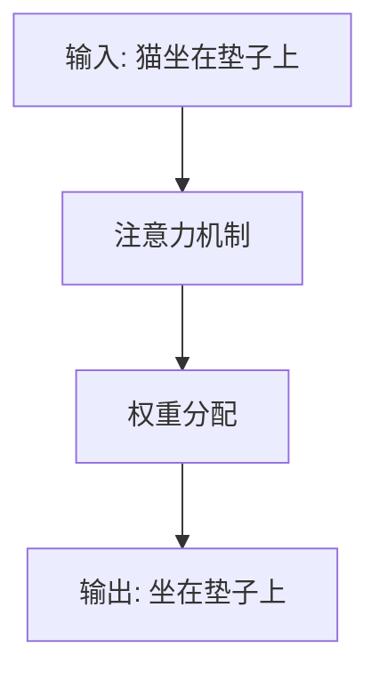
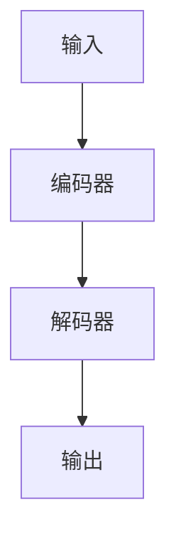
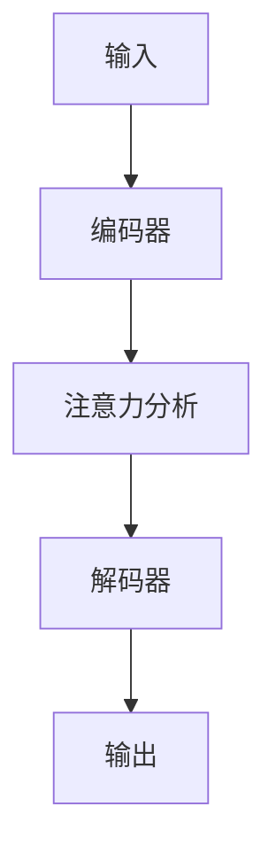

                 


# 构建可解释AI Agent：LLM决策过程的透明化设计

> 关键词：可解释AI，LLM，决策过程，透明化设计，人工智能，系统架构

> 摘要：  
本文旨在探讨如何构建可解释的AI代理，特别是基于大语言模型（LLM）的决策过程的透明化设计。通过分析当前AI决策过程的不透明性问题，提出了一种可解释性设计的系统架构，并详细阐述了其实现方法，包括算法原理、系统设计、项目实战等。本文将帮助读者理解可解释AI的核心概念、设计原则以及实际应用中的关键问题。

---

## 第一部分: 可解释AI Agent的背景与核心概念

### 第1章: 可解释AI的必要性

#### 1.1 问题背景
可解释性是人工智能系统信任和普及的关键因素。随着大语言模型（LLM）在各个领域的广泛应用，其决策过程的不透明性引发了诸多问题，例如：

- **信任缺失**：用户无法理解AI的决策依据，导致信任不足。
- **责任追究**：当AI系统出现错误时，难以追溯问题来源。
- **合规性要求**：在金融、医疗等领域，透明性是合规的基本要求。

#### 1.2 问题描述
LLM的决策过程通常被视为“黑箱”，其输出结果依赖于复杂的内部计算，缺乏直观的解释。这种不透明性使得用户难以理解AI的行为，也增加了应用中的风险。

---

### 第2章: 可解释AI的核心概念

#### 2.1 核心概念与联系
- **可解释性**：AI系统的行为可以通过人类可理解的方式进行解释。
- **透明性**：系统的设计和决策过程对用户公开。
- **可预测性**：AI系统的输出可以被用户预测和理解。

| 概念 | 定义 | 特性 |
|------|------|------|
| 可解释性 | 系统行为可以被人类理解 | 易理解性、可追溯性 |
| 透明性 | 系统设计和决策过程公开 | 可视化、可审计性 |
| 可预测性 | 系统输出可被预测 | 稳定性、一致性 |

#### 2.2 核心概念原理
可解释AI的核心在于通过设计使得决策过程可追溯、可分解。例如，通过分析LLM的注意力权重，可以了解模型在生成输出时关注的输入部分。

---

## 第二部分: 可解释AI Agent的算法原理

### 第4章: LLM决策过程的内部机制

#### 4.1 注意力机制的可解释性
- 注意力机制通过权重分配，突出输入中重要的部分。
- 例如，对于输入句子“猫坐在垫子上”，模型可能关注“猫”和“垫子”来生成“坐在”。

**注意力权重可视化示例：**


#### 4.2 解码器的可解释性
解码器通过逐步生成输出，每一步的决策都可以被跟踪和解释。

**解码器结构示意图：**


---

## 第三部分: 可解释AI Agent的系统架构

### 第5章: 可解释AI的系统架构

#### 5.1 系统架构设计
- **模块划分**：输入处理、注意力分析、解码器跟踪。
- **模块关系**：输入数据通过编码器处理，注意力权重用于生成输出。

**系统架构图：**


---

## 第四部分: 可解释AI Agent的项目实战

### 第6章: 项目实战

#### 6.1 环境安装
- 安装Python、TensorFlow、Keras等工具。

#### 6.2 核心代码实现
```python
import tensorflow as tf
from tensorflow.keras import layers

# 定义模型
class ExplainableAIModel(tf.keras.Model):
    def __init__(self, vocab_size):
        super(ExplainableAIModel, self).__init__()
        self.embedding = layers.Embedding(vocab_size, 100)
        self.attention = layers.Attention()
        self.decoder = layers.Dense(vocab_size, activation='softmax')

    def call(self, inputs):
        embedded = self.embedding(inputs)
        attn_out = self.attention(embedded, embedded)
        output = self.decoder(attn_out)
        return output, attn_out  # 返回注意力权重用于解释

# 初始化模型
model = ExplainableAIModel(vocab_size=10000)
```

---

## 第五部分: 总结与展望

### 第7章: 总结与展望

#### 7.1 总结
- 可解释AI的核心在于通过设计使得决策过程透明。
- LLM的注意力机制为实现可解释性提供了重要工具。

#### 7.2 展望
- 结合领域知识，进一步优化可解释性模型。
- 探讨可解释性在不同领域的具体应用。

---

## 附录

### 附录A: 扩展阅读
- [可解释性AI的理论基础](https://example.com/theory)
- [注意力机制的深入理解](https://example.com/attention)

### 附录B: 工具推荐
- [Transformers库](https://github.com/huggingface/transformers)
- [Mermaid图表工具](https://mermaid-js.github.io/mermaid-live-editor/)

---

作者：AI天才研究院/AI Genius Institute & 禅与计算机程序设计艺术 /Zen And The Art of Computer Programming

