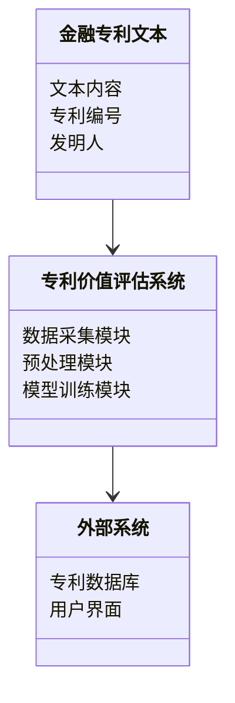
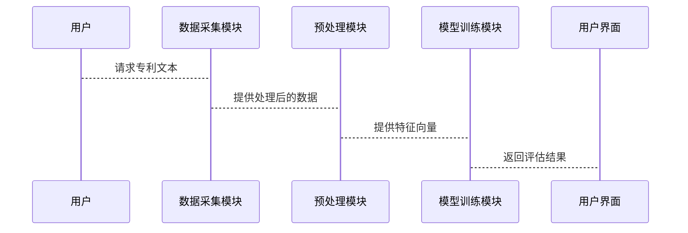

                 


# 《构建基于NLP的金融专利价值评估系统》

---

## 关键词：自然语言处理（NLP）、金融专利、文本挖掘、机器学习、专利评估、系统架构

---

## 摘要：  
本文详细探讨了如何利用自然语言处理（NLP）技术构建金融专利价值评估系统。通过分析专利文本的语义和上下文信息，结合机器学习算法，我们提出了一种高效、智能的专利价值评估方法。本文从问题背景、核心概念、NLP算法原理、系统架构设计到实际项目实现进行了全面的探讨，为读者提供了一套完整的解决方案。

---

## 目录大纲

### 第1章: 问题背景与描述
#### 1.1 问题背景
##### 1.1.1 金融专利评估的重要性
##### 1.1.2 当前专利评估的痛点
##### 1.1.3 NLP技术在专利评估中的潜力

#### 1.2 问题描述
##### 1.2.1 专利文本的复杂性
##### 1.2.2 专利价值的多维度评估
##### 1.2.3 现有评估方法的局限性

#### 1.3 问题解决思路
##### 1.3.1 引入NLP技术的必要性
##### 1.3.2 基于NLP的专利分析框架
##### 1.3.3 系统目标与功能概述

### 第2章: 核心概念与系统边界
#### 2.1 核心概念
##### 2.1.1 自然语言处理（NLP）的基本概念
##### 2.1.2 金融专利的文本特征
##### 2.1.3 专利价值评估的关键指标

#### 2.2 系统边界与外延
##### 2.2.1 系统的输入与输出
##### 2.2.2 系统的功能边界
##### 2.2.3 系统与外部系统的交互

#### 2.3 概念结构与核心要素
##### 2.3.1 系统架构的核心要素
##### 2.3.2 各要素之间的关系
##### 2.3.3 核心要素的详细描述

### 第3章: NLP算法原理
#### 3.1 NLP基础算法
##### 3.1.1 分词算法
##### 3.1.2 词性标注
##### 3.1.3 实体识别

#### 3.2 深度学习模型
##### 3.2.1 RNN与LSTM
##### 3.2.2 Transformer模型
##### 3.2.3 BERT模型

#### 3.3 金融专利分析中的NLP应用
##### 3.3.1 专利分类与主题提取
##### 3.3.2 专利相似度计算
##### 3.3.3 专利情感分析

### 第4章: 数学模型与公式
#### 4.1 文本相似度计算
##### 4.1.1 余弦相似度
$$ \text{余弦相似度} = \frac{\vec{A} \cdot \vec{B}}{|\vec{A}| |\vec{B}|} $$

##### 4.1.2 编辑距离
$$ \text{编辑距离} = \text{替换} + \text{插入} + \text{删除} $$

#### 4.2 情感分析模型
##### 4.2.1 二分类模型
$$ P(y=1|x) = \frac{1}{1 + e^{-wx}} $$

##### 4.2.2 多分类模型
$$ P(y=k|x) = \frac{e^{wx_k}}{\sum_{j=1}^{n} e^{wx_j}} $$

### 第5章: 系统分析与架构设计
#### 5.1 系统分析
##### 5.1.1 问题场景介绍
##### 5.1.2 项目介绍
##### 5.1.3 系统功能设计

#### 5.2 系统架构设计
##### 5.2.1 领域模型（Mermaid 类图）


##### 5.2.2 系统架构（Mermaid 架构图）


#### 5.3 系统接口设计
##### 5.3.1 接口描述
##### 5.3.2 接口交互流程（Mermaid 序列图）


### 第6章: 项目实战
#### 6.1 环境安装
##### 6.1.1 安装Python
##### 6.1.2 安装NLP库（如spaCy、NLTK）
##### 6.1.3 安装深度学习框架（如TensorFlow、PyTorch）

#### 6.2 核心实现
##### 6.2.1 数据预处理代码
```python
import spacy

nlp = spacy.load("en_core_web_sm")
text = "This is a sample text."
doc = nlp(text)
for token in doc:
    print(token.text, token.pos_)
```

##### 6.2.2 模型训练代码
```python
import tensorflow as tf
from tensorflow.keras import layers

model = tf.keras.Sequential([
    layers.Embedding(input_dim=10000, output_dim=50),
    layers.LSTM(64),
    layers.Dense(1, activation='sigmoid')
])
model.compile(optimizer='adam', loss='binary_crossentropy', metrics=['accuracy'])
model.fit(x_train, y_train, epochs=5)
```

#### 6.3 案例分析与效果展示
##### 6.3.1 案例选择
##### 6.3.2 实验结果分析
##### 6.3.3 系统性能优化

### 第7章: 总结与展望
#### 7.1 系统总结
##### 7.1.1 核心功能总结
##### 7.1.2 技术实现总结
##### 7.1.3 系统优势与不足

#### 7.2 未来展望
##### 7.2.1 技术改进方向
##### 7.2.2 应用场景扩展
##### 7.2.3 可能的挑战与解决方案

#### 7.3 最佳实践 tips
##### 7.3.1 数据预处理的注意事项
##### 7.3.2 模型调优的技巧
##### 7.3.3 系统部署的建议

---

## 作者：AI天才研究院/AI Genius Institute & 禅与计算机程序设计艺术 /Zen And The Art of Computer Programming

