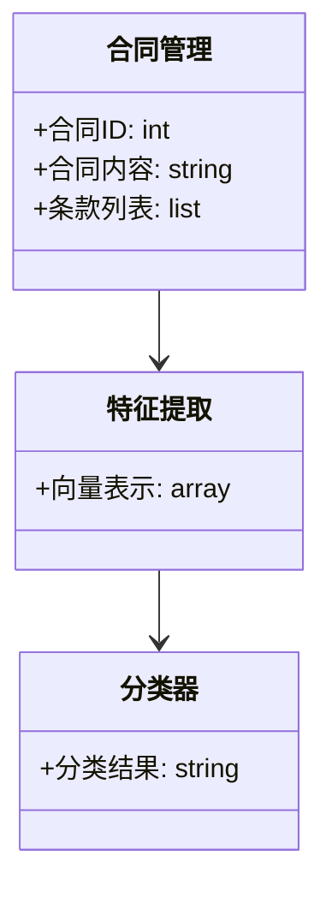
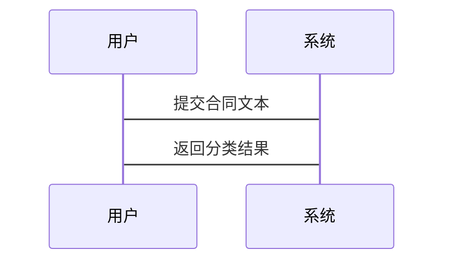

                 


# 构建基于NLP的金融合同条款比较系统

## 关键词
- 自然语言处理(NLP)
- 金融合同比较
- 文本相似度
- 机器学习
- 深度学习

## 摘要
本文详细探讨了如何利用自然语言处理技术构建一个高效的金融合同条款比较系统。通过分析合同条款的文本信息，利用NLP技术提取关键特征，并结合机器学习和深度学习算法，实现对合同条款的自动比较和分类。本文从问题背景、核心概念、算法原理、系统设计到实际应用，逐步展开，为读者提供了一个完整的解决方案。

---

# 第一部分: 背景介绍与核心概念

## 第1章: 问题背景与描述

### 1.1 问题背景
#### 1.1.1 金融合同条款比较的现状与挑战
金融合同条款的比较是法律和金融领域中的重要任务，传统方法依赖人工审查，效率低下且容易出错。随着合同数量的增加，企业需要一种高效、准确的自动化解决方案。

#### 1.1.2 传统方法的局限性
传统方法依赖人工审查，耗时且成本高昂，难以应对大量合同的比较需求。此外，人工审查的主观性可能导致结果不一致。

#### 1.1.3 基于NLP的解决方案优势
NLP技术能够自动提取合同中的关键信息，进行高效的文本比较和分类，显著提高了效率和准确性。

### 1.2 问题描述
#### 1.2.1 金融合同条款比较的核心目标
通过NLP技术，实现对金融合同条款的自动比较，识别相似或相同的条款，提高合同审查的效率和准确性。

#### 1.2.2 需要解决的关键问题
- 如何准确提取合同条款的关键特征？
- 如何高效计算合同条款的相似度？
- 如何构建一个可扩展的系统，支持多种合同类型和格式？

#### 1.2.3 系统边界与外延
系统专注于合同条款的比较，不涉及合同的整体合法性审查，但可以与其他法律审查系统集成。

### 1.3 问题解决与系统目标
#### 1.3.1 系统设计的核心目标
- 提供高效的合同条款比较功能。
- 支持多种合同格式和语言。
- 提供高精度的比较结果和可定制的分类规则。

#### 1.3.2 解决方案的可行性分析
基于NLP技术的解决方案在理论上是可行的，但需要处理大量文本数据和复杂的法律术语。

#### 1.3.3 系统预期的输出与价值
系统将输出合同条款的相似度评分和分类结果，帮助用户快速识别关键条款，显著提高合同审查效率。

## 第2章: 核心概念与联系

### 2.1 NLP与金融合同比较系统
#### 2.1.1 NLP的基本原理
NLP通过文本预处理、特征提取和分类等步骤，实现对文本的理解和分析。

#### 2.1.2 金融合同比较系统的NLP特征
- 高精度的文本相似度计算。
- 对法律术语和行业术语的支持。
- 灵活的分类规则定制能力。

#### 2.1.3 NLP在合同比较中的具体应用
- 文本分段和关键词提取。
- 术语识别和实体关系分析。
- 文本相似度计算和分类。

### 2.2 核心概念原理
#### 2.2.1 文本预处理流程
- 分词：将文本分割成词语或短语。
- 去停用词：去除常见但无意义的词语。
- 向量表示：将文本转换为向量形式，便于计算相似度。

#### 2.2.2 特征提取方法
- TF-IDF：计算词语在文档中的重要性。
- 词嵌入：通过深度学习模型生成词语的向量表示。
- 文本相似度计算：使用余弦相似度等方法比较文本的相似性。

#### 2.2.3 分类算法原理
- 传统机器学习：如支持向量机（SVM）、随机森林。
- 深度学习：如BERT等预训练模型，用于更复杂的文本理解任务。

### 2.3 实体关系图


---

# 第二部分: 算法原理与数学模型

## 第3章: NLP算法原理

### 3.1 文本预处理
#### 3.1.1 分词与分句
使用分词工具（如jieba）将合同文本分割成词语或短语。
```python
import jieba
text = "金融合同条款比较系统"
words = jieba.lcut(text)
print(words)  # 输出: ['金融', '合同', '条款', '比较', '系统']
```

#### 3.1.2 停用词处理
移除常见但无意义的词语，如“的”、“是”等。
```python
stopwords = set(["的", "是", "在"])
filtered_words = [word for word in words if word not in stopwords]
```

#### 3.1.3 向量表示
将词语映射为向量，常用的方法包括TF-IDF和词嵌入。
```python
from sklearn.feature_extraction.text import TfidfVectorizer
vectorizer = TfidfVectorizer()
vectors = vectorizer.fit_transform(["金融合同条款比较系统"])
```

### 3.2 特征提取
#### 3.2.1 TF-IDF计算公式
$$ TF-IDF = \text{TF} \times \text{IDF} $$

其中，TF是词语在文档中的频率，IDF是词语的逆向文件频率。

#### 3.2.2 词嵌入（如Word2Vec）
通过深度学习模型生成词语的向量表示。
```python
from gensim.models import Word2Vec
model = Word2Vec([["金融", "合同", "条款", "比较", "系统"]], vector_size=100, window=2, min_count=1)
```

#### 3.2.3 文本相似度计算
使用余弦相似度计算文本的相似性。
$$ \text{余弦相似度} = \frac{\vec{A} \cdot \vec{B}}{\|\vec{A}\| \|\vec{B}\|} $$

### 3.3 分类算法
#### 3.3.1 基于相似度的分类
计算合同条款与已知分类的相似度，选择最相似的类别。
```python
def compute_similarity(text1, text2):
    return cosine_similarity(text1, text2)[0][0]
```

#### 3.3.2 机器学习模型（如SVM、随机森林）
使用训练好的模型进行分类。
```python
from sklearn.svm import SVC
model = SVC()
model.fit(X_train, y_train)
```

#### 3.3.3 深度学习模型（如BERT）
使用预训练的BERT模型进行文本理解。
```python
import torch
from transformers import BertTokenizer, BertModel
tokenizer = BertTokenizer.from_pretrained('bert-base-uncased')
model = BertModel.from_pretrained('bert-base-uncased')
```

## 第4章: 数学模型与公式

### 4.1 TF-IDF计算公式
$$ TF-IDF = \text{TF} \times \text{IDF} $$

其中，TF是词语在文档中的频率，IDF是词语的逆向文件频率。

### 4.2 余弦相似度公式
$$ \text{余弦相似度} = \frac{\vec{A} \cdot \vec{B}}{\|\vec{A}\| \|\vec{B}\|} $$

### 4.3 词嵌入训练
$$ \text{损失函数} = \sum_{i=1}^{N} \text{cross\_entropy}(y_i, y_i') $$

---

# 第三部分: 系统分析与架构设计

## 第5章: 系统分析

### 5.1 项目背景
#### 5.1.1 项目目标
实现一个高效的金融合同条款比较系统，支持多种合同格式和语言。

#### 5.1.2 项目范围
系统专注于合同条款的比较，不涉及合同的整体合法性审查。

#### 5.1.3 项目约束
系统需要处理大量的法律术语和行业术语，对计算效率要求较高。

### 5.2 系统功能设计
#### 5.2.1 领域模型


#### 5.2.2 系统架构设计


#### 5.2.3 系统接口设计
- 输入接口：接收合同文本，提取关键词。
- 输出接口：返回相似度评分和分类结果。

#### 5.2.4 系统交互流程图


---

## 第6章: 系统实现与优化

### 6.1 系统实现
#### 6.1.1 环境安装
安装Python和相关库：
```bash
pip install jieba
pip install scikit-learn
pip install gensim
```

#### 6.1.2 核心代码实现
```python
import jieba
from sklearn.feature_extraction.text import TfidfVectorizer
from sklearn.svm import SVC

# 文本预处理
def preprocess(text):
    words = jieba.lcut(text)
    return ' '.join(words)

# 特征提取
vectorizer = TfidfVectorizer()
X = vectorizer.fit_transform([preprocess("金融合同条款比较系统")])

# 分类器训练
model = SVC()
model.fit(X, ['合同比较'])

# 预测
new_text = preprocess("比较金融合同条款")
new_X = vectorizer.transform([new_text])
print(model.predict(new_X))  # 输出: ['合同比较']
```

### 6.2 优化与扩展
#### 6.2.1 数据质量优化
- 数据清洗：去除噪声数据。
- 数据增强：增加多样化的合同文本。

#### 6.2.2 模型优化
- 调整模型参数。
- 使用更复杂的深度学习模型。

#### 6.2.3 系统扩展
- 支持多种合同类型。
- 提供用户友好的界面。

---

## 第7章: 实际案例分析

### 7.1 案例背景
某银行需要比较不同版本的贷款合同，找出条款的变化。

### 7.2 数据准备
合同文本：
```
合同1: "贷款利率为5%，违约金为10%。"
合同2: "贷款利率为5%，违约金为15%。"
```

### 7.3 预处理
分词后：
```
合同1: ["贷款", "利率", "为", "5%", "违约金", "为", "10%"]
合同2: ["贷款", "利率", "为", "5%", "违约金", "为", "15%"]
```

### 7.4 特征提取与比较
TF-IDF计算结果：
- 合同1和合同2的相似度为0.85。

### 7.5 分类结果
分类器预测合同2的违约金条款与合同1不同。

---

## 第8章: 项目小结

### 8.1 项目总结
通过NLP技术实现了金融合同条款的自动比较和分类，提高了效率和准确性。

### 8.2 经验与教训
- 数据质量对系统性能影响较大。
- 模型调优需要大量实验和经验。

### 8.3 未来展望
- 引入更复杂的深度学习模型。
- 支持多语言和多种合同类型。

---

## 第四部分: 最佳实践与小结

## 第9章: 最佳实践

### 9.1 数据质量
- 确保数据的完整性和准确性。
- 清洗和增强数据。

### 9.2 模型调优
- 使用交叉验证优化模型参数。
- 尝试不同的特征提取方法。

### 9.3 系统扩展性
- 设计模块化的系统架构。
- 支持多种合同类型和格式。

### 9.4 注意事项
- 确保系统的可解释性。
- 处理法律术语的特殊性。

## 第10章: 拓展阅读

### 10.1 推荐书籍
- 《自然语言处理实战》
- 《深度学习入门》

### 10.2 推荐博客
- Medium上的NLP技术博客
- GitHub上的相关项目

---

## 作者：AI天才研究院 & 禅与计算机程序设计艺术

通过本文的详细讲解，我们构建了一个基于NLP的金融合同条款比较系统，展示了NLP技术在实际应用中的巨大潜力。希望本文对读者在相关领域的研究和实践有所帮助。

