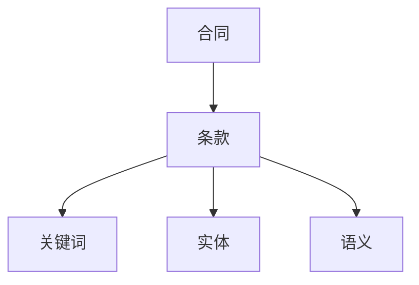

                 

# 构建基于NLP的金融合同条款自动化比对系统

## 关键词：自然语言处理(NLP)，金融合同，条款比对，机器学习，深度学习，预训练模型

## 摘要：  
本文详细介绍了如何利用自然语言处理技术构建一个高效的金融合同条款自动化比对系统。通过分析合同条款的结构和特征，结合预训练语言模型，提出了一种基于深度学习的解决方案。文章从问题背景、核心概念、算法原理到系统实现进行了全面的探讨，展示了如何利用NLP技术提高合同审查的效率和准确性。

---

# 目录

1. **背景介绍与问题分析**
   - 1.1 问题背景
     - 1.1.1 金融合同条款比对的必要性
     - 1.1.2 现有解决方案的局限性
     - 1.1.3 NLP技术在合同比对中的优势
   - 1.2 问题描述
     - 1.2.1 合同条款的复杂性
     - 1.2.2 传统比对方法的不足
     - 1.2.3 自动化比对的需求
   - 1.3 问题解决
     - 1.3.1 NLP技术的核心作用
     - 1.3.2 自动化比对的目标
     - 1.3.3 系统边界与外延
   - 1.4 核心概念与联系
     - 1.4.1 合同条款的结构化分析
     - 1.4.2 NLP模型的特征提取
     - 1.4.3 系统功能与模块的关联

2. **核心概念与技术原理**
   - 2.1 核心概念原理
     - 2.1.1 NLP在合同比对中的作用
     - 2.1.2 合同条款的特征提取
     - 2.1.3 模型的可解释性
   - 2.2 核心概念对比分析
     - 2.2.1 不同模型的优缺点对比
     - 2.2.2 合同条款特征的对比分析
     - 2.2.3 ER实体关系图

---

# 第一部分: 背景介绍与问题分析

## 第1章: 问题背景与需求分析

### 1.1 问题背景

#### 1.1.1 金融合同条款比对的必要性
金融合同是金融机构之间或金融机构与客户之间签订的法律文件，其内容涉及复杂的法律条款和商业条款。由于合同条款的复杂性和多样性，人工比对效率低下且容易出错。自动化比对系统可以显著提高效率，减少人为错误。

#### 1.1.2 现有解决方案的局限性
传统的合同比对方法主要依赖人工审查，效率低且成本高。虽然有一些基于规则的自动化工具，但它们难以处理合同条款的复杂性和多样性，导致漏检和误检的情况时有发生。

#### 1.1.3 NLP技术在合同比对中的优势
自然语言处理（NLP）技术可以对合同条款进行深度理解和语义分析，能够自动识别相似的条款，并提供高精度的比对结果。通过预训练语言模型（如BERT），可以有效提取合同条款的语义特征，实现智能比对。

### 1.2 问题描述

#### 1.2.1 合同条款的复杂性
金融合同条款通常包含复杂的法律术语和商业条款，且不同合同之间的条款表述可能略有不同，但实际含义相同。如何准确识别这些相似的条款是自动化比对的核心挑战。

#### 1.2.2 传统比对方法的不足
基于关键词匹配的传统比对方法难以处理合同条款的语义相似性问题。例如，"利息"和"违约金"在不同的合同中可能有不同的表述方式，但传统方法难以识别它们的语义相似性。

#### 1.2.3 自动化比对的需求
随着金融业务的复杂化和合同数量的增加，对自动化比对的需求日益迫切。自动化比对系统可以显著提高合同审查的效率，降低人工成本，并减少错误率。

### 1.3 问题解决

#### 1.3.1 NLP技术的核心作用
自然语言处理技术可以通过对合同条款进行分词、句法分析和语义理解，提取关键词和实体，并生成语义向量，从而实现合同条款的语义比对。

#### 1.3.2 自动化比对的目标
自动化比对系统的目标是通过NLP技术，自动识别和匹配合同中的相似条款，生成比对结果，并提供差异报告，供人工审查。

#### 1.3.3 系统边界与外延
本系统仅关注合同条款的文本内容，不涉及合同的整体结构或其他相关数据。系统的输入是合同文本，输出是比对结果。

### 1.4 核心概念与联系

#### 1.4.1 合同条款的结构化分析
合同条款可以分为标题、正文和附则三个部分。正文部分是比对的核心，通常包含多个条款，每个条款都有特定的主题和内容。

#### 1.4.2 NLP模型的特征提取
NLP模型通过提取合同条款的关键词、实体和语义特征，生成向量表示，用于比对。

#### 1.4.3 系统功能与模块的关联
系统的功能模块包括数据输入、特征提取、相似度计算和结果输出。这些模块相互关联，共同实现自动化比对。

---

### 2.2 核心概念对比分析

#### 2.2.1 不同模型的优缺点对比

| 模型类型       | 优点                         | 缺点                           |
|----------------|------------------------------|---------------------------------|
| 基于规则的模型 | 实现简单，适合特定场景         | 需要手动编写规则，难以扩展     |
| 传统机器学习模型 | 可以处理大量数据，效果稳定     | 特征工程复杂，难以捕捉语义信息   |
| 深度学习模型    | 自然语言理解能力强，效果高     | 计算资源消耗大，训练时间长       |

#### 2.2.2 合同条款特征的对比分析

| 特征类型       | 描述                         | 示例                           |
|----------------|------------------------------|---------------------------------|
| 关键词         | 合同中重要的术语或词汇         | "利息", "违约金", "期限"       |
| 实体           | 合同中的具体对象或主体         | "甲方", "乙方", "日期"         |
| 语义           | 合同条款的语义信息             | "利息计算方式", "违约责任"     |

#### 2.2.3 ER实体关系图

---

### 总结

通过以上分析，我们可以看到，基于NLP的金融合同条款自动化比对系统具有重要的应用价值。通过提取合同条款的特征，并利用深度学习模型进行语义分析，可以实现高效、准确的比对。接下来，我们将详细介绍系统的算法原理和技术实现。

--- 

**作者：AI天才研究院/AI Genius Institute & 禅与计算机程序设计艺术 /Zen And The Art of Computer Programming**

