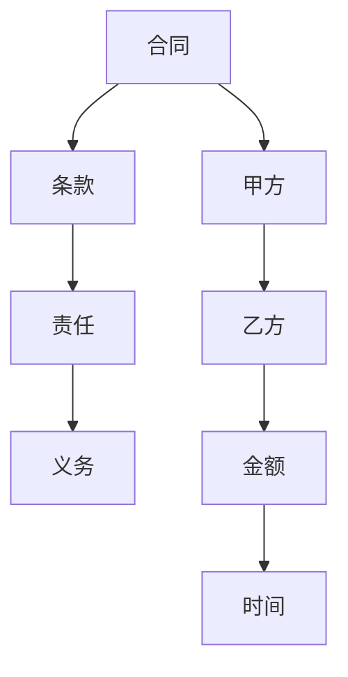
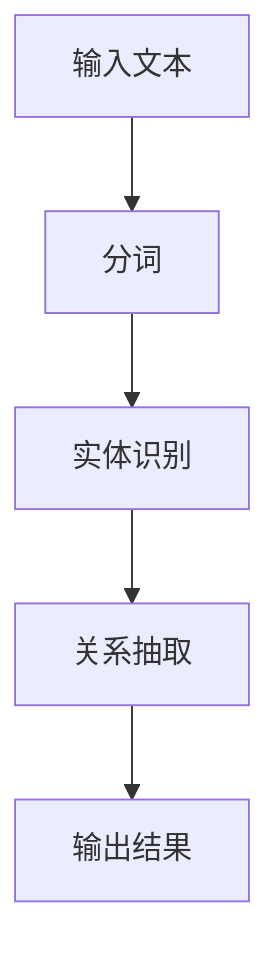
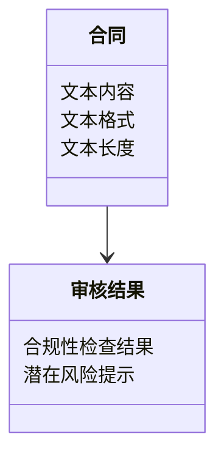
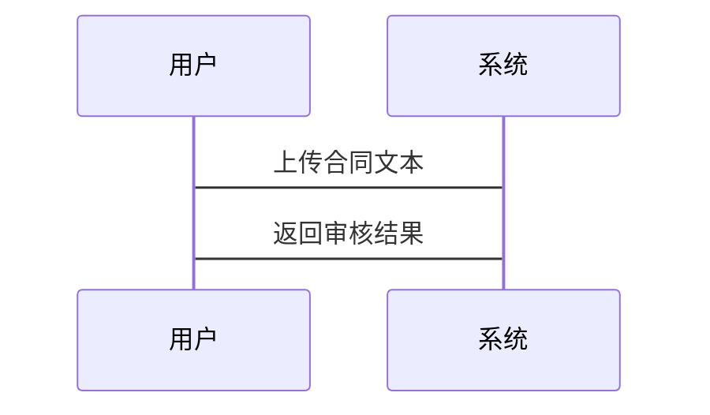

                 


# 构建基于NLP的金融合同自动化审核系统

> 关键词：NLP，金融合同，自动化审核，实体识别，关系抽取，深度学习

> 摘要：本文详细探讨了如何利用自然语言处理技术构建一个高效的金融合同自动化审核系统。从问题背景到核心概念，从算法原理到系统架构，再到项目实战，全面解析了系统的设计与实现过程。通过本文，读者可以深入了解NLP技术在金融领域的应用，掌握构建类似系统的关键技术与方法。

---

## 第一部分: 金融合同审核系统背景与核心概念

### 第1章: 问题背景与需求分析

#### 1.1 问题背景

##### 1.1.1 金融合同审核的痛点
在金融领域，合同审核是一项复杂且耗时的任务。传统的人工审核方式存在以下痛点：
- **效率低**：人工审核需要逐字逐句检查，耗时长，容易出错。
- **一致性差**：不同审核人员对合同条款的理解可能存在差异，导致审核结果不一致。
- **成本高**：需要大量专业人员参与，企业运营成本高。
- **风险高**：遗漏关键条款可能导致法律纠纷。

##### 1.1.2 传统审核方式的局限性
传统的合同审核方式依赖人工检查，主要局限性包括：
- **主观性**：审核结果受审核人员经验、知识和判断的影响。
- **效率低下**：人工审核难以应对海量合同的审核需求。
- **可扩展性差**：难以快速响应业务增长带来的合同审核需求。

##### 1.1.3 自动化审核的必要性
随着金融业务的快速发展，合同数量激增，人工审核已无法满足需求。自动化审核系统能够显著提高效率、降低成本、减少人为错误，并确保审核结果的一致性。

#### 1.2 问题描述

##### 1.2.1 合同审核的关键环节
合同审核的关键环节包括：
1. **合同条款识别**：识别合同中的关键条款，如金额、时间、责任等。
2. **条款合规性检查**：检查合同条款是否符合相关法律法规。
3. **潜在风险识别**：识别合同中可能存在的法律风险或漏洞。

##### 1.2.2 审核中的常见问题
- **术语歧义**：合同中的某些术语可能存在多种解释。
- **条款遗漏**：人工审核容易遗漏关键条款。
- **复杂性**：金融合同通常包含复杂的法律术语和条款。

##### 1.2.3 自动化审核的目标
自动化审核的目标是通过技术手段实现合同审核的自动化、智能化和高效化，减少人为错误，降低审核成本，提高审核效率。

#### 1.3 问题解决思路

##### 1.3.1 NLP技术在合同审核中的应用
自然语言处理（NLP）技术能够帮助系统理解合同文本的语义，识别关键信息，从而辅助审核工作。

##### 1.3.2 自动化审核的实现路径
- **数据采集**：收集大量金融合同文本。
- **数据预处理**：清洗和标注数据。
- **模型训练**：基于NLP技术训练合同审核模型。
- **系统集成**：将模型集成到审核系统中，实现自动化审核。

##### 1.3.3 系统设计的核心要素
- **数据源**：高质量的金融合同文本数据。
- **模型算法**：高效的NLP算法和模型。
- **系统架构**：合理的系统架构设计。

#### 1.4 系统边界与外延

##### 1.4.1 系统功能边界
系统的核心功能包括：
1. **合同文本上传**：支持多种格式的合同文本上传。
2. **自动审核**：基于NLP技术自动识别合同中的关键信息。
3. **结果输出**：生成审核报告，包括合规性检查结果和潜在风险提示。

##### 1.4.2 系统与外部系统的交互
系统可能需要与以下外部系统进行交互：
- **数据库**：存储合同文本和审核结果。
- **用户界面**：提供给用户使用的界面。
- **第三方服务**：如法律知识库、API接口等。

##### 1.4.3 系统的可扩展性与灵活性
系统设计应具备良好的扩展性和灵活性，能够根据业务需求快速调整和优化。

#### 1.5 核心概念结构

##### 1.5.1 系统组成模块
系统主要由以下模块组成：
1. **数据采集模块**：负责收集合同文本数据。
2. **数据预处理模块**：对数据进行清洗和标注。
3. **模型训练模块**：基于NLP技术训练合同审核模型。
4. **系统集成模块**：将模型集成到审核系统中，实现自动化审核。

##### 1.5.2 模块之间的关系
模块之间的关系如下：
- 数据采集模块将合同文本传输给数据预处理模块。
- 数据预处理模块将处理后的数据传输给模型训练模块。
- 模型训练模块将训练好的模型传输给系统集成模块，集成到审核系统中。

##### 1.5.3 核心要素的定义与属性
核心要素包括：
- **合同文本**：文本内容、文本格式、文本长度。
- **审核模型**：模型类型、模型参数、模型性能。

### 第2章: 核心概念与原理

#### 2.1 NLP技术原理

##### 2.1.1 自然语言处理的基本概念
自然语言处理（NLP）是计算机科学领域中的一个重要分支，旨在让计算机能够理解、生成和操作人类语言。

##### 2.1.2 金融合同审核中的NLP应用
在金融合同审核中，NLP技术主要用于以下方面：
- **关键词提取**：识别合同中的关键词，如金额、时间等。
- **实体识别**：识别合同中的实体，如公司名称、人名等。
- **关系抽取**：识别合同中的实体之间的关系。

##### 2.1.3 NLP技术的核心算法
NLP技术的核心算法包括：
1. **分词算法**：将文本分割成词语或短语。
2. **实体识别算法**：识别文本中的实体。
3. **关系抽取算法**：识别实体之间的关系。

#### 2.2 实体识别与关系抽取

##### 2.2.1 实体识别的定义与实现
实体识别是指从文本中识别出具有特定意义的实体，如人名、地名、组织名等。

##### 2.2.2 关系抽取的原理与方法
关系抽取是指从文本中识别出实体之间的关系，如“甲方向乙方支付金额”。

##### 2.2.3 实体与关系在合同审核中的应用
在金融合同审核中，实体识别和关系抽取可以帮助系统自动识别合同中的关键信息，如甲方、乙方、金额等。

#### 2.3 基于规则的合同审核

##### 2.3.1 规则的制定与优化
基于规则的合同审核通过制定一系列规则来实现合同审核，例如：
- 如果合同中包含“违约金”关键词，则标记为风险项。

##### 2.3.2 规则在合同审核中的应用
基于规则的合同审核适用于规则明确的场景，例如识别合同中的标准条款。

##### 2.3.3 规则与模型的结合
将规则与模型结合可以提高审核的准确性和效率。

#### 2.4 基于深度学习的合同审核

##### 2.4.1 深度学习在NLP中的应用
深度学习在NLP中的应用包括词嵌入、序列标注、文本分类等。

##### 2.4.2 常见深度学习模型在合同审核中的应用
常用的深度学习模型包括RNN、LSTM、Transformer等。

##### 2.4.3 深度学习模型的优缺点
- **优点**：能够捕捉到复杂的语义信息，适合处理复杂的文本数据。
- **缺点**：需要大量的训练数据，计算资源消耗较大。

#### 2.5 系统核心概念的ER实体关系图



---

## 第二部分: 算法原理与实现

### 第3章: 算法原理与实现

#### 3.1 分词算法

##### 3.1.1 基于规则的分词算法
基于规则的分词算法通过预定义的分词规则将文本分割成词语或短语。

##### 3.1.2 基于统计的分词算法
基于统计的分词算法通过统计词语出现的频率来实现分词，例如最大概率法。

##### 3.1.3 基于深度学习的分词算法
基于深度学习的分词算法使用神经网络模型，如LSTM和Transformer，进行分词。

#### 3.2 实体识别算法

##### 3.2.1 基于CRF的实体识别
条件随机场（CRF）是一种常用的实体识别算法，能够有效地捕捉上下文信息。

##### 3.2.2 基于RNN的实体识别
循环神经网络（RNN）可以用于序列标注任务，如实体识别。

##### 3.2.3 基于Transformer的实体识别
基于Transformer的实体识别算法利用自注意力机制，能够捕捉到更长距离的依赖关系。

#### 3.3 关系抽取算法

##### 3.3.1 基于句法分析的关系抽取
句法分析可以帮助识别句子的结构，从而辅助关系抽取。

##### 3.3.2 基于表示学习的关系抽取
表示学习通过将实体表示为向量，计算实体之间的相似性，从而进行关系抽取。

##### 3.3.3 基于规则的关系抽取
基于规则的关系抽取通过预定义的规则来识别实体之间的关系。

#### 3.4 算法流程图



#### 3.5 数学模型与公式

##### 3.5.1 基于条件随机场的实体识别公式
$$P(y|x) = \frac{1}{Z} \exp(\sum_{i=1}^n \theta y_i x_i)$$

##### 3.5.2 基于Transform的实体识别公式
$$\text{Encoder} = \text{Transformer}(x)$$
$$\text{Decoder} = \text{Transformer}(\text{Encoder})$$

---

## 第三部分: 系统分析与架构设计

### 第4章: 系统分析与架构设计

#### 4.1 问题场景介绍
系统需要解决金融合同审核效率低、成本高、风险高等问题。

#### 4.2 项目介绍
本项目旨在构建一个基于NLP的金融合同自动化审核系统。

#### 4.3 系统功能设计

##### 4.3.1 领域模型图



#### 4.4 系统架构设计

##### 4.4.1 系统架构图


#### 4.5 系统接口设计

##### 4.5.1 API接口设计
- **输入接口**：支持多种格式的合同文本上传。
- **输出接口**：返回审核结果，包括合规性检查结果和潜在风险提示。

#### 4.6 系统交互设计

##### 4.6.1 交互流程图



---

## 第四部分: 项目实战

### 第5章: 项目实战

#### 5.1 环境安装

##### 5.1.1 Python环境
安装Python 3.8或更高版本。

##### 5.1.2 依赖安装
使用pip安装以下依赖：
- `nltk`：自然语言处理库。
- `spaCy`：高性能NLP库。
- `transformers`：深度学习模型库。

#### 5.2 系统核心实现源代码

##### 5.2.1 分词代码
```python
import spacy

nlp = spacy.load("en_core_web_sm")
text = "This is a sample contract."
doc = nlp(text)
for token in doc:
    print(token.text)
```

##### 5.2.2 实体识别代码
```python
import spacy

nlp = spacy.load("en_core_web_sm")
text = "Apple sells iPhone to Google."
doc = nlp(text)
for ent in doc.ents:
    print(ent.text, ent.label_)
```

##### 5.2.3 关系抽取代码
```python
from transformers import pipeline

nlp = pipeline("ner")
text = "Apple sells iPhone to Google."
result = nlp(text)
print(result)
```

#### 5.3 代码应用解读与分析
- **分词代码**：使用spaCy进行分词，输出文本中的词语。
- **实体识别代码**：使用spaCy进行实体识别，输出文本中的实体及其标签。
- **关系抽取代码**：使用Transformers进行关系抽取，输出文本中的实体及其关系。

#### 5.4 实际案例分析与详细讲解剖析
以一份简单的金融合同为例，展示系统如何进行审核。

#### 5.5 项目小结
通过本项目的实现，我们可以看到NLP技术在金融合同审核中的巨大潜力。

---

## 第五部分: 总结与展望

### 第6章: 总结与展望

#### 6.1 最佳实践 Tips
- **数据质量**：确保数据的高质量，以提高模型的准确率。
- **模型优化**：不断优化模型，以提高审核的效率和准确率。
- **系统维护**：定期更新模型和规则，以适应法律法规的变化。

#### 6.2 小结
通过本文的详细讲解，读者可以深入了解如何构建一个基于NLP的金融合同自动化审核系统。

#### 6.3 注意事项
- **数据隐私**：注意保护合同文本的隐私。
- **模型选择**：根据具体需求选择合适的模型。
- **系统性能**：优化系统性能，提高审核效率。

#### 6.4 拓展阅读
建议读者进一步阅读以下内容：
- 《自然语言处理入门》
- 《深度学习与NLP》
- 《金融合同审核系统设计》

---

## 作者信息

作者：AI天才研究院/AI Genius Institute & 禅与计算机程序设计艺术/Zen And The Art of Computer Programming

---

通过以上思考步骤，我们可以逐步构建一个基于NLP的金融合同自动化审核系统。从问题背景到系统实现，每一步都需要仔细分析和设计，确保系统的高效性和准确性。

