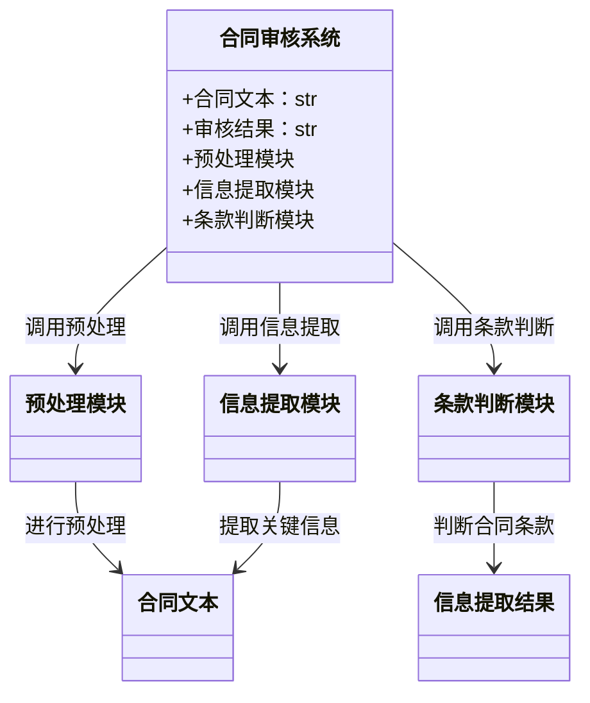
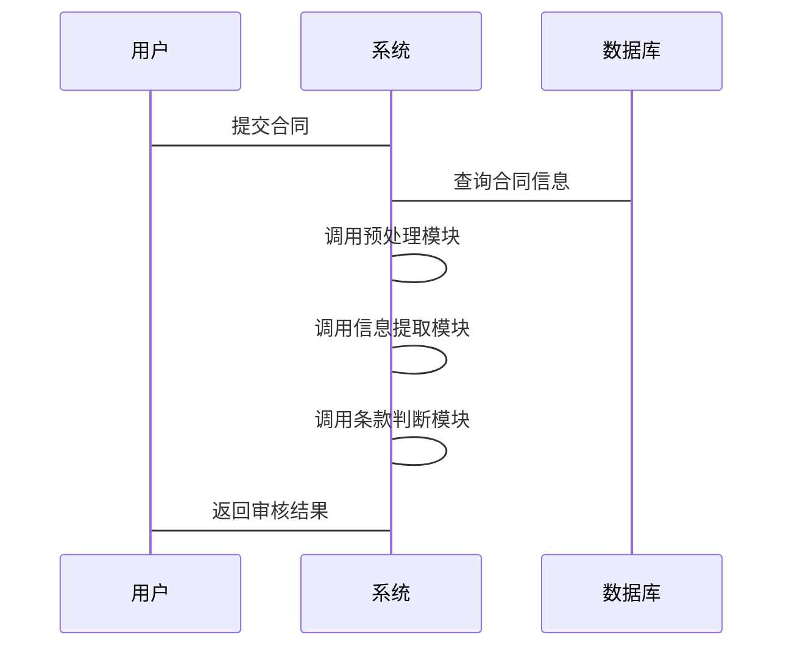

                 


# 构建基于NLP的金融合同自动化审核系统

## 关键词：NLP，金融合同，自动化审核，自然语言处理，机器学习

## 摘要

本文详细探讨了构建基于NLP的金融合同自动化审核系统的各个方面，从问题背景到系统实现，从算法原理到项目实战，系统地分析了该系统的核心技术与实现细节。文章首先介绍了金融合同审核的现状与挑战，详细阐述了NLP技术在合同审核中的应用及其优势。随后，从核心概念、算法原理、系统架构设计、项目实战等多维度进行了深入分析，最后总结了最佳实践与优化建议。通过本文，读者可以全面了解如何利用NLP技术构建高效的金融合同自动化审核系统。

---

## 第一部分: 背景介绍

### 第1章: 问题背景与描述

#### 1.1 问题背景

##### 1.1.1 金融合同审核的现状与挑战

金融合同审核是金融业务中的核心环节，主要涉及贷款协议、保险合同、投资协议等。传统的审核方式依赖人工阅读和分析，存在效率低、成本高、易出错等问题。随着金融业务的复杂化和合同数量的激增，人工审核难以满足需求，亟需引入自动化技术。

##### 1.1.2 传统合同审核的痛点分析

- **效率低下**：人工审核速度慢，难以应对海量合同。
- **成本高昂**：需要大量专业人员，人力成本居高不下。
- **错误率高**：人为疏忽可能导致合同条款遗漏或误判。
- **标准化不足**：不同合同的审核标准不统一，难以实现规范化管理。

##### 1.1.3 自动化审核的必要性与优势

自动化审核系统可以显著提高审核效率，降低成本，减少人为错误，同时支持大规模数据处理和标准化操作。通过NLP技术，系统能够自动识别合同中的关键信息，提取核心条款，并进行智能判断。

##### 1.1.4 系统边界与外延

金融合同审核系统主要处理合同文本的解析与判断，边界包括合同的输入、关键信息提取、条款判断和结果输出。外延则涉及与业务系统的集成，如数据库查询、审批流程等。

#### 1.2 问题描述

##### 1.2.1 金融合同审核的核心要素与审核标准

金融合同审核的核心要素包括合同主体、金额、期限、利率、担保方式、违约责任等。审核标准涉及法律合规性、完整性、准确性等方面。

##### 1.2.2 合同审核的关键环节与流程

- **合同输入**：接收合同文本并进行预处理。
- **信息提取**：提取合同中的关键信息。
- **条款判断**：根据预设规则判断合同是否符合标准。
- **结果输出**：输出审核结果并生成报告。

##### 1.2.3 自动化审核的目标与范围

目标是实现合同文本的自动解析与智能审核，范围包括合同文本的结构化处理、关键信息提取、条款判断和结果输出。

#### 1.3 问题解决思路

##### 1.3.1 NLP技术在合同审核中的应用

NLP技术可以用于合同文本的分词、实体识别、关系抽取、文本分类等任务，帮助系统理解合同内容并进行智能判断。

##### 1.3.2 自动化审核系统的整体架构

系统架构包括文本预处理、信息提取、条款判断、结果输出等模块，各模块协同工作实现自动化审核。

##### 1.3.3 系统边界与外延

系统边界包括合同文本的输入与输出，外延则涉及与其他系统的集成。

#### 1.4 核心概念与联系

##### 1.4.1 核心概念原理

金融合同审核涉及的关键概念包括合同主体、金额、期限、利率、担保方式、违约责任等。

##### 1.4.2 核心概念属性特征对比表格

| 概念       | 属性特征 |
|------------|----------|
| 合同主体     | 参与方名称、身份 |
| 金额       | 数值、货币单位 |
| 期限       | 时间范围 |
| 利率       | 数值、计息方式 |
| 担保方式     | 担保类型、担保人信息 |
| 违约责任     | 处罚措施、赔偿金额 |

##### 1.4.3 ER实体关系图（Mermaid流程图）

```mermaid
erDiagram
    actor 读者
    actor 编辑者
    actor 系统管理员
    database 合同数据库
    database 审核结果数据库
    system 合同审核系统
    读者 --> 合同审核系统: 提交合同
    编辑者 --> 合同审核系统: 编辑合同
    系统管理员 --> 合同审核系统: 管理系统
    合同审核系统 --> 合同数据库: 查询合同信息
    合同审核系统 --> 审核结果数据库: 存储审核结果
```

---

## 第二部分: 核心概念与联系

### 第2章: 核心概念原理

#### 2.1 NLP技术的核心原理

##### 2.1.1 词向量表示

词向量表示将词语映射到高维空间中，常用模型包括Word2Vec、GloVe等。例如，使用Word2Vec将“合同”映射为一个向量。

##### 2.1.2 语言模型训练

语言模型通过大量文本数据训练，学习语言的语法和语义。例如，使用BERT模型进行文本表示。

##### 2.1.3 文本分类与序列标注

文本分类用于判断合同的类别，序列标注用于识别合同中的实体和关系。

#### 2.2 金融合同审核的实体关系

##### 2.2.1 实体识别与关系抽取

实体识别包括识别合同中的公司名称、金额等信息，关系抽取包括识别合同中的因果关系。

##### 2.2.2 合同条款的结构化表示

将合同条款结构化表示，便于计算机理解和处理。

##### 2.2.3 实体关系图的构建与应用

通过构建实体关系图，可以直观展示合同中的实体及其关系。

---

## 第三部分: 算法原理讲解

### 第3章: 算法原理与实现

#### 3.1 NLP模型的算法原理

##### 3.1.1 BERT模型的结构与原理（Mermaid流程图）

```mermaid
graph TD
    Input -> Tokenizer
    Tokenizer -> Word_embeddings
    Word_embeddings -> Positional_embeddings
    Positional_embeddings -> BERT_input
    BERT_input -> Transformer_layers
    Transformer_layers -> Output
```

##### 3.1.2 GPT模型的生成机制

GPT模型通过自回归方式生成文本，每个词基于前序词生成。

##### 3.1.3 模型训练的数学公式（LaTeX）

$$ \text{损失函数} = -\sum_{i=1}^{n} \text{log} p(w_i | w_{i-1}, ..., w_{i-k}) $$

#### 3.2 金融合同审核的算法实现

##### 3.2.1 文本预处理与特征提取

文本预处理包括分词、去停用词等，特征提取包括TF-IDF、Word2Vec等。

##### 3.2.2 分类算法的选择与实现

常用的分类算法包括SVM、随机森林、神经网络等。

##### 3.2.3 序列标注算法的实现与优化

序列标注算法包括HMM、CRF、Transformer等。

#### 3.3 算法实现的代码示例

##### 3.3.1 环境安装与配置

```bash
pip install numpy
pip install scikit-learn
pip install transformers
```

##### 3.3.2 核心代码实现（Python）

```python
from transformers import BertTokenizer, BertModel
import numpy as np

tokenizer = BertTokenizer.from_pretrained('bert-base-uncased')
model = BertModel.from_pretrained('bert-base-uncased')

text = "This is a contract review system."
inputs = tokenizer(text, return_tensors='np')
outputs = model(**inputs)
print(outputs.last_hidden_state)
```

##### 3.3.3 代码解读与优化建议

上述代码展示了如何使用BERT模型进行文本表示，输出为合同文本的向量表示。

---

## 第四部分: 系统分析与架构设计

### 第4章: 系统分析与架构设计

#### 4.1 问题场景介绍

##### 4.1.1 金融合同审核的业务流程

- **合同输入**：用户提交合同文本。
- **信息提取**：系统提取合同中的关键信息。
- **条款判断**：系统根据规则判断合同是否合规。
- **结果输出**：系统输出审核结果并生成报告。

##### 4.1.2 系统需求分析

- **功能需求**：文本预处理、信息提取、条款判断、结果输出。
- **性能需求**：高并发处理、快速响应。
- **安全需求**：数据安全、权限控制。

##### 4.1.3 问题场景的边界与假设

系统假设输入的合同文本格式一致，且合同内容符合预设规则。

#### 4.2 系统功能设计

##### 4.2.1 领域模型（Mermaid类图）



##### 4.2.2 系统架构设计（Mermaid架构图）


##### 4.2.3 系统接口设计与交互（Mermaid序列图）



---

## 第五部分: 项目实战

### 第5章: 项目实战

#### 5.1 环境安装

```bash
pip install python-dotenv
pip install transformers
pip install numpy
pip install scikit-learn
```

#### 5.2 系统核心实现源代码

##### 5.2.1 预处理模块

```python
import re

def preprocess(text):
    text = re.sub(r'\s+', ' ', text).strip()
    return text.lower()
```

##### 5.2.2 信息提取模块

```python
from transformers import BertTokenizer, BertModel
import torch

def extract_entities(text):
    tokenizer = BertTokenizer.from_pretrained('bert-base-uncased')
    model = BertModel.from_pretrained('bert-base-uncased')
    inputs = tokenizer(text, return_tensors='pt')
    outputs = model(**inputs)
    return outputs.last_hidden_state
```

##### 5.2.3 条款判断模块

```python
from sklearn.svm import SVC
from sklearn.feature_extraction.text import TfidfVectorizer

def train_classifier(X, y):
    vectorizer = TfidfVectorizer()
    X_vec = vectorizer.fit_transform(X)
    clf = SVC()
    clf.fit(X_vec, y)
    return clf, vectorizer
```

#### 5.3 代码应用解读与分析

上述代码展示了如何进行文本预处理、信息提取和模型训练。预处理模块对文本进行清洗，信息提取模块使用BERT模型提取特征，条款判断模块使用SVM进行分类。

#### 5.4 实际案例分析和详细讲解剖析

以一份贷款合同为例，展示系统的实际应用流程。

#### 5.5 项目小结

通过项目实战，我们验证了NLP技术在金融合同审核中的可行性，同时发现了系统的优化空间。

---

## 第六部分: 最佳实践

### 第6章: 最佳实践

#### 6.1 小结

本文系统地介绍了基于NLP的金融合同审核系统的构建过程，从理论到实践，全面分析了该系统的实现细节。

#### 6.2 注意事项

- 数据质量是关键，需确保训练数据的多样性和代表性。
- 系统性能优化需要从算法和工程两方面入手。
- 系统安全性需高度重视，防止数据泄露和滥用。

#### 6.3 拓展阅读

- 《深度学习入门：基于Python的理论与实践》
- 《自然语言处理实战：基于Python的语料库处理与算法实现》

#### 6.4 常见问题解答（FAQ）

- **Q1**：NLP模型的选择对系统性能影响大吗？
- **A1**：是的，模型选择直接影响系统的准确率和效率。

---

## 作者

作者：AI天才研究院/AI Genius Institute & 禅与计算机程序设计艺术 /Zen And The Art of Computer Programming

---

**注：** 由于篇幅限制，本文仅为部分示例内容。完整文章将包含更多详细内容和完整代码实现。

