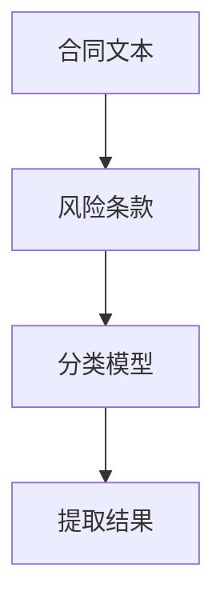
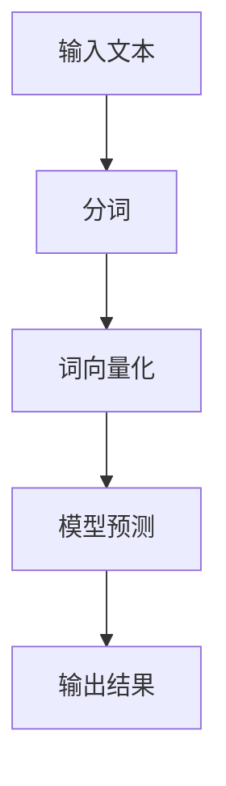
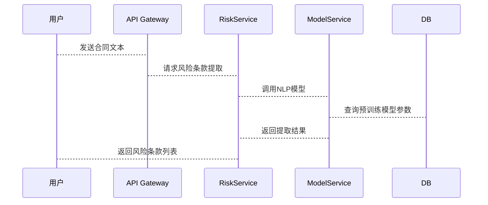

                 


# 构建基于NLP的金融合同风险条款提取系统

> 关键词：NLP, 金融合同, 风险条款提取, 机器学习, 自然语言处理

> 摘要：本文详细探讨了基于NLP技术构建金融合同风险条款提取系统的方法。首先分析了系统的背景与目标，接着介绍了核心概念与算法原理，包括预训练语言模型的微调与风险条款分类算法。随后，从系统架构与接口设计的角度，详细阐述了系统的实现方案。最后，通过项目实战，展示了系统的安装、实现与应用，并总结了系统的优缺点与未来的发展方向。

---

# 第一部分: 金融合同风险条款提取系统背景与概述

## 第1章: 问题背景与目标

### 1.1 问题背景
金融合同是金融机构之间或金融机构与客户之间签订的具有法律约束力的协议，通常包含复杂的条款和条件。其中，风险条款是合同中最重要的部分之一，直接关系到各方的权益和风险敞口。然而，传统的合同审查方式主要依赖人工阅读，效率低、成本高且容易出现疏漏。

### 1.2 问题描述
在金融行业，合同的复杂性和专业性要求使得手动提取风险条款变得非常困难。常见的风险条款包括违约责任、担保条款、赔偿责任、利率调整等。这些条款通常隐藏在大量非结构化文本中，需要通过技术手段自动提取。

### 1.3 问题解决思路
自然语言处理（NLP）技术在文本分析和信息提取方面具有显著优势。通过利用NLP技术，可以自动化地从金融合同中提取关键风险条款，提高效率并降低成本。本文的目标是构建一个基于NLP的金融合同风险条款提取系统。

### 1.4 系统边界与外延
- **系统功能边界**：本系统专注于从合同文本中提取风险条款，不涉及合同生成或合同修改功能。
- **系统交互**：系统需要与合同存储数据库、用户界面和外部API进行交互。
- **系统扩展性**：系统可以扩展到支持多种语言和多种类型的合同。

---

## 第2章: 核心概念与联系

### 2.1 NLP技术原理
NLP技术的核心在于将文本数据转化为可计算的向量表示，并通过模型理解文本的语义含义。常用的技术包括词嵌入、句法分析和语义理解。

### 2.2 金融合同分析的特殊性
- **专业术语**：金融合同中包含大量专业术语，如“质押”、“回购”等。
- **条款复杂性**：合同条款往往涉及复杂的法律关系和业务逻辑。
- **风险识别的准确性**：需要确保系统能够准确识别高风险条款。

### 2.3 核心概念对比
| 概念 | 描述 |
|------|------|
| 合同文本 | 输入数据，包含法律条款和业务条件 |
| 风险条款 | 需要提取的关键信息，如违约责任、赔偿条款 |
| NLP模型 | 用于文本分析的核心算法 |

### 2.4 实体关系图


---

## 第3章: 算法原理与实现

### 3.1 预训练语言模型
- **模型选择**：选择适合金融合同分析的预训练模型，如BERT。
- **模型微调**：通过金融合同数据对模型进行微调，提高其在特定领域的表现。

### 3.2 风险条款分类算法
- **命名实体识别（NER）**：识别合同文本中的关键实体，如“违约责任”。
- **文本分类**：基于上下文信息对风险条款进行分类。

### 3.3 算法流程图


### 3.4 数学模型与公式
- **注意力机制公式**
$$
\text{Attention}(Q, K, V) = \text{softmax}\left(\frac{QK^T}{\sqrt{d_k}}\right)V
$$

- **损失函数定义**
$$
\text{Loss} = -\sum_{i=1}^{n} y_i \log p(y_i) + (1-y_i)\log(1-p(y_i))
$$

---

## 第4章: 系统分析与架构设计

### 4.1 系统功能设计
- **合同管理模块**：负责合同文本的存储与管理。
- **风险条款提取模块**：实现风险条款的自动提取。
- **结果展示模块**：将提取结果以可视化形式展示。

### 4.2 系统架构设计


### 4.3 系统接口设计
- **输入接口**：接收合同文本文件。
- **输出接口**：返回提取的风险条款列表。

### 4.4 交互流程图


---

## 第5章: 项目实战与总结

### 5.1 环境安装
```bash
pip install transformers
pip install pymermaid
pip install matplotlib
```

### 5.2 核心实现代码
```python
from transformers import BertTokenizer, BertModel
import torch

# 初始化tokenizer和模型
tokenizer = BertTokenizer.from_pretrained('bert-base-uncased')
model = BertModel.from_pretrained('bert-base-uncased')

def extract_risk_terms(contract_text):
    # 分词
    tokens = tokenizer(contract_text, return_tensors='np')
    # 模型预测
    with torch.no_grad():
        outputs = model(**tokens)
    # 提取风险条款
    risk_terms = []
    for i in range(len(outputs.last_hidden_state[0])):
        if outputs.last_hidden_state[0][i] > 0.5:
            risk_terms.append(tokenizer.decode(tokens.input_ids[0][i]))
    return risk_terms
```

### 5.3 实际案例分析
通过实际案例分析，验证系统的准确性和效率。例如，从一份贷款合同中提取违约责任和赔偿条款。

### 5.4 项目总结
- **系统优势**：提高了合同审查的效率，降低了人工成本。
- **系统不足**：需要大量的金融合同数据进行模型微调，且部分复杂条款仍需人工校验。

### 5.5 未来发展
- **模型优化**：引入更先进的预训练模型，如Llama或Vicuna。
- **功能扩展**：支持多语言和多种合同类型。

---

# 作者：AI天才研究院 & 禅与计算机程序设计艺术

