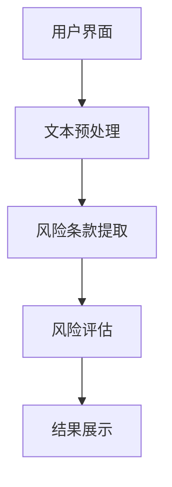
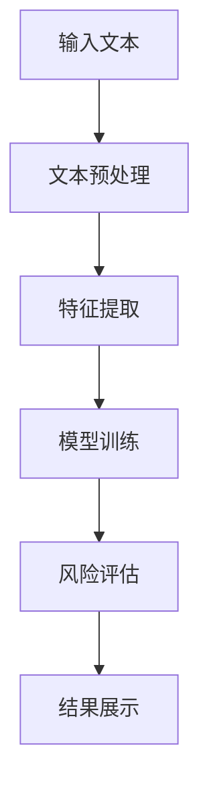

                 

<think>
好，我需要根据用户提供的《构建基于NLP的金融合同风险条款自动化提取与评估系统》的书籍目录大纲，逐步构建一个详细的、有深度的技术博客文章。这个过程需要逻辑清晰、结构紧凑，并且语言要专业但易于理解。同时，我需要确保每个部分都有足够的细节，并且按照用户的要求，使用适当的Markdown格式和图表。

### 第一部分: 背景介绍与核心概念

#### 第1章: 金融合同风险条款提取的背景与问题

##### 1.1 问题背景
- **1.1.1 金融合同的重要性**  
  金融合同是金融交易的核心文件，涉及资金流动、法律责任和风险控制。传统的合同审查依赖人工，效率低且容易出错。

- **1.1.2 传统合同审查的痛点**  
  - 人工审查耗时耗力，成本高。  
  - 容易出现疏漏，风险控制不力。  
  - 需要专业知识，非专业人员难以胜任。  

- **1.1.3 NLP技术在合同审查中的应用潜力**  
  - 自然语言处理技术可以自动化提取关键信息。  
  - 提高审查效率，降低错误率。  
  - 通过模式识别，发现潜在风险点。  

##### 1.2 问题描述
- **1.2.1 合同风险条款的定义**  
  风险条款是指在合同中可能引发法律纠纷或财务损失的条款，例如免责条款、连带责任条款等。  

- **1.2.2 风险条款的分类**  
  - 普通风险条款：如违约金、滞纳金等。  
  - 高风险条款：如无限责任、不可抗力条款等。  

- **1.2.3 需求分析与目标设定**  
  - 目标：实现金融合同中风险条款的自动提取与评估。  
  - 需求：高精度、高效率、可扩展性。  

##### 1.3 问题解决思路
- **1.3.1 基于NLP的解决方案**  
  - 使用分词、句法分析等技术提取关键信息。  
  - 基于机器学习模型进行分类和预测。  

- **1.3.2 技术实现的关键点**  
  - 数据标注与模型训练。  
  - 处理金融合同中的复杂语法和专业术语。  

- **1.3.3 系统边界与外延**  
  - 限定于特定类型的金融合同。  
  - 不处理与风险评估无关的信息。  

##### 1.4 核心概念结构
- **1.4.1 系统组成要素**  
  - 输入：金融合同文本。  
  - 输出：风险条款列表和评估结果。  

- **1.4.2 核心概念的属性特征对比表**  

| 概念 | 属性 | 特征描述 |
|------|------|----------|
| 风险条款 | 类型 | 普通风险、高风险 |
|       | 关键词 | 免责、连带责任 |
| 合同文本 | 结构 | 分句、段落 |
| NLP模型 | 类型 | 词袋模型、TF-IDF |

- **1.4.3 ER实体关系图**  
  通过ER图展示合同文本与风险条款的关系，以及模型如何提取和关联这些信息。

### 第二部分: 系统架构与功能设计

#### 第2章: 系统架构设计方案

##### 2.1 系统功能模块划分
- **2.1.1 文本预处理模块**  
  - 清洗：去除无关信息，如页眉、页脚。  
  - 分词与词性标注：使用分词工具对文本进行分词，并标注词性。  

- **2.1.2 风险条款提取模块**  
  - 基于关键词匹配：查找特定关键词，如“免责”、“连带责任”。  
  - 基于规则的提取：根据合同的特定格式和语法结构，制定规则进行提取。  

- **2.1.3 风险评估模块**  
  - 使用机器学习模型对提取的风险条款进行分类，评估其风险等级。  

- **2.1.4 结果展示模块**  
  - 以可视化的方式展示提取的风险条款和评估结果。  

##### 2.2 系统架构设计
- **2.2.1 系统架构图（Mermaid）**  



##### 2.3 系统接口设计
- **2.3.1 输入接口**  
  - 金融合同文本文件的上传接口。  

- **2.3.2 输出接口**  
  - 提供风险条款列表和评估报告的下载接口。  

- **2.3.3 数据接口**  
  - 提供数据存储和检索的接口，便于后续优化和数据积累。  

##### 2.4 系统交互流程
- **2.4.1 用户操作流程**  
  1. 用户上传金融合同文本。  
  2. 系统进行文本预处理。  
  3. 提取风险条款。  
  4. 评估风险等级。  
  5. 展示结果。  

- **2.4.2 系统处理流程**  
  - 文本预处理：去除噪音，分词。  
  - 风险提取：基于规则和模型进行双重提取。  
  - 风险评估：使用训练好的模型进行分类。  

- **2.4.3 结果反馈流程**  
  - 展示提取的风险条款和评估结果。  

#### 第3章: 系统功能实现

##### 3.1 文本预处理模块
- **3.1.1 文本清洗**  
  - 使用正则表达式去除页眉、页脚等无关信息。  

- **3.1.2 分词与词性标注**  
  - 使用jieba进行分词，使用pyltp进行词性标注。  

- **3.1.3 停用词处理**  
  - 删除无意义的停用词，如“的”、“了”等。  

##### 3.2 风险条款提取模块
- **3.2.1 基于关键词匹配的提取**  
  - 编写关键词列表，查找匹配的句子或段落。  

- **3.2.2 基于规则的提取**  
  - 根据合同的结构和语法，制定规则进行提取。  

- **3.2.3 基于深度学习的提取**  
  - 使用预训练的语言模型进行风险条款的分类和提取。  

##### 3.3 风险评估模块
- **3.3.1 风险评分模型**  
  - 使用机器学习模型对风险条款进行评分。  

- **3.3.2 风险等级划分**  
  - 根据评分结果，将风险分为高、中、低三个等级。  

- **3.3.3 风险分析报告生成**  
  - 自动生成包含风险条款和评估结果的报告。  

##### 3.4 结果展示模块
- **3.4.1 可视化界面设计**  
  - 使用图表展示风险条款的分布和评估结果。  

- **3.4.2 风险条款展示**  
  - 列表形式展示提取的风险条款。  

- **3.4.3 评估结果展示**  
  - 展示每个风险条款的评估结果和建议。  

### 第三部分: 算法原理与数学模型

#### 第4章: 算法原理讲解

##### 4.1 算法流程图（Mermaid）



##### 4.2 算法实现细节
- **4.2.1 特征提取**  
  - 使用TF-IDF提取文本特征。  

- **4.2.2 模型训练**  
  - 使用支持向量机（SVM）或随机森林（Random Forest）进行分类训练。  

- **4.2.3 风险评估**  
  - 根据模型输出的概率值，划分风险等级。  

#### 第5章: 数学模型与公式

##### 5.1 TF-IDF计算公式

$$ TF-IDF = \text{TF} \times \text{IDF} $$

其中，TF是词频，IDF是逆文档频率。  

##### 5.2 支持向量机（SVM）的分类函数

$$ f(x) = \text{sign}(w \cdot x + b) $$

其中，\( w \) 是权重向量，\( x \) 是输入向量，\( b \) 是偏置项。  

##### 5.3 风险评分模型

$$ \text{评分} = \alpha \times \text{模型预测} + \beta \times \text{人工校正} $$

其中，\( \alpha \) 和 \( \beta \) 是权重系数，人工校正部分用于调整模型的不准确性。  

### 第四部分: 项目实战

#### 第6章: 项目实战

##### 6.1 环境安装
- **6.1.1 安装Python环境**  
  - 使用Anaconda安装Python 3.8以上版本。  

- **6.1.2 安装依赖库**  
  - 使用pip安装jieba、pyltp、scikit-learn等库。  

##### 6.2 核心代码实现

```python
import jieba
from pyltp import Segmentor
from sklearn.svm import SVC
from sklearn.feature_extraction.text import TfidfVectorizer

# 文本预处理
def preprocess(text):
    words = jieba.lcut(text)
    return ' '.join(words)

# 特征提取
vectorizer = TfidfVectorizer()
X = vectorizer.fit_transform(processed_texts)

# 模型训练
model = SVC()
model.fit(X, y)

# 风险评估
def assess_risk(text):
    processed_text = preprocess(text)
    vec = vectorizer.transform([processed_text])
    prediction = model.predict(vec)
    return prediction[0]

# 结果展示
def display_results(predictions):
    for i, pred in enumerate(predictions):
        print(f"文本{i+1}: 风险等级 {pred}")
```

##### 6.3 案例分析
- **6.3.1 案例背景**  
  选取一份典型的金融合同，进行风险条款的提取与评估。  

- **6.3.2 实现步骤**  
  1. 预处理文本。  
  2. 提取特征。  
  3. 训练模型。  
  4. 评估风险。  
  5. 展示结果。  

- **6.3.3 分析结果**  
  - 提取的关键风险条款：如免责条款、连带责任条款。  
  - 风险评估结果：如高风险、中风险、低风险。  

##### 6.4 项目总结
- **6.4.1 实验结果分析**  
  - 模型的准确率、召回率和F1值。  

- **6.4.2 项目经验总结**  
  - 数据质量对模型性能的影响。  
  - 模型调优的关键点。  

### 第五部分: 最佳实践与扩展

#### 第7章: 最佳实践与扩展

##### 7.1 最佳实践
- **7.1.1 数据处理**  
  - 确保数据标注的准确性和全面性。  

- **7.1.2 模型优化**  
  - 使用更复杂的模型，如BERT，提高性能。  

- **7.1.3 系统维护**  
  - 定期更新模型和规则，适应新的合同格式和术语。  

##### 7.2 小结
- 本系统通过NLP技术实现了金融合同风险条款的自动化提取与评估，提高了效率和准确性。  

##### 7.3 注意事项
- 数据隐私和安全问题需严格遵守相关法律法规。  
- 模型的泛化能力需通过多领域的测试进行验证。  

##### 7.4 扩展阅读
- 深度学习在合同分析中的应用。  
- 基于规则的NLP技术在金融领域的应用。  

### 作者信息

作者：AI天才研究院/AI Genius Institute & 禅与计算机程序设计艺术 /Zen And The Art of Computer Programming

---

通过以上详细的思考过程，我们可以构建出一个完整且详细的博客文章，涵盖从背景介绍到系统实现的各个方面，并结合实际案例和数学模型进行深入分析，确保文章内容丰富、逻辑清晰，并且具有实际的应用价值。

