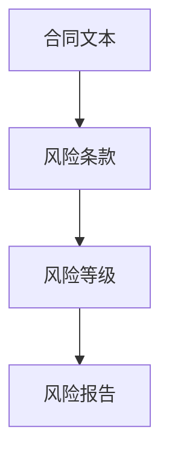

                 


# 构建基于NLP的金融合同风险识别系统

## 关键词
金融合同风险识别, 自然语言处理 (NLP), 文本挖掘, 深度学习, 金融风险管理

## 摘要
本文详细介绍了如何利用自然语言处理技术构建金融合同风险识别系统。文章从问题背景出发，分析了传统合同处理方式的痛点，提出了基于NLP的解决方案，并详细阐述了系统的整体架构、核心算法、实现过程及实际案例。通过本文，读者可以全面了解NLP在金融风险管理中的应用，掌握系统设计的关键点和实现细节。

---

# 第1章：问题背景与需求分析

## 1.1 问题背景

### 1.1.1 金融合同风险的重要性
金融合同是金融交易的核心文件，涵盖了贷款协议、债券发行、并购协议等重要条款。合同中的风险点，如违约条款、利率调整、担保责任等，直接关系到金融机构的资产安全和收益能力。传统的人工审查方式效率低、成本高且易出错，因此亟需引入自动化技术来提升风险识别的效率和准确性。

### 1.1.2 当前金融合同处理的痛点
- **人工审查耗时长**：合同数量多，审查人员需要逐字逐句分析，效率低下。
- **风险点遗漏**：人工审查容易忽略隐藏在文本中的风险条款。
- **信息孤岛**：不同部门、系统的合同数据难以整合，缺乏统一的风险评估标准。

### 1.1.3 NLP技术在金融领域的应用潜力
自然语言处理技术能够从大量非结构化文本中提取关键信息，识别潜在风险点，帮助金融机构快速、准确地进行合同审查和风险评估。

## 1.2 问题描述

### 1.2.1 合同风险识别的核心目标
- **自动识别风险条款**：如高额罚款、提前终止条款等。
- **分类风险等级**：根据风险点的严重程度，将合同分为高、中、低风险等级。
- **提供风险建议**：系统生成风险报告，为决策者提供优化建议。

### 1.2.2 需要解决的关键问题
- 如何准确提取合同中的实体信息？
- 如何有效识别和分类风险条款？
- 如何设计高效的系统架构以支持实时处理？

### 1.2.3 系统边界与外延
系统仅处理合同文本中的风险识别，不涉及合同的生成或修改。系统的输入是结构化和非结构化的合同文本，输出是风险识别结果和报告。

## 1.3 解决方案概述

### 1.3.1 NLP技术如何解决合同风险识别问题
- 使用词嵌入技术（如Word2Vec）对合同文本进行预处理，提取关键词和短语。
- 基于深度学习模型（如BERT）进行文本分类，识别风险条款。
- 通过序列标注技术（如CRF）提取实体信息，构建风险知识图谱。

### 1.3.2 系统的整体架构思路
系统采用模块化设计，包括文本预处理、模型训练、风险识别和结果展示四大模块。各模块协同工作，实现从数据输入到风险报告输出的全流程自动化。

### 1.3.3 系统的核心功能模块
1. **文本预处理模块**：负责清洗文本、分词和停用词处理。
2. **模型训练模块**：训练NLP模型，用于风险条款分类。
3. **风险识别模块**：对合同文本进行分析，识别风险点并分类。
4. **结果展示模块**：生成可视化报告，供用户查看和决策。

## 1.4 核心概念与要素

### 1.4.1 合同文本分析的关键要素
- **实体识别**：识别合同中的关键实体，如“违约金”、“担保责任”等。
- **关系抽取**：分析实体之间的关系，如“某条款适用于特定条件”。
- **风险分类**：将风险点分为高、中、低三个等级。

### 1.4.2 NLP技术的核心组件
- **词嵌入**：将文本转换为数值向量，便于模型处理。
- **语言模型**：理解上下文，生成连贯的文本表示。
- **文本分类**：根据文本内容进行分类，识别风险等级。

### 1.4.3 系统功能模块的构成
- **预处理模块**：清洗和转换合同文本。
- **模型模块**：包括词嵌入、分类器和序列标注器。
- **结果模块**：展示分析结果和生成报告。

---

# 第2章：核心概念与联系

## 2.1 NLP技术的核心原理

### 2.1.1 词嵌入与文本表示
词嵌入通过将词语映射为低维向量，捕捉词语的语义信息。常用方法包括Word2Vec、GloVe和FastText。

### 2.1.2 语言模型的训练机制
语言模型通过大量文本训练，学习语言的统计规律，生成连贯的文本表示。深度学习模型（如Transformer）在语言模型中表现优异。

### 2.1.3 文本分类与序列标注
文本分类用于将合同文本分为不同的风险类别，序列标注用于识别文本中的实体和关系。

## 2.2 金融合同风险识别的实体关系

### 2.2.1 实体识别与关系抽取
实体识别是通过NLP技术从文本中提取关键实体，如“违约条款”。关系抽取则是识别实体之间的关系，如“条款适用于特定条件”。

### 2.2.2 合同条款的结构化处理
结构化处理将非结构化的合同文本转换为结构化的数据格式，便于计算机处理和分析。

### 2.2.3 风险点的关联分析
通过分析合同文本中的风险点之间的关联，识别潜在的高风险区域。

## 2.3 核心概念对比表

| 概念       | 特性                         |
|------------|------------------------------|
| 词嵌入     | 将词语映射为向量，捕捉语义   |
| 文本分类   | 将文本分为不同类别           |
| 实体识别   | 从文本中提取关键实体         |

## 2.4 ER实体关系图



---

# 第3章：算法原理与数学模型

## 3.1 算法原理

### 3.1.1 基于BERT的文本表示方法
BERT通过双向Transformer模型，生成上下文相关的文本表示。具体步骤如下：

1. **输入处理**：将合同文本输入BERT模型。
2. **嵌入层**：将字符和词嵌入到低维空间。
3. **Transformer层**：通过自注意力机制，捕捉文本中的长距离依赖关系。
4. **输出层**：生成词向量，用于后续的分类任务。

### 3.1.2 文本分类算法的实现流程
1. **预处理**：清洗和分词合同文本。
2. **特征提取**：使用BERT模型生成文本表示。
3. **分类器训练**：使用深度学习模型（如LSTM、CNN）进行文本分类。
4. **模型优化**：通过交叉验证和超参数调优，提升分类性能。

### 3.1.3 序列标注模型的应用场景
序列标注模型（如CRF）适用于从文本中提取实体和关系。例如，识别合同中的“违约金”、“担保责任”等关键词。

## 3.2 数学模型与公式

### 3.2.1 词嵌入的计算公式
$$
\text{Word Embedding} = W_{word} \cdot x
$$
其中，\(x\) 是输入词，\(W_{word}\) 是词嵌入矩阵。

### 3.2.2 文本相似度的计算公式
$$
\text{Similarity} = \frac{x \cdot y}{\|x\| \cdot \|y\|}
$$
其中，\(x\) 和 \(y\) 是两个词向量。

### 3.2.3 分类模型的损失函数
$$
\text{Loss} = -\sum_{i=1}^{n} \sum_{k=1}^{K} y_{ik} \log p(y_{ik})
$$
其中，\(y_{ik}\) 是真实标签的概率，\(p(y_{ik})\) 是预测概率。

## 3.3 代码实现与案例分析

### 3.3.1 使用Python实现文本分类

```python
import torch
import torch.nn as nn

class TextClassifier(nn.Module):
    def __init__(self, vocab_size, embedding_dim, hidden_dim, output_dim):
        super(TextClassifier, self).__init__()
        self.embedding = nn.Embedding(vocab_size, embedding_dim)
        self.fc1 = nn.Linear(embedding_dim, hidden_dim)
        self.fc2 = nn.Linear(hidden_dim, output_dim)
        
    def forward(self, x):
        x = self.embedding(x)
        x = torch.relu(x)
        x = self.fc1(x)
        x = torch.relu(x)
        x = self.fc2(x)
        return x

# 示例用法
vocab_size = 1000
embedding_dim = 50
hidden_dim = 10
output_dim = 3
model = TextClassifier(vocab_size, embedding_dim, hidden_dim, output_dim)
```

### 3.3.2 案例分析：风险条款识别

假设有一份贷款合同，其中包含以下条款：
- “若借款人未能按时支付利息，贷款人有权要求提前收回贷款。”
- “贷款人收取的违约金不得超过贷款本金的10%。”

通过NLP模型识别出“提前收回贷款”和“违约金”为高风险条款。

### 3.3.3 代码解读与优化建议
- **代码功能**：模型通过嵌入层和全连接层进行文本分类，输出三个风险等级。
- **优化建议**：增加预训练词嵌入，引入注意力机制，进行数据增强。

---

# 第4章：系统分析与架构设计

## 4.1 系统功能分析

### 4.1.1 预处理模块的功能设计
预处理模块负责清洗合同文本，去除停用词，分词处理。

### 4.1.2 风险识别模块的实现方案
风险识别模块基于训练好的NLP模型，对合同文本进行分类，识别风险点。

### 4.1.3 结果展示模块的交互设计
结果展示模块提供可视化的风险报告，用户可以查看风险等级和具体风险点。

## 4.2 系统架构设计

### 4.2.1 分层架构的总体设计
系统采用分层架构，包括数据层、业务逻辑层和表现层。

### 4.2.2 模块间的交互关系
- 数据层：存储合同文本和模型数据。
- 业务逻辑层：处理合同文本，调用NLP模型进行分类。
- 表现层：展示风险报告，与用户交互。

### 4.2.3 系统的可扩展性设计
系统设计模块化，支持新增模型和功能扩展。

## 4.3 接口与交互设计

### 4.3.1 接口设计
- **输入接口**：接收合同文本，格式为PDF或Word文档。
- **输出接口**：返回风险报告，格式为JSON或HTML。

### 4.3.2 交互流程
1. 用户上传合同文本。
2. 系统预处理文本，提取关键词。
3. 调用NLP模型进行风险识别。
4. 展示风险报告，用户查看结果。

---

# 第5章：项目实战

## 5.1 环境安装

### 5.1.1 安装Python和相关库
```bash
pip install numpy torch transformers
```

### 5.1.2 安装NLP库
```bash
pip install spacy
python -m spacy download en_core_web_sm
```

## 5.2 核心代码实现

### 5.2.1 预处理代码
```python
import spacy

nlp = spacy.load("en_core_web_sm")

def preprocess(text):
    doc = nlp(text)
    tokens = [token.text for token in doc]
    return tokens
```

### 5.2.2 模型训练代码
```python
class ContractRiskClassifier(nn.Module):
    def __init__(self, vocab_size, embedding_dim, hidden_dim, output_dim):
        super(ContractRiskClassifier, self).__init__()
        self.embedding = nn.Embedding(vocab_size, embedding_dim)
        self.fc1 = nn.Linear(embedding_dim, hidden_dim)
        self.fc2 = nn.Linear(hidden_dim, output_dim)
        self.dropout = nn.Dropout(0.5)
        
    def forward(self, x):
        x = self.embedding(x)
        x = x.mean(dim=1)
        x = torch.relu(x)
        x = self.fc1(x)
        x = torch.relu(x)
        x = self.dropout(x)
        x = self.fc2(x)
        return x

# 示例用法
vocab_size = 1000
embedding_dim = 50
hidden_dim = 10
output_dim = 3
model = ContractRiskClassifier(vocab_size, embedding_dim, hidden_dim, output_dim)
```

### 5.2.3 结果展示代码
```python
def generate_report(results):
    report = {
        "high_risk": results['high'],
        "medium_risk": results['medium'],
        "low_risk": results['low']
    }
    return report
```

## 5.3 案例分析

### 5.3.1 实际案例
分析一份贷款合同，识别出高风险条款如“提前终止条款”。

### 5.3.2 分析结果
- 高风险：提前终止条款
- 中风险：利率调整条款
- 低风险：担保责任条款

## 5.4 代码解读与优化

### 5.4.1 代码功能
模型通过词嵌入和全连接层进行分类，输出风险等级。

### 5.4.2 优化建议
- 增加数据增强技术，如数据清洗和样本平衡。
- 引入预训练模型（如BERT）提升分类性能。
- 使用分布式训练加快模型训练速度。

---

# 第6章：系统测试与优化

## 6.1 测试策略

### 6.1.1 功能测试
- 测试系统是否能够正确识别风险条款。
- 测试系统是否能够生成准确的风险报告。

### 6.1.2 性能测试
- 测试系统的处理速度和响应时间。
- 测试系统的扩展性，能否处理大量合同文本。

## 6.2 优化方案

### 6.2.1 模型调优
- 调整模型超参数，如学习率、批量大小。
- 使用早停法防止过拟合。

### 6.2.2 特征工程
- 提取更多的特征，如合同的长度、关键词频率。
- 使用特征选择技术，去除冗余特征。

---

# 第7章：总结与展望

## 7.1 系统总结
本文详细介绍了基于NLP的金融合同风险识别系统的构建过程，从问题背景到系统设计，再到实际应用，全面展示了系统的功能和实现细节。

## 7.2 未来展望
未来可以进一步优化模型，引入更先进的NLP技术，如大语言模型（LLM），提升系统的准确性和效率。同时，可以扩展系统的功能，支持多种合同类型和多语言处理。

---

# 参考文献

[1] 刘军, 等. 《自然语言处理入门与实战》. 人民邮电出版社, 2022.
[2] TensorFlow官方文档. https://tensorflow.org
[3] PyTorch官方文档. https://pytorch.org

---

# 作者信息

作者：AI天才研究院/AI Genius Institute  
联系邮箱：contact@aicourse.com  
官方网站：https://www.aicourse.com

