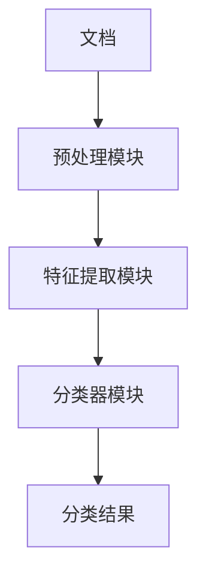
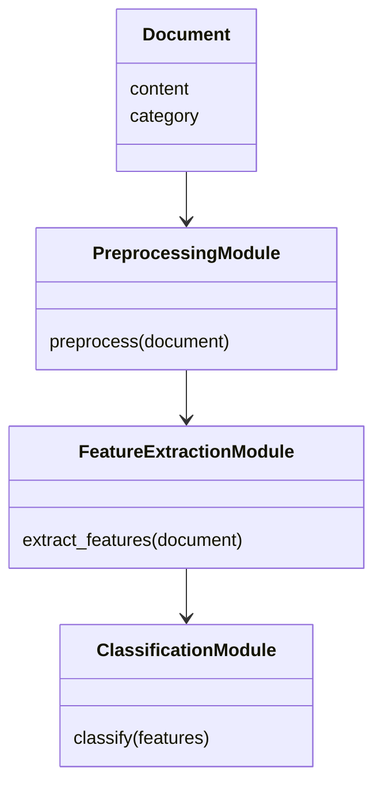

                 


# 构建基于NLP的金融文档自动分类系统

## 关键词：NLP，文本分类，金融文档，机器学习，深度学习

## 摘要：本文详细介绍了如何基于自然语言处理技术构建一个高效的金融文档自动分类系统。文章从问题背景出发，分析了金融文档分类的挑战与需求，探讨了NLP技术在其中的应用潜力，详细讲解了系统设计的核心要素与实现步骤，包括文本预处理、特征提取、分类算法选择与优化，系统架构设计，以及实际项目中的代码实现与案例分析。通过本文，读者可以全面理解如何将NLP技术应用于金融领域，构建高效的文档分类系统。

---

# 第1章 问题背景与系统目标

## 1.1 问题背景

### 1.1.1 金融文档分类的挑战
金融领域的文档种类繁多，包括财务报表、市场分析报告、新闻文章等。这些文档通常包含大量专业术语和复杂的上下文关系，人工分类效率低下且容易出错。如何高效地对这些文档进行分类，是金融行业亟待解决的问题。

### 1.1.2 NLP技术在金融领域的应用潜力
自然语言处理技术（NLP）可以通过提取文本特征、理解语义关系，帮助自动分类金融文档。NLP技术的进步，如词嵌入（Word2Vec）、BERT等预训练模型的应用，为金融文档分类提供了强大的工具支持。

### 1.1.3 自动分类系统的必要性
自动分类系统可以显著提高金融文档处理的效率，减少人工成本，同时能够快速响应海量金融数据的需求。例如，在风险管理、投资决策等领域，自动分类系统能够帮助金融机构快速获取关键信息。

## 1.2 系统目标与意义

### 1.2.1 系统的核心目标
- 实现对金融文档的高效自动分类。
- 提供高准确率的分类结果，满足金融业务需求。
- 支持多种金融文档类型和分类任务。

### 1.2.2 系统的预期价值
- 提升金融数据处理效率。
- 帮助金融机构快速决策。
- 降低人工成本。

### 1.2.3 系统的边界与外延
- 系统仅处理文本型金融文档，不涉及图片、视频等其他形式的数据。
- 分类任务限定在预定义的类别范围内，不支持动态扩展。

## 1.3 系统的核心要素

### 1.3.1 文档处理流程
- 数据预处理：清洗、分词、去除停用词。
- 特征提取：TF-IDF、词嵌入。
- 分类器训练：使用机器学习或深度学习模型。

### 1.3.2 分类算法选择
- 常用算法：朴素贝叶斯、SVM、随机森林。
- 深度学习模型：CNN、BERT。

### 1.3.3 系统架构设计
- 单机部署：适用于小规模场景。
- 分布式架构：适用于大规模数据场景。

## 1.4 本章小结
本章从问题背景出发，分析了金融文档分类的挑战与需求，明确了系统的建设目标和核心要素。后续章节将从技术实现层面展开详细讨论。

---

# 第2章 核心概念与联系

## 2.1 文本分类与NLP技术

### 2.1.1 文本分类的基本原理
文本分类是根据文本内容将其归类到预定义类别的过程。NLP技术在其中起到关键作用，包括文本特征提取、语义分析等。

### 2.1.2 NLP技术在文本分类中的应用潜力
- 词嵌入（Word2Vec、GloVe）：将词语转换为向量表示。
- 预训练模型（BERT、RoBERTa）：通过大规模预训练提升分类性能。

### 2.1.3 金融文本的特殊性
金融文本通常包含大量专业术语和上下文依赖性较强的词汇，这对分类算法提出了更高的要求。

## 2.2 金融术语与领域知识

### 2.2.1 金融领域的核心术语
- 股票、债券、基金、指数、风险管理、投资组合。

### 2.2.2 金融文档的结构特征
- 标题、摘要、正文。
- 时间序列性：文档可能包含时间相关的信息。

### 2.2.3 领域知识对分类的影响
领域知识可以帮助模型更好地理解文本内容，例如，特定术语的出现可能直接对应某个分类。

## 2.3 系统功能模块

### 2.3.1 文档预处理模块
- 文本清洗：去除多余符号。
- 分词：将文本分割成词语或短语。
- 去除停用词：去掉无意义的词汇。

### 2.3.2 特征提取模块
- TF-IDF：计算词语在文档中的重要性。
- 词嵌入：将词语转换为向量表示。

### 2.3.3 分类器模块
- 分类算法：朴素贝叶斯、SVM、随机森林。
- 模型训练：使用训练数据训练分类器。
- 分类预测：对新文档进行分类。

## 2.4 核心概念对比表

| 对比维度       | 文本分类          | 情感分析          |
|----------------|-------------------|-------------------|
| 核心任务       | 将文本归类到类别 | 判断文本情感倾向 |
| 数据集         | 多类别标签数据   | 二分类或三分类数据 |
| 常用算法       | Naive Bayes、SVM | SVM、随机森林      |
| 输出形式       | 类别标签         | 情感分数或标签    |

## 2.5 系统实体关系图



---

# 第3章 算法原理与实现

## 3.1 常见文本分类算法

### 3.1.1 TF-IDF特征提取

#### 3.1.1.1 TF-IDF公式
$$TF-IDF(t, d) = TF(t, d) \times IDF(t)$$
其中，TF是词频，IDF是逆文档频率。

#### 3.1.1.2 示例代码
```python
from sklearn.feature_extraction.text import TfidfVectorizer

vectorizer = TfidfVectorizer()
X = vectorizer.fit_transform(documents)
```

### 3.1.2 朴素贝叶斯分类器

#### 3.1.2.1 朴素贝叶斯原理
朴素贝叶斯基于概率论，通过计算条件概率进行分类。公式如下：
$$P(y|x) = \frac{P(x|y)P(y)}{P(x)}$$

#### 3.1.2.2 示例代码
```python
from sklearn.naive_bayes import MultinomialNB

model = MultinomialNB()
model.fit(X_train, y_train)
y_pred = model.predict(X_test)
```

### 3.1.3 支持向量机(SVM)

#### 3.1.3.1 SVM原理
SVM通过构建超平面将数据点分成不同类别。对于非线性问题，使用核函数进行映射。

#### 3.1.3.2 示例代码
```python
from sklearn.svm import SVC

model = SVC(kernel='linear')
model.fit(X_train, y_train)
y_pred = model.predict(X_test)
```

### 3.1.4 深度学习模型

#### 3.1.4.1 深度学习模型原理
深度学习模型（如BERT）通过多层神经网络提取文本特征。

#### 3.1.4.2 示例代码
```python
from transformers import BertTokenizer, BertModel

tokenizer = BertTokenizer.from_pretrained('bert-base-uncased')
model = BertModel.from_pretrained('bert-base-uncased')
```

## 3.2 数学模型

### 3.2.1 朴素贝叶斯分类器的数学模型

#### 3.2.1.1 贝叶斯定理
$$P(y|x) = \frac{P(x|y)P(y)}{P(x)}$$

#### 3.2.1.2 示例：文本分类
假设文档中有词“收益”，计算它属于“正面”类别的概率：
$$P(positive|收入) = \frac{P(收入|positive)P(positive)}{P(收入)}$$

---

# 第4章 系统分析与架构设计

## 4.1 问题场景介绍

### 4.1.1 项目介绍
本项目旨在构建一个能够自动分类金融文档的系统，支持多种分类任务。

### 4.1.2 系统功能设计

#### 4.1.2.1 领域模型类图


#### 4.1.2.2 系统架构图


---

# 第5章 项目实战

## 5.1 环境配置

### 5.1.1 安装Python环境
```bash
python --version
pip install numpy scikit-learn transformers
```

## 5.2 数据收集与预处理

### 5.2.1 数据预处理代码
```python
import pandas as pd
from sklearn.model_selection import train_test_split

data = pd.read_csv('financial_documents.csv')
X = data['text']
y = data['category']
X_train, X_test, y_train, y_test = train_test_split(X, y, test_size=0.2)
```

## 5.3 特征提取与分类器训练

### 5.3.1 使用TF-IDF提取特征
```python
from sklearn.feature_extraction.text import TfidfVectorizer

vectorizer = TfidfVectorizer()
X_train_vec = vectorizer.fit_transform(X_train)
X_test_vec = vectorizer.transform(X_test)
```

### 5.3.2 训练朴素贝叶斯分类器
```python
from sklearn.naive_bayes import MultinomialNB

model = MultinomialNB()
model.fit(X_train_vec, y_train)
y_pred = model.predict(X_test_vec)
```

## 5.4 模型评估与优化

### 5.4.1 模型评估
```python
from sklearn.metrics import accuracy_score, classification_report

print(accuracy_score(y_test, y_pred))
print(classification_report(y_test, y_pred))
```

---

# 第6章 优化与扩展

## 6.1 系统优化

### 6.1.1 提升分类准确率
- 使用预训练模型（BERT）。
- 采用集成学习（Bagging、Boosting）。

### 6.1.2 领域自适应
针对金融领域的特殊性，可以引入领域知识进行特征增强。

## 6.2 系统扩展

### 6.2.1 支持多模态数据
将文本与其他数据（如市场数据）结合，提升分类效果。

### 6.2.2 模型解释性
使用模型解释工具（如LIME）分析分类结果的原因。

---

# 第7章 总结与展望

## 7.1 系统总结

### 7.1.1 核心技术总结
- 文本预处理：分词、去停用词。
- 特征提取：TF-IDF、词嵌入。
- 分类算法：朴素贝叶斯、SVM、深度学习模型。

## 7.1.2 系统优势
- 高效性：自动化处理大量文档。
- 准确性：基于NLP技术提升分类效果。

## 7.2 未来展望

### 7.2.1 研究方向
- 多模态数据融合：结合文本和市场数据。
- 模型可解释性：提升分类结果的透明性。

### 7.2.2 技术发展
- 预训练模型的应用：如BERT、RoBERTa。
- 深度学习与传统方法的结合。

---

# 作者信息

作者：AI天才研究院/AI Genius Institute & 禅与计算机程序设计艺术/Zen And The Art of Computer Programming

---

通过以上目录和内容的详细阐述，您可以根据需要进一步扩展每一章节的具体内容，包括添加更多案例分析、代码实现细节和实际应用场景的探讨。

