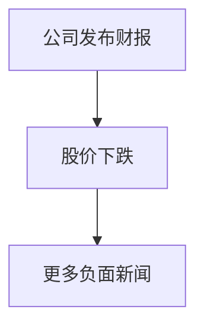
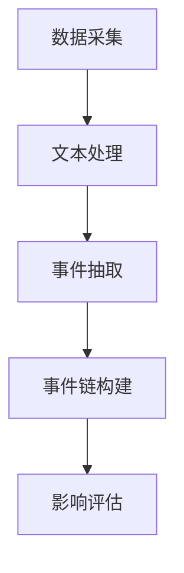
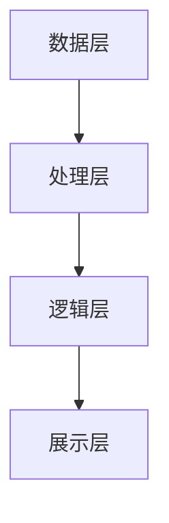

                 

# 构建基于NLP的金融新闻事件链影响量化评估系统

**关键词**：自然语言处理、金融新闻、事件链、影响量化、文本挖掘、深度学习

**摘要**：本文详细介绍了构建基于NLP的金融新闻事件链影响量化评估系统的整体架构、核心算法和实现方案。通过系统化的分析和设计，结合实际案例，展示了如何利用NLP技术量化金融新闻事件的影响，为金融市场的风险管理和投资决策提供有力支持。

---

## 第1章: 问题背景与需求分析

### 1.1 问题背景介绍

#### 1.1.1 金融新闻事件链的基本概念
金融新闻事件链是指一系列与金融市场相关联的新闻事件，这些事件通过时间、主题和关联性形成链条。例如，某公司发布财报后，市场可能因为盈利不及预期而引发股价下跌，随后可能有更多的负面新闻出现，形成一个事件链。

#### 1.1.2 事件链对金融市场的影响
金融新闻事件链对市场的影响通常是累积和扩散的。单个事件可能影响有限，但多个相关事件的叠加可能导致市场剧烈波动。因此，量化这些事件链的影响对于风险管理和投资决策至关重要。

#### 1.1.3 现有解决方案的局限性
传统的金融市场分析主要依赖人工经验或简单的统计模型，难以捕捉复杂事件链的动态关系。现有的NLP技术在金融领域的应用也多局限于单点分析，缺乏对事件链的整体建模和量化评估。

### 1.2 问题描述与目标

#### 1.2.1 金融新闻事件链的复杂性
金融新闻事件链具有高度的动态性和复杂性。事件之间可能存在因果关系、相关关系或竞争关系，这些关系需要通过NLP技术进行建模和分析。

#### 1.2.2 系统建设的核心目标
本文的核心目标是构建一个基于NLP的金融新闻事件链影响量化评估系统，能够自动提取新闻事件，构建事件链，并量化其对市场的综合影响。

#### 1.2.3 系统的边界与外延界定
系统的边界包括金融新闻的来源、事件链的长度和深度，以及影响评估的范围。外延则包括对事件链的实时监控和动态调整。

### 1.3 核心概念与系统架构

#### 1.3.1 核心概念的定义与属性
- **事件**：金融新闻中的具体事件，如“某公司发布财报”。
- **事件链**：多个相关事件的序列，如“财报发布 -> 股价下跌 -> 更多负面新闻”。
- **影响评估**：量化事件链对市场的影响程度。

#### 1.3.2 事件链的结构化表示
通过表格和Mermaid图展示事件链的结构化表示：

#### 1.3.3 系统功能模块划分
- **文本预处理**：分词、去停用词、向量化。
- **事件抽取**：基于规则或深度学习提取事件。
- **事件链构建**：通过关联性算法构建事件链。
- **影响评估**：量化事件链的影响。

---

## 第2章: 核心概念与系统框架

### 2.1 NLP在金融新闻处理中的应用

#### 2.1.1 自然语言处理的基本原理
自然语言处理（NLP）是通过计算机理解、处理和生成人类语言的技术。在金融新闻处理中，常用的NLP技术包括分词、实体识别、情感分析和文本相似度计算。

#### 2.1.2 金融文本的特征与挑战
金融文本具有高度的专业性和结构化特征，但也存在信息不完整、语义复杂等问题。例如，新闻标题可能包含模糊信息，需要结合上下文进行理解。

#### 2.1.3 NLP在事件链分析中的作用
NLP技术可以帮助自动提取事件信息，构建事件链，并通过语义理解量化事件链的影响。

### 2.2 事件链分析的原理与方法

#### 2.2.1 事件链的定义与分类
事件链可以分为单点事件、线性链和网状链。例如，公司发布财报可能引发股价下跌，进而影响投资者信心。

#### 2.2.2 事件链的关联性分析
通过计算事件之间的相似度和相关性，可以构建事件链的关联图。例如，使用余弦相似度计算事件之间的语义相似度：

$$ \text{相似度} = \frac{\vec{E_1} \cdot \vec{E_2}}{||\vec{E_1}|| \cdot ||\vec{E_2}||} $$

#### 2.2.3 事件链的影响评估模型
影响评估模型可以基于事件的影响力、传播速度和关联性进行综合评分。例如，使用加权平均模型：

$$ \text{影响力} = \sum_{i=1}^n w_i \cdot s_i $$

其中，\( w_i \) 是权重，\( s_i \) 是评分。

### 2.3 系统框架设计

#### 2.3.1 系统整体架构
系统整体架构包括数据采集、文本处理、事件抽取、事件链构建和影响评估五个模块。

#### 2.3.2 模块间的交互关系
通过Mermaid图展示模块交互关系：

#### 2.3.3 系统的可扩展性与灵活性
系统采用模块化设计，各模块之间接口清晰，便于后续功能扩展和优化。

---

## 第3章: 系统架构与技术选型

### 3.1 系统架构设计

#### 3.1.1 分层架构设计
系统采用分层架构，包括数据层、处理层、逻辑层和展示层。

#### 3.1.2 模块间的交互关系
通过Mermaid图展示模块交互关系：

#### 3.1.3 系统的高可用性设计
采用分布式架构和负载均衡技术，确保系统的高可用性和稳定性。

### 3.2 技术选型与实现方案

#### 3.2.1 NLP工具的选择与比较
常用的NLP工具包括spaCy、Gensim和NLTK。本文选择spaCy进行文本处理和事件抽取。

#### 3.2.2 事件链分析算法的选择
基于深度学习的事件链分析算法（如BERT）在准确性和可扩展性方面表现更优。

#### 3.2.3 数据存储与处理方案
采用关系型数据库（如MySQL）存储事件链数据，并结合分布式存储技术提高数据处理效率。

### 3.3 系统接口设计

#### 3.3.1 数据输入接口
支持多种数据格式（如JSON、CSV）的输入，并提供API接口。

#### 3.3.2 数据处理接口
提供文本预处理和事件抽取的API接口。

#### 3.3.3 结果输出接口
输出事件链的结构化数据和影响评估结果。

---

## 第4章: 算法原理与实现

### 4.1 文本预处理算法

#### 4.1.1 分词与词性标注
使用spaCy进行分词和词性标注。例如，将“公司发布财报”分为“公司”、“发布”、“财报”。

#### 4.1.2 停用词处理与向量化
去除停用词后，使用Word2Vec生成文本向量。

#### 4.1.3 文本相似度计算
使用余弦相似度计算事件之间的相似度：

$$ \text{相似度} = \frac{\vec{E_1} \cdot \vec{E_2}}{||\vec{E_1}|| \cdot ||\vec{E_2}||} $$

### 4.2 事件抽取算法

#### 4.2.1 基于规则的事件抽取
通过预定义规则提取事件。例如，使用正则表达式提取公司名称和事件类型。

#### 4.2.2 基于深度学习的事件抽取
使用BERT模型进行事件抽取，效果更优。

#### 4.2.3 事件抽取的评估指标
常用的评估指标包括准确率、召回率和F1值。

### 4.3 事件链构建与影响评估

#### 4.3.1 事件链构建算法
基于事件相似度构建事件链，使用图论算法确定事件之间的关系。

#### 4.3.2 事件链影响评估模型
使用加权平均模型量化事件链的影响：

$$ \text{影响力} = \sum_{i=1}^n w_i \cdot s_i $$

#### 4.3.3 模型训练与优化
通过大量金融新闻数据进行模型训练，并使用交叉验证优化模型性能。

---

## 第5章: 系统实现与项目实战

### 5.1 环境搭建与配置

#### 5.1.1 开发环境的安装与配置
安装Python、spaCy、TensorFlow和Flask框架。

#### 5.1.2 数据集的获取与预处理
从新闻网站获取金融新闻数据，并进行清洗和标注。

#### 5.1.3 工具链的安装与使用
安装并配置NLP工具链，包括模型下载和训练。

### 5.2 核心功能模块实现

#### 5.2.1 文本预处理模块
实现文本分词、去停用词和向量化功能。

#### 5.2.2 事件抽取模块
基于规则和深度学习实现事件抽取。

#### 5.2.3 事件链构建与评估模块
构建事件链并量化其影响。

### 5.3 项目实战与案例分析

#### 5.3.1 实际案例的选择与分析
选择真实金融新闻事件进行分析，如某公司财报发布后的股价波动。

#### 5.3.2 系统的运行与结果展示
展示系统输出的事件链和影响评估结果。

#### 5.3.3 系统性能的优化与调整
通过优化算法和调整参数提升系统性能。

---

## 第6章: 系统优化与扩展

### 6.1 系统性能优化

#### 6.1.1 数据处理效率的提升
采用分布式计算和并行处理技术提高数据处理效率。

#### 6.1.2 算法计算速度的优化
通过优化算法和使用更高效的模型（如轻量级模型）提升计算速度。

#### 6.1.3 系统资源利用率的提升
优化资源分配策略，降低系统资源消耗。

### 6.2 功能扩展与增强

#### 6.2.1 多语言支持的实现
扩展系统支持多种语言的金融新闻处理。

#### 6.2.2 实时事件检测的实现
实现对实时新闻的事件检测和影响评估。

#### 6.2.3 用户自定义事件链的实现
允许用户自定义事件链和评估指标。

### 6.3 本章小结

---

## 结语

本文详细介绍了构建基于NLP的金融新闻事件链影响量化评估系统的整体架构、核心算法和实现方案。通过系统化的分析和设计，结合实际案例，展示了如何利用NLP技术量化金融新闻事件的影响，为金融市场的风险管理和投资决策提供有力支持。

---

**作者：AI天才研究院/AI Genius Institute & 禅与计算机程序设计艺术 /Zen And The Art of Computer Programming**

