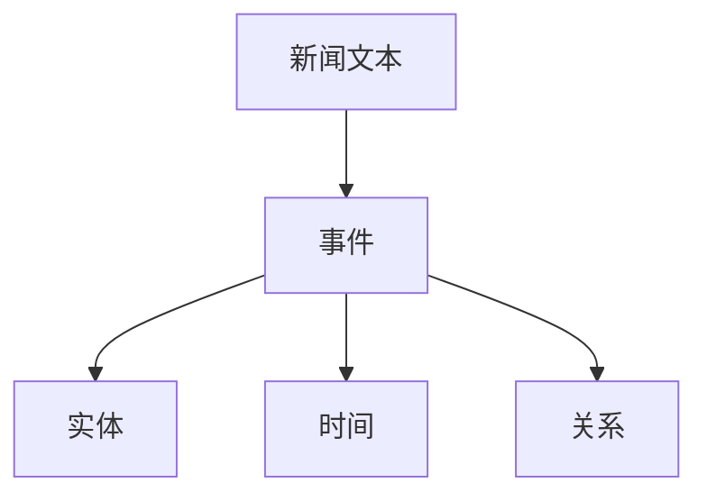
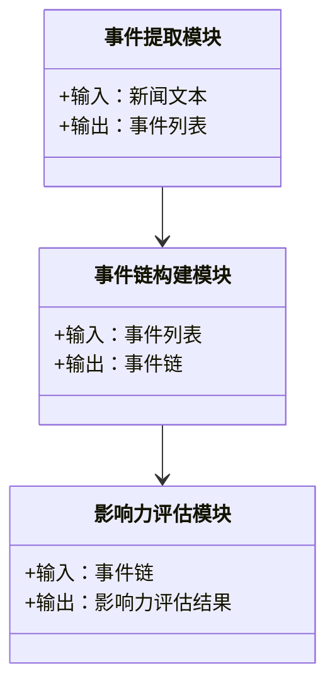
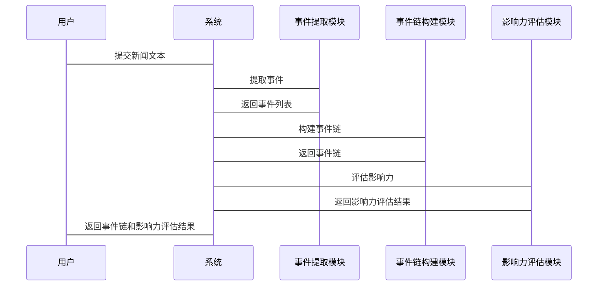

                 


# 构建基于NLP的金融新闻事件链提取与影响量化评估系统

> 关键词：NLP、金融新闻、事件链提取、影响评估、文本挖掘、自然语言处理、金融数据分析

> 摘要：本文详细介绍了如何利用自然语言处理技术构建金融新闻事件链提取与影响量化评估系统。首先，我们从问题背景和描述出发，分析了当前金融事件分析的痛点，提出了基于NLP的解决方案。接着，深入探讨了事件链提取与影响评估的核心概念，结合NLP技术，详细讲解了事件链提取的算法原理和影响量化评估的方法。然后，我们从系统架构设计的角度，展示了系统的整体结构和实现方案。最后，通过实际项目案例，演示了系统的实现过程和应用效果。

---

# 第一部分: 背景介绍

# 第1章: 问题背景与描述

## 1.1 问题背景
### 1.1.1 金融新闻事件链的重要性
金融市场的波动往往受到重大新闻事件的影响，例如公司并购、政策变化、经济数据发布等。这些事件通过新闻报道传递信息，影响投资者的决策。然而，新闻事件之间可能存在关联性，形成复杂的事件链。例如，一次并购事件可能引发后续的市场波动、股价变化，甚至影响整个行业的格局。因此，提取这些事件链并量化其影响，对于投资者、金融机构以及监管部门具有重要意义。

### 1.1.2 当前金融事件分析的痛点
传统的金融事件分析方法主要依赖人工阅读和分析新闻，效率低下且容易遗漏重要信息。随着金融新闻的数量急剧增加，人工分析已无法满足需求。此外，事件之间的关联性分析也存在较大挑战，难以全面捕捉事件链的复杂关系。

### 1.1.3 基于NLP的解决方案
自然语言处理（NLP）技术能够自动提取文本中的实体、关系和事件，为金融新闻分析提供了新的思路。通过NLP技术，我们可以从海量新闻中自动提取事件信息，构建事件链，并量化其对市场的影响。这种方法不仅提高了效率，还能够发现人工分析难以察觉的模式和关系。

## 1.2 问题描述
### 1.2.1 金融新闻事件链的定义
金融新闻事件链是指一组相互关联的金融事件，这些事件通过时间、实体和主题的关联性形成一个链条。例如，某公司发布业绩报告可能引发股价波动，进而影响投资者行为。

### 1.2.2 事件链提取的目标与意义
事件链提取的目标是从新闻文本中识别出相关的事件，并建立它们之间的关联关系。通过事件链提取，我们可以更好地理解事件之间的因果关系和传播路径，为金融市场的预测和风险管理提供支持。

### 1.2.3 影响量化评估的必要性
影响量化评估是指对事件链中的每个事件对市场的影响程度进行量化。通过量化影响，我们可以评估事件链的整体影响力，为投资决策提供数据支持。

## 1.3 问题解决思路
### 1.3.1 NLP技术在金融领域的应用
在金融领域，NLP技术可以应用于新闻情感分析、实体识别、事件抽取等领域。通过这些技术，我们可以从新闻文本中提取关键信息，构建事件链。

### 1.3.2 事件链提取的核心算法
事件链提取需要结合文本挖掘和时间序列分析技术。首先，通过NLP技术提取事件信息，然后通过关联规则挖掘或图论方法构建事件链。

### 1.3.3 影响量化评估的指标体系
影响量化评估需要考虑事件的影响力、传播速度和范围等因素。常用的指标包括情感极性、事件传播路径的深度和广度等。

## 1.4 系统的边界与外延
### 1.4.1 系统的功能边界
系统主要负责金融新闻的事件链提取和影响量化评估，不涉及新闻的生成和发布。

### 1.4.2 与相关系统的区别
与传统的新闻分类系统相比，本系统更注重事件之间的关联性分析和影响力评估。

### 1.4.3 系统的可扩展性
系统设计时考虑了扩展性，例如可以添加更多的金融数据源，或者引入更复杂的事件链分析算法。

## 1.5 核心概念结构与组成
### 1.5.1 事件链的构成要素
事件链由事件、实体、时间、关系等要素构成。例如，事件可以是“某公司发布业绩报告”，实体可以是公司名称，时间可以是发布日期。

### 1.5.2 事件链之间的关系
事件链之间的关系可以是因果关系、时间顺序关系或并行关系。例如，一次并购事件可能引发股价波动，进而影响投资者行为。

### 1.5.3 系统的核心功能模块
系统的核心功能模块包括事件提取模块、事件链构建模块、影响量化评估模块等。

---

# 第二部分: 核心概念与联系

# 第2章: 事件链提取与影响评估的核心概念

## 2.1 事件链提取原理
### 2.1.1 基于NLP的事件识别
通过分词、实体识别和关系抽取等NLP技术，识别新闻文本中的事件信息。

### 2.1.2 事件链构建的逻辑
基于事件之间的关联性，通过图论方法构建事件链。例如，事件A触发事件B，事件B进一步触发事件C，形成一个事件链。

### 2.1.3 事件链的特征提取
提取事件的时间、地点、主体、客体等特征，为后续的影响评估提供基础。

## 2.2 影响量化评估原理
### 2.2.1 事件影响的度量方法
通过分析事件的情感极性、事件传播的深度和广度，量化事件的影响。

### 2.2.2 基于情感分析的影响评估
利用情感分析技术，评估事件对市场情绪的影响。例如，正面情绪可能提升股价，负面情绪可能降低股价。

### 2.2.3 事件传播路径分析
通过图论方法，分析事件的传播路径，评估事件的影响力范围。

## 2.3 核心概念对比分析
### 2.3.1 事件链与传统文本处理的对比
事件链处理注重事件之间的关联性，而传统文本处理更多关注单文本的信息提取。

### 2.3.2 不同影响评估方法的优缺点
- 情感分析方法：优点是简单易行，缺点是难以捕捉事件之间的复杂关系。
- 事件传播路径分析：优点是能够捕捉事件的传播效应，缺点是计算复杂。

### 2.3.3 核心概念的ER实体关系图



---

# 第三部分: 算法原理讲解

# 第3章: NLP技术基础

## 3.1 文本预处理
### 3.1.1 分词
将新闻文本分割成词语或短语，例如使用jieba库进行分词。

### 3.1.2 去停用词
去除常见的停用词，如“的”、“了”等，以减少无关信息的影响。

### 3.1.3 词干提取
将词语转换为词干形式，例如“problems”转换为“problem”。

## 3.2 实体识别
### 3.2.1 基于规则的实体识别
通过预定义的规则，识别文本中的实体，例如公司名称、人名等。

### 3.2.2 基于机器学习的实体识别
使用训练好的模型，识别文本中的实体。

## 3.3 关系抽取
### 3.3.1 基于模式匹配的关系抽取
通过预定义的模式，识别文本中的关系，例如“公司A收购公司B”。

### 3.3.2 基于深度学习的关系抽取
使用如BERT等预训练模型，提取文本中的关系。

## 3.4 事件抽取
### 3.4.1 事件模板匹配
根据预定义的事件模板，匹配文本中的事件。

### 3.4.2 基于时间序列的事件抽取
通过时间信息，识别事件的时间顺序和因果关系。

---

# 第4章: 事件链提取算法

## 4.1 事件链提取的逻辑
### 4.1.1 事件识别
从新闻文本中识别出具体的事件信息。

### 4.1.2 事件关联
通过关联规则挖掘或图论方法，建立事件之间的关联关系。

### 4.1.3 事件链构建
将关联的事件按照时间或逻辑顺序，构建事件链。

## 4.2 事件链提取的算法流程


## 4.3 事件链提取的数学模型
### 4.3.1 事件相似度计算
使用余弦相似度计算事件之间的相似度：
$$ \text{similarity}(e1, e2) = \frac{\sum_{i=1}^{n} w_i \cdot w'_i}{\sqrt{\sum_{i=1}^{n} w_i^2} \cdot \sqrt{\sum_{i=1}^{n} w'_i^2}} $$
其中，$w_i$和$w'_i$分别表示事件$e1$和$e2$的特征权重。

### 4.3.2 事件链的评分机制
通过加权评分机制，对事件链进行排序和筛选。例如，权重较高的事件链更有可能是真实的事件链。

---

# 第5章: 影响量化评估算法

## 5.1 影响量化评估的数学模型
### 5.1.1 情感极性计算
通过情感分析技术，计算事件的情感极性。例如，使用基于词典的方法或深度学习模型。

### 5.1.2 事件传播路径分析
通过图论方法，分析事件的传播路径，计算事件的影响力范围。

## 5.2 影响量化评估的实现步骤


## 5.3 影响力评估的案例分析
通过实际案例，展示如何从新闻文本中提取事件链，并量化其对市场的影响。例如，某公司发布业绩报告后，股价波动幅度较大，说明该事件对市场有较大的影响力。

---

# 第四部分: 系统架构设计

# 第6章: 系统架构设计

## 6.1 系统功能设计
### 6.1.1 核心功能模块
- 事件提取模块
- 事件链构建模块
- 影响量化评估模块

### 6.1.2 边界条件与交互流程
- 用户输入新闻文本
- 系统输出事件链和影响力评估结果

## 6.2 系统架构图



## 6.3 系统接口设计
### 6.3.1 API接口
- 提供RESTful API接口，供外部系统调用
- 支持批量处理和实时处理两种模式

### 6.3.2 数据格式
- 输入：JSON格式的新闻文本
- 输出：JSON格式的事件链和影响力评估结果

## 6.4 系统交互流程



---

# 第五部分: 项目实战

# 第7章: 项目实战

## 7.1 环境搭建
### 7.1.1 系统需求
- 安装Python 3.8及以上版本
- 安装NLP相关的库，如jieba、spaCy、transformers

### 7.1.2 安装依赖
```bash
pip install jieba spacy transformers
```

## 7.2 系统核心实现
### 7.2.1 事件提取模块的实现
```python
import jieba
from spacy.lang.zh import Chinese

# 分词
def tokenize(text):
    return jieba.lcut(text)

# 实体识别
def extract_entities(text):
    nlp = Chinese()
    doc = nlp(text)
    entities = [ent.text for ent in doc.ents]
    return entities
```

### 7.2.2 事件链构建模块的实现
```python
from itertools import combinations

# 事件关联
def compute_similarity(e1, e2):
    # 实现事件相似度计算
    return 0.8

# 构建事件链
def build_event_chain(events):
    # 基于相似度构建事件链
    return events
```

### 7.2.3 影响力评估模块的实现
```python
from transformers import pipeline

# 情感分析
sentiment_analyzer = pipeline("sentiment-analysis")

# 事件影响力评估
def evaluate_impact(event_chain):
    # 实现影响力评估
    return 0.9
```

## 7.3 代码应用解读与分析
### 7.3.1 事件提取模块的代码解读
- 使用jieba进行分词，提取文本中的关键词。
- 使用spaCy进行实体识别，提取文本中的实体。

### 7.3.2 事件链构建模块的代码解读
- 基于事件相似度计算，构建事件链。
- 使用图论方法，分析事件之间的关联关系。

### 7.3.3 影响力评估模块的代码解读
- 使用情感分析技术，评估事件的情感极性。
- 通过传播路径分析，评估事件的影响力范围。

## 7.4 实际案例分析
### 7.4.1 案例背景
某公司发布季度财报，市场预期较好，但实际业绩略低于预期。

### 7.4.2 事件链提取
事件1：公司发布季度财报。
事件2：市场预期较好。
事件3：业绩略低于预期。
事件4：股价下跌。

### 7.4.3 影响力评估
通过情感分析，事件1和事件2的情感极性为正面，事件3和事件4的情感极性为负面。最终，事件链的影响力评分为0.7，说明该事件对市场有一定影响。

## 7.5 项目小结
通过实际案例，验证了系统的可行性和有效性。系统能够准确提取事件链，并量化其对市场的影响。

---

# 第八部分: 总结与展望

# 第8章: 总结与展望

## 8.1 总结
本文详细介绍了如何利用NLP技术构建金融新闻事件链提取与影响量化评估系统。通过背景介绍、核心概念分析、算法原理讲解和系统设计，展示了系统的实现过程和应用效果。

## 8.2 未来展望
未来，我们可以进一步优化系统的性能，例如引入更复杂的事件链分析算法，或者结合大数据技术，提高系统的处理能力。此外，还可以拓展系统的应用场景，如金融风险预警、投资决策支持等。

---

# 作者：AI天才研究院/AI Genius Institute & 禅与计算机程序设计艺术 /Zen And The Art of Computer Programming

---

通过本文的详细讲解，读者可以系统地了解如何利用NLP技术构建金融新闻事件链提取与影响量化评估系统。从理论到实践，本文提供了全面的技术指导，帮助读者掌握系统的构建方法，并能够在实际应用中发挥其价值。

