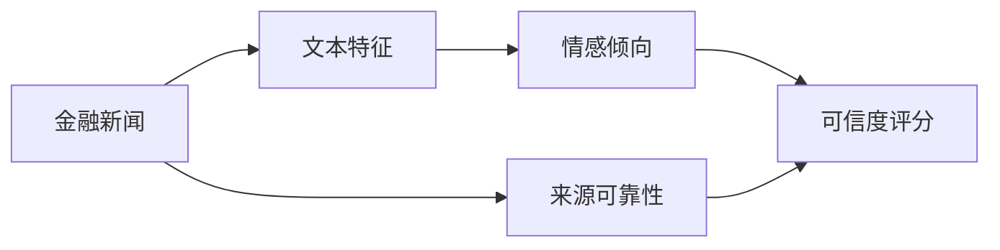
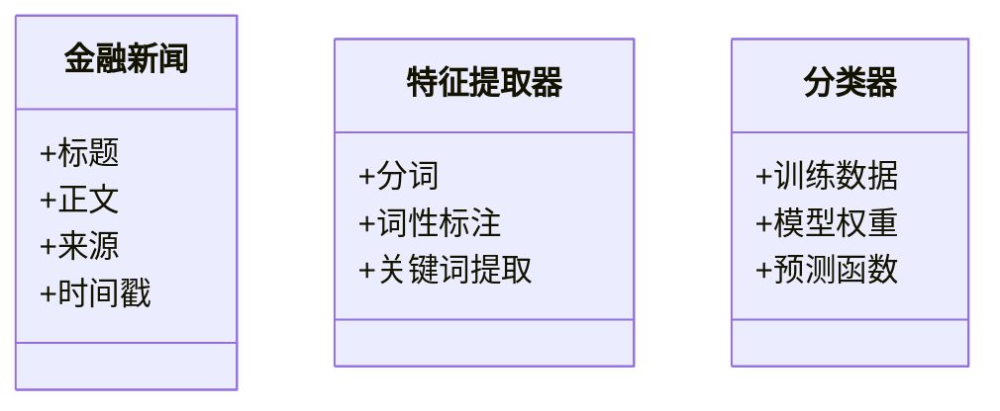
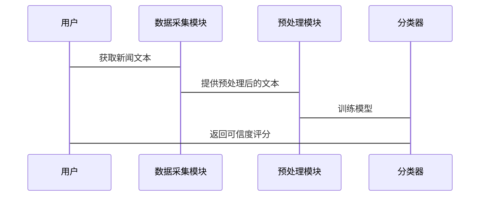

                 


# 《构建基于NLP的金融新闻可信度评估系统》

---

## 关键词：  
金融新闻，可信度评估，自然语言处理（NLP），文本挖掘，深度学习，情感分析

---

## 摘要：  
本文旨在探讨如何利用自然语言处理技术构建一个金融新闻可信度评估系统。通过分析金融新闻文本的特征，结合文本挖掘和深度学习技术，设计并实现了一套能够自动评估新闻可信度的系统。该系统不仅能够识别虚假信息，还能为投资者提供可靠的决策支持。文章详细介绍了系统的构建过程，包括数据采集、特征提取、模型训练和结果展示等环节，并通过实际案例验证了系统的有效性。

---

## 第1章：背景与核心概念

### 1.1 问题背景  
在金融领域，新闻的可信度直接影响投资者的决策。然而，由于信息过载和虚假新闻的泛滥，如何快速、准确地评估金融新闻的可信度成为一个亟待解决的问题。  

#### 1.1.1 金融新闻的现状与挑战  
- 金融新闻数量庞大，信息更新速度快。  
- 虚假新闻和误导性信息层出不穷，容易误导投资者。  
- 不同来源的新闻质量参差不齐，难以统一评估标准。  

#### 1.1.2 信息真实性的重要性  
- 投资者依赖金融新闻做出决策，信息的真实性至关重要。  
- 虚假信息可能导致市场波动和经济损失。  

#### 1.1.3 NLP技术的应用潜力  
- 自然语言处理技术能够提取文本特征，识别情感倾向。  
- 深度学习模型可以学习复杂的语言模式，提升可信度评估的准确性。  

### 1.2 问题描述  
金融新闻可信度评估的核心任务是：基于新闻文本内容，量化其可信度。  

#### 1.2.1 可信度评估的定义  
可信度评估是对新闻内容的客观性和真实性进行量化的过程。  

#### 1.2.2 核心要素  
- **来源可靠性**：新闻来源的可信度（如知名媒体 vs. 小网站）。  
- **文本特征**：关键词分布、情感倾向、语法复杂度等。  
- **上下文关联性**：新闻内容与市场趋势的一致性。  

#### 1.2.3 现有解决方案的局限性  
- 基于规则的方法难以应对复杂的语言现象。  
- 统计模型依赖特征工程，难以捕捉深层语义信息。  

### 1.3 核心概念与联系  
#### 1.3.1 实体关系图  


#### 1.3.2 核心概念对比表  
| 概念 | 定义 | 示例 |  
|------|------|------|  
| 文本特征 | 文本中的关键词和语法结构 | “市场崩盘”、“利好消息” |  
| 情感倾向 | 文本表达的情感倾向 | 正向（买入信号）、负向（卖出信号） |  
| 可信度评分 | 新闻的可信度量化结果 | 0（不可信）到1（可信） |  

---

## 第2章：算法原理与数学模型

### 2.1 算法流程  


### 2.2 数学模型  
#### 2.2.1 情感分析模型  
$$ P(\text{positive}|x) = \frac{\exp(w \cdot x)}{1 + \exp(w \cdot x)} $$  
其中，$w$ 是模型权重，$x$ 是文本特征向量。  

#### 2.2.2 文本相似度计算  
$$ \text{similarity}(x, y) = \frac{x \cdot y}{\|x\| \|y\|} $$  
通过计算新闻文本与参考文本的相似度，评估其可信度。  

#### 2.2.3 综合可信度评分  
$$ \text{score} = \alpha \cdot \text{similarity} + \beta \cdot \text{sentiment} $$  
其中，$\alpha$ 和 $\beta$ 是权重系数，根据实验数据调整。  

---

## 第3章：系统分析与架构设计

### 3.1 系统架构  


#### 3.1.1 领域模型  


#### 3.1.2 系统架构  


#### 3.1.3 接口设计  
- 数据采集接口：`get_news(url)`  
- 预处理接口：`preprocess(text)`  
- 模型调用接口：`predict(text)`  

#### 3.1.4 交互流程  


---

## 第4章：项目实战

### 4.1 环境与工具  
- **编程语言**：Python 3.8+  
- **库与工具**：NLTK、spaCy、scikit-learn  

### 4.2 核心代码实现  
```python
import numpy as np
from sklearn.feature_extraction.text import TfidfVectorizer
from sklearn.linear_model import LogisticRegression

# 数据加载
def load_data(file_path):
    with open(file_path, 'r') as f:
        return f.read()

# 数据预处理
def preprocess(text):
    # 分词与词性标注
    words = tokenize(text)
    # 提取关键词
    keywords = extract_keywords(words)
    return keywords

# 模型训练
def train_model(X, y):
    vectorizer = TfidfVectorizer()
    X_vec = vectorizer.fit_transform(X)
    model = LogisticRegression()
    model.fit(X_vec, y)
    return model, vectorizer

# 预测与评估
def evaluate(model, vectorizer, test_X, test_y):
    test_X_vec = vectorizer.transform(test_X)
    y_pred = model.predict(test_X_vec)
    accuracy = np.mean(y_pred == test_y)
    return accuracy
```

### 4.3 实际案例分析  
以某金融新闻为例，展示系统如何提取关键词、训练模型并输出可信度评分。  

---

## 第5章：总结与展望

### 5.1 最佳实践  
- 数据预处理是关键，确保文本质量。  
- 模型调参时，使用交叉验证优化性能。  

### 5.2 小结  
本文构建了一个基于NLP的金融新闻可信度评估系统，通过文本特征提取和深度学习模型，实现了对新闻可信度的量化评估。  

### 5.3 注意事项  
- 数据来源需多样化，避免模型过拟合。  
- 系统需定期更新模型，适应市场变化。  

### 5.4 拓展阅读  
- 《自然语言处理实战：基于Python的机器学习和深度学习》  
- 《金融风险管理与数据分析》  

---

## 作者：AI天才研究院/AI Genius Institute & 禅与计算机程序设计艺术 /Zen And The Art of Computer Programming

