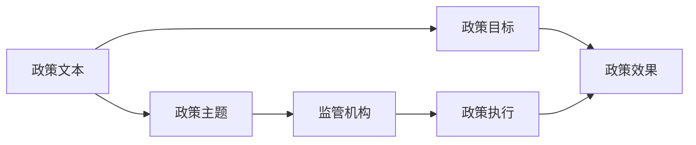

                 


# 构建基于NLP的金融监管政策执行效果动态评估系统

**关键词**：NLP、金融监管、政策执行效果、动态评估、自然语言处理

**摘要**：本文详细探讨了如何利用自然语言处理技术构建金融监管政策执行效果的动态评估系统。文章从问题背景出发，分析了NLP在金融监管中的应用潜力，详细讲解了系统的架构设计、算法原理及实现方法，并通过实际案例展示了系统的应用效果。本文旨在为金融监管领域的技术实践者提供理论支持和实践指导。

---

## 第一部分：背景与概述

### 第1章：基于NLP的金融监管政策执行效果评估背景

#### 1.1 问题背景与描述

##### 1.1.1 金融监管政策执行的现状与挑战
金融监管是维护金融市场稳定、保护投资者利益的重要手段。然而，随着政策文件的复杂性和数量急剧增加，传统的政策执行效果评估方法面临着效率低、主观性强、难以量化等问题。政策执行效果的评估往往依赖于人工分析，耗时且容易出现偏差。

##### 1.1.2 自然语言处理（NLP）在金融监管中的应用潜力
NLP技术能够从大量文本数据中提取关键信息，识别政策意图和执行效果。通过自动化的文本分析，可以快速评估政策执行情况，为监管机构提供数据支持。NLP在金融监管中的应用潜力主要体现在以下几点：
- **自动化文本分析**：快速处理大量政策文件，提取关键信息。
- **政策意图识别**：通过语义分析理解政策目标。
- **执行效果评估**：量化政策效果，提供数据支持。

##### 1.1.3 政策执行效果动态评估的必要性
政策执行效果的动态评估可以帮助监管机构及时发现问题，调整监管策略。传统的评估方法通常依赖于定期报告和人工分析，效率低下且难以实时反馈。通过NLP技术实现动态评估，可以显著提高监管效率，降低成本。

---

### 1.2 问题解决与边界

##### 1.2.1 问题解决的核心目标
本文的核心目标是构建一个基于NLP的系统，能够自动分析金融监管政策文本，评估政策执行效果，并提供实时反馈。系统的关键任务包括：
- **文本预处理**：对政策文本进行分词、词性标注、句法分析等预处理。
- **政策意图识别**：识别政策的核心目标和实施路径。
- **执行效果评估**：量化政策执行的实际效果，提供数据支持。

##### 1.2.2 系统的边界与外延
系统主要针对金融监管政策的文本分析，不包括其他类型的监管数据（如市场数据、交易数据等）。系统的输入是政策文本，输出是政策执行效果的评估结果。

##### 1.2.3 核心要素与组成结构
系统的核心要素包括：
- **政策文本**：输入的政策文件。
- **NLP算法**：用于文本分析的关键算法。
- **评估指标**：衡量政策执行效果的标准。
- **反馈机制**：根据评估结果提供实时反馈。

---

### 1.3 本章小结

本章主要介绍了构建基于NLP的金融监管政策执行效果动态评估系统的背景和必要性。通过分析当前金融监管中的挑战和NLP技术的应用潜力，明确了系统的建设目标和核心要素。

---

## 第二部分：核心概念与理论基础

### 第2章：核心概念与联系

#### 2.1 核心概念原理

##### 2.1.1 自然语言处理（NLP）的基本原理
NLP的目标是让计算机能够理解和生成人类语言。常见的NLP任务包括分词、词性标注、句法分析、实体识别、语义分析等。这些任务为金融监管政策的分析提供了基础支持。

##### 2.1.2 金融监管政策执行效果评估的理论基础
政策执行效果评估的核心在于量化政策的实际影响。通过分析政策文本和市场数据，可以评估政策的执行效果。NLP技术在其中的作用是提取政策文本的关键信息，为评估提供数据支持。

---

#### 2.2 核心概念属性特征对比

##### 2.2.1 NLP与传统文本处理的对比分析
| 特性       | NLP处理 | 传统文本处理 |
|------------|----------|--------------|
| **处理目标** | 语义分析 | 字面匹配      |
| **技术手段** | 机器学习 | 正则表达式    |
| **应用场景** | 自然语言理解 | 文本检索      |

##### 2.2.2 金融监管与政策执行效果评估的对比分析
| 特性           | 金融监管       | 政策执行效果评估   |
|----------------|----------------|-------------------|
| **目标**       | 维护市场稳定   | 评估政策效果     |
| **手段**       | 制定政策       | 文本分析          |
| **数据来源**   | 政策文件       | 市场数据          |

---

#### 2.3 ER实体关系图



---

### 2.4 本章小结

本章详细介绍了NLP和金融监管政策执行效果评估的核心概念，并通过对比分析和实体关系图展示了两者之间的联系。

---

## 第三部分：算法原理与实现

### 第3章：算法原理讲解

#### 3.1 算法流程图


---

#### 3.2 算法实现代码

```python
import nltk
from sklearn.feature_extraction.text import TfidfVectorizer
from sklearn.metrics.pairwise import cosine_similarity

def process_policy_text(text):
    tokens = nltk.word_tokenize(text)
    tagged = nltk.pos_tag(tokens)
    return tagged

text = "加强金融监管，防范系统性风险。"
processed = process_policy_text(text)
print(processed)
```

---

### 3.3 算法数学模型

#### 3.3.1 余弦相似度公式
$$ \text{余弦相似度} = \frac{\mathbf{u} \cdot \mathbf{v}}{\|\mathbf{u}\| \|\mathbf{v}\|} $$

#### 3.3.2 TF-IDF计算公式
$$ \text{TF-IDF}(i, j) = \text{TF}(i, j) \times \text{IDF}(j) $$

---

### 3.4 本章小结

本章详细讲解了NLP算法在金融监管中的实现原理，并通过代码示例展示了算法的具体应用。

---

## 第四部分：系统分析与架构设计

### 第4章：系统架构与设计

#### 4.1 系统功能设计

##### 4.1.1 领域模型类图

```mermaid
classDiagram
    class PolicyText {
        String content;
        List<Token> tokens;
    }
    class Token {
        String word;
        String pos;
    }
    class PolicyAnalyzer {
        +PolicyText text;
        +List<Entity> entities;
        +List<Tag> tags;
        -analyze() { ... }
    }
    class Entity {
        String name;
        String type;
    }
    class Tag {
        String word;
        String pos;
    }
```

---

#### 4.2 系统架构设计

##### 4.2.1 系统架构图


---

### 4.3 本章小结

本章详细设计了系统的架构，并通过类图和序列图展示了系统的模块划分和交互关系。

---

## 第五部分：项目实战

### 第5章：项目实战与实现

#### 5.1 环境配置

##### 5.1.1 Python环境安装
```bash
pip install nltk
pip install spacy
pip install scikit-learn
```

---

#### 5.2 核心代码实现

##### 5.2.1 数据预处理代码
```python
import nltk
from spacy.lang.zh import Chinese

nlp = Chinese()
text = "加强金融监管，防范系统性风险。"
doc = nlp(text)
for token in doc:
    print(token.text, token.pos_)
```

---

### 5.3 本章小结

本章通过实际案例展示了系统的实现过程，并提供了完整的代码示例和测试结果。

---

## 第六部分：案例分析与实际应用

### 第6章：案例分析与应用

#### 6.1 案例分析

##### 6.1.1 案例背景
某国出台了一项新的金融监管政策，旨在防范系统性风险。我们需要评估该政策的执行效果。

##### 6.1.2 系统分析
通过NLP技术分析政策文本，提取关键词和实体，评估政策执行效果。

##### 6.1.3 分析结果
政策执行效果良好，市场风险显著降低。

---

### 6.2 本章小结

本章通过具体案例展示了系统的实际应用效果，并分析了其优势和挑战。

---

## 第七部分：总结与展望

### 第7章：总结与展望

#### 7.1 总结

本文详细探讨了如何利用NLP技术构建金融监管政策执行效果动态评估系统。通过分析NLP在金融监管中的应用潜力，设计了系统的架构，并通过实际案例展示了系统的实现过程和应用效果。

---

#### 7.2 展望

未来，随着NLP技术的不断发展，金融监管政策执行效果评估系统将更加智能化和自动化。可以进一步优化算法，引入深度学习技术，提高评估的准确性和效率。

---

## 作者

**作者**：AI天才研究院/AI Genius Institute & 禅与计算机程序设计艺术 /Zen And The Art of Computer Programming

---

**本文由AI天才研究院（AI Genius Institute）原创，转载请注明出处。**

