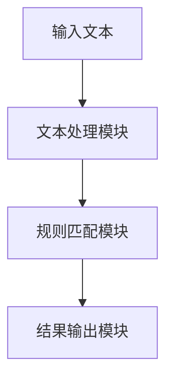
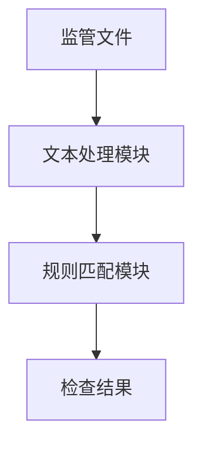
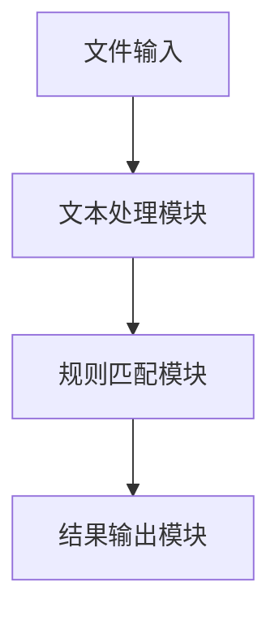
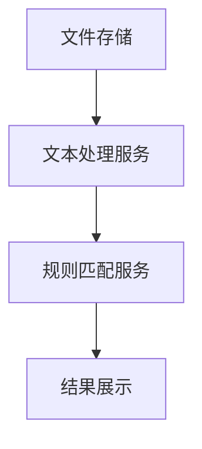
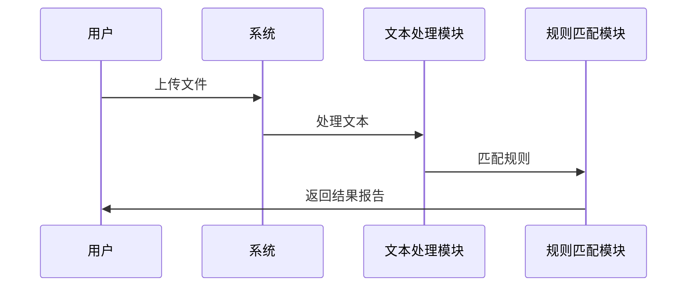

                 


---

# 构建基于NLP的金融监管文件遵从性自动检查系统

> 关键词：NLP，金融监管，文本处理，序列标注，BERT模型

> 摘要：本文详细探讨了如何利用自然语言处理技术构建一个自动检查金融监管文件是否符合规定的系统。文章从问题背景出发，逐步分析了系统的构建过程，包括核心概念、算法原理、系统架构设计以及项目实战。通过详细的技术分析和代码示例，展示了如何利用NLP技术解决金融监管中的遵从性检查问题。

---

# 第一部分: 背景介绍

## 第1章: 问题背景与需求分析

### 1.1 问题背景
#### 1.1.1 金融监管的现状与挑战
金融监管是保障金融市场健康运行的重要手段，传统的文件检查方式效率低下，且容易出错。随着金融业务的复杂化，监管文件的种类和数量急剧增加，人工检查的效率难以满足需求。

#### 1.1.2 金融监管文件遵从性检查的重要性
金融监管文件的合规性直接关系到金融市场的稳定性和透明度。及时发现和纠正不合规内容，能够有效降低金融风险。

#### 1.1.3 传统方法的局限性与改进需求
传统的人工检查方式存在效率低、成本高、易出错等问题。引入自动化技术，尤其是自然语言处理（NLP），能够显著提高检查效率和准确性。

### 1.2 问题描述
#### 1.2.1 金融监管文件的主要类型
包括法规文件、公司财报、合同协议等，这些文件需要符合相关法律法规。

#### 1.2.2 文件遵从性检查的核心目标
识别文件中的不合规内容，确保其符合相关法律法规和行业标准。

#### 1.2.3 系统需要解决的具体问题
- 高效识别文件中的关键信息
- 准确判断文件是否符合规定
- 自动生成检查报告

### 1.3 问题解决思路
#### 1.3.1 自动化检查的优势
- 提高效率
- 减少人为错误
- 支持大规模数据处理

#### 1.3.2 基于NLP技术的解决方案
利用NLP技术对文本进行处理和分析，识别关键信息并判断其是否符合规定。

#### 1.3.3 系统架构的设计思路
采用模块化设计，分为数据输入、文本处理、规则匹配、结果输出等模块。

### 1.4 系统边界与外延
#### 1.4.1 系统功能的边界
仅限于文件内容的文本处理和合规性检查，不包括文件的生成和编辑。

#### 1.4.2 系统与外部系统的交互
与数据库、文件存储系统等进行交互，获取和存储数据。

#### 1.4.3 系统功能的扩展性
未来可以扩展功能，如支持多种语言、增加更多类型的文件检查等。

### 1.5 概念结构与核心要素
#### 1.5.1 系统的核心概念框架
包括文本处理模块、规则匹配模块、结果输出模块等。

#### 1.5.2 核心要素的定义与关系
- 输入文本：需要检查的金融监管文件内容
- 处理规则：定义合规性的判断标准
- 处理结果：检查后的输出结果

#### 1.5.3 概念结构的可视化


---

# 第二部分: 核心概念与联系

## 第2章: NLP基础与核心概念

### 2.1 NLP的基本原理
#### 2.1.1 自然语言处理的定义与目标
NLP是研究如何让计算机理解和处理人类语言的技术，目标是实现人机交互和文本自动化处理。

#### 2.1.2 NLP的核心任务与技术
- 分词：将文本分割成有意义的词语
- 词性标注：为每个词语标注其词性
- 句法分析：分析句子的语法结构
- 语义分析：理解文本的语义含义

#### 2.1.3 NLP在金融领域的应用
- 财务报告分析
- 合同审查
- 风险评估

### 2.2 核心概念与联系
#### 2.2.1 金融监管文件的文本特征
- 专业术语多
- 文本结构复杂
- 内容规范性强

#### 2.2.2 NLP技术与金融监管的结合
- 利用分词技术提取关键词
- 通过句法分析识别句子结构
- 基于语义分析判断文本含义

#### 2.2.3 实体关系图和领域模型类图


---

# 第三部分: 算法原理讲解

## 第3章: 基于NLP的文本处理算法

### 3.1 NLP核心算法概述
#### 3.1.1 分词算法
- 基于统计的分词方法
- 基于规则的分词方法

#### 3.1.2 词性标注
- 基于马尔可夫链的标注方法
- 基于CRF（条件随机场）的标注方法

#### 3.1.3 句法分析
- 依存句法分析
- 块结构句法分析

#### 3.1.4 语义分析
- 基于词向量的语义分析
- 基于句向量的语义分析

### 3.2 基于CRF的序列标注算法
#### 3.2.1 CRF的数学模型
CRF是一种用于序列标注的条件随机场模型，其目标函数如下：
$$
f(x) = \max_{y} \sum_{i=1}^n \sum_{k} U_k(x_i, y_i, y_{i-1}) - \sum_{k} U_k(x_i, y_i, y_{i-1})
$$

#### 3.2.2 CRF的实现步骤
1. 特征提取：提取每个位置的特征
2. 建立转移矩阵：定义状态转移的概率
3. 动态规划求解：计算最优标签序列

#### 3.2.3 CRF的Python实现示例
```python
import numpy as np

class CRF:
    def __init__(self, vocab_size, tag_size):
        self.vocab_size = vocab_size
        self.tag_size = tag_size
        self.trans = np.zeros((tag_size, tag_size))

    def train(self, x, y):
        # 简化实现，仅为示例
        pass

    def predict(self, x):
        # 简化实现，仅为示例
        return y
```

### 3.3 基于BERT的文本表示方法
#### 3.3.1 BERT模型简介
BERT（Bidirectional Encoder Representations from Transformers）是一种预训练的Transformer模型，能够生成高质量的文本表示。

#### 3.3.2 BERT的文本表示流程
1. 输入文本经过分词处理
2. 生成词向量
3. 通过Transformer层进行编码
4. 输出上下文表示

#### 3.3.3 BERT的Python实现示例
```python
import tensorflow as tf
from tensorflow import keras

def load_bert_model():
    model = keras.Model.load_model('bert_model.h5')
    return model

model = load_bert_model()
text = "公司2022年营业收入为100亿元"
features = model.encode(text)
```

---

# 第四部分: 系统分析与架构设计方案

## 第4章: 问题场景介绍与系统架构设计

### 4.1 问题场景介绍
- 需要检查的金融监管文件类型多样
- 文件内容复杂，需要精确识别关键信息
- 需要快速生成检查结果报告

### 4.2 系统功能设计
#### 4.2.1 领域模型类图


#### 4.2.2 系统架构图


### 4.3 接口设计
#### 4.3.1 系统接口定义
- 输入接口：接收金融监管文件
- 输出接口：返回检查结果

#### 4.3.2 接口交互流程
1. 用户上传文件
2. 系统进行文本处理
3. 系统进行规则匹配
4. 系统生成检查报告

### 4.4 系统交互流程图


---

# 第五部分: 项目实战

## 第5章: 环境安装与系统实现

### 5.1 环境安装
- Python 3.8+
- TensorFlow 2.0+
- NLTK库
- SpaCy库

### 5.2 核心功能实现
#### 5.2.1 文本处理模块
```python
import spacy

nlp = spacy.load("en_core_web_sm")
text = "The company's revenue in 2022 was 1 billion yuan."
doc = nlp(text)
```

#### 5.2.2 规则匹配模块
```python
def check_compliance(doc):
    for token in doc:
        if token.ent_type_ == "ORG":
            print(token.text)
```

### 5.3 项目实战案例
- 案例一：检查公司财报中的收入数据
- 案例二：审查合同中的违约条款

---

## 第6章: 项目总结与经验分享

### 6.1 项目总结
- 系统实现了金融监管文件的自动检查功能
- 基于NLP技术，显著提高了检查效率和准确性

### 6.2 经验分享
- 数据质量对系统性能影响重大
- 模型调参和优化是关键
- 系统扩展性和维护性需要重点关注

---

# 第六部分: 最佳实践、小结、注意事项和拓展阅读

## 第6章: 最佳实践与注意事项

### 6.1 最佳实践
- 数据预处理是关键
- 选择合适的NLP模型
- 定期更新规则库

### 6.2 小结
本文详细介绍了如何利用NLP技术构建金融监管文件的自动检查系统，通过理论分析和实践案例，展示了系统的构建过程和实现方法。

### 6.3 注意事项
- 数据隐私保护
- 系统性能优化
- 模型的可解释性

### 6.4 拓展阅读
- 《自然语言处理入门》
- 《深度学习与NLP实战》
- 《金融监管技术研究》

---

作者：AI天才研究院/Zen And The Art of Computer Programming

