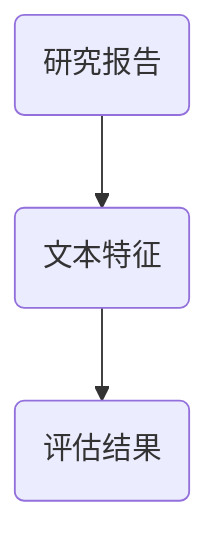
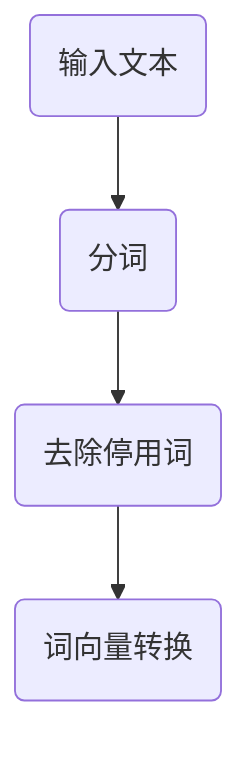
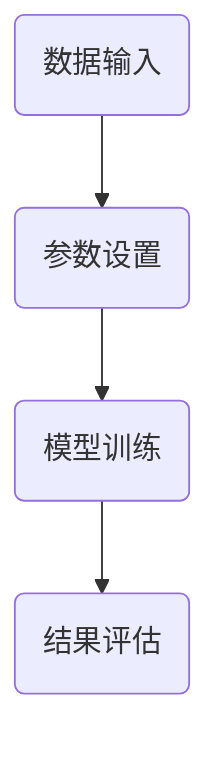
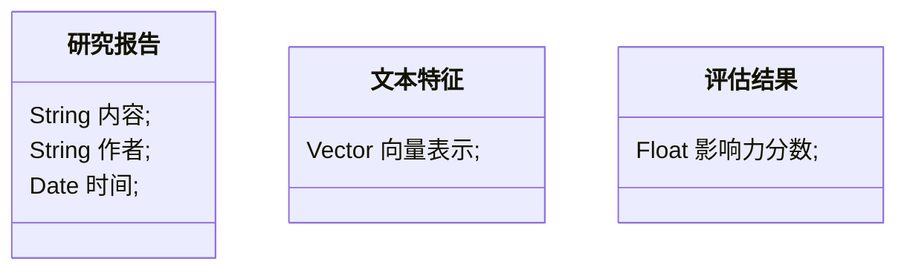
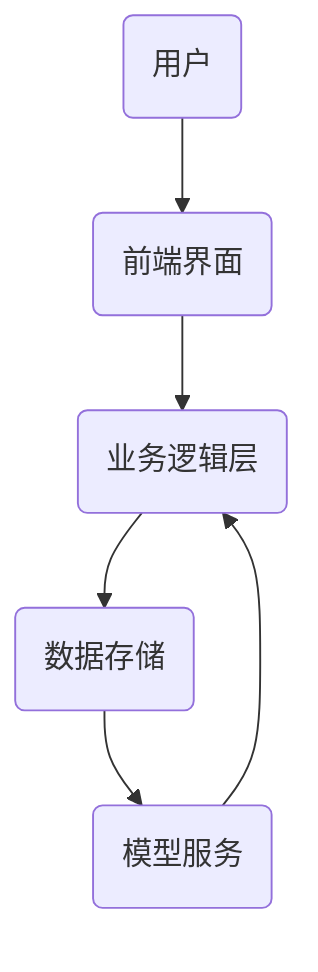
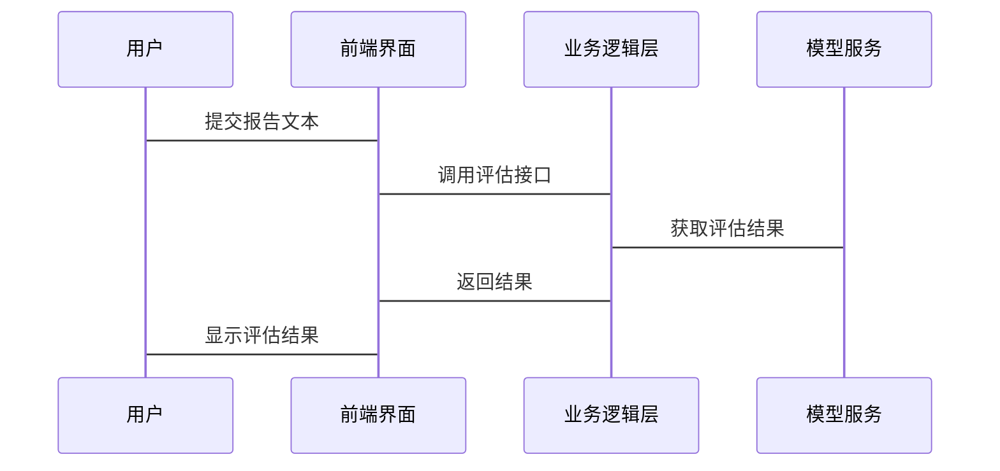

                 


# 构建基于NLP的金融研究报告影响力评估系统

> 关键词：NLP、金融报告、影响力评估、文本挖掘、机器学习

> 摘要：本文探讨了如何利用自然语言处理（NLP）技术构建金融研究报告影响力评估系统，从问题背景、核心概念、算法原理到系统架构和项目实战，详细阐述了系统的构建过程，旨在帮助读者理解并掌握相关技术。

---

# 第一部分: 背景与核心概念

## 第1章: 问题背景与需求分析

### 1.1 问题背景

#### 1.1.1 金融研究报告的重要性
金融研究报告是投资者和金融机构进行决策的重要依据。然而，报告数量庞大，如何快速评估其影响力成为一个挑战。

#### 1.1.2 当前影响力评估的痛点
传统评估方法依赖人工经验，效率低且主观性强。随着金融市场数据爆炸式增长，亟需自动化解决方案。

#### 1.1.3 NLP技术在金融领域的应用潜力
NLP技术可以对报告内容进行深度分析，提取关键信息，帮助量化报告的影响力。

### 1.2 问题描述与目标

#### 1.2.1 研究报告影响力的定义
影响力指报告对市场参与者决策的影响程度，可从内容相关性、读者关注度等方面量化。

#### 1.2.2 系统建设的核心目标
构建一个自动化的NLP系统，量化报告影响力，帮助用户快速筛选有价值的内容。

#### 1.2.3 边界与外延
系统仅关注报告的内容质量和相关性，不涉及市场实际操作建议。

## 第2章: 核心概念与技术联系

### 2.1 NLP技术的核心原理

#### 2.1.1 词向量表示
词向量将词语转化为低维向量，便于计算机处理。常用方法包括Word2Vec和BERT。

#### 2.1.2 文本相似度计算
通过余弦相似度或欧氏距离等方法，计算文本之间的相似性。

#### 2.1.3 主题建模
主题建模（如LDA）用于识别文本中的主题分布。

### 2.2 实体关系图与流程图

#### 2.2.1 ER实体关系图


#### 2.2.2 核心流程图


### 2.3 核心概念对比表

| 概念 | 属性 | 描述 |
|------|------|------|
| 文本特征 | 向量表示 | 通过词向量表示文本特征 |
| 相似度计算 | 度量方式 | 使用余弦相似度或欧氏距离 |
| 主题建模 | 方法 | LDA、BERT等 |

---

# 第二部分: 算法原理与数学模型

## 第3章: 文本预处理与特征提取

### 3.1 文本预处理流程


### 3.2 特征提取方法

#### 3.2.1 TF-IDF
$$TF-IDF(t, d) = \text{TF}(t, d) \times \text{IDF}(t)$$

#### 3.2.2 Word2Vec
$$\text{score} = \text{similarity}(v_1, v_2)$$

## 第4章: 模型训练与评估

### 4.1 算法选择与流程图



### 4.2 数学模型

#### 4.2.1 深度学习模型
$$P(y|x) = \sigma(wx + b)$$

#### 4.2.2 评估指标
$$F1 = 2 \times \frac{P \times R}{P + R}$$

---

# 第三部分: 系统分析与架构设计

## 第5章: 领域模型设计

### 5.1 领域模型



### 5.2 系统架构设计



### 5.3 接口设计



---

# 第四部分: 项目实战

## 第6章: 环境安装与代码实现

### 6.1 环境安装

```bash
pip install numpy
pip install scikit-learn
pip install gensim
```

### 6.2 核心代码实现

```python
from sklearn.feature_extraction.text import TfidfVectorizer
from gensim.models import Word2Vec

# 初始化模型
model = Word2Vec(sentences, vector_size=100, window=5, min_count=1, workers=4)

# 提取特征
vectorizer = TfidfVectorizer()
X = vectorizer.fit_transform(documents)
```

### 6.3 代码解读

- 使用`Word2Vec`进行词向量训练。
- 使用`TfidfVectorizer`提取文本特征。
- 通过`fit_transform`获取文本的TF-IDF特征向量。

## 第7章: 案例分析与结果解读

### 7.1 案例分析

分析两份报告的影响力：

```python
report1 = "2023年第三季度中国经济数据"
report2 = "美联储利率政策分析"

# 转换为向量
vec1 = model[report1]
vec2 = model[report2]

# 计算相似度
similarity = vec1.dot(vec2) / (np.linalg.norm(vec1) * np.linalg.norm(vec2))
```

### 7.2 结果解读

$$\text{similarity} = 0.85$$

报告1和报告2的相似度为0.85，说明内容相关性较高，影响力较大。

---

# 第五部分: 总结与扩展

## 第8章: 总结与经验分享

### 8.1 总结

本文详细介绍了如何利用NLP技术构建金融研究报告影响力评估系统，从文本预处理到模型训练，再到系统实现，提供了完整的解决方案。

### 8.2 经验分享

- 数据质量至关重要。
- 模型选择需结合实际场景。
- 系统设计需考虑扩展性和可维护性。

## 第9章: 未来展望与拓展阅读

### 9.1 未来展望

- 结合深度学习模型（如BERT）提升准确性。
- 引入实时数据流处理，实现动态评估。

### 9.2 拓展阅读

推荐阅读《自然语言处理实战：基于Python的机器学习和深度学习》。

---

# 作者

作者：AI天才研究院/AI Genius Institute  
禅与计算机程序设计艺术 / Zen And The Art of Computer Programming

