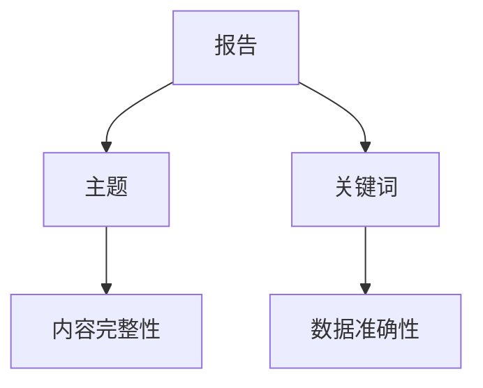
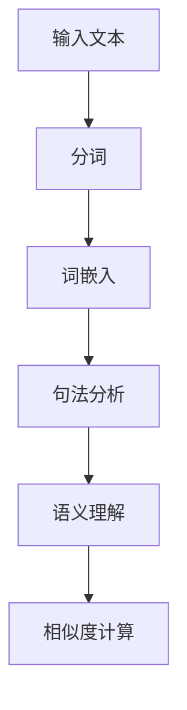
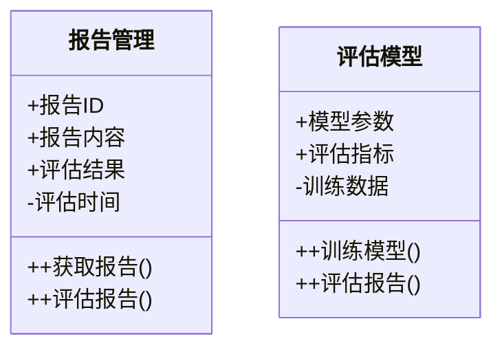
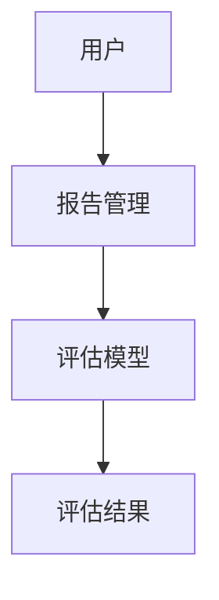
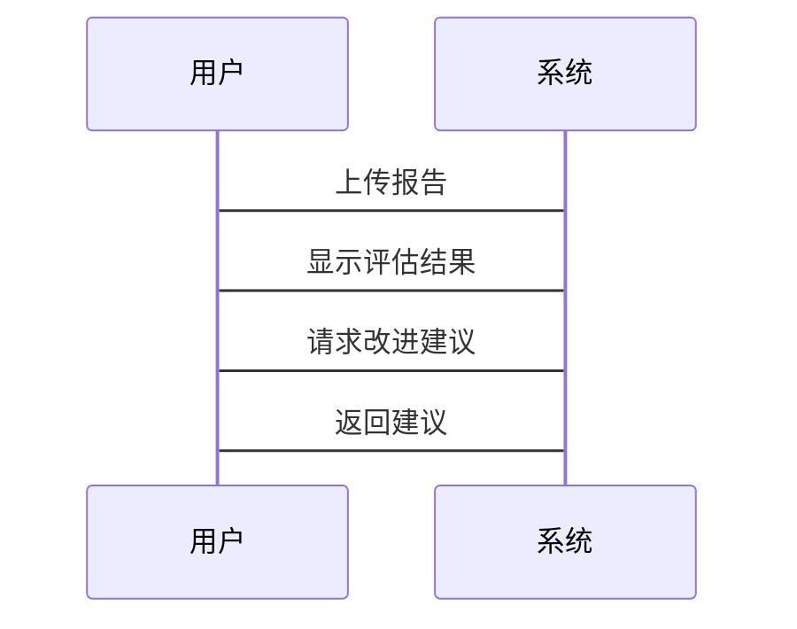

                 


# 构建基于NLP的金融研究报告质量评估系统

## 关键词：NLP，金融报告，质量评估，文本挖掘，机器学习

## 摘要：本文详细探讨了如何利用自然语言处理（NLP）技术构建一个金融研究报告质量评估系统。通过分析金融报告的关键要素，结合NLP的核心算法和数学模型，提出了系统的整体架构和实现方案。文章从背景介绍、核心概念、算法原理到系统设计和项目实战，全面阐述了构建该系统的各个方面，为读者提供了一套完整的解决方案。

---

## 第1章: 问题背景与需求分析

### 1.1 问题背景
#### 1.1.1 金融研究报告的重要性
金融研究报告是金融行业中的重要工具，用于分析市场趋势、评估投资机会以及制定决策。高质量的报告能够为投资者提供准确的信息和深入的洞察，而低质量的报告可能导致错误的决策，造成经济损失。

#### 1.1.2 现有评估方法的局限性
传统的金融报告评估方法主要依赖人工阅读和评分，这种方法不仅耗时耗力，而且容易受到主观因素的影响。此外，随着金融市场数据的爆炸式增长，人工评估的效率和准确性难以满足需求。

#### 1.1.3 NLP技术在金融领域的应用潜力
NLP技术能够从大量文本数据中提取有用的信息，帮助自动评估报告的质量。通过自然语言处理，可以量化报告的逻辑性、准确性和可读性，从而提供客观的评估结果。

### 1.2 问题描述
#### 1.2.1 金融研究报告的关键要素
金融报告通常包括市场分析、财务数据、投资建议等内容。这些内容的质量直接关系到报告的实用性和可信度。

#### 1.2.2 质量评估的核心维度
报告质量的评估可以从以下几个维度进行：
- **内容完整性**：报告是否涵盖了所有关键信息。
- **数据准确性**：报告中的数据是否准确无误。
- **表达清晰度**：报告是否逻辑清晰，易于理解。

#### 1.2.3 系统目标与功能定位
本系统的目标是通过NLP技术，自动评估金融报告的质量，并提供改进建议。系统的功能定位包括文本分析、评分生成和反馈优化。

### 1.3 问题解决思路
#### 1.3.1 NLP技术如何赋能金融报告评估
NLP技术可以通过文本分类、实体识别和情感分析等方法，自动提取报告中的关键信息，并进行质量评估。

#### 1.3.2 系统设计的创新点
本系统结合了NLP和机器学习技术，通过多维度分析报告内容，生成客观的质量评估结果。

#### 1.3.3 技术实现的可行性分析
通过现有NLP工具和开源库（如spaCy、Gensim等），可以高效实现文本处理和分析功能。

### 1.4 系统边界与外延
#### 1.4.1 系统的功能边界
系统仅负责报告的质量评估，不涉及报告生成和数据采集。

#### 1.4.2 系统的适用范围
适用于金融行业的各类研究报告，包括市场分析、财务分析和投资建议等。

#### 1.4.3 系统与其他系统的接口关系
系统可以与其他金融数据分析系统集成，提供数据支持和评估结果。

### 1.5 核心概念与要素组成
#### 1.5.1 NLP技术的核心要素
包括文本预处理、特征提取和模型训练等。

#### 1.5.2 金融报告质量评估的关键指标
包括内容完整性、数据准确性和表达清晰度。

#### 1.5.3 系统架构的核心组成
包括文本处理模块、评估模型和用户界面模块。

---

## 第2章: 核心概念与联系

### 2.1 NLP技术的核心原理
#### 2.1.1 词嵌入技术
词嵌入（如Word2Vec）通过将词转换为向量表示，捕捉词语之间的语义关系。

#### 2.1.2 句法分析与语义理解
句法分析帮助理解句子的结构，语义理解则提取文本的深层含义。

#### 2.1.3 文本相似度计算
通过余弦相似度等方法，衡量两段文本之间的相似性。

### 2.2 金融报告质量评估的关键指标
#### 2.2.1 内容完整性
报告是否涵盖所有关键内容。

#### 2.2.2 数据准确性
报告中的数据是否准确无误。

#### 2.2.3 表达清晰度
报告是否逻辑清晰，易于理解。

### 2.3 NLP与金融报告质量评估的结合
#### 2.3.1 文本特征提取
从报告中提取关键词和主题，用于质量评估。

#### 2.3.2 情感分析与主题识别
分析报告中的情感倾向和主题分布。

#### 2.3.3 自动评分与反馈生成
基于NLP分析结果，生成自动评分和改进建议。

### 2.4 核心概念的对比分析
#### 2.4.1 不同NLP模型的性能对比
比较Word2Vec和BERT在金融报告评估中的表现。

#### 2.4.2 不同评估指标的适用场景
分析内容完整性适用于市场分析报告，数据准确性适用于财务分析报告。

#### 2.4.3 系统功能模块的关联性分析
文本预处理模块为特征提取提供基础，特征提取模块为评估模型提供输入。

### 2.5 ER实体关系图


---

## 第3章: 算法原理与实现

### 3.1 NLP算法原理
#### 3.1.1 词嵌入算法（如Word2Vec）
Word2Vec通过上下文预测词的向量表示，捕捉词语之间的语义关系。

#### 3.1.2 句法分析与语义理解
句法分析（如依赖句法分析）帮助理解句子结构，语义理解则基于句法树提取语义信息。

#### 3.1.3 文本相似度计算
使用余弦相似度计算文本之间的相似性，公式如下：
$$\text{相似度} = \frac{\vec{u} \cdot \vec{v}}{|\vec{u}| |\vec{v}|}$$

### 3.2 算法实现
#### 3.2.1 词嵌入实现
使用Gensim库训练Word2Vec模型：
```python
from gensim.models import Word2Vec
model = Word2Vec(sentences, vector_size=100, window=5, min_count=1, workers=4)
```

#### 3.2.2 句法分析实现
使用spaCy库进行依赖句法分析：
```python
import spacy
nlp = spacy.load("en_core_web_sm")
doc = nlp(text)
for token in doc:
    print(token.text, token.dep_)
```

#### 3.2.3 文本相似度实现
计算两段文本的余弦相似度：
```python
from sklearn.metrics.pairwise import cosine_similarity

vec1 = model.wv.get_vector(word1)
vec2 = model.wv.get_vector(word2)
similarity = cosine_similarity([vec1], [vec2])[0][0]
print(f"Similarity: {similarity}")
```

### 3.3 算法流程图


---

## 第4章: 系统分析与架构设计

### 4.1 问题场景介绍
金融报告质量评估系统需要处理大量文本数据，评估其内容、数据和表达的准确性。

### 4.2 系统功能设计
#### 4.2.1 领域模型


#### 4.2.2 系统架构设计


#### 4.2.3 接口设计
系统提供RESTful API接口，供其他系统调用评估结果。

#### 4.2.4 交互设计
用户通过Web界面上传报告，系统返回评估结果和改进建议。

### 4.3 系统交互图


---

## 第5章: 项目实战

### 5.1 环境安装
安装必要的库：
```bash
pip install spacy gensim sklearn
python -m spacy download en_core_web_sm
```

### 5.2 系统核心实现
#### 5.2.1 文本预处理
```python
import spacy

nlp = spacy.load("en_core_web_sm")
text = "The market is expected to grow at a CAGR of 5%."
doc = nlp(text)
```

#### 5.2.2 特征提取
提取关键词和主题：
```python
from gensim.models import LdaModel
from gensim.corpora import Dictionary

corpus = [doc.tokens for doc in docs]
dictionary = Dictionary(corpus)
corpus_dict = [dictionary.doc2bow(doc) for doc in corpus]
lda = LdaModel(corpus_dict, num_topics=5, id2word=dictionary)
```

#### 5.2.3 评估模型训练
训练文本分类模型：
```python
from sklearn.svm import SVC
from sklearn.feature_extraction.text import TfidfVectorizer

vectorizer = TfidfVectorizer()
X = vectorizer.fit_transform(corpus_texts)
y = [doc.metadata for doc in docs]
model = SVC()
model.fit(X, y)
```

### 5.3 案例分析
分析一份市场分析报告的质量，系统生成评分和改进建议。

### 5.4 项目小结
总结项目实现的关键步骤和成果，为后续优化提供参考。

---

## 第6章: 总结与展望

### 6.1 总结
本文详细介绍了构建基于NLP的金融报告质量评估系统的方法，从背景分析到系统实现，全面阐述了系统的构建过程。

### 6.2 未来展望
未来可以进一步优化NLP模型，引入深度学习技术，提高评估的准确性和效率。

### 6.3 最佳实践
- 确保数据质量和多样性。
- 定期更新模型和评估标准。
- 提供用户友好的交互界面。

### 6.4 注意事项
- 注意数据隐私和安全问题。
- 确保模型的可解释性，避免黑箱操作。

### 6.5 拓展阅读
推荐相关书籍和论文，供读者深入学习。

---

## 作者：AI天才研究院 & 禅与计算机程序设计艺术

---

通过以上内容，我们详细讲解了如何利用NLP技术构建一个金融报告质量评估系统，从理论到实践，为读者提供了一套完整的解决方案。

