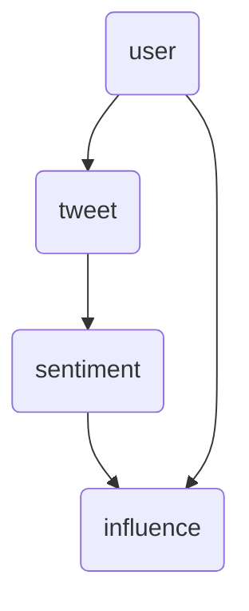
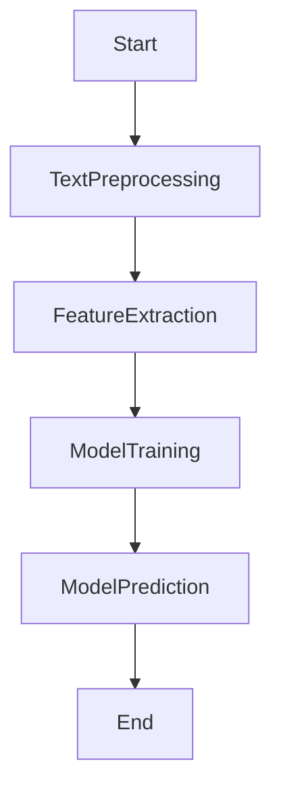
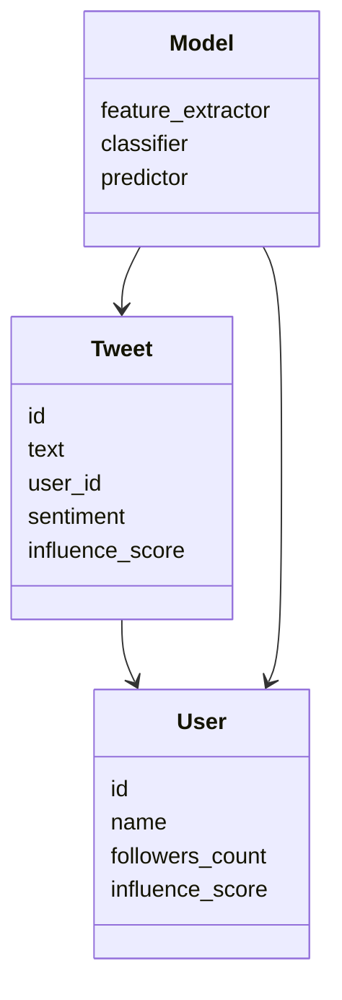
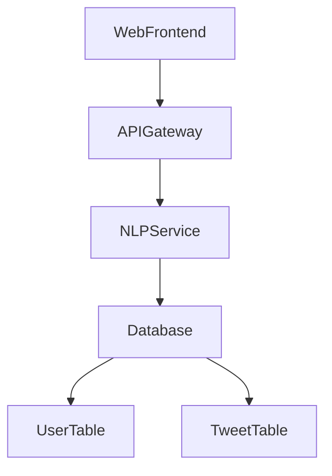

                 


# 构建基于NLP的金融社交媒体影响力量化模型

## 关键词：自然语言处理，金融影响力，社交媒体，文本挖掘，情感分析

## 摘要：本文详细探讨了如何利用自然语言处理技术构建金融社交媒体影响力量化模型。通过分析社交媒体文本数据，提取情感、关键词和用户影响力特征，结合机器学习算法，构建预测模型，并在实际案例中验证其有效性。文章从背景介绍、核心概念、算法原理、系统架构到项目实战，全面阐述了模型构建的全过程，为金融领域的影响力评估提供了新的思路。

---

## 第1章: 基于NLP的金融社交媒体影响力量化模型概述

### 1.1 问题背景与描述

#### 1.1.1 金融社交媒体的兴起
随着互联网的普及，社交媒体成为信息传播的重要平台，尤其是在金融领域，投资者、分析师和机构通过社交媒体分享观点、分析市场趋势。社交媒体上的信息对金融市场的影响日益显著，例如，社交媒体上的情绪波动可能引发股票价格的波动。

#### 1.1.2 社会化媒体对金融市场的影响
社交媒体上的信息具有即时性和广泛传播的特点，能够迅速影响市场的参与者。例如，突发事件在社交媒体上的传播可能引发市场的剧烈波动。因此，量化社交媒体上的影响力对于金融市场的风险管理和投资决策具有重要意义。

#### 1.1.3 基于NLP的影响力量化需求
自然语言处理技术能够从社交媒体文本中提取情感、关键词和用户影响力特征，从而帮助量化用户的影响力。通过NLP技术，可以将非结构化的文本数据转化为结构化的影响力指标，为金融分析提供数据支持。

### 1.2 问题解决与边界

#### 1.2.1 社交媒体影响力量化的核心问题
如何从社交媒体文本中提取有效的影响力特征？如何量化用户的影响力？如何将影响力与金融市场的波动联系起来？

#### 1.2.2 模型的边界与外延
模型仅关注社交媒体上的文本数据，不考虑其他数据源（如市场交易数据）。影响力量化主要基于文本内容和用户行为，不考虑其他外部因素。

#### 1.2.3 核心要素与概念结构
影响力量化模型的核心要素包括：文本数据、用户行为数据、情感分析结果、关键词提取结果和影响力评分。

---

## 第2章: NLP与金融影响力量化的核心概念

### 2.1 NLP基础概念

#### 2.1.1 自然语言处理的定义与特点
自然语言处理（NLP）是计算机科学与人工智能的交叉领域，旨在使计算机能够理解和处理人类语言。NLP的特点包括：数据驱动、任务多样性、模型复杂性和语言的模糊性。

#### 2.1.2 常见NLP任务与技术
常见的NLP任务包括文本分类、情感分析、关键词提取、实体识别和文本生成。常用的技术包括词袋模型、TF-IDF、词嵌入（如Word2Vec）和深度学习模型（如LSTM、BERT）。

#### 2.1.3 金融领域的NLP应用
在金融领域，NLP技术常用于情感分析、新闻摘要、市场情绪监测和风险预警。例如，通过分析新闻标题的情感，预测股票价格的波动。

### 2.2 社交媒体影响力量化模型

#### 2.2.1 模型的核心概念与属性
影响力量化模型的核心概念包括：文本内容、用户行为、情感强度和影响力评分。模型属性包括：实时性、准确性、可解释性和可扩展性。

#### 2.2.2 模型的输入与输出
模型的输入是社交媒体文本数据和用户行为数据，输出是用户的影响力评分和情感分析结果。影响力评分反映了用户在社交媒体上的影响力，情感分析结果反映了文本的情感倾向。

#### 2.2.3 模型的评估标准与指标
模型的评估标准包括准确率、召回率、F1分数和影响力评分的误差。准确率反映了模型预测的正确性，F1分数反映了模型的综合性能。

---

## 第3章: 核心概念与联系

### 3.1 核心概念原理

#### 3.1.1 NLP在影响力量化中的作用
NLP技术用于提取社交媒体文本中的情感、关键词和用户行为特征，为影响力量化提供数据支持。例如，情感分析技术可以量化文本的情感倾向，关键词提取技术可以识别文本中的重要主题。

#### 3.1.2 社交数据的特征提取
特征提取是影响力量化的关键步骤。常用的特征包括：文本长度、关键词出现频率、情感强度和用户互动行为（如点赞、转发、评论）。

#### 3.1.3 模型训练与优化
通过机器学习算法（如随机森林、支持向量机和神经网络），利用特征数据训练影响力量化模型，并通过交叉验证优化模型参数。

### 3.2 概念属性特征对比

| 概念 | 特征 |
|------|------|
| 文本内容 | 长度、关键词、情感倾向 |
| 用户行为 | 点赞数、转发数、评论数 |
| 情感强度 | 积极、消极、中性 |
| 影响力评分 | 高、中、低 |

### 3.3 ER实体关系图



---

## 第4章: 基于NLP的影响力量化算法原理

### 4.1 算法流程



### 4.2 算法实现

#### 4.2.1 文本预处理
```python
import pandas as pd
from sklearn.model_selection import train_test_split
from sklearn.feature_extraction.text import TfidfVectorizer
from sklearn.svm import SVC
from sklearn.metrics import accuracy_score

# 示例数据
data = pd.DataFrame({
    'text': ['Positive sentiment example', 'Negative sentiment example'],
    'label': [1, 0]
})

# 文本预处理
vectorizer = TfidfVectorizer(max_features=500)
X = vectorizer.fit_transform(data['text'])
y = data['label']

# 模型训练
X_train, X_test, y_train, y_test = train_test_split(X, y, test_size=0.2)
model = SVC()
model.fit(X_train, y_train)

# 模型预测
y_pred = model.predict(X_test)
print(f'Accuracy: {accuracy_score(y_test, y_pred)}')
```

### 4.3 数学模型与公式

#### 情感分析模型
情感分析模型的目标是将文本分类为积极、消极或中性。常用的算法是支持向量机（SVM）和长短期记忆网络（LSTM）。SVM的数学公式如下：

$$ \text{SVM的目标函数} = \text{min} \left( \frac{1}{2} \|\omega\|^2 + C \sum_{i=1}^n \xi_i \right) $$

其中，$\omega$ 是模型的权重，$\xi_i$ 是松弛变量，$C$ 是正则化参数。

---

## 第5章: 系统分析与架构设计方案

### 5.1 系统功能设计



### 5.2 系统架构设计



---

## 第6章: 项目实战

### 6.1 环境安装

```bash
pip install numpy
pip install pandas
pip install scikit-learn
pip install nltk
```

### 6.2 系统核心实现

```python
import nltk
from sklearn.model_selection import GridSearchCV
from sklearn.pipeline import Pipeline

# 示例数据集
data = [
    ('This is a positive tweet', 1),
    ('This is a negative tweet', 0)
]

# 数据分割
X = [text for text, label in data]
y = [label for text, label in data]

# 模型构建
pipeline = Pipeline([
    ('tfidf', TfidfVectorizer()),
    ('clf', SVC())
])

# 参数优化
parameters = {
    'clf__C': [1, 10],
    'clf__kernel': ['linear', 'rbf']
}

grid_search = GridSearchCV(pipeline, parameters, cv=5)
grid_search.fit(X, y)

# 最佳模型
best_model = grid_search.best_estimator_
print(f'Best parameters: {grid_search.best_params_}')
print(f'Best accuracy: {grid_search.best_score_}')
```

---

## 第7章: 总结与展望

### 7.1 总结
本文详细探讨了如何利用NLP技术构建金融社交媒体影响力量化模型。通过分析社交媒体文本数据，提取情感、关键词和用户行为特征，结合机器学习算法，构建了影响力量化模型，并在实际案例中验证了其有效性。

### 7.2 展望
未来的研究方向包括：引入多模态数据（如图像和视频）提高模型的准确性，优化模型的实时性以满足高频交易的需求，以及探索模型在风险管理中的应用。

---

## 作者：AI天才研究院/AI Genius Institute & 禅与计算机程序设计艺术 /Zen And The Art of Computer Programming

---

本文通过系统地介绍基于NLP的金融社交媒体影响力量化模型的构建过程，为读者提供了一种新的思路来量化社交媒体上的影响力。希望本文能够为金融领域的研究人员和从业者提供有价值的参考。

