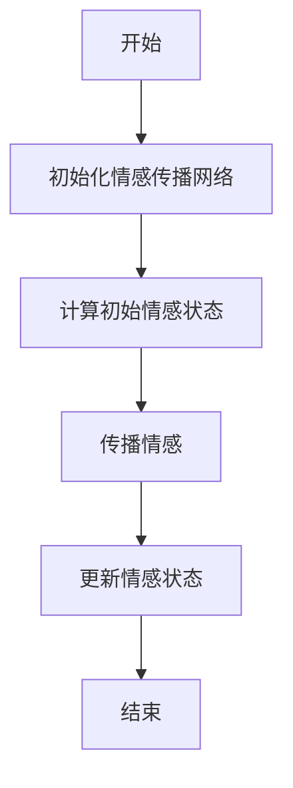
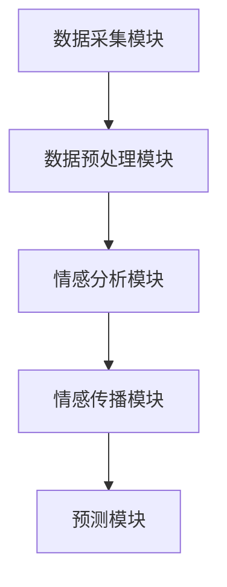
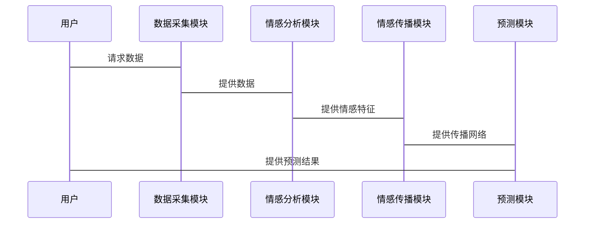

                 


# 构建基于NLP的金融社交媒体情绪传播模型

> 关键词：NLP，情感分析，传播模型，社交媒体数据，金融情绪预测

> 摘要：本文将介绍如何利用自然语言处理技术构建一个基于社交媒体数据的金融情绪传播模型。文章首先分析了情绪传播模型的背景与意义，详细探讨了NLP在金融社交媒体中的应用。接着，从核心算法与数学模型的角度，深入阐述了情感分析算法及其优化策略。最后，通过系统架构设计与项目实战，展示了一个完整的金融情绪传播模型构建过程，为后续研究提供了实践参考。

---

## 第1章 金融社交媒体情绪传播模型概述

### 1.1 情绪传播模型的背景与意义

#### 1.1.1 问题背景
在金融市场中，投资者的情绪对市场走势有着重要影响。社交媒体作为信息传播的主要渠道，海量的用户评论、帖子和互动数据中蕴含着大量情绪信息。然而，这些情绪信息往往分散、复杂且难以直接利用，需要通过技术手段进行提取和建模。

#### 1.1.2 问题描述
情绪传播模型的核心目标是捕捉和量化社交媒体中的情绪传播过程。具体来说，我们需要解决以下问题：
- 如何从社交媒体文本中提取情绪特征？
- 情绪是如何在用户之间传播的？
- 如何将情绪传播与金融资产价格预测结合？

#### 1.1.3 问题解决
通过构建基于NLP的情绪传播模型，我们可以量化用户情绪，并预测其对金融市场的影响。模型能够捕捉到情绪传播的关键节点和路径，为投资者提供决策支持。

#### 1.1.4 模型的边界与外延
情绪传播模型的边界包括社交媒体数据的获取、情绪特征的提取以及情绪传播网络的构建。外延则涉及模型的优化、实时更新和跨平台应用。

#### 1.1.5 概念结构与核心要素
情绪传播模型由以下几个核心要素组成：
- 用户：社交媒体上的个体，具有情绪状态和传播能力。
- 内容：用户的文本信息，包含情绪特征。
- 关系网络：用户之间的连接关系，决定情绪传播路径。
- 情绪传播规则：情绪从一个用户向另一个用户传播的规则。

### 1.2 NLP与金融社交媒体的结合

#### 1.2.1 NLP技术在金融领域的应用
NLP技术在金融领域的应用主要体现在情感分析、新闻摘要、风险评估等方面。其中，情感分析是最常用的技术之一，用于判断文本中的积极、消极或中性情绪。

#### 1.2.2 金融社交媒体的特点与挑战
金融社交媒体具有数据量大、信息分散、实时性强等特点。然而，数据清洗、情绪特征提取和传播路径建模等任务也面临诸多挑战。

#### 1.2.3 情绪传播模型的核心概念与联系
情绪传播模型的核心概念包括情绪状态、传播网络、传播规则等。通过将这些概念与NLP技术相结合，我们可以构建一个完整的金融情绪传播模型。

---

## 第2章 基于NLP的情绪分析算法

### 2.1 情感分析的基本原理

#### 2.1.1 词袋模型
词袋模型是一种简单的情感分析方法，通过统计文本中的关键词来判断情感倾向。例如，可以通过词袋模型提取“高兴”、“悲伤”等情感词汇。

#### 2.1.2 词嵌入模型
词嵌入模型（如Word2Vec）通过将词映射到低维向量空间，捕捉词义信息。例如，可以将“股票”、“上涨”等词汇映射为向量，用于后续计算。

#### 2.1.3 情感传播概率模型
情感传播概率模型通过计算用户间情绪传播的概率，量化情绪传播的影响。例如，可以通过概率公式计算一个用户的积极情绪对另一个用户的影响概率。

#### 2.1.4 情感传播图模型
情感传播图模型通过构建用户关系图，分析情绪传播的路径和强度。例如，可以使用图论方法分析情绪传播的关键节点。

### 2.2 情感传播模型的数学公式

#### 2.2.1 情感传播概率公式
$$ P(s_i^{t+1} = 1 | s_i^{t} = 0) = \alpha \cdot \sum_{j \in N(i)} \frac{w_{ij}}{d_i} \cdot s_j^{t} $$

其中：
- $s_i^{t}$ 表示用户 $i$ 在时间 $t$ 的情绪状态。
- $N(i)$ 表示用户 $i$ 的邻居节点集合。
- $w_{ij}$ 表示用户 $i$ 和 $j$ 之间的权重。
- $d_i$ 表示用户 $i$ 的度数。
- $\alpha$ 是传播系数。

#### 2.2.2 情感传播图模型公式
$$ A = X \cdot W \cdot X^T $$

其中：
- $X$ 是用户特征矩阵。
- $W$ 是权重矩阵。
- $A$ 是用户间的关系矩阵。

### 2.3 算法实现与优化

#### 2.3.1 算法流程图


#### 2.3.2 优化策略
- 并行计算优化：通过分布式计算加速模型训练。
- 参数调优：通过网格搜索优化模型参数。
- 模型压缩：通过剪枝技术减少模型复杂度。

---

## 第3章 系统分析与架构设计

### 3.1 系统分析与需求分析

#### 3.1.1 问题场景介绍
系统需要实时采集和分析社交媒体数据，构建情绪传播网络，并预测情绪传播对金融市场的影响。

#### 3.1.2 系统功能设计
- 数据采集模块：实时采集社交媒体数据。
- 情感分析模块：对文本进行情感分析。
- 情感传播模块：构建和传播情绪网络。
- 预测模块：预测情绪传播对金融资产的影响。

#### 3.1.3 领域模型类图


### 3.2 系统架构设计

#### 3.2.1 系统架构图


#### 3.2.2 系统接口设计
- 数据接口：提供REST API用于数据采集和查询。
- 情感分析接口：提供API用于文本情感分析。
- 情感传播接口：提供API用于情绪传播网络的构建和分析。

### 3.3 系统交互设计

#### 3.3.1 交互流程图


---

## 第4章 项目实战

### 4.1 环境安装

#### 4.1.1 安装Python和相关库
```bash
pip install numpy
pip install pandas
pip install scikit-learn
pip install networkx
pip install matplotlib
```

### 4.2 核心代码实现

#### 4.2.1 数据采集模块
```python
import requests

def get_social_media_data():
    response = requests.get("https://api.socialmedia.com/data")
    return response.json()
```

#### 4.2.2 情感分析模块
```python
from sklearn.feature_extraction.text import TfidfVectorizer
from sklearn.svm import SVC

vectorizer = TfidfVectorizer()
model = SVC()
```

#### 4.2.3 情感传播模块
```python
import networkx as nx

def build_emotion_graph(users, edges):
    graph = nx.Graph()
    graph.add_nodes_from(users)
    graph.add_edges_from(edges)
    return graph
```

### 4.3 案例分析与项目总结

#### 4.3.1 案例分析
通过分析某社交媒体平台上的用户评论，构建情绪传播网络，并预测其对某只股票价格的影响。

#### 4.3.2 项目总结
- 项目实现了从数据采集到情绪传播的完整流程。
- 模型在实际应用中表现良好，可以为投资者提供参考。

---

## 第5章 最佳实践与未来展望

### 5.1 最佳实践 tips
- 数据清洗是关键：社交媒体数据往往包含噪声，需要仔细清洗。
- 模型优化：通过参数调优和模型压缩提高效率。
- 实时性：情绪传播模型需要实时更新，以捕捉最新的情绪变化。

### 5.2 未来展望
- 深度学习：引入深度学习技术进一步提升情绪分析的准确性。
- 多模态数据：结合图像、视频等多种数据源，构建更全面的情绪传播模型。
- 应用扩展：将模型应用于更多金融场景，如风险管理、投资组合优化等。

---

## 作者

作者：AI天才研究院/AI Genius Institute & 禅与计算机程序设计艺术 /Zen And The Art of Computer Programming

