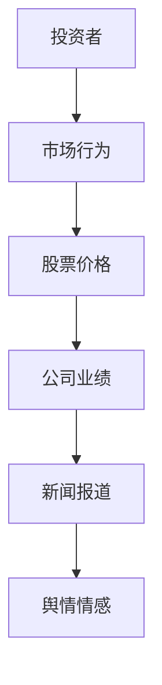
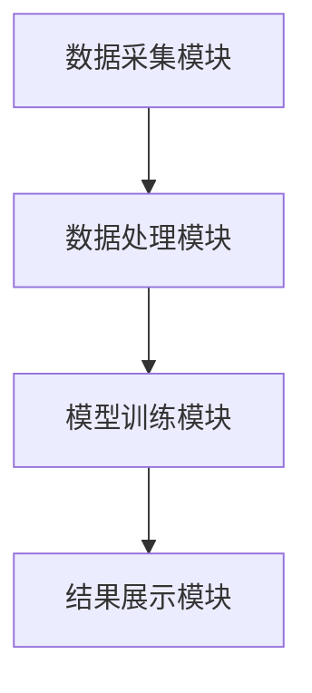
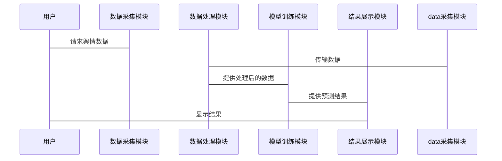

                 


# 《构建基于NLP的金融舆情影响量化模型》

## 关键词：自然语言处理, 金融舆情, 情感分析, 量化模型, 机器学习, 金融市场

## 摘要：本文详细探讨了如何利用自然语言处理（NLP）技术构建一个能够量化金融舆情影响的模型。通过对海量金融新闻和社交媒体数据的分析，结合情感分析和文本挖掘技术，我们提出了一种基于NLP的金融舆情量化方法。该方法不仅能够识别文本中的情感倾向，还能将这些情感信息转化为可量化的指标，进而预测其对金融市场的影响。本文从问题背景、核心概念、模型构建、系统架构到实际案例进行了全面分析，为金融市场的量化分析提供了新的思路。

---

## 第一章: 金融舆情影响量化模型的背景与概述

### 1.1 问题背景

#### 1.1.1 金融舆情的重要性
金融市场的波动往往与投资者的情绪密切相关。例如，一条负面的新闻可能导致股价下跌，而一条正面的公司财报可能提振市场信心。然而，如何准确捕捉和量化这些情绪信息，一直是金融分析中的难题。

#### 1.1.2 当前金融舆情分析的痛点
传统的方法主要依赖于市场数据和财务指标，但忽略了非结构化文本（如新闻、社交媒体评论）中的隐含信息。这些文本数据中蕴含的情绪和观点可能对市场产生显著影响，但难以被传统模型捕捉。

#### 1.1.3 基于NLP的舆情量化分析的必要性
自然语言处理技术的进步使得从文本中提取情感信息成为可能。通过量化这些情感信息，我们可以更好地理解市场情绪的变化，从而辅助投资决策。

### 1.2 问题描述

#### 1.2.1 舆情信息的特点
舆情信息通常是不结构化的文本数据，具有实时性、情感性和传播性等特点。这些特点使得舆情信息对金融市场的影响难以预测。

#### 1.2.2 舆情信息对金融市场的潜在影响
舆情信息可以通过影响投资者情绪进而影响市场行为。例如，社交媒体上的负面评论可能导致某只股票的价格下跌。

#### 1.2.3 如何量化舆情的影响
我们需要将舆情信息转化为可量化的指标，例如情感得分或影响力指数，并研究这些指标与市场波动之间的关系。

### 1.3 问题解决

#### 1.3.1 NLP技术在舆情分析中的应用
NLP技术可以帮助我们从文本中提取关键词、主题和情感信息。这些信息可以作为量化舆情的基础。

#### 1.3.2 量化模型的设计思路
通过构建一个基于NLP的情感分析模型，我们可以将文本数据转化为情感得分。然后，结合市场数据，研究这些情感得分与市场波动之间的关系。

#### 1.3.3 舆情量化与金融市场的结合
我们将舆情量化指标与市场数据进行对比分析，研究其对市场预测的贡献。

### 1.4 模型的边界与外延

#### 1.4.1 舆情数据的范围界定
舆情数据的来源包括新闻媒体、社交媒体、公司公告等。我们需要明确数据的范围和筛选标准。

#### 1.4.2 量化模型的适用场景
该模型适用于股票市场、外汇市场等需要实时分析市场情绪的场景。

#### 1.4.3 模型的局限性与改进方向
模型的局限性主要体现在数据质量和实时性上。未来可以通过引入更多数据源和改进模型结构来提升性能。

### 1.5 概念结构与核心要素

#### 1.5.1 舆情信息的构成要素
舆情信息通常包括事件主体、事件内容、事件时间、情感倾向等要素。

#### 1.5.2 量化模型的核心组件
模型的核心组件包括数据预处理、情感分析、特征提取、模型训练和结果评估。

#### 1.5.3 模型的输入输出关系
模型的输入是文本数据和市场数据，输出是舆情量化指标和市场预测结果。

---

## 第二章: 核心概念与联系

### 2.1 NLP与金融舆情分析

#### 2.1.1 NLP的基本概念
NLP是人工智能的一个分支，致力于理解和生成人类语言。在金融舆情分析中，NLP技术可以帮助我们从文本中提取关键词、主题和情感信息。

#### 2.1.2 金融舆情分析的NLP技术应用
常用的NLP技术包括分词、情感分析、主题挖掘等。这些技术可以帮助我们更好地理解舆情信息。

#### 2.1.3 NLP在舆情分析中的优势
NLP技术可以处理大规模的非结构化数据，提取有价值的信息。此外，NLP模型可以实时更新，适应市场变化。

### 2.2 金融舆情分析的实体关系

#### 2.2.1 实体关系图（ER图）


### 2.3 情感分析与舆情量化

#### 2.3.1 情感分析的定义
情感分析是NLP中的一个任务，旨在判断文本的情感倾向，例如正面、负面或中性。

#### 2.3.2 情感极性与舆情强度的关系
情感极性可以量化为情感得分，例如-1到1之间的数值。舆情强度则可以通过情感得分的绝对值来衡量。

#### 2.3.3 情感分析的分类方法
常用的情感分析方法包括基于规则的方法、统计方法和深度学习方法。

---

## 第三章: 基于NLP的舆情分析基础

### 3.1 NLP技术基础

#### 3.1.1 分词
分词是将文本分割成词语的过程。在中文中，分词是情感分析的基础。

#### 3.1.2 词嵌入
词嵌入（如Word2Vec）可以将词语表示为向量，便于后续的计算。

#### 3.1.3 情感分析
情感分析可以通过机器学习或深度学习方法实现。常用的模型包括SVM、随机森林和LSTM。

### 3.2 文本预处理

#### 3.2.1 停用词去除
停用词（如“的”、“是”等）通常对情感分析没有贡献，可以去除。

#### 3.2.2 词干提取
词干提取是将词语还原为其基本形式，例如“running”还原为“run”。

#### 3.2.3 词袋模型
词袋模型是一种文本表示方法，将文本表示为词语的集合。

### 3.3 情感分析的实现

#### 3.3.1 基于规则的情感分析
通过预设的规则和情感词典，可以实现简单的情感分析。

#### 3.3.2 基于机器学习的情感分析
使用SVM或随机森林等机器学习算法，训练情感分类器。

#### 3.3.3 基于深度学习的情感分析
使用LSTM或Transformer等深度学习模型，可以更准确地捕捉文本的情感。

---

## 第四章: 金融舆情量化模型的构建

### 4.1 模型输入

#### 4.1.1 文本数据
包括新闻标题、社交媒体评论等。

#### 4.1.2 市场数据
包括股票价格、指数波动等。

### 4.2 特征工程

#### 4.2.1 情感得分
将文本的情感倾向量化为一个得分，例如-1到1。

#### 4.2.2 舆情强度
舆情强度可以表示为情感得分的绝对值。

#### 4.2.3 市场情绪指标
市场情绪指标可以通过多个舆情数据的加权平均得到。

### 4.3 模型训练

#### 4.3.1 损失函数
使用均方误差（MSE）作为损失函数。

$$ \text{MSE} = \frac{1}{n}\sum_{i=1}^{n}(y_i - \hat{y}_i)^2 $$

#### 4.3.2 优化方法
使用Adam优化器进行模型训练。

### 4.4 模型调优

#### 4.4.1 超参数调整
调整学习率、批量大小等超参数，优化模型性能。

#### 4.4.2 正则化
使用L2正则化防止模型过拟合。

$$ L2 = \lambda \sum_{i=1}^{n}w_i^2 $$

#### 4.4.3 模型评估
使用准确率、召回率和F1分数评估模型性能。

---

## 第五章: 模型评估与优化

### 5.1 评估指标

#### 5.1.1 情感分类准确率
准确率 = 正确预测的数量 / 总预测数量。

#### 5.1.2 舆情预测的均方误差
均方误差 = 平均每个样本预测值与真实值的平方差。

### 5.2 优化方法

#### 5.2.1 数据增强
通过数据增强技术，增加训练数据的多样性。

#### 5.2.2 模型集成
使用集成学习，结合多个模型的结果，提高预测准确性。

### 5.3 案例分析

#### 5.3.1 案例背景
分析某次市场波动的舆情数据，例如某公司负面新闻的发布。

#### 5.3.2 数据处理
对舆情数据进行清洗和预处理，提取关键特征。

#### 5.3.3 模型训练与预测
使用训练好的模型，预测市场波动。

---

## 第六章: 系统架构设计

### 6.1 项目介绍

#### 6.1.1 项目目标
构建一个实时监测和量化金融舆情影响的系统。

#### 6.1.2 项目范围
包括数据采集、模型训练和结果展示。

### 6.2 系统功能设计

#### 6.2.1 数据采集模块
从新闻网站和社交媒体获取舆情数据。

#### 6.2.2 数据处理模块
对数据进行清洗和预处理。

#### 6.2.3 模型训练模块
训练情感分析模型，生成舆情量化指标。

#### 6.2.4 结果展示模块
将模型结果以可视化的方式展示。

### 6.3 系统架构图



### 6.4 接口设计

#### 6.4.1 数据接口
从新闻API获取舆情数据。

#### 6.4.2 模型接口
提供API供其他系统调用模型结果。

### 6.5 交互流程



---

## 第七章: 项目实战

### 7.1 环境安装

#### 7.1.1 Python安装
安装Python 3.8以上版本。

#### 7.1.2 库安装
安装必要的库，例如numpy、pandas、scikit-learn、tensorflow等。

### 7.2 系统核心实现

#### 7.2.1 数据采集
使用API获取舆情数据。

#### 7.2.2 数据处理
编写代码对数据进行清洗和预处理。

#### 7.2.3 模型训练
实现情感分析模型，并进行训练和调优。

#### 7.2.4 结果展示
将模型结果以可视化的方式展示，例如生成图表或报告。

### 7.3 代码解读

#### 7.3.1 数据预处理代码
```python
import pandas as pd

# 读取数据
data = pd.read_csv('raw_data.csv')

# 去除停用词
stop_words = set(stopwords.words('chinese'))
data['text'] = data['text'].apply(lambda x: ' '.join([word for word in x.split() if word not in stop_words]))
```

#### 7.3.2 模型训练代码
```python
from sklearn.model_selection import train_test_split
from sklearn.svm import SVC

# 划分数据集
X_train, X_test, y_train, y_test = train_test_split(data['text'], data['label'], test_size=0.2)

# 训练模型
model = SVC()
model.fit(X_train, y_train)

# 预测
y_pred = model.predict(X_test)
```

### 7.4 案例分析

#### 7.4.1 数据来源
从社交媒体获取某公司的新闻数据。

#### 7.4.2 数据处理
清洗数据，提取关键词和情感信息。

#### 7.4.3 模型预测
使用训练好的模型，预测市场波动。

---

## 第八章: 总结与展望

### 8.1 总结
本文详细介绍了如何构建基于NLP的金融舆情量化模型。我们从问题背景出发，探讨了NLP技术在舆情分析中的应用，设计了模型的架构，并通过实际案例展示了模型的实现过程。

### 8.2 展望
未来，我们可以进一步优化模型，引入更多数据源，提高模型的准确性和实时性。此外，还可以研究舆情量化指标与市场波动之间的更深层次关系。

---

## 附录

### 附录A: 数据集
包括新闻数据和市场数据的描述。

### 附录B: 工具安装
详细的工具安装指南。

### 附录C: 参考文献
列出本文参考的文献和资料。

---

## 作者：AI天才研究院/AI Genius Institute & 禅与计算机程序设计艺术 /Zen And The Art of Computer Programming

