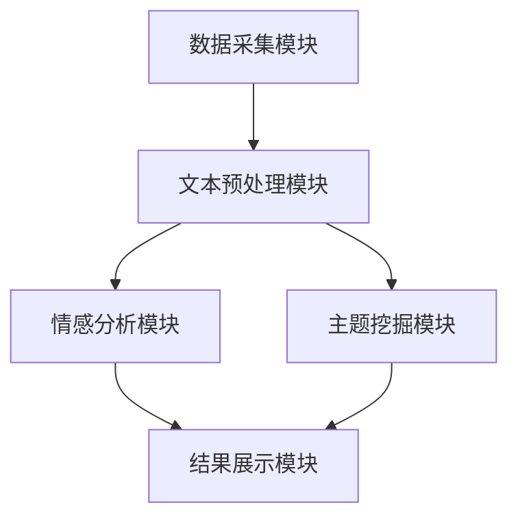
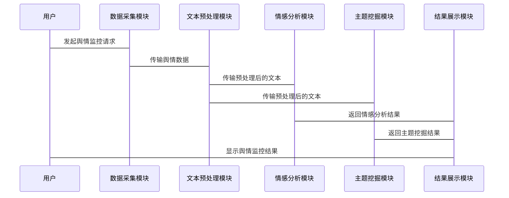

                 


# 《构建基于NLP的金融舆情监控平台》

## 关键词：金融舆情、NLP、自然语言处理、舆情监控、文本挖掘、情感分析

## 摘要：本文旨在介绍如何利用自然语言处理技术构建一个高效的金融舆情监控平台。文章从金融舆情监控的背景需求出发，详细讲解了NLP的核心算法、系统设计及项目实现，涵盖文本预处理、情感分析、主题挖掘等内容，结合实际案例，帮助读者掌握构建此类平台的关键技术与方法。

---

## 第1章: 金融舆情监控平台的背景与需求

### 1.1 什么是金融舆情监控
#### 1.1.1 金融舆情的定义与特点
金融舆情是指金融市场中的各种言论、评论和信息，包括新闻、社交媒体、论坛等。这些信息反映了市场参与者的观点、情绪和态度，对金融市场的走势有着重要影响。

金融舆情具有以下特点：
- **实时性**：金融市场信息瞬息万变，需要实时监控和分析。
- **多样性**：信息来源广泛，包括新闻、社交媒体、机构报告等。
- **情感驱动**：舆情往往带有强烈的情感色彩，影响投资者决策。

#### 1.1.2 金融舆情监控的重要性
- **风险预警**：及时发现负面舆情，防范金融风险。
- **投资决策支持**：通过分析舆情，为投资者提供决策参考。
- **市场情绪分析**：了解市场情绪变化，帮助制定交易策略。

#### 1.1.3 金融舆情监控的核心目标
- 实时监测金融市场的相关信息。
- 分析舆情的情感倾向和主题。
- 提供数据支持和决策依据。

### 1.2 基于NLP的舆情监控优势
#### 1.2.1 NLP技术在金融领域的应用
- **情感分析**：判断文本的情感倾向，识别市场情绪。
- **主题挖掘**：提取文本中的主要话题，了解市场关注点。
- **实体识别**：识别公司、人物、机构等实体信息。

#### 1.2.2 基于NLP的舆情监控的独特价值
- **自动化处理**：NLP技术能够自动化处理大量文本数据，提高效率。
- **深度分析**：通过NLP技术，可以深入分析文本内容，提取有价值的信息。
- **实时监控**：结合流处理技术，实现实时舆情监控。

#### 1.2.3 金融舆情监控的典型场景
- 股票市场情绪分析。
- 新闻事件影响评估。
- 社交媒体情绪监控。

### 1.3 本书的核心目标与结构
#### 1.3.1 本书的核心目标
- 系统地介绍构建基于NLP的金融舆情监控平台所需的技术和方法。
- 提供从理论到实践的详细指导，帮助读者掌握相关技能。

#### 1.3.2 本书的章节安排
- **第1章**：介绍金融舆情监控的背景与需求。
- **第2章**：讲解NLP基础与文本处理技术。
- **第3章**：分析金融舆情监控的核心需求与挑战。
- **第4章**：详细讲解NLP的核心算法。
- **第5章**：介绍系统设计与架构方案。
- **第6章**：项目实战，指导读者完成一个简单的金融舆情监控系统。
- **第7章**：讨论优化与扩展，探索前沿技术。
- **第8章**：总结全书，展望未来发展方向。

#### 1.3.3 本书的适用读者
- 金融从业者：希望利用NLP技术进行市场分析和投资决策。
- 数据科学家：希望掌握NLP技术在金融领域的应用。
- 软件开发人员：希望了解如何构建基于NLP的金融舆情监控系统。

### 1.4 本章小结
本章主要介绍了金融舆情监控的背景与需求，阐述了NLP技术在金融舆情监控中的重要性，以及本书的核心目标和结构安排。通过本章，读者可以了解构建基于NLP的金融舆情监控平台的基本框架和重要意义。

---

## 第2章: NLP基础与文本处理技术

### 2.1 NLP的基本概念
#### 2.1.1 什么是自然语言处理
自然语言处理（NLP）是计算机科学与人工智能的交叉领域，旨在使计算机能够理解和处理人类语言。

#### 2.1.2 NLP的核心任务与技术
- **文本分类**：将文本分为不同的类别，如情感分类、主题分类。
- **文本生成**：生成符合上下文的文本，如自动回复、机器翻译。
- **信息抽取**：从文本中提取特定信息，如实体识别、关系抽取。

#### 2.1.3 NLP在金融领域的应用
- 情感分析：分析股票新闻的情感倾向。
- 主题挖掘：识别市场关注的热点话题。
- 实体识别：识别公司名称、人物等实体信息。

### 2.2 文本预处理技术
#### 2.2.1 分词
分词是将文本分割成有意义的词语或短语的过程。例如，将“金融舆情监控”分割成“金融”、“舆情”、“监控”。

#### 2.2.2 停用词处理
停用词是指在文本处理中没有实际意义的词汇，如“的”、“了”、“是”等。停用词处理可以减少文本的冗余信息，提高处理效率。

#### 2.2.3 词干提取与词性标注
- **词干提取**：提取单词的根形式，如“running”提取为“run”。
- **词性标注**：给每个词标注其词性，如名词、动词、形容词等。

#### 2.2.4 文本清洗与标准化
文本清洗包括去除特殊字符、转换大小写、去除空白字符等。标准化是为了使文本格式统一，便于后续处理。

### 2.3 常见的文本表示方法
#### 2.3.1 词袋模型
词袋模型是一种简单有效的文本表示方法，它将文本表示为词汇表中词语的出现与否或出现次数的向量。

例如，词汇表为{“hello”，“world”}，文本“hello world”可以表示为向量[1, 1]。

#### 2.3.2 词嵌入技术
词嵌入是一种将词语映射到低维连续向量空间的技术，常用的词嵌入方法有Word2Vec、GloVe等。

例如，Word2Vec通过上下文预测单词，生成单词的向量表示。

#### 2.3.3 短语表示与句向量
短语表示是对短语或句子进行表示，常用的方法有Skip-Gram、Continuous-BOW等。

句向量是将整个句子表示为一个向量，常用的模型有BERT、GPT等。

### 2.4 本章小结
本章介绍了NLP的基本概念和文本处理技术，包括分词、停用词处理、词干提取、词性标注等预处理技术，以及词袋模型、词嵌入技术等文本表示方法。这些技术是构建金融舆情监控平台的基础。

---

## 第3章: 金融舆情监控的核心需求与挑战

### 3.1 金融舆情监控的需求分析
#### 3.1.1 实时性需求
金融市场的信息变化迅速，需要实时监控和分析。

#### 3.1.2 数据多样性需求
金融舆情数据来源广泛，包括新闻、社交媒体、机构报告等，数据格式多样。

#### 3.1.3 情感分析需求
需要准确分析文本的情感倾向，识别市场情绪。

#### 3.1.4 实体识别与关系抽取需求
需要识别文本中的公司、人物等实体信息，并提取它们之间的关系。

### 3.2 金融舆情监控的挑战
#### 3.2.1 数据质量与噪声问题
金融舆情数据中可能存在噪声，如拼写错误、语法错误等，影响处理效果。

#### 3.2.2 多语言与多文化差异
金融舆情可能涉及多种语言和文化背景，需要处理语言和文化差异带来的复杂性。

#### 3.2.3 情感分析的复杂性
金融市场中的情感表达可能不明确，需要准确识别和分类。

### 3.3 本章小结
本章分析了金融舆情监控的核心需求与挑战，强调了实时性、数据多样性、情感分析和实体识别等方面的重要性，同时指出了数据质量、多语言和情感分析等方面的挑战。

---

## 第4章: NLP的核心算法与实现

### 4.1 文本表示方法
#### 4.1.1 词袋模型
词袋模型是一种简单有效的文本表示方法，将文本表示为词汇表中词语的出现与否或出现次数的向量。

#### 4.1.2 词嵌入技术
词嵌入技术将词语映射到低维连续向量空间，常用的模型有Word2Vec、GloVe等。

#### 4.1.3 短语表示与句向量
短语表示是对短语或句子进行表示，常用的方法有Skip-Gram、Continuous-BOW等。句向量是将整个句子表示为一个向量，常用的模型有BERT、GPT等。

### 4.2 情感分析算法
#### 4.2.1 基于机器学习的情感分析
- **文本特征提取**：使用词袋模型或词嵌入技术提取文本特征。
- **分类器训练**：使用SVM、随机森林等机器学习算法训练分类器。

#### 4.2.2 基于深度学习的情感分析
- **神经网络模型**：使用CNN、RNN、LSTM等深度学习模型进行情感分析。

#### 4.2.3 情感分析的实现步骤
1. 文本预处理：分词、停用词处理、词向量化。
2. 模型训练：选择合适的模型进行训练。
3. 情感预测：对新的文本进行情感预测。

### 4.3 主题挖掘算法
#### 4.3.1 基于聚类的主题挖掘
- **K-means聚类**：将相似的文本聚类，提取主题。
- **LDA主题模型**：使用LDA（隐性主题模型）提取主题。

#### 4.3.2 基于词嵌入的主题挖掘
- **LSA潜在语义分析**：通过降维技术提取主题。

### 4.4 本章小结
本章详细讲解了NLP的核心算法，包括文本表示方法、情感分析算法和主题挖掘算法，并给出了实现步骤。这些算法是构建金融舆情监控平台的核心技术。

---

## 第5章: 系统设计与架构方案

### 5.1 系统架构设计
#### 5.1.1 系统功能模块划分
- **数据采集模块**：采集金融舆情数据，包括新闻、社交媒体等。
- **文本预处理模块**：对采集的数据进行分词、去停用词等预处理。
- **情感分析模块**：对文本进行情感分析，识别情感倾向。
- **主题挖掘模块**：对文本进行主题挖掘，提取主要话题。
- **结果展示模块**：将分析结果以可视化的方式展示。

#### 5.1.2 系统架构图


### 5.2 系统接口设计
#### 5.2.1 数据接口
- **数据输入接口**：接收外部数据源的舆情数据。
- **数据输出接口**：将处理后的数据输出到存储系统或数据库。

#### 5.2.2 API接口
- **情感分析API**：提供情感分析服务，返回情感倾向。
- **主题挖掘API**：提供主题挖掘服务，返回主要话题。

### 5.3 系统交互设计
#### 5.3.1 系统交互流程


### 5.4 本章小结
本章详细设计了金融舆情监控系统的架构和接口，包括功能模块划分、系统架构图、API接口设计和系统交互流程。这些设计为后续的系统实现奠定了基础。

---

## 第6章: 项目实战——构建金融舆情监控系统

### 6.1 环境搭建
#### 6.1.1 安装Python
- 安装Python 3.x版本。
- 安装Jupyter Notebook用于开发和测试。

#### 6.1.2 安装NLP相关库
- `nltk`：自然语言处理库，用于分词、停用词处理等。
- `sklearn`：机器学习库，用于情感分析模型训练。
- `gensim`：主题挖掘库，用于LDA模型训练。
- `transformers`：包含各种预训练的词嵌入模型，如BERT。

#### 6.1.3 数据集准备
- 数据来源：新浪财经、社交媒体等。
- 数据格式：文本格式，包括标题、内容等。

### 6.2 核心实现
#### 6.2.1 数据采集
- 使用爬虫技术采集金融舆情数据。
- 示例代码：
  ```python
  import requests
  from bs4 import BeautifulSoup

  def fetch_data(url):
      response = requests.get(url)
      soup = BeautifulSoup(response.text, 'html.parser')
      content = soup.find('div', {'class': 'content'}).text
      return content
  ```

#### 6.2.2 文本预处理
- 分词、去停用词、词向量化。
- 示例代码：
  ```python
  from nltk.corpus import stopwords
  from sklearn.feature_extraction.text import TfidfVectorizer

  stop_words = set(stopwords.words('english'))
  vectorizer = TfidfVectorizer(stop_words=stop_words)
  ```

#### 6.2.3 情感分析
- 使用SVM或随机森林模型进行情感分类。
- 示例代码：
  ```python
  from sklearn.svm import SVC
  model = SVC()
  model.fit(X_train, y_train)
  ```

#### 6.2.4 主题挖掘
- 使用LDA模型进行主题挖掘。
- 示例代码：
  ```python
  from gensim.models import LdaModel
  lda_model = LdaModel(num_topics=5, id2word=dictionary)
  ```

#### 6.2.5 结果展示
- 使用可视化工具展示情感分析和主题挖掘结果。
- 示例代码：
  ```python
  import matplotlib.pyplot as plt
  plt.bar(topics, scores)
  plt.xticks(range(len(topics)), topics, rotation=45)
  plt.show()
  ```

### 6.3 项目小结
本章通过实际案例，指导读者完成一个简单的金融舆情监控系统。从环境搭建到核心实现，详细讲解了数据采集、文本预处理、情感分析和主题挖掘的实现步骤，并提供了可视化结果展示。

---

## 第7章: 系统优化与扩展

### 7.1 系统优化
#### 7.1.1 性能优化
- 使用分布式计算框架（如Spark）处理大规模数据。
- 优化算法复杂度，提高处理效率。

#### 7.1.2 可扩展性优化
- 设计模块化架构，便于功能扩展。
- 使用云服务（如AWS、阿里云）部署系统，提高可扩展性。

### 7.2 前沿技术的应用
#### 7.2.1 基于BERT的深度学习模型
- 使用预训练的BERT模型进行情感分析和主题挖掘。
- 示例代码：
  ```python
  from transformers import BertTokenizer, BertModel
  tokenizer = BertTokenizer.from_pretrained('bert-base-uncased')
  model = BertModel.from_pretrained('bert-base-uncased')
  ```

#### 7.2.2 实时数据流处理
- 使用Kafka、Flume等流处理工具，实现实时舆情监控。

### 7.3 本章小结
本章讨论了系统优化与扩展的方法，包括性能优化、可扩展性优化，以及前沿技术如BERT模型和实时数据流处理的应用，为读者提供了进一步提升系统功能和性能的方向。

---

## 第8章: 总结与展望

### 8.1 本项目总结
- 介绍了构建基于NLP的金融舆情监控平台的核心技术和实现方法。
- 提供了从理论到实践的详细指导，帮助读者掌握相关技能。

### 8.2 未来展望
- 深度学习技术的应用：如BERT模型的优化和创新。
- 多模态数据融合：结合图像、语音等多模态数据，提升舆情分析的准确性。
- 全球化与多语言支持：扩展系统支持多种语言和多文化背景的舆情分析。

### 8.3 作者寄语
构建基于NLP的金融舆情监控平台是一个复杂而有趣的过程，需要不断学习和实践。希望本书能够为读者提供有价值的指导和启发，帮助他们在金融舆情监控领域取得更大的成功。

---

## 作者：AI天才研究院/AI Genius Institute & 禅与计算机程序设计艺术 /Zen And The Art of Computer Programming

---

通过以上详细的内容，您可以系统地了解和掌握构建基于NLP的金融舆情监控平台的关键技术与方法。希望这篇文章对您有所帮助！

