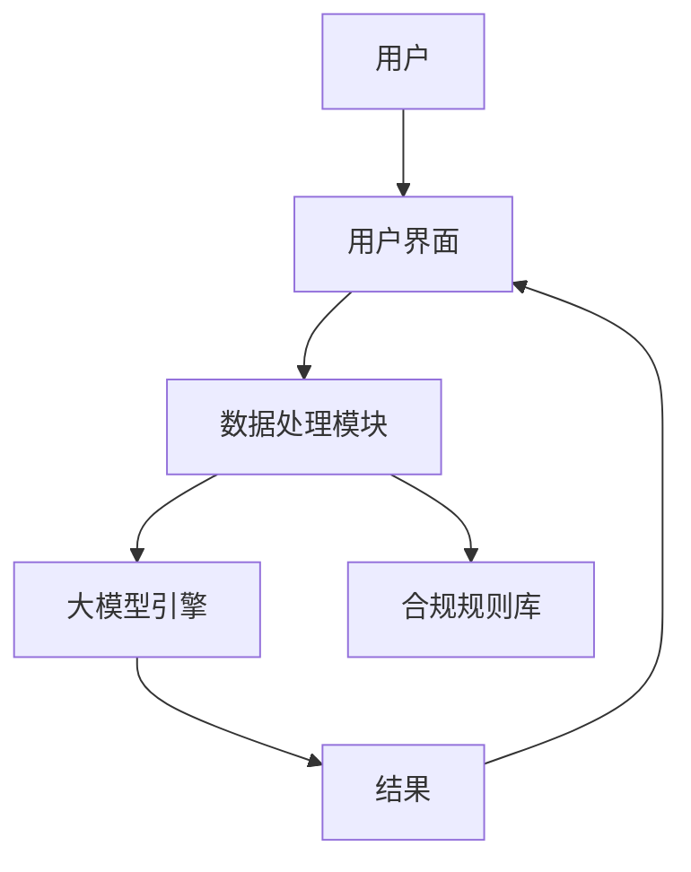
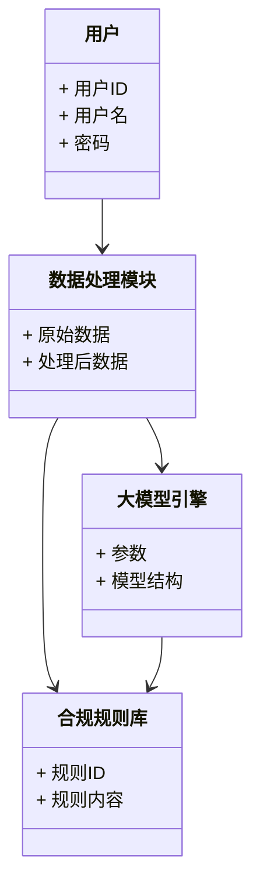
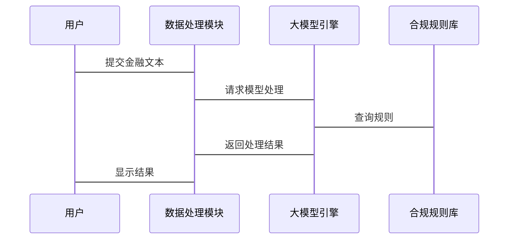

                 


# 构建基于大模型的金融监管合规自动化平台

> 关键词：大模型，金融监管，合规自动化，NLP，系统架构

> 摘要：本文详细探讨了基于大模型的金融监管合规自动化平台的构建过程，涵盖平台背景、技术原理、系统架构、项目实战及最佳实践等方面，为读者提供全面的技术指导。

---

# 第一部分: 金融监管合规自动化平台的背景与需求

## 第1章: 金融监管合规自动化平台概述

### 1.1 问题背景与需求分析

#### 1.1.1 传统金融监管的痛点
传统的金融监管依赖人工审查和简单的规则匹配，存在以下问题：
- **效率低**：人工审查耗时长，难以应对海量数据。
- **精准度低**：规则匹配难以覆盖复杂的金融场景。
- **合规成本高**：需要大量专业人员，成本高昂。
- **灵活性差**：难以快速适应监管政策的变化。

#### 1.1.2 合规自动化的需求
随着金融市场的复杂化和监管要求的严格化，金融机构亟需自动化合规解决方案：
- **提升效率**：快速处理海量数据，降低人工成本。
- **提高精准度**：通过智能算法识别复杂合规问题。
- **增强灵活性**：快速调整以适应新的监管政策。

#### 1.1.3 大模型技术的引入
大模型（如GPT系列）具有强大的自然语言处理能力，能够理解复杂的金融文本，适用于：
- **智能合规审查**：自动识别合同、报告中的合规问题。
- **风险预警**：通过分析市场动态和新闻，预测潜在风险。
- **智能问答**：为用户提供实时的合规咨询。

---

### 1.2 金融监管合规平台的定义与目标

#### 1.2.1 定义
金融监管合规自动化平台是一个基于大模型的智能系统，用于自动化处理金融领域的合规审查、风险预警和智能问答。

#### 1.2.2 核心目标
- **自动化审查**：自动识别合同、报告中的合规问题。
- **风险预警**：通过分析市场动态和新闻，预测潜在风险。
- **智能问答**：为用户提供实时的合规咨询。

#### 1.2.3 平台边界与外延
- **边界**：专注于合规审查和风险预警，不涉及具体的金融交易执行。
- **外延**：可扩展至金融数据分析、客户行为分析等领域。

---

### 1.3 平台核心要素与组成结构

#### 1.3.1 核心要素分析
- **大模型引擎**：负责文本理解和生成。
- **合规规则库**：存储金融领域的合规规则。
- **数据处理模块**：处理和解析金融文本。
- **用户交互界面**：供用户进行查询和操作。

#### 1.3.2 组成结构图


---

### 1.4 本章小结
本章介绍了金融监管合规自动化平台的背景、定义、目标及核心要素，为后续的技术实现奠定了基础。

---

# 第二部分: 基于大模型的金融监管合规自动化技术基础

## 第2章: AI大模型的核心原理与技术特点

### 2.1 大模型的基本原理

#### 2.1.1 大模型的参数规模
- 大模型通常拥有 billions（十亿）级别的参数，例如GPT-3拥有175 billion参数。
- 参数规模直接影响模型的理解能力和生成能力。

#### 2.1.2 大模型的训练方法
- **预训练**：利用大规模通用数据（如书籍、网页）进行无监督学习。
- **微调**：在特定领域数据上进行有监督训练，适应金融场景。

#### 2.1.3 大模型的注意力机制
- **自注意力机制**：模型能够关注输入序列中重要的部分。
- **多头注意力机制**：通过多个子空间的注意力计算，提升模型的表达能力。

---

### 2.2 大模型在金融领域的应用特点

#### 2.2.1 金融文本处理的特殊性
- **专业术语多**：金融领域有大量专业术语和复杂句式。
- **数据稀疏性**：某些金融场景的数据量有限，难以训练专用模型。

#### 2.2.2 大模型的可解释性问题
- 大模型的决策过程难以解释，影响合规审查的透明性。
- 需要结合业务知识，为模型结果提供合理的解释。

#### 2.2.3 大模型的实时性挑战
- 大模型通常需要大量的计算资源，实时处理存在性能瓶颈。
- 通过模型压缩和优化可以提升实时性。

---

### 2.3 大模型与传统NLP技术的对比

#### 2.3.1 对比维度分析
| 对比维度       | 大模型               | 传统NLP技术         |
|----------------|----------------------|--------------------|
| 参数规模       | 大（ billions级别）   | 小（ millions级别） |
| 训练数据       | 大规模通用数据       | 专用领域数据         |
| 可解释性       | 低                   | 高                 |

#### 2.3.2 优劣势分析
- **优势**：大模型具有强大的通用性和生成能力。
- **劣势**：计算资源需求高，可解释性差。

---

### 2.4 本章小结
本章详细讲解了大模型的核心原理及其在金融领域的应用特点，分析了大模型与传统NLP技术的优劣势。

---

# 第三部分: 金融监管合规自动化平台的核心算法与模型

## 第3章: 大模型在金融合规中的算法原理

### 3.1 大模型的文本处理流程

#### 3.1.1 输入处理
- **文本预处理**：分词、去除停用词等。
- **向量表示**：将文本转换为向量表示（如Word Embedding）。

#### 3.1.2 编码器
- **自注意力机制**：计算输入序列中每个词的重要性。
- **前馈网络**：将注意力结果映射到更高维的空间。

#### 3.1.3 解码器
- **自注意力机制**：生成输出序列。
- **交叉注意力机制**：结合输入和输出的上下文信息。

---

### 3.2 大模型的注意力机制

#### 3.2.1 自注意力机制
$$
\text{Attention}(Q, K, V) = \text{softmax}\left(\frac{QK^T}{\sqrt{d_k}}\right)V
$$

其中：
- \( Q \)：查询向量。
- \( K \)：键向量。
- \( V \)：值向量。
- \( d_k \)：向量维度。

#### 3.2.2 多头注意力机制
$$
\text{Multi-head Attention}(Q, K, V) = \text{Concat}(\text{Attention}(Q_i, K_i, V_i), \dots, \text{Attention}(Q_j, K_j, V_j))
$$

其中：
- \( i, j \) 表示不同的头（head）。

---

### 3.3 大模型的训练与推理

#### 3.3.1 预训练过程
- 使用大规模通用数据（如书籍、网页）进行无监督学习。
- 目标函数：预测词的下一个词概率。

#### 3.3.2 微调过程
- 在金融领域数据上进行有监督训练。
- 目标函数：分类任务（如合规与否）。

#### 3.3.3 推理过程
- 输入金融文本，通过大模型生成结果。

---

### 3.4 金融合规场景下的模型优化

#### 3.4.1 数据增强
- **同义词替换**：替换部分词汇，增加数据多样性。
- **数据清洗**：去除噪音数据，提升模型性能。

#### 3.4.2 模型压缩
- **剪枝**：删除冗余参数。
- **量化**：降低参数精度（如从FP32到FP16）。

#### 3.4.3 模型融合
- **集成学习**：结合多个模型的结果，提升准确率。

---

### 3.5 本章小结
本章详细讲解了大模型在金融合规中的算法原理，包括文本处理流程、注意力机制、训练与推理过程，以及模型优化方法。

---

# 第四部分: 金融监管合规自动化平台的系统架构与设计

## 第4章: 平台系统架构设计

### 4.1 项目背景与目标
- **背景**：传统金融监管效率低，合规成本高。
- **目标**：构建一个基于大模型的自动化合规平台。

---

### 4.2 系统功能设计

#### 4.2.1 领域模型类图


---

### 4.3 系统架构设计

#### 4.3.1 架构图


#### 4.3.2 系统交互序列图


---

### 4.4 本章小结
本章详细设计了金融监管合规自动化平台的系统架构，包括功能设计、架构图和系统交互流程。

---

# 第五部分: 项目实战

## 第5章: 项目实战与分析

### 5.1 环境安装

```bash
pip install transformers
pip install torch
pip install mermaid
```

---

### 5.2 系统核心实现源代码

#### 5.2.1 数据处理模块
```python
class DataPreprocessor:
    def __init__(self):
        self.tokenizer = AutoTokenizer.from_pretrained('bert-base-uncased')

    def preprocess(self, text):
        inputs = self.tokenizer(text, return_tensors='np', padding=True, truncation=True)
        return inputs
```

#### 5.2.2 大模型引擎
```python
class ModelEngine:
    def __init__(self):
        self.model = AutoModel.from_pretrained('gpt2')
    
    def process(self, inputs):
        outputs = self.model.generate(inputs['input_ids'])
        return outputs
```

---

### 5.3 代码应用解读与分析
- **数据处理模块**：负责将金融文本转换为模型可接受的格式。
- **大模型引擎**：负责对预处理后的数据进行合规审查。

---

### 5.4 实际案例分析
假设输入一份金融合同，系统自动识别合规问题并生成报告。

---

### 5.5 本章小结
本章通过实战项目，详细讲解了金融监管合规自动化平台的核心实现过程。

---

# 第六部分: 最佳实践与总结

## 第6章: 最佳实践与总结

### 6.1 最佳实践 tips
- **数据安全**：金融数据敏感，需做好数据加密和访问控制。
- **模型优化**：通过剪枝和量化等技术提升模型性能。
- **持续学习**：定期更新模型，适应新的监管政策。

---

### 6.2 小结
本文详细探讨了基于大模型的金融监管合规自动化平台的构建过程，涵盖了背景、技术原理、系统架构、项目实战和最佳实践。

---

### 6.3 注意事项
- 大模型的计算资源需求较高，需做好硬件优化。
- 模型的可解释性问题需要结合业务知识进行处理。

---

### 6.4 拓展阅读
- **相关书籍**：《Deep Learning》
- **论文推荐**：《Attention Is All You Need》

---

# 作者：AI天才研究院 & 禅与计算机程序设计艺术

---

**本文由AI天才研究院 & 禅与计算机程序设计艺术联合撰写，转载请注明出处。**

