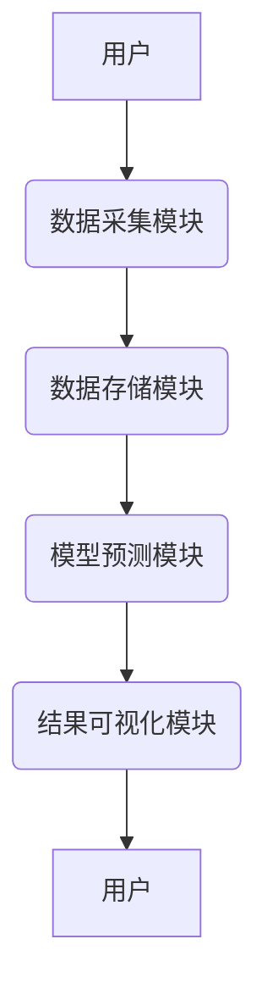

                 


# 构建基于大模型的金融监管政策影响链预测平台

> 关键词：大模型、金融监管、政策影响链、预测平台、人工智能

> 摘要：本文旨在介绍如何利用大模型构建金融监管政策影响链预测平台。首先分析了传统金融监管的局限性，提出了基于大模型的解决方案。通过详细阐述影响链的概念、模型训练、系统架构设计等关键部分，构建了一个完整的预测平台。最后，通过案例分析展示了平台的实际应用价值。

---

## 第1章: 金融监管政策影响链预测平台的背景与问题

### 1.1 问题背景
#### 1.1.1 金融监管的重要性
金融监管是维护金融市场稳定的重要手段。通过监管政策，可以防范系统性风险，保护投资者利益，促进市场公平竞争。

#### 1.1.2 政策影响链的定义
政策影响链是指政策的制定、实施及其对市场参与者的具体影响路径。例如，一项货币政策可能首先影响银行，再通过银行影响企业，最终影响整体经济。

#### 1.1.3 大模型在金融监管中的作用
大模型能够处理海量数据，识别复杂模式，预测政策影响链，帮助监管机构提前制定应对策略。

### 1.2 问题描述
#### 1.2.1 传统金融监管的局限性
传统监管手段依赖人工分析，效率低，覆盖面有限，难以应对金融市场快速变化的挑战。

#### 1.2.2 政策影响链分析的难点
政策影响链涉及多层主体和复杂的交互关系，传统方法难以准确预测和模拟。

#### 1.2.3 基于大模型的解决方案
利用大模型的自然语言处理和深度学习能力，可以自动分析政策文本，预测其对市场的影响。

### 1.3 问题解决与边界
#### 1.3.1 大模型在政策影响链预测中的优势
大模型能够处理非结构化数据，识别隐含关系，提供实时预测。

#### 1.3.2 解决方案的边界与外延
平台专注于政策影响链的预测，不涉及具体监管执行，但可为监管机构提供决策支持。

#### 1.3.3 核心要素与组成结构
核心要素包括政策文本、金融机构、政策影响，三者通过影响链联系起来。

---

## 第2章: 核心概念与联系

### 2.1 影响链预测的核心原理
#### 2.1.1 政策影响链的构成
政策影响链包括政策发布、影响传导和最终影响三个阶段。

#### 2.1.2 大模型在影响链预测中的角色
大模型负责政策文本分析、影响路径识别和预测结果生成。

#### 2.1.3 影响链预测的数学模型
使用图神经网络建模影响链，节点代表政策文本和金融机构，边代表影响关系。

### 2.2 核心概念对比分析
#### 2.2.1 大模型与传统算法的对比
大模型在处理复杂关系和非结构化数据方面更具优势，但计算资源需求较高。

#### 2.2.2 影响链预测与传统金融分析的对比
影响链预测更注重政策的多层影响，传统分析多关注直接影响。

#### 2.2.3 数据特征与模型性能的对比
高维数据特征有助于提升模型性能，但需注意过拟合问题。

### 2.3 ER实体关系图
```mermaid
er
    entity(政策文本) {
        id: string
        content: string
        date: date
    }
    entity(政策影响) {
        id: string
        impact: float
        description: string
    }
    entity(金融机构) {
        id: string
        name: string
        sector: string
    }
    relation(政策文本-政策影响) {
        policy_text_id: string
        impact_id: string
    }
    relation(政策影响-金融机构) {
        impact_id: string
        institution_id: string
    }
```

---

## 第3章: 算法原理与数学模型

### 3.1 大模型的训练与优化
#### 3.1.1 数据预处理
对政策文本进行分词、去停用词处理，提取关键词。

#### 3.1.2 模型训练流程
使用Transformer架构，进行预训练和微调，优化模型参数。

#### 3.1.3 模型调优策略
采用学习率衰减、早停等技术，防止过拟合。

### 3.2 影响链预测的数学模型
#### 3.2.1 概率论基础
概率用于表示政策影响发生的可能性。

#### 3.2.2 损失函数
$$ L = -\frac{1}{n}\sum_{i=1}^{n} [y_i \log p_i + (1-y_i)\log(1-p_i)] $$

#### 3.2.3 优化算法
使用Adam优化器，优化损失函数。

---

## 第4章: 系统分析与架构设计

### 4.1 项目场景介绍
平台用于预测政策对金融机构的影响，帮助监管机构制定应对策略。

### 4.2 系统功能设计
#### 4.2.1 数据采集模块
从公开渠道获取政策文本。

#### 4.2.2 模型预测模块
基于大模型预测政策影响链。

#### 4.2.3 可视化模块
展示预测结果，提供交互界面。

### 4.3 系统架构设计


### 4.4 接口设计
定义RESTful API，供其他系统调用预测结果。

---

## 第5章: 项目实战

### 5.1 环境安装
安装Python、TensorFlow、Mermaid等工具。

### 5.2 核心代码实现
```python
import tensorflow as tf
from tensorflow.keras import layers

model = tf.keras.Sequential([
    layers.Embedding(input_dim=..., output_dim=...),
    layers.Conv1D(filters=..., kernel_size=...),
    layers.GlobalMaxPooling1D(),
    layers.Dense(1, activation='sigmoid')
])
```

### 5.3 案例分析
分析某项货币政策，展示平台预测结果。

---

## 第6章: 总结与展望

### 6.1 最佳实践
数据质量、模型调优和结果可视化是关键。

### 6.2 小结
本文构建了基于大模型的金融监管政策影响链预测平台，展示了其在实际中的应用价值。

### 6.3 注意事项
模型性能依赖数据质量和计算资源，需谨慎处理。

### 6.4 拓展阅读
建议深入学习大模型和金融监管的结合应用。

---

## 作者：AI天才研究院 & 禅与计算机程序设计艺术

