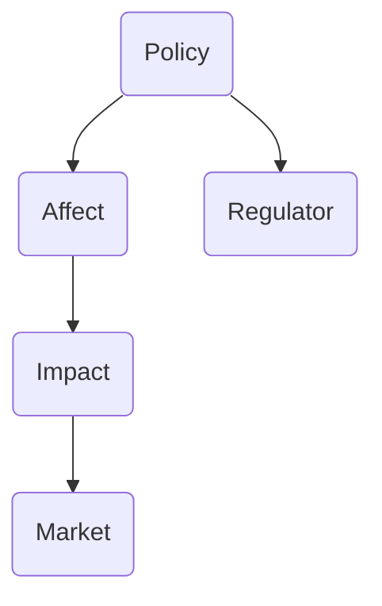
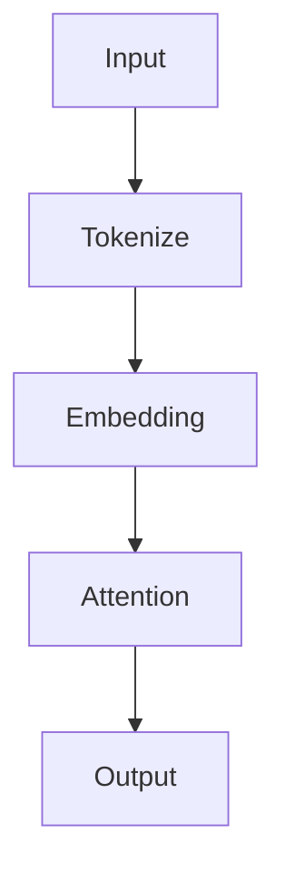
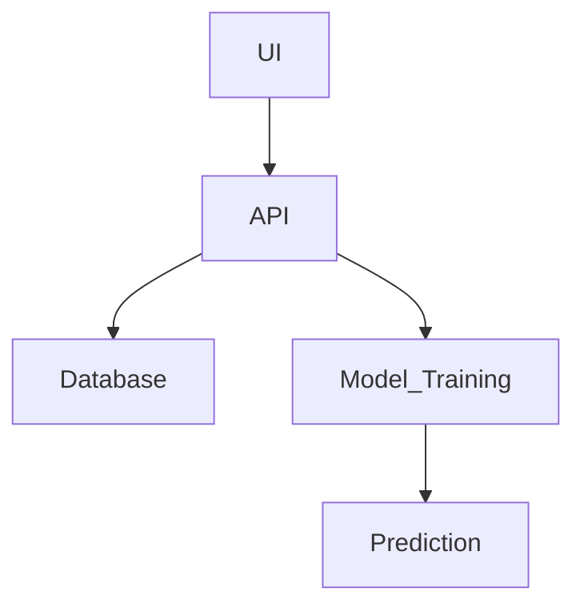
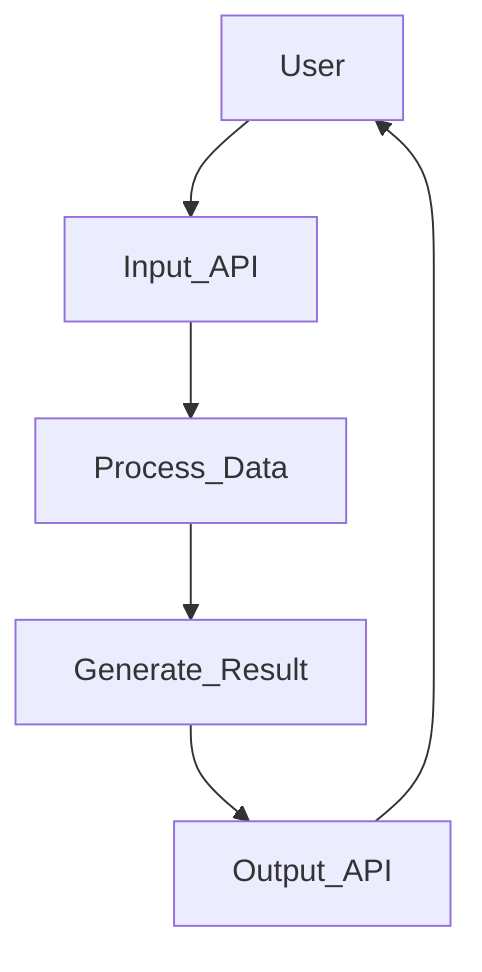

                 


# 构建基于大模型的金融监管政策影响预测平台

> 关键词：金融监管，政策影响，大模型，Transformer，预测平台

> 摘要：本文探讨了如何利用大模型技术构建金融监管政策影响预测平台，涵盖背景分析、算法原理、系统设计、项目实现及最佳实践，提供从理论到实践的全面指导。

---

## 第一部分：背景介绍

### 第1章：问题背景与描述

#### 1.1 问题背景
随着全球金融市场的复杂化，金融监管政策对市场的影响日益显著。准确预测政策变化及其影响，对于金融机构和投资者至关重要。然而，传统方法依赖专家经验，难以处理海量数据和复杂关系。

#### 1.2 问题描述
传统政策影响评估存在主观性强、数据处理能力有限、预测精度低等问题。大模型凭借其强大的数据处理和模式识别能力，为解决这些问题提供了新思路。

#### 1.3 问题解决
通过引入大模型，我们能够实时分析多源数据，提取隐藏模式，生成高精度的预测结果。这不仅提高了预测的准确性，还为决策者提供了有力支持。

#### 1.4 边界与外延
本研究聚焦于政策文本和市场数据，暂不考虑政策执行过程中的微观因素。未来可扩展至多模态数据和实时预测。

### 第2章：核心概念与联系

#### 2.1 核心概念
- **金融监管政策**：政府为维护金融市场稳定而发布的规则和指导。
- **大模型**：基于深度学习的大型神经网络模型，如Transformer。
- **政策影响预测**：利用模型预测政策对市场的影响。

#### 2.2 对比分析
| 对比维度 | 传统模型 | 大模型 |
|----------|----------|--------|
| 数据处理 | 小规模数据 | 大规模数据 |
| 模型复杂度 | 低 | 高 |
| 预测精度 | 低 | 高 |

#### 2.3 ER实体关系图


---

## 第二部分：算法原理

### 第3章：大模型算法原理

#### 3.1 模型结构
- **Transformer架构**：由编码器和解码器组成，适用于处理序列数据。
- **多层感知机**：用于非序列数据的特征提取。

#### 3.2 模型训练流程


#### 3.3 数学模型
- **注意力机制公式**
  $$ \text{Attention}(Q, K, V) = \text{softmax}\left(\frac{QK^T}{\sqrt{d_k}}\right)V $$
- **损失函数**
  $$ \mathcal{L} = -\sum_{i=1}^{n} y_i \log p(y_i) + (1 - y_i) \log(1 - p(y_i)) $$

#### 3.4 代码实现
```python
import torch

class Attention(nn.Module):
    def __init__(self, d_model, n_heads, d_k=None):
        super(Attention, self).__init__()
        self.n_heads = n_heads
        if d_k is None:
            d_k = d_model // n_heads
        self.linears = clones(lambda: nn.Linear(d_model, d_k), 4)
        
    def forward(self, x):
        # x: batch_size x len x d_model
        x = x.view(-1, x.size(-1))
        qs, ks, vs = [l(x) for l in self.linears[1:4]]
        d_k = ks.size(-1)
        attn = (qs @ ks.transpose(-2, -1)) / torch.sqrt(torch.tensor(d_k, dtype=torch.float))
        attn = F.softmax(attn, dim=-1)
        return (attn @ vs).view(x.size(0), -1, self.n_heads * (d_k))
```

---

## 第三部分：系统架构设计

### 第4章：系统分析与架构

#### 4.1 功能设计
- **数据采集模块**：收集政策文本和市场数据。
- **模型训练模块**：训练和优化模型。
- **预测与分析模块**：生成预测结果并分析。

#### 4.2 系统架构图


#### 4.3 接口设计
- **数据接口**：定义数据格式和传输协议。
- **模型接口**：定义模型输入输出格式。
- **结果接口**：定义结果展示格式。

#### 4.4 交互流程图


---

## 第四部分：项目实战

### 第5章：项目实现

#### 5.1 环境安装
- **依赖库**：PyTorch、Transformer库、Scikit-learn。
- **环境配置**：建议使用虚拟环境，安装所需库。

#### 5.2 核心代码实现
```python
import torch
import torch.nn as nn
import torch.optim as optim

class PolicyImpactPredictor(nn.Module):
    def __init__(self, input_dim, hidden_dim, output_dim):
        super(PolicyImpactPredictor, self).__init__()
        self.fc1 = nn.Linear(input_dim, hidden_dim)
        self.fc2 = nn.Linear(hidden_dim, output_dim)
        self.dropout = nn.Dropout(0.5)
        
    def forward(self, x):
        x = torch.relu(self.fc1(x))
        x = self.dropout(x)
        x = torch.sigmoid(self.fc2(x))
        return x

def train(model, criterion, optimizer, train_loader):
    for epoch in range(num_epochs):
        for batch, labels in train_loader:
            outputs = model(batch)
            loss = criterion(outputs, labels)
            loss.backward()
            optimizer.step()
            optimizer.zero_grad()
```

#### 5.3 案例分析
- **数据准备**：收集政策文本和市场数据，进行预处理。
- **模型训练**：使用训练数据训练模型。
- **预测与分析**：输入新政策，模型输出影响评估。

---

## 第五部分：最佳实践与小结

### 第6章：最佳实践

#### 6.1 小结
本文详细介绍了构建基于大模型的金融监管政策影响预测平台的全过程，从背景分析到系统实现，提供了全面的技术指导。

#### 6.2 注意事项
- 数据质量至关重要，需确保数据准确性和完整性。
- 模型调参需谨慎，避免过拟合。
- 部署时需考虑计算资源和数据隐私。

#### 6.3 拓展阅读
推荐深入研究大模型的优化技术、多模态数据融合方法和实时预测系统。

---

## 作者：AI天才研究院/AI Genius Institute & 禅与计算机程序设计艺术/Zen And The Art of Computer Programming

---

通过以上结构，文章系统地介绍了构建基于大模型的金融监管政策影响预测平台的各个方面，从理论到实践，为读者提供了深入的技术指导。

