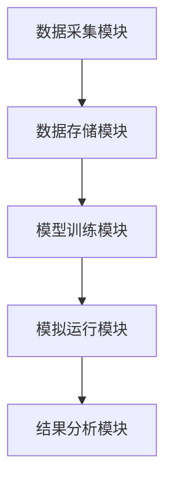

                 


# 构建基于大模型的金融监管沙盒模拟平台

> 关键词：大模型、金融监管、沙盒模拟、系统架构、算法原理、项目实战

> 摘要：本文详细探讨了如何利用大模型技术构建金融监管沙盒模拟平台。从背景介绍、核心概念分析到系统架构设计、算法实现，再到项目实战和最佳实践，全面解析了该平台的构建过程。通过本文，读者可以系统性地了解大模型在金融监管中的应用价值，掌握平台构建的关键技术和方法。

---

# 第一部分: 金融监管沙盒与大模型概述

## 第1章: 金融监管沙盒概述

### 1.1 金融监管沙盒的定义与背景

#### 1.1.1 金融监管沙盒的定义
金融监管沙盒（Financial Regulatory Sandbox）是指一个模拟的金融环境，允许金融机构在受控的环境中测试新的产品、服务或流程，同时确保符合相关法律法规。它旨在降低创新风险，同时保护消费者和市场的稳定性。

#### 1.1.2 金融监管沙盒的发展背景
随着金融科技的快速发展，金融机构需要不断推出新的产品和服务以满足市场需求。然而，金融创新往往伴随着一定的风险，包括合规风险、操作风险和市场风险。传统的监管方式难以应对快速变化的金融环境，因此需要一种更灵活、更高效的监管工具。

#### 1.1.3 金融监管沙盒的核心目标
- 提供一个安全的测试环境，允许金融机构在模拟的真实市场条件下测试新产品和服务。
- 降低创新风险，确保创新活动符合监管要求。
- 提高监管效率，减少对市场的干扰。

### 1.2 大模型技术的概述

#### 1.2.1 大模型技术的基本概念
大模型（Large Model）是指具有大量参数的深度学习模型，通常基于Transformer架构。大模型在自然语言处理、图像识别等领域表现出色，具有强大的数据理解和生成能力。

#### 1.2.2 大模型技术的演进历程
从传统的RNN到现代的Transformer架构，大模型技术经历了多次演进。随着计算能力的提升和数据量的增加，大模型的规模和性能不断提高，应用场景也逐渐扩展到金融、医疗、教育等多个领域。

#### 1.2.3 大模型技术在金融领域的应用潜力
- **风险评估**：通过分析历史数据，预测潜在的金融风险。
- **智能投顾**：为投资者提供个性化的投资建议。
- **合规监控**：自动检测交易行为中的异常情况，确保符合监管要求。

### 1.3 本章小结
本章介绍了金融监管沙盒的概念及其在现代金融环境中的重要性，同时探讨了大模型技术的基本概念和在金融领域的应用潜力。

---

## 第2章: 大模型在金融监管中的核心作用

### 2.1 金融监管中的关键问题

#### 2.1.1 金融风险的识别与预警
金融市场的波动性和复杂性使得风险的识别和预警成为一项挑战。传统的基于规则的系统难以应对复杂的金融环境，而大模型可以通过分析大量历史数据，发现潜在的风险信号。

#### 2.1.2 金融行为的预测与分析
金融机构需要预测市场行为和客户行为，以便制定有效的策略。大模型可以通过对历史数据和市场动态的分析，提供更准确的预测。

#### 2.1.3 金融政策的模拟与优化
政策制定者需要在实施新政策前进行模拟，以评估其可能的影响。大模型可以通过模拟不同政策情景，帮助政策制定者优化政策设计。

### 2.2 大模型在金融监管中的优势

#### 2.2.1 大模型的高维度数据处理能力
大模型可以处理多源异构数据，包括文本、图像和结构化数据，从而提供更全面的分析能力。

#### 2.2.2 大模型的实时分析能力
大模型可以实时处理数据，提供实时的监控和预警，帮助金融机构快速响应市场变化。

#### 2.2.3 大模型的自适应学习能力
大模型可以通过在线学习不断更新模型参数，适应市场的变化，保持模型的准确性。

### 2.3 本章小结
本章分析了金融监管中的关键问题，并探讨了大模型在解决这些问题中的独特优势。

---

## 第3章: 金融监管沙盒模拟平台的系统架构

### 3.1 系统功能模块划分

#### 3.1.1 数据采集模块
- **功能**：从多种数据源（如交易数据、新闻、社交媒体）收集数据。
- **技术**：使用爬虫、API接口等方式获取数据。
- **输出**：结构化数据，供后续模块使用。

#### 3.1.2 模型训练模块
- **功能**：对数据进行预处理、特征提取，并训练大模型。
- **技术**：使用深度学习框架（如TensorFlow、PyTorch）进行模型训练。
- **输出**：训练好的大模型。

#### 3.1.3 模拟运行模块
- **功能**：在模拟环境中运行模型，测试新政策或产品。
- **技术**：构建模拟环境，定义测试用例。
- **输出**：模拟结果，包括数据变化和模型表现。

#### 3.1.4 结果分析模块
- **功能**：分析模拟结果，生成报告。
- **技术**：使用可视化工具（如Matplotlib、Tableau）进行数据展示。
- **输出**：分析报告，包括风险评估、政策效果等。

### 3.2 系统架构图


### 3.3 本章小结
本章详细描述了金融监管沙盒模拟平台的系统架构，包括功能模块划分和系统架构图。

---

## 第4章: 大模型算法原理与实现

### 4.1 大模型的基本原理

#### 4.1.1 大模型的训练目标
大模型的目标是通过大量数据学习数据的分布，生成与训练数据类似的输出。

#### 4.1.2 大模型的自注意力机制
自注意力机制允许模型在处理输入时，关注不同的位置，捕捉长距离依赖关系。

#### 4.1.3 大模型的训练过程
1. 数据预处理：清洗、归一化。
2. 模型初始化：随机初始化参数。
3. 前向传播：计算模型输出。
4. 损失计算：计算损失函数。
5. 反向传播：计算梯度，更新参数。

### 4.2 大模型的数学模型

#### 4.2.1 Transformer模型
$$\text{Transformer}(x) = \text{Self-attention}(x) + \text{FFN}(x)$$

#### 4.2.2 损失函数
$$\text{Loss} = -\frac{1}{N}\sum_{i=1}^{N}\log p(y_i|x_i)$$

#### 4.2.3 梯度下降
$$\theta = \theta - \eta \frac{\partial L}{\partial \theta}$$

### 4.3 本章小结
本章详细介绍了大模型的基本原理和数学模型。

---

## 第5章: 项目实战

### 5.1 环境安装与配置

#### 5.1.1 安装依赖
```bash
pip install tensorflow transformers pandas numpy
```

#### 5.1.2 配置GPU
```bash
export CUDA_VISIBLE_DEVICES=0
```

### 5.2 核心代码实现

#### 5.2.1 数据预处理
```python
import pandas as pd
import numpy as np

def preprocess(data):
    # 数据清洗和归一化
    data = data.dropna()
    data = (data - data.mean()) / data.std()
    return data
```

#### 5.2.2 模型训练
```python
import tensorflow as tf
from tensorflow import keras

def build_model(input_shape):
    model = keras.Sequential()
    model.add(keras.layers.Dense(64, activation='relu', input_shape=input_shape))
    model.add(keras.layers.Dense(1, activation='sigmoid'))
    model.compile(optimizer='adam', loss='binary_crossentropy', metrics=['accuracy'])
    return model
```

### 5.3 实际案例分析

#### 5.3.1 案例背景
假设我们希望模拟一个金融政策的效果，测试其对市场的影响。

#### 5.3.2 模拟运行
```python
# 定义模拟环境
def simulate(policy):
    # 初始化市场环境
    market = initialize_market()
    # 运行模拟
    for day in range(30):
        market = update_market(market, policy)
    return market
```

### 5.4 本章小结
本章通过实际案例展示了如何在金融监管沙盒模拟平台中使用大模型技术。

---

## 第6章: 最佳实践与总结

### 6.1 小结
- 本文详细探讨了构建基于大模型的金融监管沙盒模拟平台的关键技术。
- 从系统架构设计到算法实现，再到项目实战，全面解析了平台的构建过程。

### 6.2 注意事项
- 数据隐私和安全问题需要高度重视。
- 模型的可解释性和透明度是实际应用中的重要考量。
- 定期更新模型以适应市场变化。

### 6.3 拓展阅读
- 《大模型在金融领域的应用》
- 《金融监管沙盒的设计与实现》

---

作者：AI天才研究院/AI Genius Institute & 禅与计算机程序设计艺术 /Zen And The Art of Computer Programming

