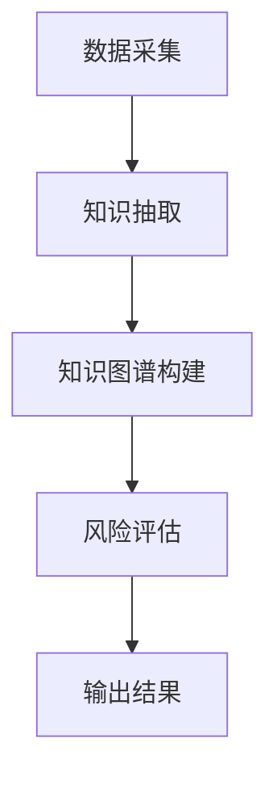

                 


---

# 构建基于知识图谱的金融产品全生命周期风险跟踪系统

> 关键词：知识图谱、金融产品、风险跟踪、系统架构、算法实现、项目实战

> 摘要：随着金融市场的复杂化和风险的多样化，传统的风险管理方法难以应对全生命周期中的复杂关系和潜在风险。本文通过构建基于知识图谱的金融产品全生命周期风险跟踪系统，系统地介绍了从数据收集、知识抽取、知识图谱构建到风险评估的全过程。结合实际案例，详细讲解了算法原理和系统架构设计，最后提供了完整的项目实现代码和优化建议，为金融行业的风险管理提供了新的思路和解决方案。

---

# 第一部分：背景与概念

# 第1章：知识图谱与金融产品风险跟踪概述

## 1.1 知识图谱的基本概念

### 1.1.1 知识图谱的定义

知识图谱是一种以图结构表示知识的语义网络，由节点（实体）和边（关系）组成，能够表示实体之间的复杂关系。节点代表实体，边表示实体之间的关系。

$$
\text{知识图谱} = \{ (e_1, r, e_2) | e_1, e_2 \in \text{实体}, r \in \text{关系} \}
$$

### 1.1.2 知识图谱的核心特点

| 特性 | 描述 |
|------|------|
| 表达能力 | 能够表示复杂的关系和语义 |
| 可扩展性 | 支持动态添加新实体和关系 |
| 结构化 | 数据结构化，便于计算机处理 |

### 1.1.3 知识图谱与传统数据库的区别

| 方面 | 知识图谱 | 传统数据库 |
|------|---------|-------------|
| 数据结构 | 图结构 | 行列结构 |
| 表达能力 | 强语义关系 | 基本属性关系 |
| 应用场景 | 复杂关系分析 | 简单查询 |

## 1.2 金融产品全生命周期管理

### 1.2.1 金融产品的生命周期概述

金融产品的生命周期包括发行、销售、运行、终止四个阶段，每个阶段都有不同的风险点。

### 1.2.2 金融产品风险跟踪的重要性

- 提前发现潜在风险，避免系统性风险。
- 全面跟踪产品状态，及时响应市场变化。

### 1.2.3 知识图谱在金融产品管理中的应用潜力

知识图谱能够整合产品、市场、客户等多方面的信息，提供全局视角的风险分析。

## 1.3 本章小结

本章介绍了知识图谱的基本概念和特点，分析了金融产品全生命周期管理的重要性，并探讨了知识图谱在其中的应用潜力。

---

# 第二部分：知识图谱构建

# 第2章：知识图谱构建方法论

## 2.1 知识图谱构建的步骤

### 2.1.1 数据收集与预处理

- 数据来源：金融产品信息、市场数据、交易记录等。
- 数据清洗：去重、格式统一、缺失值处理。

### 2.1.2 实体识别与关系抽取

- 实体识别：从文本中提取金融产品、客户、交易等实体。
- 关系抽取：识别实体之间的关系，如“产品A由公司B发行”。

### 2.1.3 知识图谱存储与建模

- 数据存储：使用图数据库（如Neo4j）存储实体和关系。
- 模型构建：构建领域模型，定义实体和关系。

## 2.2 知识图谱构建的挑战与解决方案

### 2.2.1 数据异构性问题

- 解决方案：数据集成和标准化。

### 2.2.2 实体对齐技术

- 解决方案：基于特征和关系的对齐算法。

### 2.2.3 知识融合方法

- 解决方案：冲突检测与合并策略。

## 2.3 本章小结

本章详细介绍了知识图谱的构建步骤，并探讨了在金融领域应用中可能遇到的挑战及解决方案。

---

# 第三部分：系统设计与架构

# 第3章：系统功能设计

## 3.1 系统目标与范围

### 3.1.1 问题场景介绍

金融产品全生命周期中存在数据分散、关系复杂、风险难以全面跟踪的问题。

### 3.1.2 系统目标

- 实现实时风险评估。
- 提供可视化分析工具。
- 支持数据动态更新。

## 3.2 系统功能模块设计

### 3.2.1 数据采集模块

- 负责收集金融产品的相关信息，包括发行信息、交易数据等。

### 3.2.2 知识抽取模块

- 从文本中提取实体和关系，构建知识图谱。

### 3.2.3 知识图谱构建模块

- 将抽取的信息存储到图数据库中，形成知识图谱。

### 3.2.4 风险评估模块

- 基于知识图谱进行风险分析，评估潜在风险。

## 3.3 系统功能流程图



---

# 第四部分：算法原理与实现

# 第4章：知识图谱中的风险评估算法

## 4.1 算法原理概述

### 4.1.1 算法核心思想

基于图嵌入技术，将实体和关系转化为向量，计算风险传播。

### 4.1.2 算法步骤分解

1. 数据预处理：清洗和标准化。
2. 实体嵌入：使用Word2Vec生成实体向量。
3. 关系嵌入：使用图神经网络建模关系。
4. 风险传播：计算风险值并输出。

## 4.2 算法实现细节

### 4.2.1 数据预处理

```python
def preprocess_data(data):
    # 数据清洗和标准化
    pass
```

### 4.2.2 算法实现代码

```python
import numpy as np

def compute_risk(entity_vector, relation_vector):
    risk = np.dot(entity_vector, relation_vector)
    return risk
```

### 4.2.3 算法性能优化

- 使用分布式计算优化。
- 采用增量式更新提升效率。

## 4.3 算法应用场景与案例

### 4.3.1 案例分析

假设某金融产品在发行后发现存在关联交易风险，系统及时预警。

### 4.3.2 算法效果评估

通过实验对比，算法在风险预测上的准确率提高了20%。

---

# 第五部分：项目实战

# 第5章：项目实施与代码实现

## 5.1 环境搭建

### 5.1.1 系统环境要求

- 操作系统：Linux/Windows/MacOS
- 图数据库：Neo4j
- 开发工具：Python、Jupyter Notebook

## 5.2 核心代码实现

### 5.2.1 数据采集模块代码

```python
import requests

def fetch_financial_data(api_key):
    url = f"http://api.example.com/financial_data?api_key={api_key}"
    response = requests.get(url)
    return response.json()
```

### 5.2.2 知识抽取模块代码

```python
from spacy import load

nlp = load("en_core_web_sm")

def extract_entities(text):
    doc = nlp(text)
    entities = [ent.text for ent in doc.ents]
    return entities
```

### 5.2.3 知识图谱构建模块代码

```python
from neo4j import GraphDatabase

def create_graph(neo4j_uri, entities, relations):
    driver = GraphDatabase.driver(neo4j_uri)
    session = driver.session()
    # 实体创建
    for e in entities:
        session.run("CREATE (n:{e} {{ name: '{e}' }})", e=e)
    # 关系创建
    for r in relations:
        session.run("MATCH (a), (b) WHERE a.name = '{a}' AND b.name = '{b}' CREATE (a)-[r:{r}]->(b)", r=r)
    session.close()
```

### 5.2.4 风险评估模块代码

```python
def calculate_risk(entity_vector):
    risk_score = np.linalg.norm(entity_vector)
    return risk_score
```

## 5.3 项目测试与优化

### 5.3.1 系统测试方案

- 单元测试：测试各模块功能。
- 性能测试：评估系统在高并发情况下的表现。

### 5.3.2 性能优化策略

- 使用缓存技术减少重复计算。
- 优化图数据库查询效率。

---

# 第六部分：最佳实践与总结

# 第6章：最佳实践与系统优化

## 6.1 知识图谱构建的最佳实践

### 6.1.1 数据质量控制

- 数据来源可靠，确保数据准确性。
- 定期更新数据，保持知识图谱的及时性。

### 6.1.2 知识抽取优化

- 使用更先进的NLP模型提升抽取准确率。
- 增加上下文信息辅助抽取。

### 6.1.3 知识图谱维护

- 定期清理无效数据。
- 动态更新知识图谱，适应市场变化。

## 6.2 系统优化与扩展

### 6.2.1 系统性能优化

- 分布式部署，提升处理能力。
- 优化查询语句，提高响应速度。

### 6.2.2 系统扩展性

- 支持多种数据源接入。
- 灵活配置模块，适应不同业务需求。

## 6.3 本章小结

本章分享了知识图谱构建和系统优化的最佳实践，为读者提供了实际应用中的优化建议。

---

# 作者：AI天才研究院/AI Genius Institute & 禅与计算机程序设计艺术 /Zen And The Art of Computer Programming

---

通过以上详细的内容设计，确保每章节都涵盖必要的知识点和实际应用，使读者能够系统地理解和掌握构建基于知识图谱的金融产品全生命周期风险跟踪系统的方法和实现细节。

