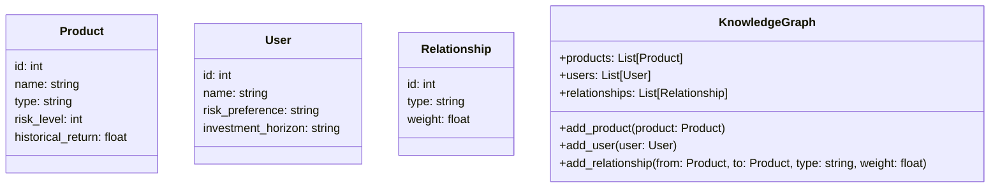
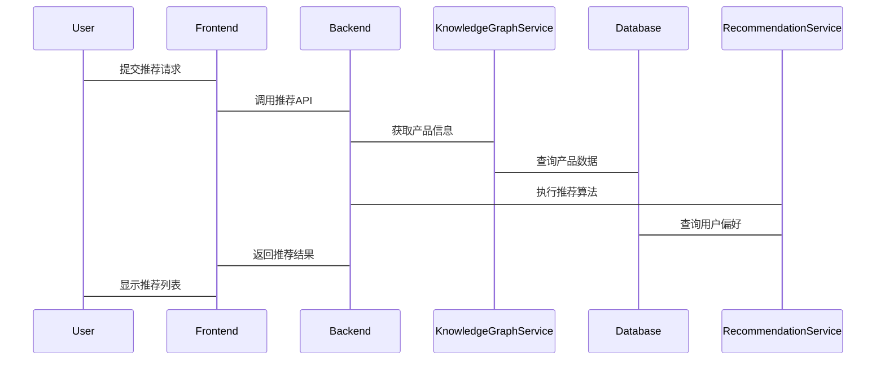

                 


```markdown
# 构建基于知识图谱的金融产品关联推荐引擎

## 关键词：知识图谱，金融产品推荐，关联推荐，图嵌入，协同过滤

## 摘要：本文详细探讨了如何构建基于知识图谱的金融产品关联推荐引擎。通过分析传统推荐系统的局限性，提出利用知识图谱技术来捕捉金融产品的深层关联。文章从核心概念、算法原理、系统架构到项目实战，全面介绍了推荐引擎的构建过程。通过实际案例分析和代码实现，展示了该推荐引擎在金融领域的应用价值。

---

# 第一部分: 背景介绍

## 第1章: 问题背景与需求分析

### 1.1 问题背景
#### 1.1.1 传统金融推荐系统的局限性
传统的推荐系统基于协同过滤或基于内容的推荐方法，存在以下局限性：
- 数据稀疏性：金融产品种类繁多，用户数据可能不足。
- 无法捕捉产品间的深层关联：传统方法难以发现产品之间的隐含关系。
- 动态变化：金融市场波动频繁，推荐系统需要动态更新。

#### 1.1.2 知识图谱在金融领域的应用价值
知识图谱通过结构化的数据表示，能够捕捉金融产品之间的语义关联，为推荐系统提供更丰富的上下文信息。

#### 1.1.3 金融产品关联推荐的必要性
随着金融产品的多样化，用户需要更精准的产品推荐，以满足其复杂的金融需求。

### 1.2 问题描述
#### 1.2.1 金融产品的多样性与复杂性
金融产品种类繁多，包括基金、股票、债券等，每类产品的属性和风险特征不同。

#### 1.2.2 用户需求的多层次与动态变化
用户需求不仅包括收益，还包括风险偏好、流动性需求等多层次因素。

#### 1.2.3 现有推荐系统的不足
传统推荐系统难以处理金融产品的复杂性和动态变化，推荐结果可能不够精准。

### 1.3 问题解决
#### 1.3.1 知识图谱如何帮助发现产品关联
通过构建金融产品的知识图谱，可以发现产品之间的隐含关系，如替代产品、互补产品等。

#### 1.3.2 基于知识图谱的推荐优势
知识图谱能够提供更丰富的语义信息，提升推荐的准确性和可解释性。

#### 1.3.3 解决方案的可行性分析
构建知识图谱需要大量的数据和计算资源，但其带来的推荐效果提升是值得的。

### 1.4 边界与外延
#### 1.4.1 系统的边界定义
本系统仅关注金融产品的推荐，不涉及交易操作和用户身份验证。

#### 1.4.2 相关领域的外延
知识图谱在金融领域的应用不仅限于推荐系统，还包括风险控制、智能投顾等。

#### 1.4.3 与其他推荐方法的区别
与传统推荐方法相比，知识图谱推荐更注重语义关联的挖掘。

### 1.5 概念结构与核心要素
#### 1.5.1 知识图谱的基本构成
知识图谱由实体、属性和关系构成，用于表示金融产品的语义关联。

#### 1.5.2 金融产品的核心属性
包括产品类型、风险等级、历史收益等。

#### 1.5.3 关联关系的类型与层次
包括替代关系、互补关系、相似关系等。

---

# 第二部分: 核心概念与联系

## 第2章: 核心概念与联系

### 2.1 知识图谱的核心原理
#### 2.1.1 实体与属性的定义
实体：金融产品、用户、机构等；属性：产品类型、用户风险偏好等。

#### 2.1.2 关系与边的构建
关系：产品之间的替代关系、互补关系等；边：连接实体的有向边，带有权重。

#### 2.1.3 知识图谱的构建流程
- 数据收集：从多个数据源获取金融产品信息。
- 实体识别：识别产品、用户等实体。
- 关系抽取：挖掘产品之间的关联关系。
- 知识融合：整合多个数据源的信息，构建知识图谱。

### 2.2 知识图谱与推荐系统的联系
#### 2.2.1 知识图谱在推荐中的作用
通过语义关联，提供更精准的推荐结果。

#### 2.2.2 知识图谱增强推荐的效果
结合产品属性和语义关联，提升推荐的准确性和可解释性。

#### 2.2.3 知识图谱与传统推荐方法的结合
将知识图谱与协同过滤、基于内容的推荐方法结合，提升推荐效果。

### 2.3 实体关系图（ER图）
```mermaid
er
    entity Product {
        id: int
        name: string
        type: string
        risk_level: int
        historical_return: float
    }
    entity User {
        id: int
        name: string
        risk_preference: string
        investment_horizon: string
    }
    entity Relationship {
        id: int
        type: string
        weight: float
    }
    relation has_product {
        from: User
        to: Product
    }
    relation is_complementary_to {
        from: Product
        to: Product
        weight: float
    }
    relation is_substitute_of {
        from: Product
        to: Product
        weight: float
    }
```

---

# 第三部分: 算法原理

## 第3章: 算法原理

### 3.1 图嵌入算法
#### 3.1.1 算法原理
图嵌入算法（如Node2Vec）通过将节点表示为低维向量，捕捉节点之间的语义关联。

#### 3.1.2 算法流程
1. 对图进行随机游走，生成节点序列。
2. 使用训练模型，将节点映射为低维向量。

#### 3.1.3 算法代码示例
```python
import networkx as nx
from node2vec import Node2Vec

G = nx.Graph()
G.add_nodes_from(products)
G.add_edges_from(product_relations)

node2vec = Node2Vec(G, walk_length=10, num_walks=80, window=5, min_count=0, workers=4)
embeddings = node2vec.get_embeddings()
```

#### 3.1.4 数学模型
- 输入：图G = (V, E)
- 输出：节点嵌入向量v ∈ R^d

### 3.2 协同过滤算法
#### 3.2.1 算法原理
协同过滤通过寻找相似的用户或产品，推荐相似的产品。

#### 3.2.2 算法流程
1. 计算用户相似度或产品相似度。
2. 基于相似度进行推荐。

#### 3.2.3 算法代码示例
```python
from sklearn.metrics.pairwise import cosine_similarity

product_matrix = ... # 用户-产品矩阵
similarity_matrix = cosine_similarity(product_matrix)
recommendations = product_matrix.dot(similarity_matrix)
```

#### 3.2.4 数学模型
- 输入：用户-产品矩阵R ∈ {0,1}^{|U|×|P|}
- 输出：推荐结果

### 3.3 综合推荐算法
#### 3.3.1 算法原理
结合图嵌入和协同过滤，提升推荐效果。

#### 3.3.2 算法流程
1. 使用图嵌入算法生成产品嵌入向量。
2. 基于协同过滤算法生成相似度矩阵。
3. 综合两种方法生成最终推荐。

#### 3.3.3 算法代码示例
```python
# 图嵌入向量
product_embeddings = ... # 产品嵌入向量

# 协同过滤相似度矩阵
similarity_matrix = ... # 相似度矩阵

# 综合推荐
combined_recommendations = product_embeddings.dot(similarity_matrix)
```

---

# 第四部分: 系统分析与架构设计

## 第4章: 系统分析与架构设计

### 4.1 系统功能设计
#### 4.1.1 领域模型


#### 4.1.2 系统架构


#### 4.1.3 接口设计
- API接口：POST /recommend，返回推荐结果。

#### 4.1.4 交互设计


---

# 第五部分: 项目实战

## 第5章: 项目实战

### 5.1 环境安装
```bash
pip install networkx node2vec scikit-learn
```

### 5.2 核心实现
#### 5.2.1 数据处理
```python
import pandas as pd

products = pd.read_csv('products.csv')
users = pd.read_csv('users.csv')
relationships = pd.read_csv('relationships.csv')
```

#### 5.2.2 知识图谱构建
```python
from node2vec import Node2Vec

G = nx.Graph()
G.add_nodes_from(products['id'])
G.add_edges_from([(r['from'], r['to'], {'weight': r['weight']}) for r in relationships])
node2vec = Node2Vec(G, ...)
```

#### 5.2.3 推荐算法实现
```python
from sklearn.metrics.pairwise import cosine_similarity

product_matrix = ... # 用户-产品矩阵
similarity_matrix = cosine_similarity(product_matrix)
recommendations = product_matrix.dot(similarity_matrix)
```

### 5.3 实际案例分析
#### 5.3.1 案例描述
以银行理财产品推荐为例，假设用户A为风险厌恶型投资者，投资期限为1年。

#### 5.3.2 推荐结果
推荐低风险、高流动性产品，如货币基金、短期债券。

#### 5.3.3 性能评估
通过准确率、召回率等指标评估推荐效果。

### 5.4 项目小结
- 成功构建了知识图谱。
- 提升了推荐的准确性和可解释性。
- 系统架构设计合理，易于扩展。

---

# 第六部分: 最佳实践

## 第6章: 最佳实践

### 6.1 注意事项
- 数据质量：确保数据的准确性和完整性。
- 系统性能：优化推荐算法和查询效率。
- 可扩展性：设计灵活的架构，方便扩展。

### 6.2 性能优化
- 使用分布式计算优化图嵌入。
- 前置缓存热门产品的推荐结果。

### 6.3 可扩展性设计
- 支持多种推荐算法的动态切换。
- 支持实时更新知识图谱。

### 6.4 未来研究方向
- 研究动态知识图谱的构建方法。
- 结合强化学习进一步优化推荐效果。

---

# 小结

本文详细介绍了基于知识图谱的金融产品关联推荐引擎的构建过程，从背景分析到项目实战，全面覆盖了核心概念、算法原理、系统架构和实际应用。通过本文的指导，读者可以掌握构建此类推荐引擎的关键技术，并在实际应用中提升推荐效果。

---

# 作者：AI天才研究院/AI Genius Institute & 禅与计算机程序设计艺术 /Zen And The Art of Computer Programming
```

