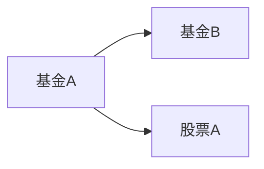
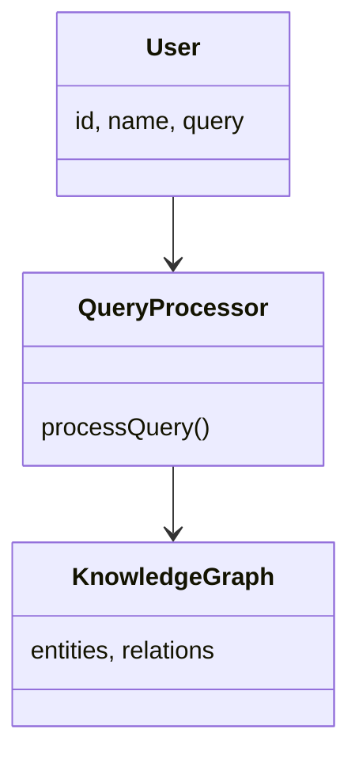
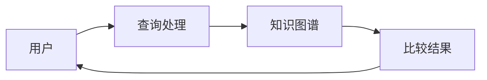
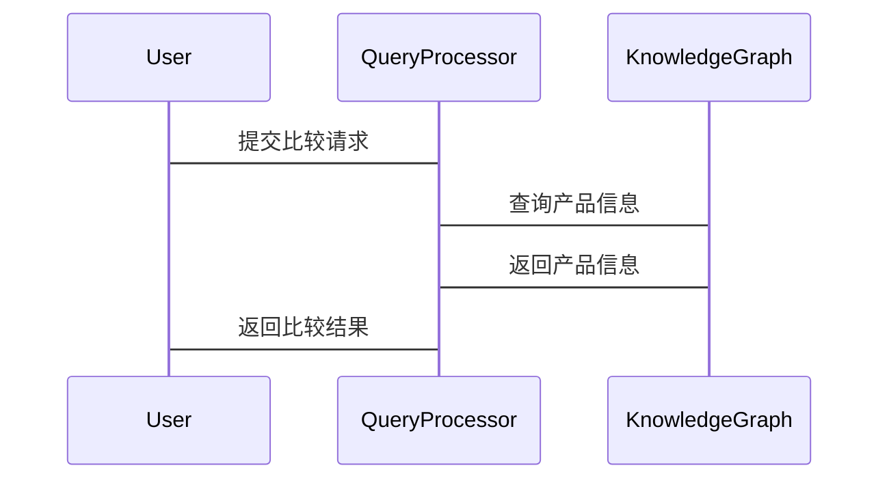

                 


# 构建基于知识图谱的金融产品比较系统

> 关键词：知识图谱，金融产品比较，实体识别，关系抽取，系统架构设计

> 摘要：本文详细探讨了如何构建基于知识图谱的金融产品比较系统。首先介绍了系统的背景与概述，包括知识图谱的基本概念、问题背景与描述。接着深入分析了系统的核心概念与知识图谱的构建方法，包括实体识别、关系抽取等算法原理与数学模型。然后详细设计了系统的架构，包括功能设计、架构设计、接口设计与交互流程。最后通过项目实战展示了系统的实现过程，并总结了最佳实践与注意事项。

---

## 第1章 知识图谱与金融产品比较系统概述

### 1.1 知识图谱的背景与概念

#### 1.1.1 知识图谱的定义与特点
知识图谱是一种用于表示知识的数据结构，通过实体和关系的网络来描述世界。其特点包括：
- **结构化**：将实体和关系明确表示，便于计算机理解和推理。
- **语义丰富**：通过关系网络，能够捕捉实体间的复杂联系。
- **可扩展性**：支持大规模数据的存储与处理。

#### 1.1.2 知识图谱在金融领域的应用
在金融领域，知识图谱可以用于：
- 金融产品分类与比较。
- 风险评估与预警。
- 投资组合优化。

#### 1.1.3 金融产品比较系统的必要性
传统金融产品比较方法存在以下问题：
- 数据分散，难以整合。
- 信息非结构化，难以处理。
- 比较维度单一，无法全面分析。

知识图谱能够通过结构化数据和语义分析，解决这些问题，提供更全面的比较能力。

### 1.2 问题背景与描述

#### 1.2.1 问题背景
金融产品的种类繁多，且信息复杂。用户在选择金融产品时，需要考虑多个维度，如风险等级、收益预期、产品期限等。传统的比较方法难以满足这些需求。

#### 1.2.2 问题描述
本文旨在构建一个基于知识图谱的系统，能够：
- 自动化提取金融产品的关键信息。
- 建立产品之间的关系网络。
- 提供多维度的产品比较功能。

#### 1.2.3 系统的目标与边界
- **目标**：构建一个能够快速、准确地比较金融产品的系统。
- **边界**：仅关注产品的基本信息和直接关系，不涉及实时市场数据。

---

## 第2章 核心概念与知识图谱构建

### 2.1 知识图谱的核心原理

#### 2.1.1 实体与属性
- **实体**：金融产品（如基金、股票）。
- **属性**：产品类型、风险等级、收益预期。

#### 2.1.2 实体关系
- **关系类型**：相似性、相关性。
- **关系方向**：从产品A到产品B的关系。

#### 2.1.3 知识图谱的构建流程
1. 数据采集：从金融数据库中获取产品信息。
2. 数据清洗：去除冗余和噪声数据。
3. 实体识别：使用NLP技术提取实体。
4. 关系抽取：建立实体之间的关系。

### 2.2 实体与关系的定义

#### 2.2.1 实体类型与属性
| 实体类型 | 属性       |
|----------|------------|
| 基金      | 类型、风险等级、收益预期 |
| 股票      | 行业、市值、市盈率 |

#### 2.2.2 关系类型与方向
- **相似性关系**：基金A与基金B在风险等级上相似。
- **相关性关系**：股票A与股票B在同一行业中。

#### 2.2.3 实体关系的表示方法
使用关系图表示实体之间的关系：


### 2.3 知识图谱的构建流程

#### 2.3.1 数据源的选择与采集
从金融数据库中采集产品信息，包括产品名称、类型、风险等级等。

#### 2.3.2 数据清洗与预处理
去除重复数据和噪声，确保数据质量。

#### 2.3.3 实体识别与关系抽取
使用NLP技术（如NER）提取实体，并建立实体之间的关系。

#### 2.3.4 知识图谱的存储与管理
使用图数据库（如Neo4j）存储知识图谱。

---

## 第3章 算法原理与数学模型

### 3.1 实体识别与命名实体识别（NER）

#### 3.1.1 NER算法原理
- **分词**：将文本分割成词或短语。
- **实体识别**：识别文本中的实体类型。

#### 3.1.2 实体识别的实现
使用Python的`spaCy`库进行实体识别：
```python
import spacy

nlp = spacy.load("en_core_web_sm")
doc = nlp("Apple is a technology company.")
for token in doc:
    if token.ent_type_:
        print(token.text, token.ent_type_)
```

#### 3.1.3 实体识别的数学模型
- **词嵌入**：使用Word2Vec生成词向量。
- **实体分类**：使用SVM或随机森林进行分类。

### 3.2 关系抽取与知识图谱构建

#### 3.2.1 关系抽取的实现
使用`transformers`库进行关系抽取：
```python
from transformers import pipeline

nlp = pipeline("ner", model="dbmdz/bert-base-turkish-uncased")
result = nlp("Apple invests in Google.")
print(result)
```

#### 3.2.2 关系抽取的数学模型
- **相似度计算**：使用余弦相似度计算文本相似度。
$$ \text{similarity} = \frac{\vec{a} \cdot \vec{b}}{|\vec{a}| |\vec{b}|} $$

---

## 第4章 系统分析与架构设计

### 4.1 系统功能设计

#### 4.1.1 领域模型
使用Mermaid图展示系统功能模块：


### 4.2 系统架构设计

#### 4.2.1 分层架构
系统分为数据采集层、知识构建层、比较分析层和用户界面层。

#### 4.2.2 架构图
使用Mermaid图展示系统架构：


### 4.3 系统接口设计

#### 4.3.1 接口定义
- `GET /products`：获取所有产品信息。
- `POST /compare`：提交比较请求。

### 4.4 系统交互流程

#### 4.4.1 交互流程图
使用Mermaid图展示交互流程：


---

## 第5章 项目实战

### 5.1 环境安装

#### 5.1.1 安装依赖
```bash
pip install spacy transformers neo4j
```

### 5.2 核心代码实现

#### 5.2.1 实体识别与关系抽取
```python
import spacy

nlp = spacy.load("en_core_web_sm")
doc = nlp("Apple is a technology company.")
for token in doc.ents:
    print(token.text, token.label_)
```

#### 5.2.2 知识图谱存储
```python
from neo4j import GraphDatabase

driver = GraphDatabase.driver("neo4j://localhost:7687")
session = driver.session()
session.run("CREATE (a:Product {name: '基金A'})")
session.run("CREATE (b:Product {name: '基金B'})")
session.run("MATCH a, b CREATE (a)-[:SIMILAR]->(b)")
```

### 5.3 实际案例分析

#### 5.3.1 案例分析
比较两只基金的风险等级和收益预期：
- 基金A：低风险，预期收益5%。
- 基金B：中风险，预期收益7%。

### 5.4 项目小结

---

## 第6章 最佳实践与总结

### 6.1 最佳实践
- 定期更新知识图谱数据。
- 优化实体识别和关系抽取的准确率。

### 6.2 小结
本文详细介绍了基于知识图谱的金融产品比较系统的构建过程，包括核心概念、算法原理、系统架构设计和项目实战。

### 6.3 注意事项
- 数据质量和模型准确率直接影响系统的性能。
- 系统的扩展性和可维护性需要重点关注。

### 6.4 拓展阅读
- 《Knowledge Graphs: From Research to Applications》
- 《Applied Machine Learning in Python》

---

作者：AI天才研究院/AI Genius Institute & 禅与计算机程序设计艺术 /Zen And The Art of Computer Programming

